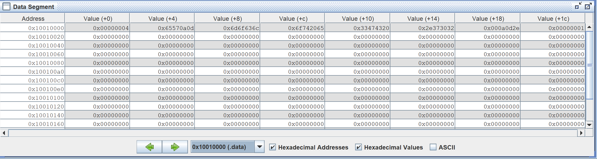
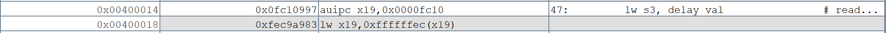
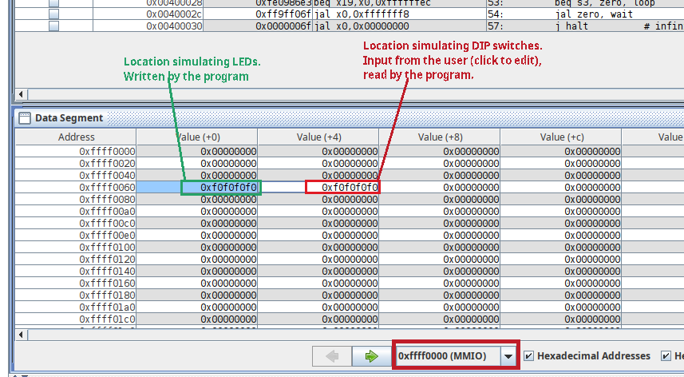
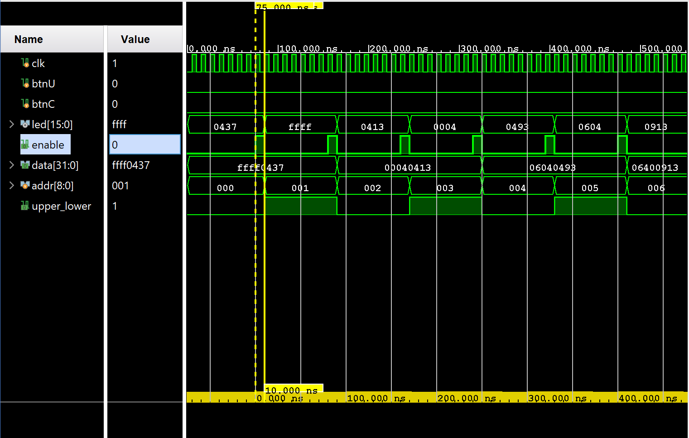

# Lab 01 - Get prepared

## Introduction

> It is **imperative** to put in effort and try your best for this assignment. It may take an amount of effort that is quite disproportionately large, compared to the impact on your grade. This is normal. This assignment is designed to prepare you for the later ones, so that you can spend time debugging your design, instead of debugging your knowledge.
>
> <p align="right">— From CG3207 Teaching Team</p>

## Task 1: Assembly Simulation

### Task Instruction

The goal of this task is to understand the RISC-V Assembly Language. Thus, I will put some effort to explain this [program public on the GitHub](https://github.com/NUS-CG3207/labs/blob/main/docs/code_templates/Asst_01/DIP_to_LED.asm).&#x20;

#### Overall Structure

This sample RISC-V assembly program contains 3 parts,



`.eqv` (**Constants**)

The code here is not data at all — it never goes into instruction memory (IROM) or data memory (DMEM). Instead, it's purely an **assembler directive**: a **symbolic substitution** (like `#define` in C).

```armasm
.eqv NAME VALUE
```

When the assembler sees `NAME`, it replaces it with `VALUE`.



**Instruction Memory (IROM / Code Memory)**

This is the **program memory** — where instructions live. It stores the instructions that the CPU fetches and executes. It has the following coding convention,


```armasm
.text   ## IROM segment
main:
    li s0, MMIO_BASE
    ...
halt:
    j halt
```



#### Code Explanation

1. All code goes inside `.text`.
2. Labels like `main:`, `loop:`, `wait:` are symbolic addresses.
3. Final `halt: j halt` ensures execution has a “dead end” — since without an OS, programs don’t really _return_.
4. With IROM depth 9 → 2^9 = 512 bytes → you can fit 128 instructions (each 4 bytes).
5. Pseudoinstructions (like `li`) may expand to multiple real instructions, so you must stay within this limit.




**Data Memory (DMEM)**

**Data memory** stores constants, variables, strings, arrays, stack, heap, etc. Its coding convention is as follows,


```armasm
.data   ## DMEM segment
DMEM:

delay_val: .word 4       # a constant at DMEM+0x00
string1:  .asciz "\r\nWelcome to CG3207..\r\n"
var1:     .word 1        # static variable, initial value = 1

.align 9
STACK_INIT:
```



#### Code Explanation

1. `.data` means “put this stuff in memory space for data.”
2. `.word N` reserves 4 bytes and initializes them with `N`.
3. `.asciz "..."` stores a null-terminated string.
4. `.align n` aligns the next data to 2ⁿ bytes. For example, `.align 9` -> aligns on a 512-byte boundary.




#### Line-by-line Explanation



**Line 15-31**

These lines define some constants.



**Line 40-45 (main)**

This section initializes base addresses (`MMIO_BASE`, LED address, DIP switch address).

1. Line 41: `li` is implemented as `lui + addi` because `MMIO_BASE` doesn't fit in 12-bit immediate.
   1. Now `s0 = 0xFFFF0000`. This will be the starting point for accessing all peripherals.
2. Line 43: Computes the **LED peripheral’s memory-mapped address**, `s1 = s0 + 0x60` -> `s1 = 0xFFFF0060`.
   1. Later, writing to `(s1)` will control the LEDs.
3. Line 44: Since `DIP_OFF` (`0x64`) fits in 12 bits, this is just one `addi` instruction, not `lui+addi`. It loads the immediate into a `dp` reg (data-processing register) `s2`, which is meant for the LED Offset from the MMIO base.
4. Line 45: Add the LED Offset to the MMIO base.
   1. The comment here means this is just a way to demonstrate the instruction `add` (register + register) and the usage of `dp` reg (data-processing register).


`li` in RISC-V means "load immediate" and its implementation depends on the size of the immediate value.




**Line 46-54 (loop + wait)**

This code snippet mainly does the following

* Each time through `loop`, DIP switches are read → LEDs updated.
* Then the program spends time in `wait`, decrementing `s3` until it reaches zero.
  * That’s a **software delay loop**.
* Once the delay is over, execution returns to `loop`, reloads `delay_val`, and the process repeats.

So, the overall effect is: LEDs continuously reflect DIP switches, but with a controlled **refresh rate** (slowed down by the delay loop). And the detailed explanation is as follows:

1. Line 47: Loads the constant `delay_val` (here = 4) from data memory into `s3`.
2. Line 48: Reads the DIP switch values from the MMIO register at `s2 = 0xFFFF0064`.
3. Line 49: Writes the same value into the LED MMIO register (`s1 = 0xFFFF0060`). So the LEDs mirror whatever is on the DIP switches.
4. Line 51: Decrement the delay counter.
5. Line 52: If counter hits zero, go back to `loop:` to reload `delay_val` and refresh LEDs.
6. Line 53: If counter ≠ 0, jump back to `wait:` (continue counting down).
   1. Here `jal zero, wait` is used as a plain jump. Since `jal` normally stores the return address into a register, writing into `zero` discards it. It is equivalent to `j wait`.



**Line 63-79 (dmem)**

This is the data memory,

1. Line 69: Defines a constant `delay_val` stored at the beginning of data memory.
2. Line 70-71: Stores a null-terminated string in memory. Each character = 1 byte. The assembler appends a null (`0x00`) at the end.
3. Line 72: A statically allocated variable, initialized with `1`. As the string above is 24 byte, it is stored from `DMEM+0x4` to `DMEM+0x18`. Thus, the `var1` happens to fit in `DMEM+0x1c`.
   1. Line 73: If the string is 1 byte longer, then `var1` will be stored at `DMEM+0x20` for word-alignment.
4. Line 75: `.align 9` means “advance the current memory location to the next multiple of 2⁹ = 512 bytes.”
5. Line 76: Followed by Line 75, so the stack starts at address `DMEM+0x200`.
   1. Line 77: Mainly describes the stack in RISC-V
      * Stack grows **downwards** (toward lower addresses).
      * `sp` (stack pointer) should be initialized to this address.
      * Each push → decrement `sp`, each pop → increment `sp`.

***

In RISC-V, the word is stored in low-endianness. So, below is how the String in Line 72 is stored,

<figure><figcaption></figcaption></figure>


The word is stored using [**little endianess**](https://wenbo-notes.gitbook.io/cg2111a-notes/studio/studio-13-communication-protocol#big-and-little-endianness) (we've encounterd little-endiance in CG2111A) in RISC-V memory, but within each byte, the byte is stored normally.




<details>

<summary>What's actually going on in Line 47? (<code>auipc</code>)</summary>

In Line 47, the instruction is actually implemented by two RISC-V instructions.&#x20;


```armasm
auipc x19, 0x0000fc10
lw    x19, 0xffffffec(x19)
```


This is as shown as follows, (`x19` is the `s3` register)

<figure><figcaption></figcaption></figure>

The reason for this two-step sequence is that **`lw`** is an I-type instruction, and I-type immediates are limited to a signed **12-bit offset** relative to a base register. This means `lw` can only directly access data within ±2048 bytes of the base address. When the data we want to load is located _far away_, we need an additional instruction to construct a base address that is “close enough.”

This is where `auipc` (Add Upper Immediate to PC) comes in. `auipc` takes the current PC value, adds a 20-bit immediate shifted left by 12 bits, and stores the result into the destination register. In other words, it lets us build a base address relative to the PC, suitable for accessing distant memory.

1. The symbol **`delay_val`** is at address `0x10010000`. The instruction `lw s3, delay_val` itself is at `0x00400014`.
   1. These two addresses differ by much more than 12 bits, so a plain `lw` cannot reach `delay_val` directly.
2. To bridge the gap, the assembler splits the target address into a **high part** and a **low part**.
   1. The **upper 20 bits** difference is: `0x10010 - 0x00400 = 0xFC10`. This becomes the immediate for `auipc`.
3. After executing `auipc x19, 0x0000fc10`, register `x19` holds: `x19 = PC + (0xFC10 << 12)`, which is a value “close” to the address of `delay_val`.
4. Now only a **small offset** is left to cover.
   1. The **lower 12 bits** difference is: `0x000 - 0x014 = 0xFFFFFFEC`. This fits within the signed 12-bit immediate range of `lw`.
5. Finally, the instruction `lw x19, 0xffffffec(x19)` uses `x19` as the base plus the small offset to reach the exact address of `delay_val` and load its value into `s3`.

***

The key idea is that `auipc` provides a way to **construct PC-relative addresses for far-away data or code**. By combining `auipc` (for the high 20 bits of the address) with an I-type instruction like `lw` (for the low 12 bits), RISC-V can access any 32-bit address in memory, despite the immediate size limitations of a single instruction.


The use of `la` to load address which is far away from the current PC address works in exactly similar ways. Instead storing the content, `la` store the address of that content.


</details>

#### Demonstration

In this task, we mainly just need to demonstrate as the following images shows,

<figure><figcaption></figcaption></figure>

1. Run the code step by step till Line 48
2. Change the input at the DIP switches (`0xffff0064`), then run Line 48 and 49, the output at LEDs (`0xffff0060`) should be mirrored.
3. This loop is infinite, so showing this mirror once suffices.
4. Wait for the problems proposed by the TA.

#### Questions Preparation

1. What is the 32-bit representation of certain instruciont, like the `opcode`, `funct3`, etc
   1. bring the risc-v card along with you
2. What is the memory capcity of IROM?
   1. As we IROM can store 128 words, its memory capcity is 7 bits. (Although I think it is a bit not good here as memory capcity should be 128 words bruh, and the address of IROM is 7 bits.)

### Optional Task

#### Helloworld without subroutines

The RISC-V [assembly code about HelloWorld](https://github.com/NUS-CG3207/labs/blob/main/docs/code_templates/Asst_01/HelloWorld.asm) is public on the GitHub. The overall behaivor is

* It waits for the user to press the **`A` key** followed by **Enter** (`\r` or `\n`) on the console.
  * It echoes every input character to the console, LEDs, and seven-segment display while waiting.
* Once the correct input is received, it prints **“Welcome to CG3207..”** to the console using [UART](https://wenbo-notes.gitbook.io/cg2111a-notes/studio/studio-9-serial-communication#u-s-art-communication) character by character.


- The LED and seven-segment display here are just used as “hardware echo” that mirrors what you typed.
- We met UART again, feel free to go back to [NUS CG2111A Notes](https://wenbo-notes.gitbook.io/cg2111a-notes/studio/studio-9-serial-communication#u-s-art-communication) on reviewing how UART works! Here this UART serial communication is setup between our **RISC-V processor** and our **PC's console** (on RARS).


And I will do the explanation section by section,



**Line 17-50 (Setup)**

This is the setup work. Nothing special.



**Line 52-78 (Read** `A` **and** <kbd>Enter</kbd>**)**

This section is also pretty straight-forward. But in Line 75-78, the trick to implement `if A or B` needs our attention,


```armasm
li t1, '\r'
beq t0, t1, ACCEPT_CRorLF # if t0 == '\r', go to ACCEPT_CRorLF
li t1, '\n'
bne t0, t1, WAIT_A	  # if t0 != ('\r' or '\n'), not the correct pattern. try all over again.
```




**Line 79-96 (Print "Helloworld")**

1. `a0` stores the address of of the word (4 bytes) to be printed. And within each word, one byte is printed a time. After a word has been printed, `a0` is incremented by 4 to print the next word. (As we've seen in the previous task, the `string1` is 24 bytes — 6 words long)



## Task 2: Basic HDL Simulation

1. In the `initial` statement, no matter in RTL code or testbench, the L.H.S signal must be `reg`.

### RTL Design

#### Clock Enable

The `Clock_Enable` block has three states,

1. 1Hz mode: Pull up the `enable` to HIGH for 1 clock cycle (10ns for Nexys 4) every 1 second.
2. 4Hz mode: Pull up the `enable` to HIGH for 1 clock cycle every 0.25 second.
3. Pause mode: Pull down the `enable` to LOW until pause mode is exited.

In our simulation, the enable behaves like below

<figure><figcaption></figcaption></figure>

The time `enable` is low is controlled by the corresponding `threshold` for each of the three modes above. We can think of `enable` as a **slower** clock signal.&#x20;


The image uses the `1Hz` mode and change the `threshold` to 8 for simluation. Normally should be `100_000_000` for real world.


<details>

<summary><code>threshold</code> should be implemented sequentially or combinationally?</summary>

Don't be confused by the comments in the Verilog code, `threshold` should be updated in a **combinational block**. (It is faster) Although you can still implement it sequentially. But the later is not recommended if you want to get a small improvement on your CPU.

</details>

#### Get Mem

This block is straight as we only need to implement two things

1. the combinational logic part for the `data` fed to the seven-segment display and leds; and the `upper_lower` signal fed to the leds
2. the sequential logic part for the `counter` which is basically the `addr`.

<details>

<summary>Why it is a 9-bit counter/address here?</summary>

Let's anaylze from the bottom to the up:

1. As we only have 16 Leds on Nexys, each instruction is 32-bit long. Thus, we need to show the upper and lower half-word on the leds, this is for each instruction. Thus, we need **1 bit** for this, and this must be the LSB of our counter/address. (`addr[0]`)
2. As for our IROM and DMEM, each of them is 128-word long, thus we need another **7 bits** to track the address. (`addr[7:1]`)
3. As we display IROM first, then DMEM. We need another **1 bit** to do this "switching" (`addr[8]`)

Thus, in total, the counter/address should be **9 bits** long in this module. This also means that to display all of the content from IROM and DMEM, we need $$2^9=512$$ "rounds[^1]". (This is useful in our simulation)

</details>

#### Top

This module has nothing special, we just instantiate the two modules we have designed

1. the `Clock_Enable` module
2. the `Get_Mem` module

And the one module that is provided,

1. the `Seven_seg` module

In the `Top` module, we also need to implement a **multiplxer** to choose the 16 bit data to be shown on the led.

### Behavorial Simulation

Here, we basically need to simulate all the combinations of the inputs, which are

1. Both `btnC` and `btnU` are **not pressed**.
2. `btnU` is pressed but `btnC` is not pressed.
3. `btnC` is pressed but `btnU` is not pressed.

#### No auto-check version

From the [explanation above](lab-01-get-prepared.md#why-it-is-a-9-bit-counter-address-here), we know that we need 512 rounds to display all the data from IROM an DMEM. Under each of the three modes above, the clock cycles for each round is different, and it is determined by the corresponding `threshold` value in each mode, thus

1. Under 1Hz mode, we need  $$512\times\text{threshold\_1Hz}$$  clock cycles in total, this will be the terminating `i` value in our for loop.
2. Similarly, under 4Hz mode, we need $$512\times\text{threshold\_4Hz}$$  clock cycles.

And the total timing is also not difficult to calcualte. Let's say we delay 10ns at each round. So, under 1 Hz mode, the total time taken will be $$10\times512\times\text{threshold\_1Hz}$$.


#### Notes

1. The `initial` statement **will not** be ignored in the behavorial simulation, but **will** be ignored in the real run, or synthesis.
2. Remember to change the `threshold` values back to normal after simulation. (For observing the results quickly, we have changed them to some really small number during the simulation)


#### Auto-check version

Here, the auto-check means we should read the IROM and DMEM data again in our testbench. And then check at each clock cycle, the led output of our UUT is the same as the expected led. (Only led here because `led` is the only port visible to us). See more from this [issue](https://github.com/NUS-CG3207/labs/discussions/37#discussioncomment-14328479).


Notice that what we want to achieve here is that we press the `btnU` for several "seconds", and then release, and then press `btnC` for several seconds, then release. Then check whether the `uut.led` and the `expected_led` match or not.


To implement this, we are recommended to write a verilog task to do the checking for us. (Reduce duplicate code)


```verilog
task check;
  input integer cycles;  // number of LED updates to observe
  integer i;
  reg [15:0] expected_led;
  begin
    for (i = 0; i < cycles; i = i + 1) begin
      @(posedge uut.enable);

      // compute expected LED value
      if (addr < 128) expected_led = (upper_lower_tb == 0) ? IROM[addr][31:16] : IROM[addr][15:0];
      else expected_led = (upper_lower_tb == 0) ? DMEM[addr-128][31:16] : DMEM[addr-128][15:0];

      // compare against DUT
      if (uut.led !== expected_led) begin
        $error("Mismatch at addr %0d (upper_lower=%b): got %h expected %h", addr, upper_lower_tb,
               uut.led, expected_led);
        $stop;
      end

      // Update TB model state
      upper_lower_tb = ~upper_lower_tb;
      if (upper_lower_tb == 0) addr = addr + 1;
    end
    $display("Nothing Wrong, good job!");
  end
endtask
```



#### Code Explanation

1. The argument `cycles` doesn't need to take the threhold into accound because it uses the posedge of `uut.enable`.


Then in our main simulation, we can just call these two methods under each phase.


```verilog
initial begin
  // Load from memory
  // Load only 128 words (0 through 127)
  $readmemh("IROM.mem", IROM, 0, 127);
  $readmemh("DMEM.mem", DMEM, 0, 127);

  clk = 0;
  btnU = 0;
  btnC = 0;
  addr = 0;
  upper_lower_tb = 0;

  // 1Hz mode
  $display("Starting 1 Hz mode...");
  check(5);
  #10;

  // 4Hz mode
  $display("Switching to 4 Hz mode...");
  btnU = 1;
  check(10);
  btnU = 0;
  #10;

  // Pause mode
  $display("Switching to Pause mode...");
  btnC = 1;
  #200;
  btnC = 0;

  $display("Simulation finished.");
  $stop;
end
```



#### Code Explanation

1. The `#10` at Line 16 and Line 23 is **important** as it makes sure the during the next phase the simulation actually sees the button change. The value may change depending on the the clock period. Usually, we should pause for 1 clock period.


### Demostration

1. Load the bitstream file into your FPGA.
2. Press the `btnU`, `btnC` to see the output of your FPGA.

#### Questions Asked

1. What is the difference between `Clock_Enable` between the normal 100MHz clock?
   1. `Clock_Enable` is a slower clock implemented by the `threshold` thinking.
2. How to verify the content shown on the **seven-seg display** is correct?
   1. The only way we can do is to compare it visually with the memory files  (IROM and DMEM)

## The fruits of our labour



The video is out-dated and is for reference only as the lower-half and upper-half displaying sequence is flipped. As our design specification, should display upper-half first, then lower-half.

### Some Interesting Questions



**Why the actual behavior of seven-seg display and leds is different from the behavorial simulation?**

An interesting phenomenon I find out is that after the instruction memory, the last line will blink several times and then it still prints the instructions memory.

***

This is solved by Dr. Rajesh and TA Neil in this [disscussion](https://github.com/NUS-CG3207/labs/discussions/41). The main reasons is that the synthesis tool will likely optimise the storage to a combinational circuit (4-input, 32-output) instead of a ROM as the utilisation is very low. That means repeating pattern modulo 16 composed of 13 valid and 3 garbage words.



**Why after I press** `btnU`, **my FPGA will have a delay, then change to fast speed?**

This happens because of the way the `Clock_Enable` logic uses the **counter vs. threshold** comparison.

<pre class="language-verilog" data-line-numbers><code class="lang-verilog">always @(posedge clk) begin
  if (threshold == 0) begin
    // Pause mode: no enable pulses
    counter &#x3C;= 0;
    enable  &#x3C;= 0;
  end else begin
<strong>    if (counter >= threshold - 1) begin
</strong>      counter &#x3C;= 0;
      enable  &#x3C;= 1;  // pulse high for 1 cycle
    end else begin
      counter &#x3C;= counter + 1;
      enable  &#x3C;= 0;
    end
  end
end
</code></pre>

If your Line 7 is `counter == threshold - 1`, then you will encounter the problem stated. But why?

1. In **1 Hz mode**, the `threshold` is large, so the `counter` can hold a relatively big value.
2. When you switch to **4 Hz mode**, the new `threshold` is much smaller
3. If the **current counter value is still larger than the** `threshold_4Hz` (new threshold) but smaller than the `threshold_1Hz`, the condition `counter==threshold-1` will be false for many cycles. Thus, the counter continues incrementing until it eventually wraps around to zero, only then generating the first enable pulse at the new faster rate.
4. This “wrap-around” is the **delay** you see when switching speeds.



[^1]: Why not directly clock cycles here? It is because we have slowed down the system clock on our `Get_Mem` module by using an `enable` signal instead. Thus, the real clock cycle will be "rounds" x "threshold"
