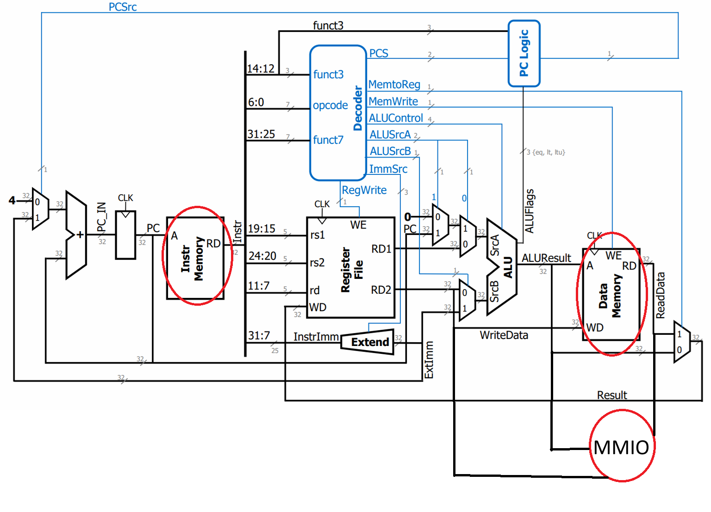

# Lab 02 - Single Cylce RV Processor

## Introduction

In this lab, we will build a single-cycle RISC-V processor and the lab manual is [here](https://nus-cg3207.github.io/labs/asst_manuals/Asst_02/Asst_02/). And our processor will support the followig instructions for now,

* `add`, `addi`, `sub`, `and`, `andi`, `or`, `ori`
* `lw`, `sw`
* `beq`, `bne`, `jal` (without linking, that is, without saving the return address).&#x20;
* `lui`,`auipc`
* `sll`, `srl`, `sra`

## Design Files

### Top Module

Our Top design file, `Top_Nexys.vhd`, is written in VHDL instead of Verilog. (FYI, some of our teaching team is really a fan of VHDL 😂). Before reading about this section, I strongly recommended you to read the our [Wrapper file](lab-02-single-cylce-rv-processor.md#why-does-the-wrapper-exist) first.

#### Purpose of Top

In this module, we explicitly connect the ports (like LED, Seven-seg, etc) on our Wrapper (or, motherboard) to the real ports (LEC, Seven-seg, etc) on our Nexys 4 FPGA.

#### CLK\_DIV\_BITS

You don't need to know how everything works in `Top_Nexys.vhd` except for one variable — `CLK_DIV_BITS`, which is essentially a variable to slow down the processor's speed.

For example, given that the base clock frequency on our FPGA is 100MHz.

1. If `CLK_DIV_BITS = 5`, then the processr's clock frequency will be $$100\div2^5\approx3~\text{MHz}$$.
2. Or if `CLK_DIV_BITS = 2`, then the processor's clock frequency will be $$100\div2^2\approx25\text{~MHz}$$.

In summary, the relationship between `CLK_DIV_BITS` and clock frequency is

$$
\text{clock frequency}=100~\text{MHz}\div2^{\text{CLK\_DIV\_BITS}}
$$

<details>

<summary>If you are able to choose to run your processor at 20, 50 and 100MHz, what will you choose?</summary>

As discussed in [Lec 02](https://wenbo-notes.gitbook.io/ddca-notes/lec/lec-02-digital-system-design-and-verilog#critical-path), the maximum clock frequency is determined by the critical path — the combinational path between two registers with the longest delay.

So, to answer this question, we need to clearly demonstrate to the TA that

1. Since we are designing a single-cycled processor here, this means every instruction must complete in one cycle.
2. Among all RISC-V instructions, the load instruction has the longest execution time.
3. Therefore, the critical path can be identified within the load instruction.
4. If this critical path meets the timing requirements for 20 MHz, 50 MHz, or 100 MHz, the processor can run at that frequency by adjusting `CLK_DIV_BITS`.

Thus, when choosing between 20 MHz, 50 MHz, and 100 MHz, the decision depends on whether the critical path can support the higher frequencies without violating timing constraints.

</details>

### Why does the Wrapper exist?

`Wrapper.v` is long, but it’s basically a **simulation harness** that sits between our RISC-V core (RV) and the outside world (testbench or FPGA board). It provides memories and **memory-mapped peripherals** so that the processor can interact with LEDs, DIP switches, buttons, UART, OLED, etc. We can think of it as the “motherboard” that our RV CPU plugs into.

In short, `Wrapper.v` is just the Verilog implementation of our [Lec 03 microarchitecture](https://wenbo-notes.gitbook.io/ddca-notes/lec/lec-03-risc-v-isa-and-microarchitecture#support-for-lui-and-auipc) but adding the MMIO part. (Go to the [spoiler](lab-02-single-cylce-rv-processor.md#connection-to-rv) at the back)

#### Purpose of Wrapper

* Provides **IROM (instruction memory)** and **DMEM (data memory)** to the processor.
* Provides **MMIO (memory-mapped I/O)** registers for peripherals like LEDs, UART, DIP switches, OLED, accelerometer, etc.
* Translates “clean, parallel” signals into abstract peripherals that are easy to monitor in simulation.
* Used only for **simulation** (not synthesis directly). On the FPGA, the higher-level `TOP_Nexys.vhd` connects the wrapper to actual hardware pins.

So, it makes our RISC-V behave like it’s running on a small SoC with peripherals.

#### I/O Ports

<table><thead><tr><th width="153.5">Signal</th><th width="100">Direction</th><th width="93.5">Width</th><th>Description</th></tr></thead><tbody><tr><td><code>DIP</code></td><td>In</td><td>16</td><td>DIP switch inputs (not debounced).</td></tr><tr><td><code>PB</code></td><td>In</td><td>3</td><td>Push buttons (BTNL, BTNC, BTNR; not debounced).</td></tr><tr><td><code>LED_OUT</code></td><td>Out (reg)</td><td>8</td><td>LEDs [7:0] showing processor results.</td></tr><tr><td><code>LED_PC</code></td><td>Out</td><td>7</td><td>Shows <code>PC[8:2]</code> on LEDs [15:9].</td></tr><tr><td><code>SEVENSEGHEX</code></td><td>Out (reg)</td><td>32</td><td>Data for 8-digit 7-seg display.</td></tr><tr><td><code>UART_TX</code></td><td>Out (reg)</td><td>8</td><td>Byte sent to PC/testbench via UART.</td></tr><tr><td><code>UART_TX_ready</code></td><td>In</td><td>1</td><td>UART ready flag (ok to write new TX byte).</td></tr><tr><td><code>UART_TX_valid</code></td><td>Out (reg)</td><td>1</td><td>Indicates Wrapper wrote a new UART TX byte.</td></tr><tr><td><code>UART_RX</code></td><td>In</td><td>8</td><td>Byte received from PC/testbench via UART.</td></tr><tr><td><code>UART_RX_valid</code></td><td>In</td><td>1</td><td>Indicates new RX data available.</td></tr><tr><td><code>UART_RX_ack</code></td><td>Out (reg)</td><td>1</td><td>Acknowledge that RX byte was read.</td></tr><tr><td><code>OLED_Write</code></td><td>Out (reg)</td><td>1</td><td>Pixel update signal for OLED.</td></tr><tr><td><code>OLED_Col</code></td><td>Out (reg)</td><td>7</td><td>OLED column index.</td></tr><tr><td><code>OLED_Row</code></td><td>Out (reg)</td><td>6</td><td>OLED row index.</td></tr><tr><td><code>OLED_Data</code></td><td>Out (reg)</td><td>24</td><td>OLED pixel data <code>&#x3C;R,G,B></code> (8/8/8 aligned).</td></tr><tr><td><code>ACCEL_Data</code></td><td>In</td><td>32</td><td>Packed <code>&#x3C;Temp, X, Y, Z></code> from accelerometer.</td></tr><tr><td><code>ACCEL_DReady</code></td><td>In</td><td>1</td><td>Accelerometer data ready flag.</td></tr><tr><td><code>RESET</code></td><td>In</td><td>1</td><td>Active-high reset.</td></tr><tr><td><code>CLK</code></td><td>In</td><td>1</td><td>Clock input (divided clock shown on LED[8]).</td></tr></tbody></table>

#### Memories

In `Wrapper.v` (our motherboard), we not only have our CPU `RV.v`, but also three memory spaces:

* **IROM**: instruction memory (program comes from `.mem` file dumped by RARS).
* **DMEM**: data memory (for global variables, stack, etc.).
* **MMIO**: memory-mapped I/O (LEDs, switches, UART, OLED, etc.).

#### Address Decoding

In our `Wrapper.v`, we need to decide whether we want to **access** (can be "read" or "write") DMEM or MMIO peripherals. To do so, we introduce lots of `dec_*` signals to indicate whether we want to access DMEM or MMIO peripherals.


```verilog
//----------------------------------------------------------------
// Address Decode signals
//---------------------------------------------------------------
// 'enable' signals from data memory address decoding
reg
    dec_DMEM,
    dec_UART_RX_VALID,
    dec_UART_RX,
    dec_UART_TX_READY,
    dec_UART_TX,
    dec_OLED_COL,
    dec_OLED_ROW,
    dec_OLED_DATA,
    dec_OLED_CTRL,
    dec_ACCEL_DATA,
    dec_ACCEL_DREADY,
    dec_LED,
    dec_DIP,
    dec_PB,
    dec_SEVENSEG,
    dec_CYCLECOUNT  // Cycle count signal
    ;

//----------------------------------------------------------------
// Data memory address decoding
//----------------------------------------------------------------
always @(*) begin
    dec_DMEM          <= 1'b0;
    bad_MEM_addr      <= 1'b0;
    dec_UART_RX_VALID <= 1'b0;
    dec_UART_RX       <= 1'b0;
    dec_UART_TX_READY <= 1'b0;
    dec_UART_TX       <= 1'b0;
    dec_OLED_COL      <= 1'b0;
    dec_OLED_ROW      <= 1'b0;
    dec_OLED_DATA     <= 1'b0;
    dec_OLED_CTRL     <= 1'b0;
    dec_ACCEL_DATA    <= 1'b0;
    dec_ACCEL_DREADY  <= 1'b0;
    dec_LED           <= 1'b0;
    dec_DIP           <= 1'b0;
    dec_PB            <= 1'b0;
    dec_SEVENSEG      <= 1'b0;
    dec_CYCLECOUNT    <= 1'b0;

    if (ALUResult[31:DMEM_DEPTH_BITS] == DMEM_BASE[31:DMEM_DEPTH_BITS]) dec_DMEM <= 1'b1;
    else if (ALUResult[31:MMIO_DEPTH_BITS] == MMIO_BASE[31:MMIO_DEPTH_BITS]) begin
        case (ALUResult[MMIO_DEPTH_BITS-1:2])
            UART_RX_VALID_OFF[MMIO_DEPTH_BITS-1:2]: dec_UART_RX_VALID <= 1'b1;
            UART_RX_OFF[MMIO_DEPTH_BITS-1:2]: dec_UART_RX <= 1'b1;
            UART_TX_READY_OFF[MMIO_DEPTH_BITS-1:2]: dec_UART_TX_READY <= 1'b1;
            UART_TX_OFF[MMIO_DEPTH_BITS-1:2]: dec_UART_TX <= 1'b1;
            OLED_COL_OFF[MMIO_DEPTH_BITS-1:2]: dec_OLED_COL <= 1'b1;
            OLED_ROW_OFF[MMIO_DEPTH_BITS-1:2]: dec_OLED_ROW <= 1'b1;
            OLED_DATA_OFF[MMIO_DEPTH_BITS-1:2]: dec_OLED_DATA <= 1'b1;
            OLED_CTRL_OFF[MMIO_DEPTH_BITS-1:2]: dec_OLED_CTRL <= 1'b1;
            ACCEL_DATA_OFF[MMIO_DEPTH_BITS-1:2]: dec_ACCEL_DATA <= 1'b1;
            ACCEL_DREADY_OFF[MMIO_DEPTH_BITS-1:2]: dec_ACCEL_DREADY <= 1'b1;
            LED_OFF[MMIO_DEPTH_BITS-1:2]: dec_LED <= 1'b1;
            DIP_OFF[MMIO_DEPTH_BITS-1:2]: dec_DIP <= 1'b1;
            PB_OFF[MMIO_DEPTH_BITS-1:2]: dec_PB <= 1'b1;
            SEVENSEG_OFF[MMIO_DEPTH_BITS-1:2]: dec_SEVENSEG <= 1'b1;
            CYCLECOUNT_OFF[MMIO_DEPTH_BITS-1:2]: dec_CYCLECOUNT <= 1'b1;
            default: bad_MEM_addr <= 1'b1;
        endcase
    end else bad_MEM_addr <= 1'b1;
end
```


#### Connection to RV

Different from the [Lec 03 microarchitecture](https://wenbo-notes.gitbook.io/ddca-notes/lec/lec-03-risc-v-isa-and-microarchitecture#support-for-lui-and-auipc), here we added the MMIO part inside.

<figure><figcaption></figcaption></figure>



#### Instruction fetch path

1. CPU outputs **PC**. This is done in `RV.v` as `PC` is an output from CPU.
2.  Wrapper uses PC to fetch the `Instr` from instruction memory.&#x20;

    
    ```verilog
    //----------------------------------------------------------------
    // IROM read
    //----------------------------------------------------------------
    always @(*) begin  // @posedge CLK only if using synch read for memory
        Instr = ( ( PC[31:IROM_DEPTH_BITS] == IROM_BASE[31:IROM_DEPTH_BITS]) && // To check if address is in the valid range
        (PC[1:0] == 2'b00) )? // and is word-aligned - we do not support instruction sizes other than 32.
        IROM[PC[IROM_DEPTH_BITS-1:2]] : 32'h00000013 ; // If the address is invalid, the instruction fetched is NOP. 
        // This can be changed to trigger an exception instead if need be.
    end
    ```
    
3. Wrapper sends `Instr` back into CPU.  This done in `RV.v` as `Instr` is an input to CPU.



#### Data access path

The data access path has two parts, one is to load data from either DMEM or MMIO, the other is to store data to either DMEM or MMIO.

***

**Load**: Loading from both DMEM and MMIO peripherals look identical to CPU (in our implementation, we read both together first), only Wrapper decides the source.

* CPU computes address in ALU -> `ALUResult`.
* CPU asserts `MemRead = 1`. (`MemRead` is just `MemtoReg` in our microarchitecture)
*   Wrapper checks `ALUResult` and enable corresponding `dec_*` signal to indicate which memory we want to access (read from here)

    
    ```verilog
    // Derive the decoded MMIO read signal
    assign dec_MMIO_read = MemRead || dec_DIP || dec_PB || dec_UART_RX_VALID || dec_UART_RX || dec_UART_TX_READY || dec_UART_TX || dec_CYCLECOUNT || dec_ACCEL_DATA || dec_ACCEL_DREADY ;
    ```
    

    *   If address ∈ **DMEM range** (`dec_DMEM == 1`)-> access (read from) DMEM, and store the read data into `ReadData_DMEM`.

        
        ```verilog
        //----------------------------------------------------------------
        // Asych DMEM read - //Uncomment the following block (3 lines) if NOT using synch read for memory
        //----------------------------------------------------------------
        always @(*) begin
            ReadData_DMEM <= DMEM[ALUResult[DMEM_DEPTH_BITS-1:2]];  // async read
        end
        ```
        
    *   If address ∈ **MMIO range** (`dec_MMIO_* == 1`) -> access (read from) the MMIO peripheral and store the read data into `ReadData_MMIO`.

        
        ```verilog
        //----------------------------------------------------------------
        // MMIO read
        //----------------------------------------------------------------
        always @(*) begin  // @posedge CLK only if using synch read for memory
            if (dec_DIP) ReadData_MMIO <= {{31 - N_DIPs + 1{1'b0}}, DIP};
            else if (dec_PB) ReadData_MMIO <= {{31 - N_PBs + 1{1'b0}}, PB};
            else if (dec_UART_RX && UART_RX_valid) ReadData_MMIO <= {24'd0, UART_RX};
            else if (dec_UART_RX_VALID) ReadData_MMIO <= {31'd0, UART_RX_valid};
            else if (dec_UART_TX_READY) ReadData_MMIO <= {31'd0, UART_TX_ready};
            else if (dec_CYCLECOUNT) ReadData_MMIO <= cycle_count;
            else if (dec_ACCEL_DATA) ReadData_MMIO <= ACCEL_Data;
            else  // dec_ACCEL_DREADY // the default else to avoid the statement from being incomplete
                ReadData_MMIO <= {31'd0, ACCEL_DReady};
        end
        ```
        
    *   After that, we delay the decoded signals

        
        ```verilog
        //----------------------------------------------------------------
        // Delaying the decoded signals for multiplexing (delay only if using synch read for memory)
        //----------------------------------------------------------------
        always @(*) begin  // @posedge CLK only if using synch read for memory
            dec_DMEM_W <= dec_DMEM;
            dec_MMIO_read_W <= dec_MMIO_read;
        end
        ```
        
*   Wrapper puts that value into `ReadData_in`. (This is where the I/O Multiplexing comes into play)

    
    ```verilog
    //----------------------------------------------------------------
    // Input (into RV) multiplexing
    //----------------------------------------------------------------
    always @(*) begin
        if (dec_DMEM_W) ReadData_in <= ReadData_DMEM;
        else  // dec_MMIO_read_W
            ReadData_in <= ReadData_MMIO;
    end
    ```
    
* CPU reads `ReadData_in` and writes into register file.


The data to be read (either from MMIO or DMEM) is always stored at `ReadData_in` first (as `always @(*)` is used). But whether it will be passed to the register `rd` (via the `WD` port) in the processor depends on the `MemRead` or `MemtoReg` signal.&#x20;


**Store**: It will either update memory or trigger side effects on peripherals.

* CPU computes address in ALU -> `ALUResult`.
* CPU outputs the value we want to store in `WriteData_out`.
*   CPU asserts `MemWrite_out = 1`. (This is the `{4{MemWrite}}`, where `MemWrite` is in our Lec 03 microarchitecture)

    ```verilog
    assign MemWrite = MemWrite_out[3] || MemWrite_out[2] || MemWrite_out[1] || MemWrite_out[0];
    ```
* Wrapper checks `ALUResult`:
  *   If address ∈ **DMEM range** -> write `WriteData_out` into DMEM.

      
      ```verilog
      //----------------------------------------------------------------
      // DMEM write
      //----------------------------------------------------------------
      localparam NUM_COL = 4;
      localparam COL_WIDTH = 8;
      integer i;
      always @(posedge CLK) begin
          if (MemWrite) begin
              for (i = 0; i < NUM_COL; i = i + 1) begin
                  if (MemWrite_out[i]) begin
                      if (dec_DMEM) begin
                          DMEM[ALUResult[DMEM_DEPTH_BITS-1:2]][i*COL_WIDTH +: COL_WIDTH] <= WriteData_out[i*COL_WIDTH +: COL_WIDTH];
                      end
                  end
              end
          end
          //ReadData_DMEM <= DMEM[ALUResult[DMEM_DEPTH_BITS-1:2]] ; //Uncomment only if only using synch read for memory
      end
      ```
      
  *   If address ∈ **MMIO range** -> forward `WriteData_out` into peripheral (e.g. set LEDs, update 7-seg).

      
      ```verilog
      //----------------------------------------------------------------
      // SevenSeg write
      //----------------------------------------------------------------
      integer j;
      always @(posedge CLK) begin
          if (MemWrite) begin
              for (j = 0; j < NUM_COL; j = j + 1) begin
                  if (MemWrite_out[j]) begin
                      if (RESET) SEVENSEGHEX <= 32'd0;
                      else if (dec_SEVENSEG)
                          SEVENSEGHEX[j*COL_WIDTH+:COL_WIDTH] <= WriteData_out[j*COL_WIDTH+:COL_WIDTH];
                  end
              end
          end
      end

      //----------------------------------------------------------------
      // Memory-mapped LED write
      //----------------------------------------------------------------
      always @(posedge CLK) begin
          if (RESET) LED_OUT <= 0;
          else if (MemWrite_out[0] && dec_LED) LED_OUT <= WriteData_out[N_LEDs_OUT-1 : 0];
      end
      ```
      
* CPU does not expect anything on `ReadData_in`.


We use **synchronous** memory write here, which means we store `WriteData_out` at the end of the 1 clock cycle we use to execute the store instruction. It happens “at the end” of the cycle — not in a separate cycle.

***

Why use synchronus? This is because now memory updates **exactly at the clock edge**. So, by the time the clock rises:

* `ALUResult` is stable
* `WriteData_out` is stable
* `MemWrite_out` is stable

So, the memory can just latch the correct value reliably, which is to write on the next `posedge CLK`.




<details>

<summary>Why do you simulate <a href="lab-02-single-cylce-rv-processor.md#why-does-the-wrapper-exist">Wrapper</a> instead of <a href="lab-02-single-cylce-rv-processor.md#top-module">Top_Nexys</a>?</summary>

In this lab, simulating the Wrapper is sufficient because it contains representations of all the FPGA ports. The `Top_Nexys` module only connects these ports to the actual FPGA hardware. Since simulation only involves providing inputs to these ports and observing the outputs, the physical connections to the FPGA are unnecessary. Therefore, simulating the Wrapper alone captures the full functionality needed for verification.

</details>

### RISC-V processor

Our RISC-V processor, or simply denoted as RV processor, is designed in `RV.v`, which also has the following hierarchy

```bash
- RV.v                  // Our CPU!
    |
    - ALU.v
        |
        - Shifter.v
    - Decoder.v
    - Extend.v
    - PC_Logic.v
    - ProgramCounter.v
    - RegFile.v
```

<details>

<summary>Why there is no <code>mv</code> instruction in RISC-V?</summary>

In ARM assembly (if you have taken CG2028), `mv` can do two things:

1. Register -> Register: It just copies the value from source register `rs` into the destionation register `rd`.
2. Immediate -> Register: Move an immediate value to the destination register `rd`.

For these two scenarios, RISC-V can use its base instructions or combination of base instructions (pseudo-instructinos) to achieve

1. Register -> Register: `addi rd, rs, 0`.
2. Immediate -> Register: `li rd, imm`. (`li` is a pseudo-instruction and it will be implemented in `lui` + `addi`)

So, RISC-V doesn’t need a special instruction for all the variants that ARM has because the same effects can be achieved with a combination of simple instructions.

</details>

## Tips

### Demo

As you may be confused about what you are going to demo, here are some tips from the teaching team



#### General Caveats

1. Make your output **dependant on** some user inputs. A.k.a, don't hardcode the output using a counter, etc.
2. Design your assembly program such that if one instruction doesn't work, the final output will be completely different. In other words, to get this output correctly given this input, every instruction in your assembly program should work correctly.
   1. **Don't just look at the final output** to state that every instruction of your prgram works. For example, if you shift right by 5 bits and shift left by 5 bits, even if your shift instructions don't work, your result will still be right.



#### Testbench

Your progam should run based on your user input, so the testbench just serves as **simulating** that user input and check whether the output of your program is correct or not.



#### More about OLED

In the lab, OLED is provided, but it is just another output. The fancy demo you may see from the lab by Dr. Rajesh is just another way to craft the **well-designed** assembly code.



#### General Steps


This is the most important tip for the demo!


1. Assembly code correctness: Step through the assembly program step by step to make sure the algorithm works correctly on the "high-level".
2. HDL (Vivado) simulation: Step through the each instruction to make sure each instruction is executed correctly on vivado simulation (behavioral + post-synthesis)
3. Hardware demo: This step **cannot step through** and thus we just provide the input and see the output.


