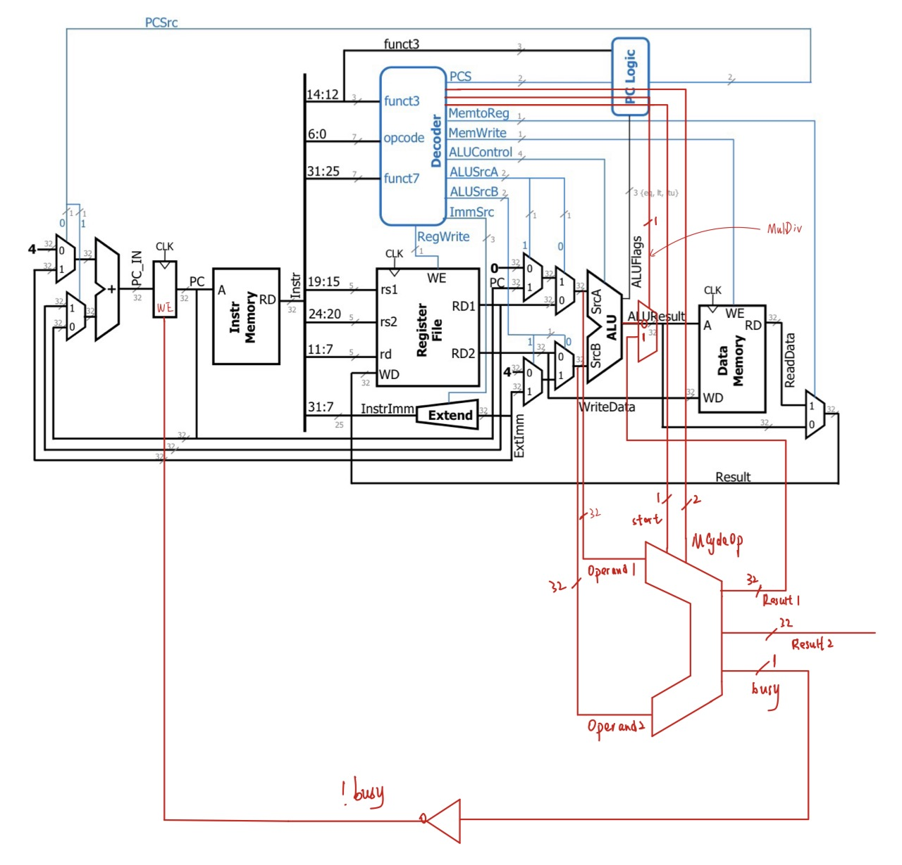

# Lab 03 - Multiply and Divide

## Introduction

In this lab, we are still using the [single cycle RISC-V processor](preparation-from-cs2100de/lab-02.md) which we have designed in Lab 02. The only difference is that, we will incorporate the **multiply** and **divide** into our processor. So, to set up for this lab, you can just copy all the design files from your lab 02 and then copy the `MCycle.v` into your design files and `test_MCycle.v` into your testbench from [here](https://github.com/NUS-CG3207/labs/blob/main/docs/asst_manuals/Asst_03/lab3_Verilog_design.zip)!

## Task 1: Implement Division

> This task only needs **HDL simulation**.

For this task, what we do is to **strictly** follow the [sequential divider](https://wenbo-notes.gitbook.io/ddca-notes/textbook/digital-building-blocks/arithmetic-circuits#sequential-divider) introduced in the lecture 04.

<details>

<summary>Why "strictly" follow here?</summary>

At the start, we find out that as per RISC-V register is 32-bit long, that means our **dividend** is **always** 32-bit long. So, we think that we don't need to align the **divisor** into 64-bit (2x32=64). Instead, we can just don't do any alignment of the divisor and use its original value.

However, this is proved to be a bad decision. As another purpose of aligning the divisor is to get the **first correct** subtraction from the remainder. In other words, the divisor should **start at a correct starting position**. If you just use the original divisor, the first subtraction from the remainder (which is just your dividend at start) using the original divisor will lead you to the **wrong result** of division in the end.

This doesn't mean the finding that there is only 32-bit dividend in the RISC-V `div`-related instruction is useless. Maybe we can have **efficient** divide algorithm based on that?

</details>

### Implementation Details

As you may notice, the [sequential divider](https://wenbo-notes.gitbook.io/ddca-notes/textbook/digital-building-blocks/arithmetic-circuits#sequential-divider) we have introduced in Lec 04 by right supports only **unsigned division**. However, we can only do some minor changes to make it support signed by considering the following cases. (in other words, find patterns from the following cases)

<table><thead><tr><th data-type="number">Dividend</th><th data-type="number">Divisor</th><th data-type="number">Quotient</th><th data-type="number">Remainder</th></tr></thead><tbody><tr><td>5</td><td>-3</td><td>-1</td><td>2</td></tr><tr><td>5</td><td>3</td><td>1</td><td>2</td></tr><tr><td>-5</td><td>3</td><td>-1</td><td>-2</td></tr><tr><td>-5</td><td>-3</td><td>1</td><td>-2</td></tr></tbody></table>

From the table above, we can clearly see that to do the **signed division**, we can just convert everything to **unsigned** first, then determine the sign of the quotient and the remainder.

* Quotient is **positive** if and only if the sign of the dividend and divisor are **the same**. Otherwise, quotient is **negative**.
* The sign of the remainder **follows** the sign of the **dividend**.

And to test whether our signed/unsigned multiplication/division works normally or not, we craft the following test cases:



| Operand A  | Operand B  | Expected 64-bit Product | Notes            |
| ---------- | ---------- | ----------------------- | ---------------- |
| 0x00000000 | 0x00000000 | 0x0000000000000000      | Zero × Zero      |
| 0x00000001 | 0xFFFFFFFF | 0x00000000FFFFFFFF      | Identity × Max   |
| 0xFFFFFFFF | 0xFFFFFFFF | 0xFFFFFFFE00000001      | Max × Max        |
| 0x0000FFFF | 0x0000FFFF | 0x00000000FFFE0001      | 16-bit check     |
| 0x7FFFFFFF | 0x00000002 | 0x00000000FFFFFFFE      | Near sign bit    |
| 0x80000000 | 0x00000002 | 0x0000000100000000      | 2³¹ × 2          |
| 0xFFFFFFFF | 0x00000002 | 0x00000001FFFFFFFE      | Max × 2          |
| 0xAAAAAAAA | 0x00000002 | 0x0000000155555554      | Alternating bits |
| 0x12345678 | 0x9ABCDEF0 | 0x0B00EA4E242D2080      | Random case      |
| 0x0000ABCD | 0x00001234 | 0x000000000C35F3F4      | Mid-range test   |



| Operand A  | Operand B  | Expected 64-bit Product (signed) | Notes                |
| ---------- | ---------- | -------------------------------- | -------------------- |
| 0x00000000 | 0x00000000 | 0x0000000000000000               | Zero                 |
| 0x00000001 | 0xFFFFFFFF | 0xFFFFFFFFFFFFFFFF               | +1 × −1 = −1         |
| 0xFFFFFFFF | 0xFFFFFFFF | 0x0000000000000001               | −1 × −1 = +1         |
| 0x7FFFFFFF | 0x00000002 | 0x00000000FFFFFFFE               | (2³¹−1) × 2          |
| 0x80000000 | 0x00000002 | 0xFFFFFFFF00000000               | −2³¹ × 2             |
| 0x80000000 | 0xFFFFFFFF | 0x0000000080000000               | −2³¹ × −1 (overflow) |
| 0x00000010 | 0xFFFFFFF0 | 0xFFFFFFFFFFFFFF00               | 16 × −16 = −256      |
| 0x7FFFFFFF | 0xFFFFFFFF | 0xFFFFFFFF80000001               | (2³¹−1) × −1         |
| 0xFFFFFFFE | 0xFFFFFFFE | 0x0000000000000004               | (−2) × (−2)          |
| 0x00001234 | 0xFFFFABCD | 0x00001233FA034FA4               | Mixed signs          |



| Dividend   | Divisor    | Quotient   | Remainder  | Notes              |
| ---------- | ---------- | ---------- | ---------- | ------------------ |
| 0x00000000 | 0x00000001 | 0x00000000 | 0x00000000 | Zero ÷ Nonzero     |
| 0xFFFFFFFF | 0x00000001 | 0xFFFFFFFF | 0x00000000 | ÷ 1                |
| 0xFFFFFFFF | 0x00000002 | 0x7FFFFFFF | 0x00000001 | Max ÷ 2            |
| 0x80000000 | 0x00000002 | 0x40000000 | 0x00000000 | 2³¹ ÷ 2            |
| 0x00000007 | 0x00000003 | 0x00000002 | 0x00000001 | Small remainder    |
| 0xFFFFFFFF | 0x7FFFFFFF | 0x00000002 | 0x00000001 | Large divisor      |
| 0xFFFFFFFF | 0xFFFFFFFF | 0x00000001 | 0x00000000 | Equal operands     |
| 0x00000005 | 0x00000007 | 0x00000000 | 0x00000005 | Dividend < Divisor |
| 0x0000000A | 0x00000003 | 0x00000003 | 0x00000001 | Nonzero remainder  |
| 0xFFFFFFFE | 0xFFFFFFFD | 0x00000001 | 0x00000001 | Max-1 ÷ Max-2      |



| Dividend   | Divisor    | Quotient   | Remainder  | Notes                        |
| ---------- | ---------- | ---------- | ---------- | ---------------------------- |
| 0x00000000 | 0x00000001 | 0x00000000 | 0x00000000 | Zero ÷ Positive              |
| 0x00000001 | 0xFFFFFFFF | 0xFFFFFFFF | 0x00000000 | +1 ÷ −1 = −1                 |
| 0xFFFFFFFF | 0xFFFFFFFF | 0x00000001 | 0x00000000 | −1 ÷ −1 = 1                  |
| 0x7FFFFFFF | 0x00000002 | 0x3FFFFFFF | 0x00000001 | Positive half division       |
| 0x80000000 | 0xFFFFFFFF | 0x80000000 | 0x00000000 | Overflow case (−2³¹ ÷ −1)    |
| 0x80000000 | 0x00000002 | 0xC0000000 | 0x00000000 | Negative ÷ Positive          |
| 0x00000010 | 0xFFFFFFF0 | 0xFFFFFFFF | 0x00000000 | 16 ÷ −16 = −1                |
| 0xFFFFFFF6 | 0x00000005 | 0xFFFFFFFE | 0xFFFFFFFC | −10 ÷ 5 = −2 r 0             |
| 0x12345678 | 0x0000F00F | 0x00000135 | 0x000026B5 | Random signed                |
| 0x80000000 | 0x00000003 | 0xD5555555 | 0xFFFFFFFD | −2³¹ ÷ 3 = floor-toward-zero |




We didn't include the case when divisor is 0 because it is specified clearly that the divisor won't be 0 in the lab manual.


## Task 2: Incorporate MCycle into our CPU

The whole idea here is that our processor is still **single cycle**! However, our multiplier and divider (`MCycle`) are **not single cycle**. So to maintain this single cycle property, we have a signal called `Busy` coming out from our `MCycle` to the `WE` (Write Enable) of the PC register indicating that if the `MCycle` is working, our PC won't be updated!

### Implementation Details

As for now, you may wonder how we incorporate the `MCycle` into our processor, and below is the updated microarchitecture diagram!

<figure><figcaption></figcaption></figure>

Based on this updated microarchitecture, we can know for sure what to modify in our processor:

1. Decoder: to generate `Start`, `MCycleOp[1:0]` and `MulDiv` signal.
2. RV: there are two things here
   1. Assign `WE_PC = ~busy`
   2. Add a multiplexer in the RV datapath to enable select from `ALUResult` or `MCycleResult` (which is just `Result1` in our microarchitecture)
3. Wrapper: to remain readability, you can change `ALUResult` to `ComputeResult`.

## Task 3: Enhancement

In Lab 03, we are required to improve the performance of the **signed multiplier**. In the example code, it is intended to be written in a very **inefficient** way, just to give us more space to improve its efficiency.

### Why it sucks

Below is part of the example code,


```verilog
if (~MCycleOp[1]) begin  // Multiply
    // if( ~MCycleOp[0] ), takes 2*'width' cycles to execute, returns signed(Operand1)*signed(Operand2)
    // if( MCycleOp[0] ), takes 'width' cycles to execute, returns unsigned(Operand1)*unsigned(Operand2)        
    if (shifted_op2[0])  // add only if b0 = 1
        temp_sum = temp_sum + shifted_op1;  // partial product for multiplication

    shifted_op2 = {1'b0, shifted_op2[2*width-1 : 1]};
    shifted_op1 = {shifted_op1[2*width-2 : 0], 1'b0};

    if( (MCycleOp[0] & count == width-1) | (~MCycleOp[0] & count == 2*width-1) ) // last cycle?
        done <= 1'b1;

    count = count + 1;
end
```


In Line 2 or Line 10, you can see that the teaching team intentionally to make **signed** multiplication taken `2 * width` cycles, which is to intentionally make the **signed** multiplication inefficient.

### Improvement Details

#### Use the [simple trick](https://wenbo-notes.gitbook.io/ddca-notes/textbook/digital-building-blocks/arithmetic-circuits#simple-trick-for-signed-multiplication-division) from lec 04

As for the partial sum method, you will at most shift `width - 1` times and perform `width` times addition. The idea of this trick is also what we use to implement our division.

#### Booth Algorithm

> There are a lot of resources online introducing what is Booth Algorithm, the ones I am watching are [this video](https://youtu.be/meSn0UXmgac?si=9_poEOU5aRmgtZXc) and [this video](https://youtu.be/tnLKU07b-HA?si=sTvtnN7rcf-Y6gFO). (The sequence matters)

The improvements and trade-off analysis of Booth Algorithm are as follows



#### Advantages

We can reduce the number of **addition** performed depending on the operand's bit pattern. For example, we want more continuous 1s to appear.



#### Disadvantages

1. We cannot reduce the number of **shifts**. It will always be `width-1`.
2. If the bit pattern of our operands is `0101...`, then Booth Algorithm will actually perform slower than the [method above](lab-03-multiply-and-divide.md#use-the-simple-trick-from-lec-04). As, for half of the "addition", we will do the **subtraction** instead.



Here, we improve the booth's algorithm as a **sequential multiplier**. Can we make it **combinational**? In other words, can we implement the booth's algorithm using the idea from the **array multiplier?** (This is to use the increased hardware cost to trade off for the improvement of the speed of multiplication)

> This is asked by the GA, I think it is a quite good food for thought.
