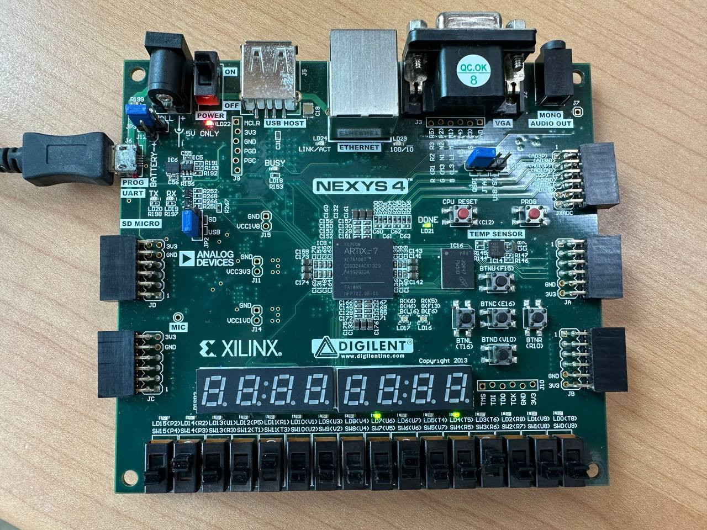

# Lab 01

## Introduction

### What is an FPGA?

Strictly speaking, the term FPGA is used to refer to the **chip** on, say, our Nexys 4 board — the one in the center which says "Artix-7" on it. The Nexys 4 as a whole is an FPGA development board. Sometimes, we may refer to the whole board as an "FPGA" - this is **technically incorrect**. Similarly, an Arduino is a microcontroller development board, not a microcontroller; the Atmega 328P chip on the Arduino is the microcontroller.

### The FPGA Design Flow



**Write RTL code in HDL**

Register-Transfer Level (RTL) code is written in an HDL. It describes the system we want to design in terms of the logic we want it to represent. Of course, the first step in creating a design is to write the RTL code so that we can eventually put it on our FPGA.



**Simulate RTL code**

This is an extremely important step in the FPGA design flow. Unfortunately, it is also one that is super tempting to skip! As a designer, it is extremely important for us to use the simulator to make sure our design is logically correct before we proceed to the next steps. If we decide to skip simulation and testing, we risk building and uploading a full design that produces the wrong output — with larger designs, this could be hours or days wasted!



**Synthesis**

Synthesis takes our RTL code and turns it into a "netlist" - that is, it converts it into a set of connections between the different components available on our FPGA board.



**Implementation**

Implementation takes our synthesised netlist and decides how the FPGA should be configured to implement that netlist. For example, it will choose the specific components to be used on the board (placement), and the specific wires that should be used to connect these components (routing).



**Programming/Uploading**

After running implementation, we need to generate a **bitstream** — this is a file we can upload to our FPGA board to program the FPGA and implement our design on it. Then, we upload the bitstream to our FPGA board, and voila: we have a working design on our FPGA!



## Creating a new Project in Vivado

### Constraints

Constraints files tell Vivado about the features of your FPGA board and how all of its peripherals like the LEDs and switches are connected to the FPGA chip. Therefore, every FPGA board has a different constraints file, and you must choose the correct one for your board. In our case, we are using a Nexys 4, so click "Add Files" and then add the file `Nexys-4-Master.xdc`.

## Simulation in Vivado

We mentioned [above](lab-01.md#the-fpga-design-flow) that simulation is an important step in the FPGA design flow. **Behavioral simulation** (the kind we will use) is perhaps the most important for us — it allows us to verify that our logic is all correct.

### Testbench

As we have seen in our [textbook](https://wenbo-notes.gitbook.io/ddca-notes/textbook/hardware-description-languages/testbench), we now explain testbench using another way.

> The simulation _testbench_ is an environment where we connect the device we want to test, to inputs that we can control and to outputs that we can monitor.

<details>

<summary>RTL? HDL? Are they the same?</summary>

All RTL code is written in an HDL, but not all HDL code is RTL code. In the [previous section](https://nus-cs2100de.github.io/labs/manuals/01/lab_01/#creating-a-simple-design), we used SystemVerilog, an HDL, to write RTL code that describes the design of a module we want to create. In this section, we use the same HDL to write simulation code.

</details>

### Writing a testbench

In this section, there is one line of error code that needs us to debug. The error code lies in **line 44** of `Adder.sv`. Basically, just change of the index from `2` to `3`.


```verilog
// error
assign carry[4] = in_a[2] & in_b[2] | (in_a[2] ^ in_b[2]) & carry[2];

// correct
assign carry[4] = in_a[3] & in_b[3] | (in_a[3] ^ in_b[3]) & carry[3];
```


## Making our design work

### Setting up constraints

In our constraint file — `Nexys-4-Master.xdc`, we will also need to use `led[8:0]` in this project. Thus, we also need to uncomment the **line 64-91**.

### Generate the bitstream

After generating the bitstream and program my FPGA, this is what I get for Question 4. Great! It works! Yay! ☺️

<figure><figcaption></figcaption></figure>

<details>

<summary>FPGA lost memory after plugged-out?</summary>

I have observed an interesting behavior on my FPGA. That is after I generate the bitstream file and use it to program my FPGA, I plug it out of my PC and plug it back, everything is gone and I have to program it again!

***

This is a normal behavior in FPGA because most FPGAs use **SRAM-based configuration** which enables very fast reconfiguration but the trade-off is that [**SRAM is volatile**](https://wenbo-notes.gitbook.io/ddca-notes/textbook/digital-building-blocks/memory-arrays#static-random-access-memory-sram)**,** so it cannot retain the bitstream without power.

</details>
