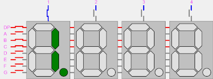

# Lab 03

## Introduction

### Clock

We have first encounterd the clock in [NUS CG2111A](https://wenbo-notes.gitbook.io/cg2111a-notes/tutorial/tut-1-gpio-and-interrupts#clock-in-the-atmega328p)! Now we met them again! We can go back to review the notes from CG2111A to get a better view about the clock. Unlike the ATmega328p, our FPGA has a clock built in, which runs at 100 MHz — that is, it completes a full period (on and then off) 100 million times a second (or every 10 nanoseconds).

### Registers

Register is something we have learned already from the textbook! Technically speaking, the register we used here is a 1-bit [D Flip-Flop](https://wenbo-notes.gitbook.io/ddca-notes/textbook/sequential-logic-design/latches-and-flip-flops#d-flip-flop). And still remember the very important sentence about the D flip-flop?

> A D flip-flop _**copies D to Q on the rising edge of the clock, and remembers its state at all other times until the next rising edge comes, then it will update its state**_**.**

That's essentially the soul of a D flip-flop/1-bit register! Now, let's look at the [verilog implementation of register](https://wenbo-notes.gitbook.io/ddca-notes/textbook/hardware-description-languages/sequential-logic#tab-verilog), remember that we have used an `always` statement.

> The keyword `always` is as the name implies; it means that any behaviour defined inside this block will be **repeated till the end of time** (or until you turn off/reprogram the FPGA, whichever comes first). This is the same behaviour as combinational logic — once you define a combinational logic circuit, it performs the same function till the end of time.

And this is again the soul of an `always` statement, both in combinational and sequential logic.

## Activity 1: Create a simple counter

### Customized Speed Counter

Following the instructions on the lab manual strictly, the code for our simple counter will be as follows,


```verilog
module Counter #(
    parameter int OUTPUT_BITS = 8,            // width of main counter
    parameter int CLK_HZ      = 100_000_000,  // FPGA input clock frequency (100 MHz default)
    parameter int TARGET_HZ   = 4             // desired output frequency (Hz)
) (
    input                        clk,
    input                        rst,      // active-low reset
    input                        up_down,  // 0 = count up, 1 = count down
    output reg [OUTPUT_BITS-1:0] count
);

  // Calculate number of input clock cycles per output increment
  localparam int N_COUNTS = CLK_HZ / TARGET_HZ;

  // Calculate number of bits needed for divider
  localparam int N_BITS = $clog2(N_COUNTS);

  // Clock divider counter
  logic [N_BITS-1:0] clk_cnt;

  always @(posedge clk) begin
    // Main counter
    if (!rst) begin
      count   <= 0;
      clk_cnt <= 0;
    end else begin
      // Second counter
      clk_cnt <= (clk_cnt == N_COUNTS - 1) ? 0 : (clk_cnt + 1);

      if (clk_cnt == 0) count <= (up_down == 0) ? (count + 1) : (count - 1);
    end
  end
endmodule
```



#### Code Explanation

1. This is a **template** for a customized speed counter which can count at the specified `CLK_HZ`.
2. In the second counter, the checking condition is `N_COUNTS-1` because you can think of the case when we reach the maximum, we still use one count to count to 0. Thus, we need to minus 1 from `N_COUNTS`.


And follow the requirements for the testbench on the lab manual, we have our testbench to be,


```verilog
module Counter_sim ();

  logic clk;
  logic rst;
  logic up_down;
  logic [7:0] count;

  Counter uut (
      .clk(clk),
      .rst(rst),
      .up_down(up_down),
      .count(count)
  );

  int correct_count = 0;

  initial begin
    clk = 0;
    up_down = 0;
    rst = 0;
    #10;
    rst = 1;
    for (int i = 0; i < 20; i++) begin
      if (count !== correct_count) begin
        $error("Counter output doesn't match");
        $stop;
      end
      correct_count++;
      #10;
    end
    up_down = 1;
    for (int i = 0; i < 20; i++) begin
      if (count !== correct_count) begin
        $error("Counter output doesn't match");
        $stop;
      end
      correct_count--;
      #10;
    end
    $finish;
  end

  // We need always block here to the clock to always toggle, so cannot be put in initial begin
  always begin
    #5 clk = ~clk;
  end

endmodule
```



#### Code Explanation

1. Note that in Line 21, the delay is `#10` and not `#1` (specified in the document) as 1 nanosecnod is not enough to let the counter reach the first posedge of `clk`. (See more from this [issue](https://github.com/NUS-CG3207/labs/discussions/36))


## Activity 2: Display the counter on seven-segment display

To get a preview of what we will design in this activity, please go to the [last part](lab-03.md#the-fruits-of-our-labour).

### Taking advantage of persistence of vision <a href="#taking-advantage-of-persistence-of-vision" id="taking-advantage-of-persistence-of-vision"></a>

We may have seen from [lab-02.md](lab-02.md "mention") that the seven-segment display can only display one unique digit at any time. However, we can play some tricks on our eyes. This is done by changing the display used very fast so that we can create the illusion of different displays showing different characters.

<figure><figcaption><p>By Laserlicht, <a href="https://creativecommons.org/licenses/by-sa/4.0">CC BY-SA 4.0</a>, <a href="https://commons.wikimedia.org/w/index.php?curid=115556518">Link</a></p></figcaption></figure>

### Putting everything together

Once again, before we make everything, make sure we are aware of what each module does, and the inputs and outputs of each module. And most importantly, bare in the heart of this FPGA design flow!

#### RTL Code

Here, we will use the [`SevenSegDecoder.sv`](https://wenbo-notes.gitbook.io/ddca-notes/lab/preparation-cs2100de/lab-02#writing-the-module) we have implemented in Lab 02 and the [`Counter.sv`](https://wenbo-notes.gitbook.io/ddca-notes/lab/preparation-cs2100de/lab-03#customized-speed-counter) we have implemented in activity 1 in this lab. Besides that, we still need to design our own `Top.sv` and a `SlowCounter.sv` (to acheieve the persistence of vision mentioned above)




```verilog
module Top (
    input        clk,
    input        btnL,
    btnC,
    btnR,               // left, center, right buttons
    input  [2:0] sw,    // switches for up/down
    output [7:0] an,    // anode enables
    output [6:0] seg    // segment lines
);

  // --- Counters ---
  logic [7:0] count0, count1, count2;

  Counter ctr0 (
      .clk(clk),
      .rst(~btnL),
      .up_down(sw[2]),
      .count(count0)
  );

  Counter ctr1 (
      .clk(clk),
      .rst(~btnC),
      .up_down(sw[1]),
      .count(count1)
  );

  Counter ctr2 (
      .clk(clk),
      .rst(~btnR),
      .up_down(sw[0]),
      .count(count2)
  );

  // --- Slow counter for multiplexing ---
  logic [2:0] digit_sel;

  SlowCounter refresh_ctr (
      .clk(clk),
      .rst(1'b1),
      .digit_sel(digit_sel)
  );

  // --- Current nibble (4-bit hex) to display ---
  logic [3:0] hex_value;

  always @(*) begin
    case (digit_sel)
      3'd0: hex_value = count2[3:0];  // rightmost
      3'd1: hex_value = count2[7:4];
      3'd2: hex_value = 4'hF;  // blank
      3'd3: hex_value = count1[3:0];
      3'd4: hex_value = count1[7:4];
      3'd5: hex_value = 4'hF;  // blank
      3'd6: hex_value = count0[3:0];
      3'd7: hex_value = count0[7:4];
    endcase
  end

  // --- 7-seg decoder ---
  SevenSegDecoder ssd (
      .sw ({digit_sel, hex_value}),
      .seg(seg),
      .an (an)
  );

endmodule
```





```verilog
module SlowCounter #(
    parameter int CLK_HZ     = 100_000_000,
    parameter int REFRESH_HZ = 1000          // 1 kHz refresh rate
) (
    input clk,
    input rst,
    output reg [2:0] digit_sel  // 0-7 (but we'll skip 2 and 5)
);

  localparam int N_COUNTS = CLK_HZ / REFRESH_HZ;
  localparam int N_BITS = $clog2(N_COUNTS);

  logic [N_BITS-1:0] clk_cnt;

  always @(posedge clk) begin
    if (!rst) begin
      clk_cnt   <= '0;
      digit_sel <= 3'd0;
    end else begin
      clk_cnt <= (clk_cnt == N_COUNTS - 1) ? '0 : clk_cnt + 1;

      if (clk_cnt == 0)
        case (digit_sel)
          3'd0: digit_sel <= 3'd1;
          3'd1: digit_sel <= 3'd3;  // skip 2
          3'd3: digit_sel <= 3'd4;
          3'd4: digit_sel <= 3'd6;  // skip 5
          3'd6: digit_sel <= 3'd7;
          3'd7: digit_sel <= 3'd0;
          default: digit_sel <= 3'd0;
        endcase
    end
  end
endmodule

```



#### Code Explanation

1. In our slow counter, as specified by the [design specification](https://nus-cs2100de.github.io/labs/manuals/03/lab_03/#design-specification_1), we skip 2 and 5 in our case statement so that in our seven-segment display the digit 2 and 5 will be blank.




#### Constraints

In our constraints file, remember to enable the `clk`, which is from Line 6-10! This is very important and easy to forget as it is our first time to enable `clk` on our Nexys 4 FPGA! Not doing so will cause failure to generate the bitstream file!

## The fruits of our labour


