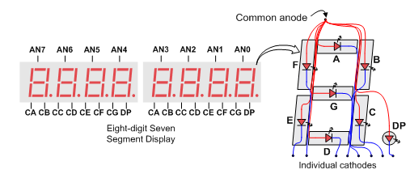

# Lab 02

## Introduction

In this lab, we will write the verilog code for a seven-segment decoder. For the final affect, see [here](lab-02.md#the-fruits-of-our-labour)!

### How the seven-segment display works <a href="#how-the-seven-segment-display-works" id="how-the-seven-segment-display-works"></a>

> The [Nexys 4 Reference Manual](https://digilent.com/reference/programmable-logic/nexys-4/reference-manual#seven-segment_display) does a very good job of explaining how the seven-segment displays are connected to the FPGA.

Basically, for each digit, we have one single anode shared by every segment. We still have a cathode for each segment, so we can control each segment individually. However, the cathode is shared by the same segment on every digit on the display. This means that two digits cannot display two different things at the same time.

<figure><figcaption></figcaption></figure>

To drive a segment led to light up, we need to both set its anode and cathode to 0. That means both the anode and cathode are **active-low**.

## Driving the seven-segment display

### Design Specification

This is very important as it tells us what our `sevensegdecoder` module does! As we have seen from the [lab manual](https://nus-cs2100de.github.io/labs/manuals/02/lab_02/#design-specification), the design specification is as follows,

* **Inputs**: `sw[6:0]`
  * `sw[3:0]` will be used to enter a 4-bit binary number. This hexadecimal digit (4-bit binary number) is what we will display on the specific digit of the 7-segment display.
  * `sw[6:4]` will be used to enter a 3-bit binary number .The number entered will specify which digit of the seven-segment display(s) will be used to display the hex digit.
* **Outputs**: `seg[6:0]` and `an[7:0]`
  * `seg[6:0]` is used to control the number to be displayed on the digit of the seven-segment display.
  * `an[7:0]` is used to control which digit of the seven-segment display will be enabled to display.

### Deriving the logic needed



**Table for the anode**

| switch\[6:4] | an\[7:0] |
| :----------: | :------: |
|      000     | 11111110 |
|      001     | 11111101 |
|      010     | 11111011 |
|      011     | 11110111 |
|      100     | 11101111 |
|      101     | 11011111 |
|      110     | 10111111 |
|      111     | 01111111 |


`an[0]` corresponds to the right-most digit, `an[7]` corresponds to the left-most digit. The rest you can derive.




**Table for the cathode**

| switch\[3:0] | seg\[6:0] |
| :----------: | :-------: |
|     0000     |  1000000  |
|     0001     |  1111001  |
|     0010     |  0100100  |
|     0011     |  0110000  |
|     0100     |  0011001  |
|     0101     |  0010010  |
|     0110     |  0000010  |
|     0111     |  1111000  |
|     1000     |  0000000  |
|     1001     |  0010000  |
|     1010     |  0001000  |
|     1011     |  0000011  |
|     1100     |  1000110  |
|     1101     |  0100001  |
|     1110     |  0000110  |
|     1111     |  0001110  |


`seg[6]` corresponds to the segment G/`CG` and `seg[0]` corresponds to the segment A/`CA`. The rest you can derive. In our Verilog, we don't need to care about the `DP`. Be careful with the sequence.




### Writing the module

The code for `an` and `seg` is as follows,


```verilog
// Structural code for anodes here:
assign an = ~(8'b00000001 << sw[6:4]);

// Code for segments here:
always @(*) begin
  case (sw[3:0])
    4'b0000: seg = 7'b1000000;  // 0
    4'b0001: seg = 7'b1111001;  // 1
    4'b0010: seg = 7'b0100100;  // 2
    4'b0011: seg = 7'b0110000;  // 3
    4'b0100: seg = 7'b0011001;  // 4
    4'b0101: seg = 7'b0010010;  // 5
    4'b0110: seg = 7'b0000010;  // 6
    4'b0111: seg = 7'b1111000;  // 7
    4'b1000: seg = 7'b0000000;  // 8
    4'b1001: seg = 7'b0010000;  // 9
    4'b1010: seg = 7'b0001000;  // A
    4'b1011: seg = 7'b0000011;  // b
    4'b1100: seg = 7'b1000110;  // C
    4'b1101: seg = 7'b0100001;  // d
    4'b1110: seg = 7'b0000110;  // E
    4'b1111: seg = 7'b0001110;  // F
    default: seg = 7'b1111111;  // blank
  endcase
end
```



For the `an`, there are many implementations, but here I use the more elegant one that I think. Anyway, it works it works! That's the principle for NUS ECE 😂



As the `seg` signal (vector) is **assigned** in an `always` statement, it **must** be declared as `reg`.


## Simulation

Here, the Lab sheet specifies that we should use loop. So, the testbench using loops is as follows,


```verilog
module SevenSegDecoder_sim ();

  logic [6:0] sw;
  logic [7:0] an;
  logic [6:0] seg;

  SevenSegDecoder uut (
      .sw (sw),
      .an (an),
      .seg(seg)
  );

  initial begin
    for (int i = 0; i < 128; i++) begin
      sw = i;  //apply input
      #10;
    end
  end
endmodule
```



In Verilog, the signal that is **assigned** inside an `initial begin end` statement **must** be declared as `reg`.


## The fruits of our labour

Now, we should modify our constraints file to enable the corresponding inputs on our FPGA. The changes we need to make in this lab is to uncomment

1. Line 12 to Line 33 (for `sw[6:0]`)
2. Line 135 to Line 185 (for `seg[6:0]` and `an[7:0]`)

And yeah, we after we program our FPGA, we can enjoy the fruits of our labour or maybe go back to step 1 and start debugging if there is some strange behaviour.


