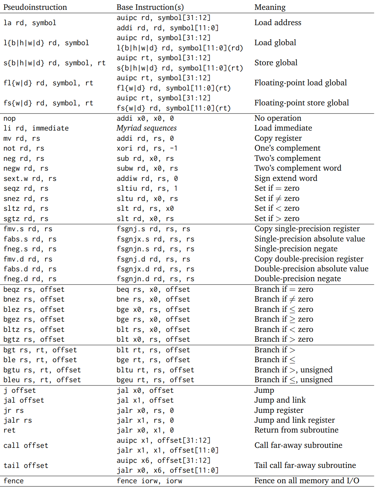

# RISC-V Resources

## RISC-V Pseudo-Instruction

The followting table from RISC-V reference card introduces all the pseudo-instruction in RISC-V.

<figure><figcaption></figcaption></figure>

## External Useful Resources

1. [Godbolt](https://godbolt.org/): This is a useful website to convert high-level language code to RISC-V assembly code.
2. RISC-V Reference card: Got two versions here
   1. One is from [Cambridge](https://www.cl.cam.ac.uk/teaching/1617/ECAD+Arch/files/docs/RISCVGreenCardv8-20151013.pdf). (This version contain more syntax)
   2. The other is from [James Zhu from UCB](https://github.com/jameslzhu/riscv-card). (This version is more complete)
3. [RISC-V Official Whitepaper](https://drive.google.com/file/d/1uviu1nH-tScFfgrovvFCrj7Omv8tFtkp/view?usp=drive_link).
