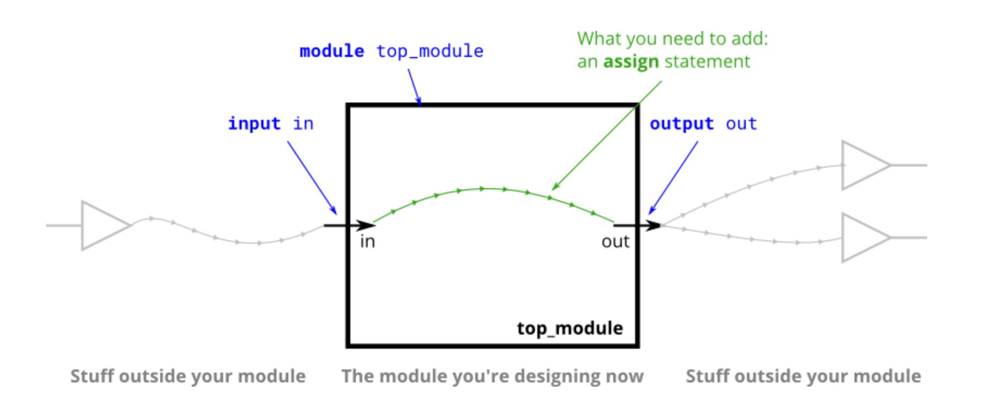
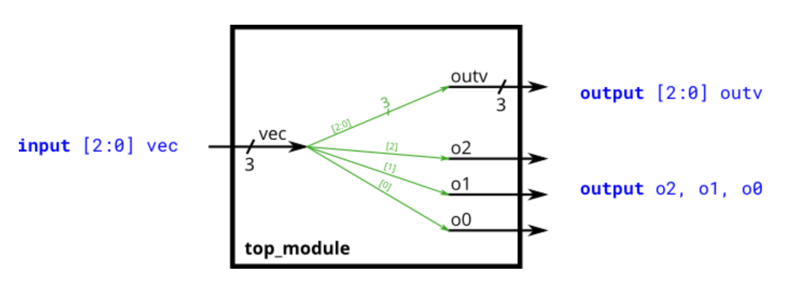
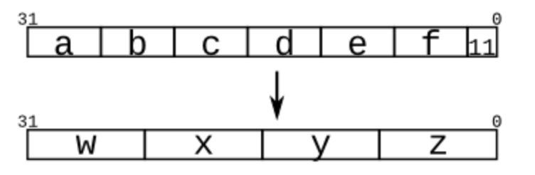
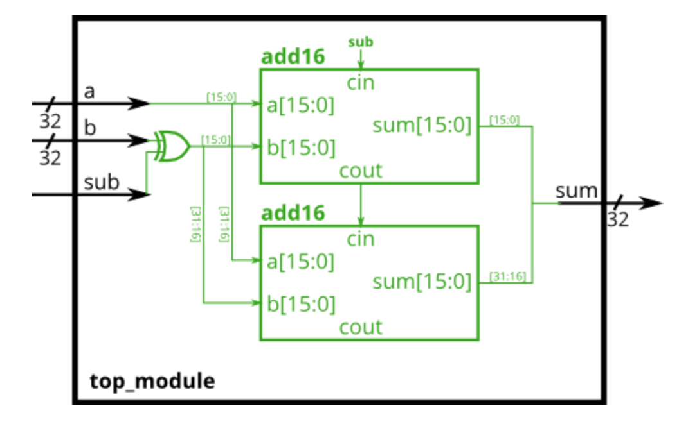
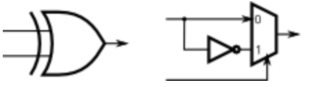

# Verilog LifeSaver

As we have a glimpse of how [SystemVerilog/Verilog](../../textbook/hardware-description-languages/) looks like by looking at how they are constructed by using the digital building blocks, like combinational logic, registers, etc. Now, we shall also introduce the programming side of this Verilog.

## Wire

Unlike physical wires, wires (and other signals) in Verilog are _directional_. This means information flows in only one direction, from (usually one) _source_ to the _sinks_ (The source is also often called a _driver_ that _drives_ a value onto a wire).

The ports on a module also have a direction (usually input or output). An input port is _driven by_ something from outside the module, while an output port _drives_ something outside. When viewed from inside the module, an input port is a driver or source, while an output port is a sink.

<figure><figcaption></figcaption></figure>

### Vector

Vectors are used to group related signals using one name to make it more convenient to manipulate. For example, `wire [7:0] w;` declares an 8-bit vector named `w` that is functionally equivalent to having 8 separate wires.


In Verilog, **vector** is just a **group of wires**.


#### Classic Examples



**Vector Basic**

<figure><figcaption></figcaption></figure>


```verilog
module top_module(
	input [2:0] vec, 
	output [2:0] outv,
	output o2,
	output o1,
	output o0
);
	
	assign outv = vec;

	// This is ok too: assign {o2, o1, o0} = vec;
	assign o0 = vec[0];
	assign o1 = vec[1];
	assign o2 = vec[2];
	
endmodule
```




**Part Select: Endianness Swap**

Example 1: A 32-bit vector can be viewed as containing 4 bytes (bits \[31:24], \[23:16], etc.). Build a circuit that will reverse the _byte_ ordering of the 4-byte word.

```
AaaaaaaaBbbbbbbbCcccccccDddddddd => DdddddddCcccccccBbbbbbbbAaaaaaaa
```

Part-select can be used on both the left side and right side of an assignment. Thus, the Verilog code should look as follows,


```verilog
module top_module (
	input [31:0] in,
	output [31:0] out
);

	assign out[31:24] = in[ 7: 0];	
	assign out[23:16] = in[15: 8];	
	assign out[15: 8] = in[23:16];	
	assign out[ 7: 0] = in[31:24];	
	
endmodule
```


***

Example 2: Given an 8-bit input vector \[7:0], reverse its bit ordering.


```verilog
module top_module (
	input [7:0] in,
	output [7:0] out
);
	
	assign {out[0],out[1],out[2],out[3],out[4],out[5],out[6],out[7]} = in;
endmodule
```



#### Code Explanation

1. For now, we don't use a for-loop for this. Leave it for the future.




**Bitwise and Logical Operators in Verilog**

The table [here](https://wenbo-notes.gitbook.io/ddca-notes/recap-from-ntu-sc1005/digital-circuit/verilog-intro#verilog-assignment-operators) summarises the bitwise and logical operators in verilog well.



**Concatenating Vectors**

The technique used here has been introduced in this [chapter](https://wenbo-notes.gitbook.io/ddca-notes/textbook/hardware-description-languages/combinational-logic#bit-swizzling). The concatenating can be done both in the L.H.S and R.H.S of the continuous assignment statements.

***

Example: Given several input vectors, concatenate them together then split them up into several output vectors. There are six 5-bit input vectors: a, b, c, d, e, and f, for a total of 30 bits of input. There are four 8-bit output vectors: w, x, y, and z, for 32 bits of output. The output should be a concatenation of the input vectors followed by two 1 bits:

<figure><figcaption></figcaption></figure>


```verilog
module top_module (
    input [4:0] a, b, c, d, e, f,
    output [7:0] w, x, y, z );//

    // assign { ... } = { ... };
    assign {w, x, y, z} = {a, b, c, d, e, f, 2'b11};
endmodule
```




## Modules

#### Classic Examples



[**Adder-subtractor**](https://hdlbits.01xz.net/wiki/Module_addsub)

An adder-subtractor can be built from an adder by optionally negating one of the inputs, which is equivalent to inverting the input then adding 1. The net result is a circuit that can do two operations: (a + b + 0) and (a + \~b + 1).

You are provided with a 16-bit adder module, which you need to instantiate twice:


```verilog
module add16 ( input[15:0] a, input[15:0] b, input cin, output[15:0] sum, output cout );
```


Build the adder-subtractor below.

<figure><figcaption></figcaption></figure>


#### Hint

1. An XOR gate can also be viewed as a programmable inverter, where one input controls whether the other should be inverted. The following two circuits are both XOR gates:

<p align="center"></p>

2. Use a 32-bit wide XOR gate to invert the b input whenever sub is 1. This can also be viewed as `b[31:0]` XORed with `sub` replicated 32 times.



```verilog
module top_module(
    input [31:0] a,
    input [31:0] b,
    input sub,
    output [31:0] sum
);
    // Xor B
    wire [31:0] xorB;
    assign xorB = sub ? ~b : b;
    // or can be written as follows
    // assign xorB = b ^ {32{sub}};
    
    wire cout1, cout2;
    add16 adder1 (a[15:0], xorB[15:0], sub, sum[15:0], cout1);
    add16 adder2 (a[31:16], xorB[31:16], cout1, sum[31:16], cout2);
    
endmodule

```




## Procedures

Procedures include `always`, `initial`, `task`, and `function` blocks. Procedures allow sequential statements (which cannot be used outside of a procedure) to be used to describe the behaviour of a circuit.


`initial`, `task`, and `function` are usually useful in [testbench](../../textbook/hardware-description-languages/testbench.md).


### Combinational `always` block&#x20;

Since digital circuits are composed of logic gates connected with wires, any circuit can be expressed as some **combination of modules** and `assign` statements. However, sometimes this is not the most convenient way to describe the circuit. _Procedures_ (of which `always` blocks are one example) provide an alternative syntax for describing circuits.

For synthesizing hardware, two types of always blocks are relevant:

* Combinational: `always @(*)`
* Clocked: `always @(posedge clk)`

Combinational `always` blocks are **equivalent** to `assign` statements, thus there is always a way to express a combinational circuit both ways. The choice between which to use is mainly an issue of which syntax is more convenient. The syntax for code inside a procedural block is different from code that is outside. Procedural blocks have a richer set of statements (e.g., `if-else`, `case`), cannot contain [continuous assignments](https://wenbo-notes.gitbook.io/ddca-notes/textbook/hardware-description-languages/combinational-logic#continuous-assignment-statement), but also introduces many new non-intuitive ways of making errors.

<details>

<summary><code>reg</code> vs. <code>wire</code></summary>

As we have seen the rule of thumb explained [here](../../textbook/hardware-description-languages/data-types.md#reg-and-wire-rule-of-thumb), we have further explanation below

> The **left-hand-side** of an [**continuous assign statement**](https://wenbo-notes.gitbook.io/ddca-notes/textbook/hardware-description-languages/combinational-logic#continuous-assignment-statement) must be a _net_ type (e.g., wire), while the **left-hand-side** of a **procedural assignment** (in an `always` block) must be a _variable_ type (e.g., reg). These types (wire vs. reg) have nothing to do with what hardware is synthesized, and is just syntax left over from Verilog's use as a hardware _simulation_ language.

This rule applies to every _procedural_ block — `always`, `initial`, `task`, and `function`. In short, in procedural blocks, the L.H.S can only be

* `reg`, or
* `integer`.

</details>

### Clocked[^1] `always` block

Clocked always blocks create a blob of combinational logic just like combinational always blocks, but also creates a set of [flip-flops](https://wenbo-notes.gitbook.io/ddca-notes/textbook/sequential-logic-design/latches-and-flip-flops#d-flip-flop) (or "[registers](https://wenbo-notes.gitbook.io/ddca-notes/textbook/sequential-logic-design/latches-and-flip-flops#register)") at the output of the blob of combinational logic. Instead of the outputs of the blob of logic being visible immediately, the outputs are visible only immediately after the next (`posedge` clk).


The second sentence (Staring from "Instead") is goated!!!


<details>

<summary>Blocking vs. Non-blocking Assignments</summary>

There are three types of assignments in Verilog:

* [Continuous assignments](https://wenbo-notes.gitbook.io/ddca-notes/textbook/hardware-description-languages/combinational-logic#continuous-assignment-statement) (`assign x = y;`). Can only be used when **not** inside a procedure ("`always` block").
* Procedural blocking assignment: (`x = y;`). Can only be used inside a procedure.
* Procedural non-blocking assignment: (`x <= y;`). Can only be used inside a procedure.

We have already seen the rule of thumb for blocking and non-blocking statements [here](https://wenbo-notes.gitbook.io/ddca-notes/textbook/hardware-description-languages/combinational-logic#continuous-assignment-statement)! Feel free to go back and review the rules again! A short summary is

> In a **combinational** `always` block, use **blocking** assignments. In a **clocked** `always` block, use **non-blocking** assignments.

</details>

### `initial` block

The `initial` block is primarily used to initialize variables and drive design ports with specific values. It is **not synthesizable** and hence cannot be converted into a hardware schematic with digital elements. Thus, we have stated above that the `initial` block is usually used in testbench. However, we can still use them in our RTL code to initialize our variables, but note that this initialization is just for testbench!


As `initial` block is also a _procedure_, the [rule](verilog-lifesaver.md#reg-vs.-wire) here still applies!


### Function

A function can reduce the appearance of repeated code in Verilog. For now, please visit [here](https://www.chipverify.com/verilog/verilog-functions) for more examples.

### Task

A `function` is meant to do some processing on the input and return a single value, whereas a `task` is more general and can calculate multiple result values and return them using _output_ and _inout_ type arguments. Tasks can contain simulation time consuming elements such as `@`, `posedge` and others.

To write a task, a good example is introduced in [NUS CG3207 Lab 1's testbench](../lab-01-get-prepared.md#auto-check-version).

***

#### Credits

1. [HDLBits](https://hdlbits.01xz.net/wiki/Main_Page)
2. [ChipVerify.com](https://chipverify.com/)

[^1]: "Clocked" is a synonym of "sequential"
