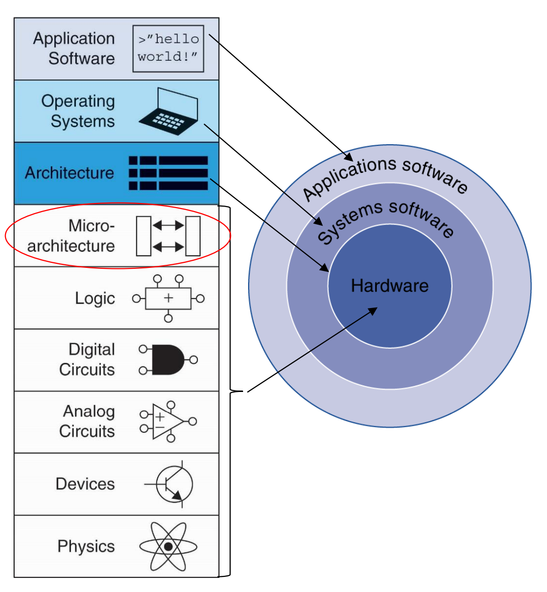
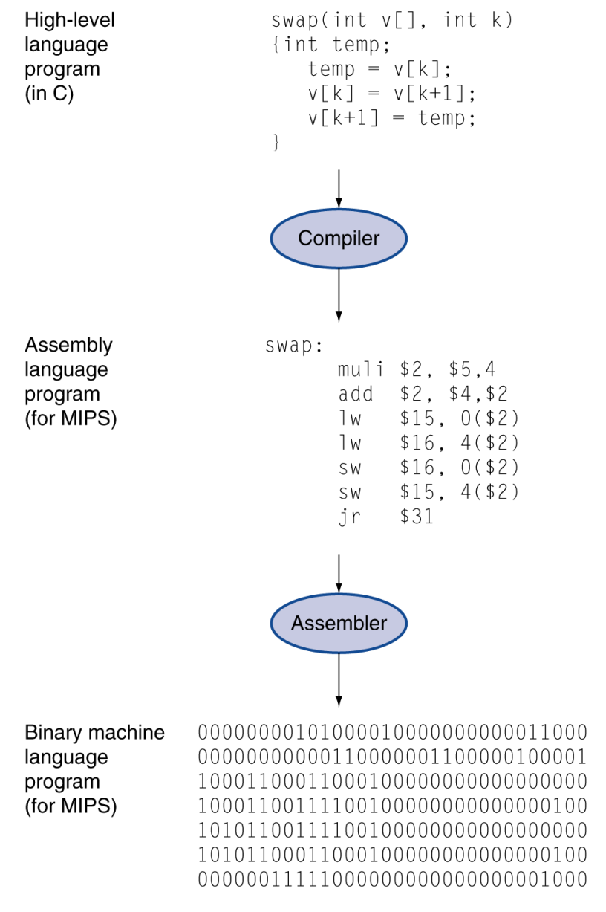

# Lec 01- History, Technology, Performance

## Intro

### Below your program

This famous image is called [_abstraction_ in Harris & Harris](https://wenbo-notes.gitbook.io/ddca-notes/textbook/from-zero-to-one#abstraction). Please go back to review the work of art before continue reading!

<figure><figcaption></figcaption></figure>

Basically, here we categorize these abstractions into three categories

1. **Application software**: Written in high-level language
2. **System software**: Operating System, a.k.a. service code
   1. Handling input/output
   2. Managing memory and storage
   3. Scheduling tasks & sharing
      &#x20;resources
3. **Hardware**: **Processor**, memory, I/O
   &#x20;controllers

### Levels of Program Code

<figure><figcaption></figcaption></figure>

There are three levels when we run a high-level language program (like C) on a processor

1. **High-level language**:
   1. Level of abstraction closer to
      &#x20;problem domain
   2. Provides for productivity and
      &#x20;portability
2. **Assembly language**: Textual representation of
   &#x20;instructions
3. **Hardware representation**:
   1. Binary digits (bits)
   2. Encoded instructions and data

### ISA

Again, go back to the Harris & Harris notes about architecture and microarchitecture [here](https://wenbo-notes.gitbook.io/ddca-notes/textbook/from-zero-to-one#abstraction) as it is pretty well-written!


ISA = assembly language programmer's / firmware engineer's view of the processor. Microarchitecture = hardware engineer's view of the processor.


### ABI



**What is an ABI?**

An **ABI (Application Binary Interface)** builds on the **ISA**, which already defines what instructions the CPU understands, but goes further by specifying **how programs interact with the OS, libraries, and hardware at the binary level**.



**What does ABI specify?**

Usually, the ABI will specify under an ISA, what is the purpose of each register. (For example, the [RISC-V Register File](https://wenbo-notes.gitbook.io/ddca-notes/textbook/architecture/assembly-language#the-register-set) is defined by its ABI)



**Why is ABI important?**

With ABI, we can get **binary portability**. For example, a program compiled on one Linux x86-64 system can run on another Linux x86-64 system, because both respect the same ABI rules.

So, think of ISA as the **language (**[**words**](#user-content-fn-1)[^1] **+** [**vocabulary**](#user-content-fn-2)[^2]**)**. Then ABI is like the **etiquette and customs**:

* Not just _what words mean_, but _how you greet people, how you exchange gifts, how you behave_. If two people speak the same language but follow different customs, they’ll still miscommunicate. Similarly, two programs can be compiled for the same ISA, but if they don’t agree on the ABI, they’ll misinterpret function calls or data.



### Todos



**Compare and contrast API and ABI**

In short: **API = source-level contract; ABI = binary-level contract**.

| Aspect         | API                                                                                                | ABI                                                                                                                                                                                                                                             |
| -------------- | -------------------------------------------------------------------------------------------------- | ----------------------------------------------------------------------------------------------------------------------------------------------------------------------------------------------------------------------------------------------- |
| **Level**      | Source code level                                                                                  | Binary / machine code level                                                                                                                                                                                                                     |
| **Definition** | This is the set of public types/variables/functions that you expose from your application/library. | This is how the compiler builds an application.                                                                                                                                                                                                 |
| **Example**    | C standard library function `printf()` is an API                                                   | 
It defines things (but is not limited to):
<ul><li>How parameters are passed to functions (registers/stack).</li><li>Who cleans parameters from the stack (caller/callee).</li><li>Where the return value is placed for return.</li></ul> |



**Read up on** [**Calling Convention on RISC-V**](https://riscv.org/wp-content/uploads/2024/12/riscv-calling.pdf)

In this course, we use RISC-V RV32I. So, the **calling convention in RISC-V RV32I** makes sure that **every compiler, OS, and library agrees** on where arguments/return values go. This way, code compiled separately (say, your program + a math library) can work together at the binary level.



**Which are the popular ISAs?**

This is simple, nowadays, we mainly has the following ISAs

1. x86
2. ARM
3. RISC-V
4. MIPS



## History

### Digital Hardware Market Segments

1. ASIC (application specific integrated circuit)
2. ASSP (application specific standard product)
3. FPGA (field programmable gate array)

### Application Processor Market

Application processors = Processors used in smartphones / tablets (ARMv8A / 9A instruction set)

### Moore's Law

In 1965, Intel’s Gordon Moore predicted that **the
&#x20;number of transistors** that can be integrated on **single chip** would **double** about **every two years**.

## Technology

### Power Trends

In CMOS IC technology,

$$
\text{Power}=\text{Capacitive Load}\times\text{Voltage}^2\times\text{Frequency}
$$

For example, suppose a new CPU has

* 85% of capacitive load of old CPU
* 15% voltage and 15% frequency reduction

The power reduction proportion is

$$
\frac{\text{P}_{\text{new}}}{\text{P}_{\text{old}}} = \frac{\text{C}_{\text{old}} \times 0.85 \times (\text{V}_{\text{old}} \times 0.85)^2 \times \text{F}_{\text{old}} \times 0.85}{\text{C}_{\text{old}} \times \text{V}_{\text{old}}^2 \times \text{F}_{\text{old}}} = 0.85^4 = 0.52
$$

But, we have reached the power wall nowadays,

* we can't reduce voltage further
* we can't remove more heat

How else can we improve performance?

### Issues and Modern Trends

To solve the power wall problem above, the modern trends are now as follows,

* Limited instruction level parallelsim (ILP), power issues
  * Cloud computing
  * Multi-core/processor systems, clusters
  * [Heterogeneous systems](#user-content-fn-3)[^3], hardware
    &#x20;accelerators, hardware/software codesign, [reconfigurable computing](#user-content-fn-4)[^4]
  * Application-specific instruction-set processors: NPU, TPU, Bitcoin mining, etc.
* Reaching the limits of silicon:
  * Use compound semiconductors such as GaN, InP, etc.
* The communication bottleneck — within and between chips: the data transfer speed between processor and memory
  * SoCs, multi-chip modules
  * 3D ICs/stacking (e.g., in HBM)
  * Optical interconnects: Use light instead of electricity to communicate
  * In-memory computing
* Leakage current & short channel effects
  * Multi-gate (3D) FETs — FinFET and gate-all-around (GAA) FETs.


The first level bullet points are the **problems**, the second level bullet points are the **modern trends solutions**.


### Todos



**Read up on chip binning**

**Chip binning** = sorting tested chips into categories (“bins”) based on their measured performance characteristics. An example is, same silicon die[^5] may become a “Core i9” if it passes high-frequency tests, or a “Core i5” if only stable at lower clocks.

This can **maximizes** [**yield**](#user-content-fn-6)[^6], so instead of throwing away chips that can’t meet the top spec, sell them in lower bins.



## Performance

### Throughput vs. Response Time

* Response time (execution time) – the time between the
  &#x20;start and the completion of a task.
* Throughput – the total amount of work done in a given
  &#x20;time.

Will need different performance metrics as well as a
&#x20;different set of applications to benchmark personal
\
mobile devices, embedded and desktop computers, which are more focused on response time, versus
\
servers, which are more focused on throughput.

### Relative Performance

We define performance to be

$$
\text{Performance}=\frac{1}{\text{Execution Time}}
$$

"X is $$n$$ time faster than Y" is equivalent to

$$
\frac{\text{Performance}_{\text{x}}}{\text{Performance}_{\text{y}}} = \frac{\text{Execution time}_{\text{y}}}{\text{Execution time}_{\text{x}}} = n
$$

Example: time taken to run a program

* 10s on A, 15s on B
* $${\text{Execution time}_{\text{B}}}\div{\text{Execution time}_{\text{A}}}=15\div10=1.5$$
* So A is 1.5 times fater than B

### CPU Clocking

* **Clock period / Clock cycle time / Cycle time (**$$T_c$$**):** the **duration of a clock cycle**. It is the **reciprocal** of clock frequency (rate). e.g., 250ps = 0.25ns = $$250\times10^{-12}$$s.
* **Clock frequency (rate)**: **cycles per second**. e.g., 4.0GHz = 4000MHz = $$4.0\times10^9$$Hz.
* **Clock cycles**: the **total** number of clock cycles needed to finish a task.
* **CPU Time:** the actual time taken by the CPU to execute a program.

Example

* Designing Computer B
  * Aim for 6s CPU to,e
  * Can do faster clock, but causes 1.2 x clock cycles
* How fast must Computer B clock be?

$$
\begin{align*}
\text{Clock Rate}_{\text{B}} &= \frac{\text{Clock Cycles}_{\text{B}}}{\text{CPU Time}_{\text{B}}} = \frac{1.2 \times \text{Clock Cycles}_{\text{A}}}{6\text{s}} \\
\text{Clock Cycles}_{\text{A}} &= \text{CPU Time}_{\text{A}} \times \text{Clock Rate}_{\text{A}} \\
&= 10\text{s} \times 2\text{GHz} = 20 \times 10^9 \\
\text{Clock Rate}_{\text{B}} &= \frac{1.2 \times 20 \times 10^9}{6\text{s}} = \frac{24 \times 10^9}{6\text{s}} = 4\text{GHz}
\end{align*}
$$

### Instruction Count (IC) and CPI

$$
\begin{align*}
\text{Clock Cycles} &= \text{Instruction Count} \times \text{CPI} \\
 &= \text{CPU Time} \times \text{Clock Rate} \\
&= \frac{\text{CPU Time}}{\text{Clock Cycle Time}} \\
\text{CPU Time} &= \text{Instruction Count} \times \text{CPI} \times \text{Clock Cycle Time} \\
 &= \frac{\text{Instruction Count} \times \text{CPI}}{\text{Clock Rate}}
\end{align*}
$$

* **Instruction Count (IC)** : the **total** number of instructions that a CPU must execute to complete a given program or task.
  * It is determined by **program, ISA** and **compiler**.
* **Cycles per Instruction (CPI):** As its name suggested.
  * It is determined by **CPU hardware**.


If different instructions have different CPI. Average CPI affected by instruction mix.


#### Example

1. CISC-> lower IC, higher CPI. RISC->higher IC, lower CPI.

### CPI in more detail

If different instruction classes take different numbers of cycles

$$
\text{Clock Cycles} = \sum_{i=1}^{n} (\text{CPI}_i \times \text{Instruction Count}_i)
$$

Weighted average CPI

$$
\text{CPI} = \frac{\text{Clock Cycles}}{\text{Instruction Count}} = \sum_{i=1}^{n}~(\text{CPI}_i\times\frac{\text{Instruction Count}_i}{\text{Instruction Count}})
$$

An CPI Example:

* Computer A: Cycle Time = 250ps, CPI = 2.0
* Computer B: Cycle Time = 500ps, CPI = 1.2
* Same ISA, compiler -> Same IC
* Which is faster, and by how much?

$$
\begin{align*}
\text{CPU Time}_{\text{A}} &= \text{Instruction Count} \times \text{CPI}_{\text{A}} \times \text{Cycle Time}_{\text{A}} \\
&= I \times 2.0 \times 250\text{ps} = I \times 500\text{ps} \\
\text{CPU Time}_{\text{B}} &= \text{Instruction Count} \times \text{CPI}_{\text{B}} \times \text{Cycle Time}_{\text{B}} \\
&= I \times 1.2 \times 500\text{ps} = I \times 600\text{ps} \\
\frac{\text{CPU Time}_{\text{B}}}{\text{CPU Time}_{\text{A}}} &= \frac{I \times 600\text{ps}}{I \times 500\text{ps}} = 1.2
\end{align*}
$$

### Performance Summary

Performance depends on

* Algorithm: affects IC, possibly CPI
* Programming language: affects IC, CPI
* Compiler: affects IC, CPI
* Instruction Set Architecture (ISA): affects IC, CPI, Cycle Time ($$T_c$$)

### Amdahl's law

Amdahl’s Law describes the **limits of performance improvement** when you only improve part of a system. It says,

> If only part of the execution time can be improved, the overall speedup is limited by the fraction of time that part takes.

Its formula form is,

$$
\text{T}_{\text{improved}} = \frac{\text{T}_{\text{affected}}}{\text{improvement factor}} + \text{T}_{\text{unaffected}}
$$

or it can be written as,

$$
S=\frac{1}{(1-f)+\frac{f}{k}}
$$

, where $$S$$ is the overall system speed up, $$f$$ is the fraction of work performed by the faster component, and $$k$$ is the speedup of the new component (same component as $$f$$).

For example, imagine you optimize **disk I/O** in a program:

* Program runtime: 50 seconds
* Disk I/O: 10 seconds (20%)
* Computation: 40 seconds (80%)

If you make disk I/O **10× faster**, then:

$$
T_{\text{new}}=\frac{10}{10}+40=41~\text{seconds}
$$

So, the speed up is,

$$
\frac{50}{41}\approx1.22
$$

Or using the second formula, we can get

$$
S=\frac{1}{(1-0.2)+\frac{0.2}{10}}=\frac{50}{41}\approx1.22
$$

Even though disk I/O became **10× faster**, the overall program only got **22% faster**, because disk I/O was only a small part of the total time.


From the Amdahl's law, we can deduce a very useful idea — "Make the **common case fast**". As the common case takes larger portion of time, improving it can improve the speed of the whole system significantly.


### Eight Great Ideas

* Design for [Moore's Law](lec-01-history-technology-performance.md#moores-law).
* Use **abstraction** to simplify the design.
* Make the **common case fast**.
* Performance via **parallelism**.
* Performance via **pipelining**.
* Performance via **prediction**: prediction depends on the history
* **Hierarchy** of memories: Cache, main memory, disk.
* **Dependability** via redundancy: One transistor broken should not affect the whole system.

[^1]: words are instructions.

[^2]: vocabulary is the instruction set.

[^3]: Use different type of processors to do different tasks

[^4]: FPGAs

[^5]: A single, individual integrated circuit that has been cut from the wafer and contains the complete electronic circuitry for a specific function. From a "die" to "chip", **packaging** is needed.

[^6]: yield is the proportion of working dies per wafer.
