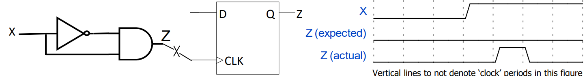
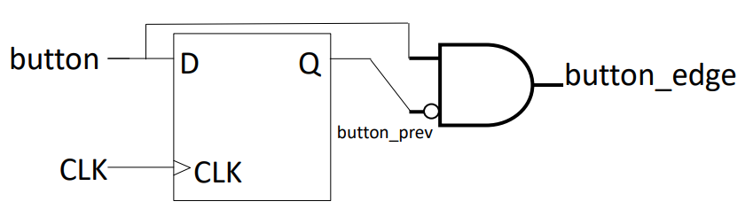
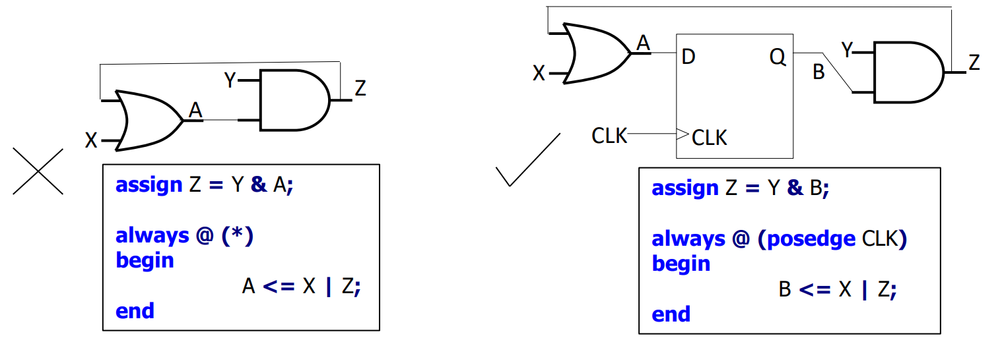
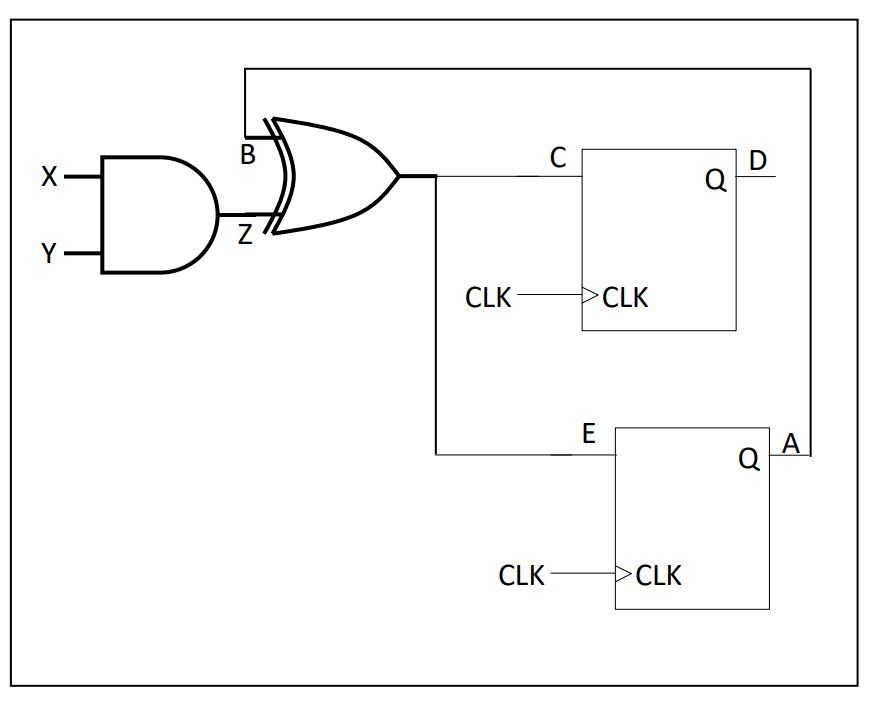

# Lec 02 - Digital System Design and Verilog

## Digital System Design

### Levels of Abstraction

Different from the [abstraction](https://wenbo-notes.gitbook.io/ddca-notes/textbook/from-zero-to-one#abstraction) we have seen in Harris & Harris, here, we will talk about the abstraction in digital system design. And below is a simple illustration,

<figure><figcaption></figcaption></figure>

Let's have a detailed look on each level,



#### **Algorithm/System Level (Untimed)**

At the highest level, the design is expressed as algorithms or functional behavior without worrying about timing.

For example, describing `output = (A+B) + (C+D)` in a flowchart or C-like pseudocode.

**Focus:** This part is only on the _functionality_, not on how many cycles or how it’s implemented in hardware.



#### **Register Transfer Level (RTL, Timed)**

It is the macroscopic hardware view and is described in terms of **data transfers between registers** and **operations performed by functional units (ALUs, multiplexers, etc.)** under clock control. And this macroscopic hardware view is **implemented** using the RTL code. Thus, it is timed, cycle-accurate, but still abstract (macroscopic).

For example, we have written the RTL Code in [CG3207 Lab01](https://wenbo-notes.gitbook.io/ddca-notes/lab/lab-01-get-prepared#rtl-design), and the following simple Verilog code is also an example of RTL Code


```verilog
always @(posedge clk)
    output <= (A+B) + (C+D);
```


**Focus:** This is where your **macroscopic blocks** appear — ALUs, adders, multiplexers, etc. And RTL code is the implementation of these macroscopic blocks.



#### **Gate Level**

It is the microscopic hardware view. The RTL code is **synthesized into** [**logic gates**](#user-content-fn-1)[^1] (AND, OR, NOT, flip-flops).

For example,`(A+B)` becomes a [ripple-carry adder](https://wenbo-notes.gitbook.io/ddca-notes/textbook/digital-building-blocks/arithmetic-circuits#ripple-carry-adder) built out of AND/OR/XOR gates. It is boolean equations + gates, but no transistor-level details.

**Focus:** This is your **microscopic implementation** of RTL macros.



#### **Circuit Level**

It is the actual electronic implementation of logic gates using [**CMOS Transistors**](https://wenbo-notes.gitbook.io/ddca-notes/textbook/from-zero-to-one/cmos-transistors).

For example, an inverter (`NOT gate`) is realized using one PMOS and one NMOS transistor.

**Focus:** Device-level representation, electrical properties like delay, power, capacitance are considered.



#### **Layout Level**

It is the physical representation of the circuit on silicon. Masks for fabrication are designed here. And it is the final physical placement/routing of transistors and wires.



### Simplified FPGA/ASIC Design Flow

<figure><figcaption></figcaption></figure>


The words at the right side of the arrow is the **output** of its upper step. For example, after "Logic Synthesis", the output is a **netlist**.


#### Behavioral Modelling

Behavioral modeling defines the "what" of your FPGA/ASIC design — its high-level logic and algorithms — without hardware details. It’s for verifying functionality early.

* **Purpose**: Ensures algorithmic correctness via simulations.
* **Tools**:
  * Initial tests with Python, C, Java, Matlab (fast, sequential). e.g., A Python script to simulate a filter: `output = input * 0.5 if input > 0 else 0` to test logic.
  * Deeper simulations with VHDL, Verilog, SystemC (handles concurrency and timing, but no cycle accuracy).
* **Not Directly Synthesized**: Meant for validation, not hardware generation.
* **HLS Trend**: High-Level Synthesis tools (e.g., Vivado HLS) can convert behavioral code to RTL, but effectiveness varies by tool, domain, and needs manual tweaks.

Then, the behavioral code/algo will be fed into Architectural Synthesis in the design flow, making complex problems manageable through iteration.

#### Architectural Synthesis

Architectural synthesis turns a high-level functional/behavioral (acrhitectural) model into a **macroscopic** structural (microarchitectural) model for FPGAs/ASICs. It’s mostly manual but becoming more automated.

> In short, architectural synthesis is just writing **RTL Code** or get the schematic (macroscopic model). But to write good RTL Code, we first need to have a clear **macroscopic** model/diagram. (See [RISC-V microarchitecture](https://wenbo-notes.gitbook.io/ddca-notes/lec/lec-03-risc-v-isa-and-microarchitecture#risc-v-microarchitecture) from Lec 03 as an example)

* **Purpose**: Converts abstract logic into a cycle-accurate, synthesizable RTL code, typically with [structural](https://wenbo-notes.gitbook.io/ddca-notes/textbook/hardware-description-languages/structural-modeling) and [behavioral](https://wenbo-notes.gitbook.io/ddca-notes/textbook/hardware-description-languages/combinational-logic) elements.
* **Output**: A block-level model where operations are **timed** and assigned to **hardware blocks**. _Example_: From `Z = (A+B) * (C+D) * E`, it creates a plan with adders and multipliers.
* **Key Steps**:
  * **Scheduling** (time, or when do we do the operation): Assigns operations to clock cycles (an integer). Finding all the clock cycles (integers) is called **solving** the scheduling problem. e.g.,  `(A+B)` in cycle #1, `(C+D)` in cycle #2.
  * **Binding** (space, or where do we do the operation): Maps operations to specific hardware resources, like function units, memories or interconnects. e.g., `(A+B)` done by ALU #1, `(C+D)` by ALU #2.
  * **Flexibility**: Adders can reuse for different pairs with multiplexers. e.g., ALU #1 adds `A+B` in cycle #1, then `E+F` in cycle #2 if inputs switch.
* **Tools**: RTL synthesis infers register transfers and generates a netlist if guidelines are followed.

The following images shows the difference between behavioural modelling and architectural synthesis.

<figure><figcaption></figcaption></figure>


**Binding directly determines how many actual FUs are instantiated** in the final design, which in turn determines the **area cost**.


For now, we should be able to use the hardware thinking to write RTL Code, let's recap on the necessary steps by looking through a very simple step!



#### Behavioral Modelling

Describes **what the computation is**, but not _when_ or _where_ it happens. This is what we have seen in [#behavioral-modelling](lec-02-digital-system-design-and-verilog.md#behavioral-modelling "mention"). For example, we want to calculate the following formula,

$$
Z=(A+B)\times(C+D)\times E
$$



#### **Build a macroscopic model**

Now, we start the [#architectural-synthesis](lec-02-digital-system-design-and-verilog.md#architectural-synthesis "mention"), where we first decide **what kinds of resources** will be in the datapath (e.g., 2 adders, 1 multiplier, 1 register file). Still no cycle-by-cycle schedule, just “these are the building blocks.” And this is the **high-level datapath architecture**.



#### Scheduling

This is done manually by deciding **when each operation executes** — e.g., in which clock cycle. For example, we want

* Cycle 1: compute A+B
* Cycle 2: compute C+D
* Cycle 3: multiply results → (A+B)∗(C+D)
* Cycle 4: multiply with E


#### Attention

1. Doing scheduling here is equivalent as solving a $$NP$$ hard problem.
2. Without scheduling, RTL can’t be written, because RTL requires explicit **registers and clocked behavior**.




#### Binding

This is still done manually. Once we know **when** things happen, we decide **where** they happen — e.g., which hardware resource executes each operation. For example,

* Cycle 1: `(A+B)` → Adder #1
* Cycle 2: `(C+D)` → Adder #1 again (reused)
* Cycle 3: `sum1 * sum2` → Multiplier #1
* Cycle 4: `prod * E` → Multiplier #1 again


#### Attention

1. Similar to scheduling, binding is also equivalent as solving a $$NP$$ hard problem.
2. Binding decides the **resource allocation vs reuse tradeoff** (performance vs area).




#### RTL Coding

The final step is to write the RTL Code, which is also the last step of [#architectural-synthesis](lec-02-digital-system-design-and-verilog.md#architectural-synthesis "mention"). Once scheduling + binding are decided, the RTL code can be written, cycle-accurate. For example,


```verilog
reg [31:0] sum1, sum2, prod, Z;
always @(posedge clk) begin
    sum1 <= A + B;        // cycle 1
    sum2 <= C + D;        // cycle 2 (same adder reused)
    prod <= sum1 * sum2;  // cycle 3
    Z    <= prod * E;     // cycle 4 (same multiplier reused)
end
```





These 5 steps are important and usually people will ignore the macroscopic block part, which is to think hardware. This will be dangerous. As macroscopic block will be useful when we **check our sysnthesis report** to see whether the hardware after sysnthesis is the same as what we want to build.


#### Logical Synthesis



#### **Workflow**

As shown in the diagram below, the logic synthesis will take in three things (HDL Code, Constraints, and Technology Library) and output one thing (mapped schematic)

<figure><figcaption></figcaption></figure>

* **Technology Library:** The **cells / microscopic building blocks** we are allowed to use. Its purpose is to enable **logic synthesis tools** to map a design into the physical hardware efficiently while respecting the process technology constraints (timing, power, area).
  * For ASICs, cells are usually **gates or gate combinations.** (e.g., flip-flops, latches and buffers, etc) They are
    &#x20;custom designed and characterized carefully by the foundry while
    &#x20;respecting the physical limitations of the specific process technology.
  * For FPGAs, technology library is composed of higher-level **CLB functions** (like adders, multipliers, LUTs, etc.) but still considered basic elements for synthesis.
* **Mapped Schematic**
  * Optimized schematic realizing the HDL code, using **building
    &#x20;blocks** from the technology library.
  * Usually a [**netlist**](https://wenbo-notes.gitbook.io/ddca-notes/textbook/hardware-description-languages#synthesis) that textually describes the interconnection
    &#x20;between cells/building blocks
* **Constraints**
  * Location: Logical port to physical pin mapping etc. (See from [CS2100DE Lab 01](https://wenbo-notes.gitbook.io/ddca-notes/lab/preparation-from-cs2100de/lab-01#constraints))
  * Timing specifications (optimization goals): Different schematics can be obtained from the same HDL code.



#### **Substeps**

1. **Logic optimization**: minimize undesirable redundancies (think [karnaugh-maps](https://wenbo-notes.gitbook.io/ddca-notes/recap-from-ntu-sc1005/boolean-algebra/combinational#forms-of-boolean-expressions)), and hence, the cost and complexity of the design.

<figure><figcaption></figcaption></figure>

2. **Technology mapping (library binding)**: map logic/hardware resources in macroscopic diagram to **cells/building blocks** in the library. This actually answers "Which actual silicon component from the library will implement this block?".

<figure><figcaption></figcaption></figure>



#### **RTL and Registers**

**RTL (Register Transfer Level):** Describes **how data moves between registers** on each clock cycle.

* Registers are like **“brick walls”** — they hold state and define the boundaries of combinational logic.
* Everything **between registers** is combinational logic (no memory, just logic operations).

**RTL Synthesis/Logical synthesis tools:** Convert your RTL into **technology-mapped gates/cells** (ASIC) or LUTs/CLBs (FPGA).

* **What gets optimized:**
  * Only the **combinational logic between registers**.
  * Optimization can focus on:
    * **Speed:** minimize propagation delay
    * **Area/cost:** minimize number of gates or LUTs
* **Registers themselves are not “optimized”** in terms of logic — they just **store values**.



#### [**Critical Path**](https://wenbo-notes.gitbook.io/ddca-notes/textbook/combinational-logic-design/timing#critical-path)

Here, we add one point from [Harris & Harris](https://wenbo-notes.gitbook.io/ddca-notes/textbook/combinational-logic-design/timing#critical-path), that is,

> Critical path = **combinational path** with maximum delay.

From Step 3 above, we see that between registers, there is only combinational logic. Hence, the critical path will determine the max clock in our circuit! The following image contains two examples,

<figure><figcaption></figcaption></figure>

If the clock is too fast and the longest "road" (critical path) hasn’t been traversed yet, the **data won’t arrive in time**, causing **incorrect data at the next register**. So, the **maximum clock frequency** is limited by the **critical path delay**.



<details>

<summary>Technology Library vs. Intellectual Property (IP)</summary>

In short, Technology Library is much more low-level. But IP is

> A pre-designed, reusable **functional block or module** that performs a specific higher-level function. Can be soft (synthesizable RTL) or hard (physical implementation).

And IP is usually much higher-level than technology library — often **entire subsystems**, like a CPU core, USB controller, or memory controller. For example,&#x20;

* CPU cores (RISC-V, ARM Cortex-M)
* PCIe or Ethernet controllers
* DSP blocks for signal processing
* Floating-point arithmetic units

***

**Analogy:**

* Think of **technology libraries** as **bricks and mortar**.
* **IP blocks** are like **pre-built rooms or furniture** made from those bricks. You can assemble your building (chip) faster if you have ready-made rooms rather than making everything brick by brick.

</details>

#### Physical Design



**Placement**

It is deciding where to put each **cell** (gate, flip-flop, or higher-level module) on the **physical chip layout**.

* **Goal**: Place **cells that communicate a lot closer together**. As shorter interconnects will deduce lower delay and lower power.
* **Tradeoff**: If you bring two blocks closer, some other blocks must move farther. This is a **global optimization problem**.

Placement minimizes some function of a coarse approximation of wirelengths.

> Why not exact wire lengths?

Because exact wirelength calculation requires routing every connection, which is **very computationally expensive**.



**Routing**

It is mapping of logical connection between cells to physical interconnects, which is to physically **connect** all the cells with wires according to the netlist.

* **Goal**: Make wires **as short as possible**. As this reduces delay, power, and congestion.
* **Constraint**: You need **placement first** to know where to draw the wires.


For more on routing, please take [NUS EE4218](https://nusmods.com/courses/EE4218/embedded-hardware-system-design)!

<p align="right">— From Dr. Rajesh</p>




<details>

<summary>Why Placement and Routing is a chicken-egg problem?</summary>

This is because

* Optimal placement depends on routing (because wire lengths affect timing).
* Optimal routing depends on placement (because you need cell locations to route).

And our solution in practice is to use **iterative approaches**:

1. Place cells using approximate wirelengths.
2. Route the design.
3. Evaluate timing and congestion.
4. Adjust placement and repeat.

</details>

#### Some Notes

1. Always Think Hardware — have the topology of the circuit in mind (the macroscopic model), and write RTL code which will imply/infer the topology from the code.
2. [Simulation and synthesis](https://wenbo-notes.gitbook.io/ddca-notes/textbook/hardware-description-languages#simulation) tools work very differently (Add more notes in Harris & Harris)
   1. Simulation "**executes**" HDL code following the semantics of the HDL
   2. Synthesis "**infers the hardware structure**" described by HDL (RTL) code
3. Read this awesome [note](http://www.sunburst-design.com/papers/CummingsSNUG2002SJ_FIFO2.pdf) from sunburst!

### FPGA

We have learned quite a lot about [FPGA in Harris & Harris](https://wenbo-notes.gitbook.io/ddca-notes/textbook/digital-building-blocks/logic-arrays#field-programmable-gate-array). Please go back and review the working principle of FPGA FYI. The purpose of this section is to get us know ASIC vs. FPGA, what are the use case for each of them. So, in short,

* **FPGA:** flexible, fast to deploy, good for prototyping and low-volume/highly-custom tasks.
* **ASIC:** high-performance, power/area-efficient, cost-effective only for large-scale production.

## Verilog for Synthesis

Note that the verilog and the rules we are talking here are for writing the RTL code, not for the testbench/simulation.

### General Rules for Synthesizability

#### Do NOT use delays (`#delay`)

Combinational (propagation) delays are hardware dependent; not
&#x20;something the synthesis tool can insert based on HDL code. So, the following code and the use of delay mentioned [here](https://wenbo-notes.gitbook.io/ddca-notes/textbook/hardware-description-languages/combinational-logic#delays) are **not recommended,**


```verilog
always @(posedge clk) begin
  data_out <= #10 data_in;   // #10 only works in simulation
end
```


In RTL Verilog code, we insert **clock cycle delays** explicity by introducing a
&#x20;**physical** [**register**](https://wenbo-notes.gitbook.io/ddca-notes/textbook/sequential-logic-design/latches-and-flip-flops#register) (e.g., it is a part of your design). So, the following is the correct code for the above,


```verilog
reg [7:0] data_d1, data_d2;

always @(posedge clk) begin
  data_d1 <= data_in;   // 1 clock cycle delay
  data_d2 <= data_d1;   // 2 clock cycle delay
end

assign data_out = data_d2;

```


So, the key takeaway is

* `#delay` is for [**testbenches**](https://wenbo-notes.gitbook.io/ddca-notes/textbook/hardware-description-languages/testbench) **only**.
* In real FPGA/ASIC design, delays are achieved via **registers (clock cycles)** and **timing constraints (.xdc)**.

#### Use one clock for the entire design

1. Connect the input of every sequential element to this only one clock
   1. Run different things on **different speed**, instead of using different clocks. (One example is the [`Clock_Enable`](https://wenbo-notes.gitbook.io/ddca-notes/lab/lab-01-get-prepared#clock-enable) module from CG3207 Lab01)
2. The clock should not come from a **combinational circuit**, as a combinational circuit can have [glitches](https://wenbo-notes.gitbook.io/ddca-notes/textbook/combinational-logic-design/timing#glitches) in its output.

<figure><figcaption></figcaption></figure>


In the above image, the glitch happens because NOT gate has a propagation delay.


Another example is that "**do not use** something like `@(posedge button)` for detecting a transition".

* Use a synchronous edge detection scheme instead — e.g., by comparing the current value with the previous value stored in a register.


```verilog
assign button_edge = button & ~button_prev;

always @(posedge CLK)
begin
    button_prev <= button;
end
```


<figure><figcaption></figcaption></figure>

#### Do not have combinational feedback path

Every circular assignment should be broken by a register (an assignment in a
&#x20;synchronous `always` block). This is what we have seen in [Harris and Harris](https://wenbo-notes.gitbook.io/ddca-notes/textbook/sequential-logic-design/synchronous-logic-design).

<figure><figcaption></figcaption></figure>

#### `reg`s and `wire`s should not have multiple drivers

* A `wire` should appear on the LHS of only **one** `assign` statement.
* A `reg` should appear on the LHS of only **one** `always` block. -> Cannot appear in more than one `always` block.

For example, the following is **wrong**


```verilog
assign Z = A & B;
assign Z = X | Y;
```


But its' ok to have a `reg` at the LHS of multiple statements within the **same**
&#x20;`always` block as long as the **same type of assignment** is used. e.g., the use of `if` statements.

* Only blocking or only non-blocking, do not mix the two for a particular `reg`.
* Within an always block, if a signal is assigned more than once, whichever assignment executes last in the flow of control is what the `reg` ends up holding.

#### Initializations of reg are ignored by synthesis

If you use either [`initial` block](https://wenbo-notes.gitbook.io/ddca-notes/lab/resources/verilog-lifesaver#initial-block) or `reg` declaration (e.g., `reg  = 1'b0`) to initialize a register, this initialization will be useful for registers and memories for FPGAs in **simulation**, but are **ignored** by the synthesis tools.



#### Wires cannot be initialized

`wire`s cannot be meaningfully initialized as they don't store anything. (Go back review the [working principle of `wire`](https://wenbo-notes.gitbook.io/ddca-notes/lab/resources/verilog-lifesaver#wire) again if you forget)

Initialization to 0 or 1 will connect the wire to a constant 0 or 1 respectively.
&#x20;Further assignment using assign will lead to it having multiple drivers. This is **dangerous** and **not recommended!**



#### Not all regs can be initialized


```verilog
reg z = 1'b1;   // initialization ignored in synthesis

always @(*) begin
  z = a & b;    // purely combinational assignment
end
```


`reg`s that get synthesized as combinational circuits **cannot be
&#x20;meaningfully initialized**.

Here, `z` is **not a flip-flop** — it’s just a combinational output of `a & b`. The `= 1'b1` initialization only affects **simulation**; in real hardware it’s ignored. So on power-up, `z` won’t magically start at `1`. It will simply depend on `a & b`.


Not all `reg`s infer physical registers.




#### **Do not** assume registers and memory have 0s as initial value



#### Every always should follow one of the three templates given below strictly

> This part is very similar to the content in [Harris & Harris](https://wenbo-notes.gitbook.io/ddca-notes/textbook/hardware-description-languages/more-combinational-logic#tab-verilog-3). But with more tips added.



**Purely combinational** (`always_comb` in SystemVerilog)

To write RTL for **more complex combinational circuit**, use

1. use `always @(*)`
2. blocking statements (`=`)

These are the same as Harris & Harris, besides that, we also recommend that

1.  Every `reg` must be assigned a meaningful value (not something like `Z <= Z;`) for
    &#x20;every possible combination of inputs (e.g., all branches of `if/case` statements). Otherwise, that `reg` will become **physical register** and it is no longer a combinational circuit anymore. For example, the following is correct

    <pre class="language-verilog" data-line-numbers><code class="lang-verilog">always @(*)
    begin
        if (x)
            Z = 1'b0;
        else
            Z = Y;
    end
    </code></pre>
2. Two cases with blocking and non-blocking statements in `always @(*)`
   1. Blocking executes **immediately, in order**. So if a `reg` is used on both **left-hand side (LHS)** and **right-hand side (RHS)**, you should assign it **first** before you read it. (that `reg` should appear on LHS before RHS)
   2.  Non-blocking executes **in parallel at the end of the clock edge**, so within the same block you’ll **never see the updated value** in the RHS. For example, in the following code snippet, `Z` in Line 5 will hold the old value of `Z`.

       <pre class="language-verilog" data-line-numbers><code class="lang-verilog">always @ (*)
       begin
           notX = ~X;
           Z &#x3C;= notX &#x26; Y;
           A &#x3C;= Z;
       end
       </code></pre>

In short, rule 1 and rule 2(a) are important! For the rule 2(b), just never use **non-blocking** statement in `always @(*)`.



**Sychronous** (`always_ff`)

Synchronous means that the output changes only on the rising or falling edge of a single clock. And in Harris & Harris, we have seen two rules of thumb:

1. use `always @(posedge clk)`
2. non-blocking assignments (`<=`) only

By keeping the above two rules, you should be able to avoid 99% of problems. But the remaining 1%, will probably be in the paper exam. 😂

1. Use **non-blocking** assignments for the outputs of the always block (signals),
   &#x20;as well as for any internal physical registers. But the updated values are **not available** for use at the **same clock edge**. (See Step 1, rule 2(b) example)
2.  If you insist on using blocking assignments for internal combinational parts (variables). In this case, the variable should appear on the LHS **before** RHS.

    <pre class="language-verilog" data-line-numbers><code class="lang-verilog">always @ (posedge CLK)
    begin
        tmp = X | Y; // tmp is a combinational variable
        Z &#x3C;= tmp; //Z is an output (signal)
        // Z &#x3C;= X | Y; is fine as well
    end
    </code></pre>

    1. However, it is **recommended** to move combinational parts into a separate `always` block or `assign` statement so that the original block just becomes a register.



**Synchronous with asynchronous** set/reset

This usually involves a [resettable register](https://wenbo-notes.gitbook.io/ddca-notes/textbook/hardware-description-languages/sequential-logic#resettable-registers) which we've seen a lot in Harris & Harris. To design such resettable register, we should keep the following rules in mind

1. Inside the `if` statement (to reset the value in the register), output should be assigned a vector of 0's and 1's,
   &#x20;and **nothing more should be done**.
2. All other code (e.g., the synchronous portion) should be inside the `else` (begin
   &#x20;and end of else). There should not be additional **outer** `if/else ifs`, but can have **inner** `if/else ifs`, but these `if`s need not have `else`, why?
   1. It’s because it’s synchronous. In clocked logic, missing `else` = “hold value,” which is fine. But in combinational logic, missing `else` = “need to remember,” which infers unintended latches. (**This is super important!**)

In short, Prof. Rajesh recommends to **never** use resettable registers in this course.



### When are physical regs inferred

In Verilog, `reg` doesn't mean it is a physical registers. The following rules summarize when are physiscal registers actually inferred

1. non-blocking assignments of `reg`s in a synchronous `always` block
2. In an `always @(posedge clk)`, if you use **blocking assignment** (`=`) to read a reg (RHS) before writing it (LHS), that `reg` is inferred as a **physical register**.


Inferring using the **second** way is **not recommended**!


Basically, the registers will be **simplified** if they fall into the following two cases

1. If there are two registers storing identical content, they could be merged by
   &#x20;the synthesis tool as a part of optimization (configurable)
2. If a register content is not used in a parent module, it is optimized away,
   &#x20;along with the combinational circuits exclusively feeding it.

For example, given the following Verilog code, draw the schematic,


```verilog
assign Z = X & Y;
    always @ (posedge CLK)
    begin
        B = A;
        C = B ^ Z;
        D <= C;
        E = C;
        A = E;
    end
```


To solve this kind of drawing schematic questions, we do it systematically

1. **Find the registers**: Based on the two rules listed above, here `D` and `A` are register.
2. **Start building/drawing the circuit in order**: We start from the first line, which is the `assign` statement to build the circuit
   1. Line 1 is an AND gate
   2. Line 2 just connect the output of the register, which is A to B
   3. Line C is just an XOR gate
   4. Line D connects the C to a register and its output is D
   5. E is just C
   6. So, C is directly connected to the input to the register whose output is A

The final schematic looks like below,

<figure><figcaption></figcaption></figure>

#### Worth to Read

* [verilog-lifesaver.md](../lab/resources/verilog-lifesaver.md "mention")

[^1]: In FPGA/ASIC design, the RTL code is synthesized into **a netlist** using the **cells/microscopic building blocks** from the technology library (as you will see [later](https://wenbo-notes.gitbook.io/ddca-notes/lec/lec-03-risc-v-isa-and-microarchitecture#risc-v-microarchitecture)).
