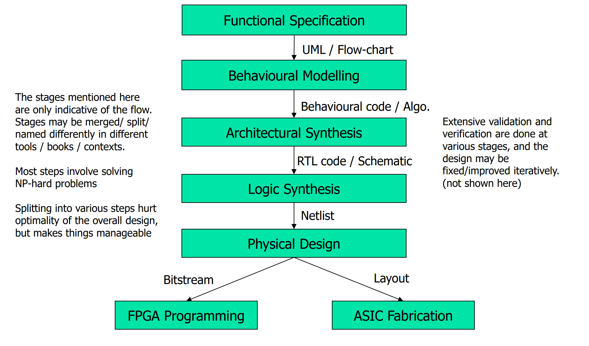
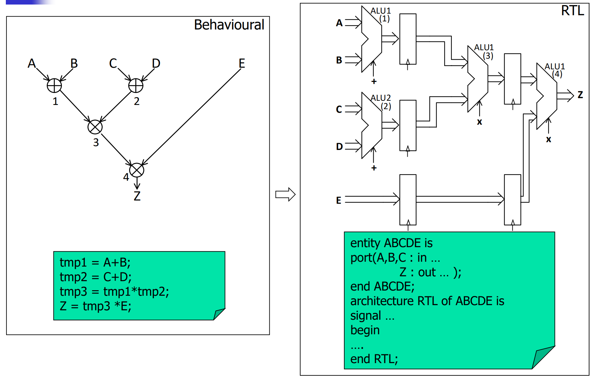
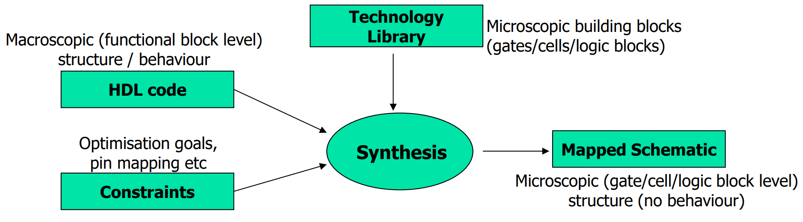
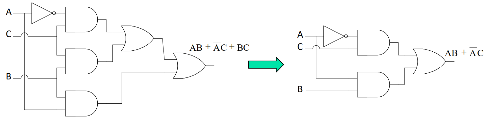
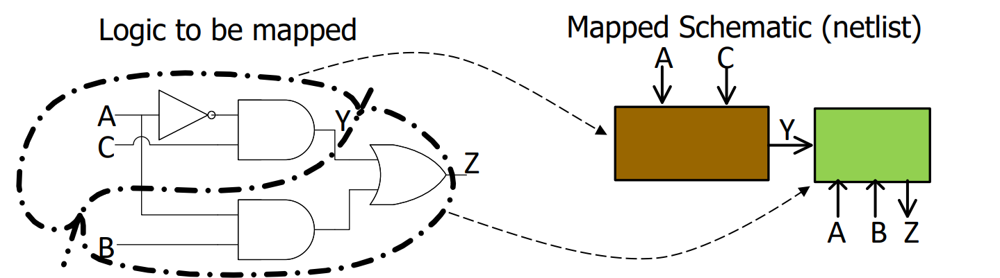
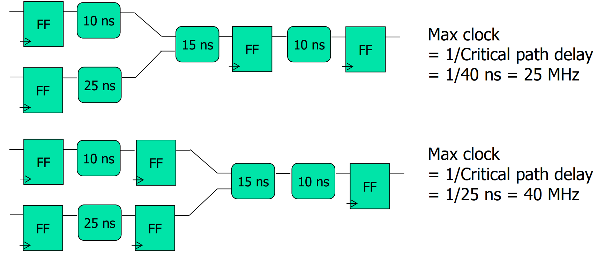

# Lec 02 - Digital System Design and Verilog

## Digital System Design

### Levels of Abstraction

Different from the [abstraction](https://wenbo-notes.gitbook.io/ddca-notes/textbook/from-zero-to-one#abstraction) we have seen in Harris & Harris. Here, we talk about the abstraction in digital system design.

<figure><figcaption></figcaption></figure>

Let's have a detailed look on each level,



**Algorithm/System Level (Untimed)**

At the highest level, the design is expressed as algorithms or functional behavior without worrying about timing. For example, describing `output = (A+B) + (C+D)` in a flowchart or C-like pseudocode.

**Focus:** This part is only on the _functionality_, not on how many cycles or how it’s implemented in hardware.



**Register Transfer Level (RTL, Timed)**

It is the macroscopic hardware view. The system is described in terms of **data transfers between registers** and **operations performed by functional units (ALUs, multiplexers, etc.)** under clock control. It is timed, cycle-accurate, but still abstract (macroscopic). For example, the RTL Verilog Code we have written in [CG3207 Lab01](https://wenbo-notes.gitbook.io/ddca-notes/lab/lab-01-get-prepared#rtl-design) or the following simple code in Verilog


```verilog
always @(posedge clk)
    output <= (A+B) + (C+D);
```


**Focus:** This is where your **macroscopic blocks** appear — ALUs, adders, multiplexers, etc.



**Gate Level**

It is the microscopic hardware view. RTL constructs are **synthesized into logic gates** (AND, OR, NOT, flip-flops). For example,`(A+B)` becomes a [ripple-carry adder](https://wenbo-notes.gitbook.io/ddca-notes/textbook/digital-building-blocks/arithmetic-circuits#ripple-carry-adder) built out of AND/OR/XOR gates. It is boolean equations + gates, but no transistor-level details.

**Focus:** This is your **microscopic implementation** of RTL macros.



**Circuit Level**

It is the actual electronic implementation of logic gates using [**CMOS Transistors**](https://wenbo-notes.gitbook.io/ddca-notes/textbook/from-zero-to-one/cmos-transistors). For example, an inverter (`NOT gate`) is realized using one PMOS and one NMOS transistor.

**Focus:** Device-level representation, electrical properties like delay, power, capacitance are considered.



**Layout Level**

It is the physical representation of the circuit on silicon. Masks for fabrication are designed here. And it is the final physical placement/routing of transistors and wires.



### Simplified FPGA/ASIC Design Flow

<figure><figcaption></figcaption></figure>


The words at the right side of the arrow is the **output** of its upper step. For example, after "Logic Synthesis", the output is a **netlist**.


#### Behavioural Modelling

Behavioral modeling defines the "what" of your FPGA/ASIC design — its high-level logic and algorithms— without hardware details. It’s for verifying functionality early.

* **Purpose**: Ensures algorithmic correctness via simulations.
* **Tools**:
  * Initial tests with Python, C, Java, Matlab (fast, sequential). e.g., A Python script to simulate a filter: `output = input * 0.5 if input > 0 else 0` to test logic.
  * Deeper simulations with VHDL, Verilog, SystemC (handles concurrency and timing, but no cycle accuracy).
* **Not Directly Synthesized**: Meant for validation, not hardware generation.
* **HLS Trend**: High-Level Synthesis tools (e.g., Vivado HLS) can convert behavioral code to RTL, but effectiveness varies by tool, domain, and needs manual tweaks.

Then, it will be fed into Architectural Synthesis in the design flow, making complex problems manageable through iteration.

#### Architectural Synthesis

Architectural synthesis turns a high-level functional/behavioral (acrhitectural) model into a **macroscopic** structural (microarchitectural) model for FPGAs/ASICs. It’s mostly manual but becoming more automated.

> In short, acchitectural synthesis is just to write **RTL Code**.

* **Purpose**: Converts abstract logic into a cycle-accurate, synthesizable RTL code, typically with structural and behavioral elements.
* **Output**: A block-level model where operations are **timed** and assigned to **hardware blocks**. _Example_: From `Z = (A+B) * (C+D) * E`, it creates a plan with adders and multipliers.
* **Key Steps**:
  * **Scheduling** (time): Assigns operations to clock cycles. e.g.,  `(A+B)` in cycle #1, `(C+D)` in cycle #2.
  * **Binding** (space): Maps operations to specific hardware blocks. e.g., `(A+B)` done by ALU #1, `(C+D)` by ALU #2.
  * **Flexibility**: Adders can reuse for different pairs with multiplexers. e.g., ALU #1 adds `A+B` in cycle #1, then `E+F` in cycle #2 if inputs switch.
* **Tools**: RTL synthesis infers register transfers and generates a netlist if guidelines are followed.

The following images shows the difference between behavioural modelling and architectural synthesis.

<figure><figcaption></figcaption></figure>

Fits between Behavioral Modeling and Logic Synthesis in the design flow, balancing abstraction with hardware readiness.

#### Logical Synthesis



**Workflow**

<figure><figcaption></figcaption></figure>

As shown in the diagram below, the logic synthesis will take in three things (HDL Code, Constraints, and Technology Library) and output one thing (mapped schematic)

* **Technology Library:** The **cells / microscopic building blocks** we are allowed to use. Its purpose is to enable **logic synthesis tools** to map a design into the physical hardware efficiently while respecting the process technology constraints (timing, power, area).
  * For ASICs, cells are usually **gates or gate combinations.** (e.g., flip-flops, latches and buffers, etc) They are
    &#x20;custom designed and characterized carefully by the foundry while
    &#x20;respecting the physical limitations of the specific process technology.
  * For FPGAs, technology library is composed of higher-level **CLB functions** (like adders, multipliers, LUTs, etc.) but still considered basic elements for synthesis.
* **Mapped Schematic**
  * Optimized schematic realizing the HDL code, using building
    &#x20;blocks from the technology library.
  * Usually a [**netlist**](https://wenbo-notes.gitbook.io/ddca-notes/textbook/hardware-description-languages#synthesis) that textually describes the interconnection
    &#x20;between cells / blocks
* **Constraints**
  * Location: Logical port to physical pin mapping etc. (See from [CS2100DE Lab 01](https://wenbo-notes.gitbook.io/ddca-notes/lab/preparation-from-cs2100de/lab-01#constraints))
  * Timing specifications (optimization goals): Different schematics can be obtained from the same HDL code.



**Substeps**

1. **Logic optimization**: minimize undesirable redundancies (think [karnaugh-maps](https://wenbo-notes.gitbook.io/ddca-notes/recap-from-ntu-sc1005/boolean-algebra/combinational#forms-of-boolean-expressions)), and hence, the cost and complexity of the design.

<figure><figcaption></figcaption></figure>

2. **Technology mapping (library binding)**: map logic to **cells** in the library

<figure><figcaption></figcaption></figure>



**RTL and Registers**

**RTL (Register Transfer Level):** Describes **how data moves between registers** on each clock cycle.

* Registers are like **“brick walls”** — they hold state and define the boundaries of combinational logic.
* Everything **between registers** is combinational logic (no memory, just logic operations).

**RTL Synthesis/Logical synthesis tools:** Convert your RTL into **technology-mapped gates/cells** (ASIC) or LUTs/CLBs (FPGA).

* **What gets optimized:**
  * Only the **combinational logic between registers**.
  * Optimization can focus on:
    * **Speed:** minimize propagation delay
    * **Area/cost:** minimize number of gates or LUTs
* **Registers themselves are not “optimized”** in terms of logic — they just **store values**.



[**Critical Path**](https://wenbo-notes.gitbook.io/ddca-notes/textbook/combinational-logic-design/timing#critical-path)

Here, we add one point Harris & Harris.

> Critical path = **combinational path** with maximum delay.

From Step 3 above, we see that between registers, there is only combinational logic. Hence, the critical path will determine the max clock in our circuit! The following contains two examples,

<figure><figcaption></figcaption></figure>

✅ **Analogy:**

* **Registers = stations** → they **hold passengers (data)** at each clock edge.
* **Combinational logic = roads** → the paths passengers travel between stations.
* **Critical path = longest road** → determines how much time a passenger needs to get to the next station.
* **Clock period** = how fast the train runs.

If the clock is too fast (train moves too quickly) and the longest road (critical path) hasn’t been traversed yet, the **passengers won’t arrive in time**, causing **incorrect data at the next register**. So, the **maximum clock frequency** is limited by the **critical path delay**.



<details>

<summary>Technology Library vs. Intellectual Property (IP)</summary>

In short, Technology Library is much more low-level. But IP is

> A pre-designed, reusable **functional block or module** that performs a specific higher-level function. Can be soft (synthesizable RTL) or hard (physical implementation).

And IP is usually much higher-level than technology library — often **entire subsystems**, like a CPU core, USB controller, or memory controller. For example,&#x20;

* CPU cores (RISC-V, ARM Cortex-M)
* PCIe or Ethernet controllers
* DSP blocks for signal processing
* Floating-point arithmetic units

***

✅ **Analogy:**

* Think of **technology libraries** as **bricks and mortar**.
* **IP blocks** are like **pre-built rooms or furniture** made from those bricks. You can assemble your building (chip) faster if you have ready-made rooms rather than making everything brick by brick.

</details>

#### Physical Design



**Placement**

It is deciding where to put each **cell** (gate, flip-flop, or higher-level module) on the **physical chip layout**.

* **Goal**: Place **cells that communicate a lot closer together**. As shorter interconnects will deduce lower delay and lower power.
* **Tradeoff**: If you bring two blocks closer, some other blocks must move farther. This is a **global optimization problem**.

Placement minimizes some function of a coarse approximation of wirelengths.

> Why not exact wire lengths?

Because exact wirelength calculation requires routing every connection, which is **very computationally expensive**.



**Routing**

It is mapping of logical connection between cells to physical interconnects, which is to physically connect all the cells with wires according to the netlist.

* **Goal**: Make wires **as short as possible**. As this reduces delay, power, and congestion.
* **Constraint**: You need **placement first** to know where to draw the wires.


For more on routing, please take [NUS EE4218](https://nusmods.com/courses/EE4218/embedded-hardware-system-design)!

<p align="right">— From Dr. Rajesh</p>




<details>

<summary>Why Placement and Routing is a chicken-egg problem?</summary>

This is because

* Optimal placement depends on routing (because wire lengths affect timing).
* Optimal routing depends on placement (because you need cell locations to route).

And our solution in practice is to use  **iterative approaches**:

1. Place cells using approximate wirelengths.
2. Route the design.
3. Evaluate timing and congestion.
4. Adjust placement and repeat.

</details>

#### Some Notes

1. Always Think Hardware — have the topology of the circuit in mind, and write RTL code which will imply/infer the topology from the code.
2. [Simulation and synthesis](https://wenbo-notes.gitbook.io/ddca-notes/textbook/hardware-description-languages#simulation) tools work very differently (Add more notes in Harris & Harris)
   1. Simulation "**executes**" HDL code following the semantics of the HDL
   2. Synthesis "**infers the hardware structure**" described by HDL (RTL) code
3. Read this awesome [note](http://www.sunburst-design.com/papers/CummingsSNUG2002SJ_FIFO2.pdf) from sunburst!

### FPGA

We have learned quite a lot about [FPGA in Harris & Harris](https://wenbo-notes.gitbook.io/ddca-notes/textbook/digital-building-blocks/logic-arrays#field-programmable-gate-array). Please go back and review the working principle of FPGA FYI. The purpose of this section is to get us know ASIC vs. FPGA, what are the use case for each of them. So, in short,

* **FPGA:** flexible, fast to deploy, good for prototyping and low-volume/highly-custom tasks.
* **ASIC:** high-performance, power/area-efficient, cost-effective only for large-scale production.
