---
layout:
  width: default
  title:
    visible: true
  description:
    visible: true
  tableOfContents:
    visible: true
  outline:
    visible: true
  pagination:
    visible: true
  metadata:
    visible: true
---

# Lec 03 - RISC-V ISA and Microarchitecture

As ISA is just architecture (see [Harris & Harris](https://wenbo-notes.gitbook.io/ddca-notes/textbook/from-zero-to-one#abstraction)!), so this lecture will talk about the architecture and microarchitecture part of RISC-V!

## RISC-V ISA

As we have already seen in [Harris & Harris](https://wenbo-notes.gitbook.io/ddca-notes/textbook/architecture)'s introduction to architecture, we first recap some important points regarding architecture and microarchitecture.



#### Architecture

This is the programmer's view of computer. And it has the following features:

* Defined by instructions & operand locations
* Assembly language: human-readable format of
  &#x20;instructions
* Machine language: computer-readable format
  &#x20;(1’s and 0’s)
* Assembly language -> Machine language
  &#x20;conversion is done by the assembler
  * one to one correspondence
    &#x20;(except for pseudo-instructions)



#### Microarchitecture

This is about how to implement an architecture in hardware (we will see later in [second half](lec-03-risc-v-isa-and-microarchitecture.md#risc-v-microarchitecture) of this lec series)



### RISC-V Features

In the lec, we have introduced some interesting features about RISC-V, and they are as follows,

* As a RISC architecture, the RISC-V ISA is a load–store architecture — only load/store variants can access memory
  * No mixing of memory access with data processing or branching


Memory and register is **not the same**! Here, memory usually refers to the data memory, like RAM.


* Interesting design choices to simplify hardware implementation
  * Especially the encoding of immediates (We will see later)


Instruction length and word length are not necessarily the same!


Below are some very interesting points starting from the **instruction length vs. word length**.



#### Instruction Length vs. Word Length

The **word length** of a processor is the width of its registers/ALU or the size of most elements in its datapath. For example, the following are three types of Risc-V processors,

* **RV32** → word length = 32 bits (registers and ALU are 32-bit wide).
* **RV64** → word length = 64 bits.
* **RV128** (rare, theoretical) → word length = 128 bits.

The **instruction length** is the number of bits to encode an instruction and it is determined by the ISA encoding design and extensions included. For example,

* Base ISA (RV32I, RV64I, RV128I) → instructions are **always 32 bits long**.
* If you add the **Compressed (C) extension**, some instructions are **16 bits long**.
* There are also **48-bit and 64-bit instruction encodings** in the RISC-V spec (for special extensions).


In a 32-bit (word length) system, the instruction length doesn't have to be 32-bit.




#### What if word length and instruction lengt doesn't match?

* **Instruction length ≠ word length**
  * A 32-bit processor does not mean all instructions must be 32 bits long.
  * Example: ARM Thumb and RISC-V compressed (`C`) extension use 16-bit instructions on a 32-bit processor.
  * The processor’s frontend (fetch/decode) handles variable instruction sizes, while the backend (execution units, registers, ALU) still works on 32-bit data.


The idea of frontend and backend of a processor is very important and we will come back to it in the [microarchitecture](lec-03-risc-v-isa-and-microarchitecture.md#risc-v-microarchitecture) again later also!


* **Microarchitecture impact**
  * Supporting multiple instruction lengths adds complexity to the **frontend** (fetch, decode).
  * The **backend** (datapath, ALU, register file) usually remains tied to the word length, so the impact on overall hardware design is noticeable but not drastic.
* **Practical advantage: saving instruction memory**
  * Shorter instructions (16-bit vs. 32-bit) reduce code size.
  * This allows more instructions to fit into the same memory/cache, improving memory efficiency and potentially performance.
* **Word length and memory addressing**
  * In a 32-bit processor, addresses are 32 bits wide.
  * This limits the maximum directly addressable memory to $$2^{32} = 4\ \text{GB}.$$
  * This is a **backend (data memory)** property, tied to word length, not instruction length.
  * Thus, even if instructions are compressed to 16 bits, the system is still limited to 4 GB RAM because addressing depends on word length.



#### More about modern processors

* **ISA Stability**
  * The **Instruction Set Architecture (ISA)** (e.g., x86, ARM, RISC-V) usually remains stable across generations.
  * This ensures that code compiled decades ago can still run on modern processors of the same ISA family.
  * Example: Modern Intel CPUs can still run DOS-era x86 code.
* **Extensions to the ISA**
  * Instead of replacing the ISA, new generations often **extend** it with additional instructions (e.g., Intel’s SSE, AVX, AVX-512; ARM’s NEON; RISC-V vector extensions).
  * These new instructions allow compilers and developers to take advantage of improved performance features, but are optional from the program’s perspective.
* **Backward and Forward Compatibility**
  * **Backward compatibility:** Old code (compiled for older processors) runs fine on newer processors, since the original instructions are still supported.
  * **Forward compatibility:** New code (compiled with instructions from the newest extensions) **will not run** on older processors if those instructions are missing.
  * Workaround: Compilers often provide a **compatibility mode** (e.g., “target x86-64 baseline”) so the same program can run on older hardware.
* **Real-world example: Windows 11**
  * Windows 11 requires support for certain instruction set extensions (e.g., SSE4.2, CMPXCHG16b, LAHF/SAHF, and in practice often AVX2).
  * Older CPUs without these instructions cannot run Windows 11, even though they are technically “x86-64 processors.”
* **Microarchitecture vs. ISA**
  * New processors primarily innovate by updating the **microarchitecture** (pipeline depth, branch prediction, cache design, out-of-order execution, etc.) while keeping the ISA stable.
  * This allows performance to improve without breaking software compatibility.



### Registers

The register set has been introduced in [Harris & Harris](https://wenbo-notes.gitbook.io/ddca-notes/textbook/architecture/assembly-language#the-register-set). But the following image adds the information about whether the register should be saved by the caller or callee.

<figure>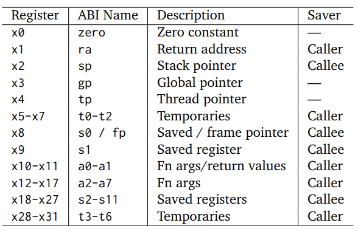<figcaption></figcaption></figure>

And below are some useful notes



#### ABI name and ISA name

In RISC-V assembly code, we can use ABI name, like `zero`, `ra`, etc. But in compiled code, ISA names, like `x0`, `x1`, etc, is used.



#### PC in RISC-V

In RISC-V, PC is not a register readable/writable explicitly by any
&#x20;instruction, e.g., it is not a visible register. And,

* In RISC-V, PC just stores the address of the current instruction. (Not like ARM, PC actually stores the address of the current instruction address +4 or +8)
* Writing PC is done **only by** branch/jump instructions.



#### **No** instruction updates more than one visible register

This is a very important golden rule (The step title here) And, in RISC-V, the register updated is **explicitly** specified in the `rd` field. This ensures that the [register file](https://wenbo-notes.gitbook.io/ddca-notes/textbook/digital-building-blocks/memory-arrays#register-files) only needs **one write port**.



#### **No** instruction reads more than two registers.

Another golden rule here. This ensures that the register file needs only **2 read ports**. Below is the example of RISC-V's register file,

So, in summary, below is the illustration of RISC-V register file,

<figure>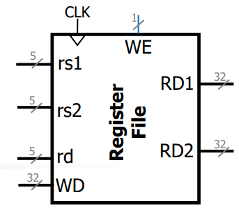<figcaption></figcaption></figure>



#### No flag registers

In RISC-V, flags are never stored for “future use.” Instead, comparisons and branches are **self-contained**. For example, `beq x1, x2, target;` will directly compare `x1` and `x2`, and branches to `target`.

* If you _do_ need the comparison result as data, use an instruction like `slt` to store it in an **general-purpose register** `slt x3, x1, x2;` means `x3 1` if `x1<x2`, else `x3=0`.
* Because branch instructions already use the ALU for comparison, RISC-V usually has a separate unit to compute branch target addresses (`PC + offset`).



### Instruction Formats

RISC-V instruction has 6 formats, and they are well summarized in the following table,

<figure>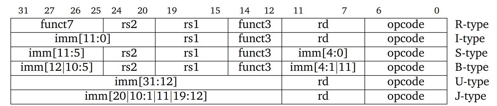<figcaption><p>This table is from <a href="https://github.com/jameslzhu/riscv-card">James Zhu</a> at UCB</p></figcaption></figure>



#### **Opcode field occupies the least significant part of the instruction**

This gives us the benefit that,

* CPU can recognize instruction type by just reading the first byte (since RISC-V uses [little-endian](https://wenbo-notes.gitbook.io/cg2111a-notes/studio/studio-13-communication-protocol#big-and-little-endianness) and little-endian puts opcode at the lowest address).
* "3L mnemonic" for little-endian: In **l**ittle-endian formatting, **l**east significant byte goes to **l**owest memory address.



#### `rd`, `rs1`, `rs2` **always in the same place across formats**

This makes decoder hardware is simpler (fewer multiplexers, will see later in the microarchitecture).



#### **All immediates are MSB-extended**

So all immediates become sign-extended words. RISC-V immediates are encoded in **2’s complement form**. So when you sign-extend, you’re effectively just preserving the correct integer value. For example, in RV32I, 12-bit immediate,

* Immediate field = `1111_1000` (0xF8).
* As 12-bit 2’s complement → −8.
* Sign-extend to 32 bits → `0xFFFFFFF8`.
* ALU sees this and just adds normally, giving a result 8 less.


Only all **immediates** are MSB-extended. Later we will see, value stored in registers sometimes are zero-extended.


However, this may become a bit wired with instruction `sltu`. But, let loop at the following example,

```armasm
sltiu x3, x1, -8
```

Suppose the above is our "set if less than immediate unsigned" instruction, and RISC-V processor will treate `-8` as `0xFFFFFFF8`.&#x20;

* `x1=-2`, `x1` will be interpreted as `0xFFFFFFFE`. As ALU just compares unsigned, `0xFFFFFFFE` is greater than `0xFFFFFFF8`, thus `false`, meaning under **unsigned comparison** `x1` is not smaller than `-8`!
* `x1=5`, `x1` will be interpreted as `0x00000101`. Similarly, ALU just compares unsigned, `0x00000101` is smaller than `0xFFFFFFF8`, thus `true`, meaning under **unsigned comparison** `x1` is **smaller** than `-8` (unsigned)


Treat negative number in 2's complement as **unsigned** meaning it will become a **very large positive number**.




#### **The location of immediate is well-designed**

From the table above, we may think why the immediate's location is that wired! Actually, later from the microarchitecture view, we will see that this is a **genius design** as it minimizes the number of multiplexers!



### DP Instruction

"DP" stands for data-processing. The following tables summarises all the base DP instructions.

<figure>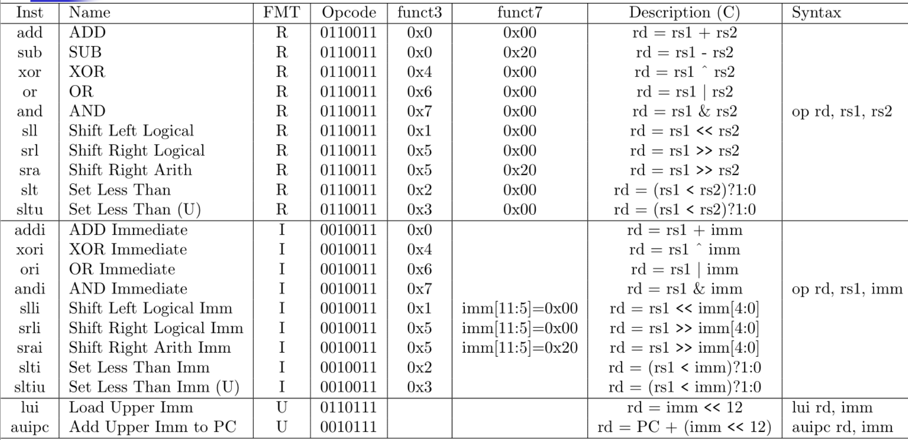<figcaption></figcaption></figure>

From this table, we notice that

* `subi` is unnecessary as the assembler can encode `A-B` as `A+(-B)`. This find as `B` is immediate, if `B` is a register, then `B` cannot be known at assembly time, and that's why `sub` is still needed.
* And the following table is copied from [Harris & Harris](https://wenbo-notes.gitbook.io/ddca-notes/textbook/architecture/programming#shift-instructions), just for CG3207 midterm quiz purpose.

#### DP Pseudo-Instruction

All the pseudo-instruction in RISC-V is introduced [here](../lab/resources/risc-v-resources.md#risc-v-pseudo-instruction)! Among them, knowing the working principle of `auipc` from [Lab 1](https://wenbo-notes.gitbook.io/ddca-notes/lab/lab-01-get-prepared#whats-actually-going-on-in-line-47-auipc) is also necessary! This means that the working principle should also be included in this page manually for CG3207 midterm quiz purpose.

#### Multiply and Divide

The multiply and divide are not part of the base instruction set, but are available as an optional standard extension.

<figure>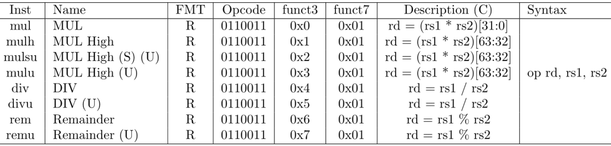<figcaption></figcaption></figure>

### Memory Instruction

The following is the base memory instruction:

<figure>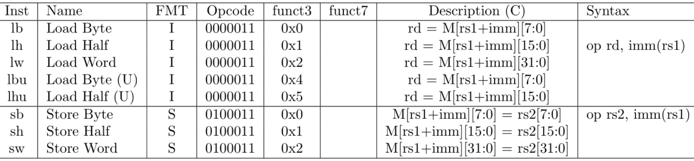<figcaption></figcaption></figure>

So, from this table, notice that

* For the memory instruction syntax, if `imm=0`, we can omit the `imm`. e.g., `op rd, (rs1)`.
* For `lb` and `lh`, which loads a byte or a half word, the rest of bits are formed by **sign-extension/MSB-extension** (just copy the MSB) of the byte/half-word
* For `lbu` and `lhu`, **zero extension** (copy zero only) is done.

### Control Instructions

The following is the base control instructions:

<figure>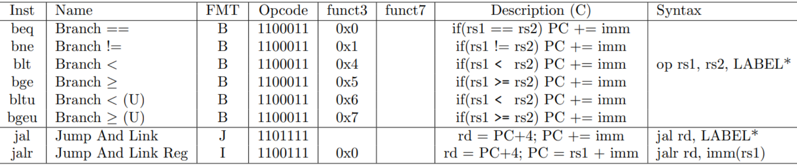<figcaption></figcaption></figure>



#### **Jump vs. Branch**

1. `jal` can jump farther than conditional branches because
   1. `jal` instructions use 20-bit signed immediate
   2. Branch instructions use 12-bit signed immediate
2. `jal` allows for saving **return address**, while conditional branches cannot.



#### **Two types of jumps**

1. `jal`: jump and link, is a J-type instruction. And it stores return address in `rd`.
   1. Used when you know the **target address at assembly time**.
   2. Used in **function call** (Jump to a function’s code so it can execute)
   3. `imm` is 20-bit.
2. `jalr`: jump and link register, is an I-type instruction. And it stores return address in `rd` (usually `ra`)
   1. Use when the **target address is dynamic**, stored in a register.
   2. Used in **function return** (Go back to where the function was called from)
   3. `imm` is 12-bit, but it can jump anywhere in a 32-bit absolute address range. A LUI
      \
      instruction can first load rs1 with the upper 20 bits of a target address, then JALR
      \
      can add in the lower bits.
      1. Similarly, AUIPC then JALR can jump anywhere in a 32-bit
         \
         pc-relative address range



### Put it all together

Nothing is better than an example! So, let's loook at an example to put everything together.




```c
// Global variables
int z1;
int z2;

// Callee function: Computes and returns the sum of two integers
int fn2(int p, int q) {
    int temp = p + q;
    return temp;
}

// Caller function: Calls fn2 and performs additional operations
void fn1() {
    int x = 20;
    int y = 30;
    z1 = fn2(x, y); // Store result of fn2(x, y) in z1
    x++;
    y++;
    z2 = x + y; // Store x + y in z2
}
```





```armasm
# Caller function: fn1
# Calls fn2, increments x and y, and stores results in z1 and z2
fn1:
    # Prologue: Save callee-saved registers
    addi sp, sp, -4        # Allocate stack space
    sw s0, 0(sp)           # Save s0 to stack

    # Initialize variables
    li s0, 20              # x = 20
    li t0, 30              # y = 30

    # Save caller-saved registers
    addi sp, sp, -8        # Allocate stack space for t0 and ra
    sw t0, 0(sp)           # Save t0 (y) to stack
    sw ra, 4(sp)           # Save return address

    # Call fn2(20, 30)
    mv a0, s0              # Set first argument: p = x
    mv a1, t0              # Set second argument: q = y
    jal ra, fn2            # Call fn2, result in a0

    # Store result in z1
    sw a0, z1, t0          # z1 = fn2(x, y)

    # Restore caller-saved registers
    lw ra, 4(sp)           # Restore return address
    lw t1, 0(sp)           # Restore y to t1
    addi sp, sp, 8         # Deallocate stack space

    # Increment x and y
    addi s0, s0, 1         # x++ (x = 21)
    addi t1, t1, 1         # y++ (y = 31)

    # Compute and store x + y in z2
    add t2, s0, t1         # t2 = x + y
    sw t2, z2, t3          # z2 = x + y

    # Epilogue: Restore callee-saved registers
    lw s0, 0(sp)           # Restore s0
    addi sp, sp, 4         # Deallocate stack space
    ret                    # Return to caller

# Callee function: fn2
# Arguments: p in a0, q in a1
# Returns: temp (p + q) in a0
fn2:
    # Prologue: Save callee-saved registers
    addi sp, sp, -4        # Allocate stack space
    sw s0, 0(sp)           # Save s0 to stack

    # Compute temp = p + q
    add s0, a0, a1         # temp = p + q
    mv a0, s0              # Move result to a0 for return

    # Epilogue: Restore callee-saved registers
    lw s0, 0(sp)           # Restore s0 from stack
    addi sp, sp, 4         # Deallocate stack space
    jr ra                  # Return to caller
```



#### Code Explanation

1. From this example, we see some useful pseudo-instructions, like `jr` (for function return) and `mv` (for register copy)




## RISC-V Microarchitecture

From a computer hardware engineer's view, a computer can be divided into 2 parts

* [Datapath](lec-03-risc-v-isa-and-microarchitecture.md#datapath): Backend
* [Control Unit](lec-03-risc-v-isa-and-microarchitecture.md#control-unit): Frontend

### Datapath

Datapath is the path through which data "flows". It includes the following elements



#### **Storage elements**

Like memories and registers. The storage elements can be further divided into the following parts

1. **Architectural state elements**: manipulated by the programmer, like instruction memory (IROM), data memory (DMEM), register file (x0-x31), PC, and other control registers.
2. **Microarchitectural state elements**: **not accessible** to the
   &#x20;programmers, like pipeline registers, cache tags, and branch predictor state



#### **Steering logic**

This is to **channel** data properly. For example, in the pipeline, should the ALU take operand from register file, or from immediate, or from forwarding path?

The steering logic is implemented using

* **multiplexers** (select one of many inputs) and
* **internal buses** (shared connections).



#### **Functional units**

These units **operate** on data, like deciding **where the data should go**. For example,

* **ALU**: performs add, subtract, AND, OR, shifts, etc.
* **Adders**: sometimes separate for PC update, address calculation, etc.
  * Often **stateless** because they don’t store, just compute outputs when inputs arrive.



#### **Interface resources**

These connect the CPU to the **outside world**. For example,

* **External buses**: connect CPU to memory, I/O devices, GPU, etc.
* **Ports**: I/O interfaces like memory-mapped registers, communication ports.



<details>

<summary>What is bus?</summary>

From the above points, we may wonder what on earth is a bus? From Wikipedia, the definition is

> In computer architecture, a **bus** is a communication system that transfers data between components inside a computer or between computers. At its core, a bus is a **shared physical pathway**, typically composed of wires, that allows multiple devices to communicate.

And, bus in computer architecture can be categorized based on the following two categories

#### The **location** of the bus

1. **Internal buses**: inside the CPU datapath.
   1. Example: register file → ALU operand buses.
2. **External buses**: connects CPU to **outside world** (main memory, I/O devices, GPU, etc.).
   1. Example: system bus, PCIe, AMBA, memory bus.

#### The **purpose** of the bus

This is basically what the information a bus can carry

1. **Data bus**: carries the actual _data values_ being read or written.
2. **Address bus**: carries the _location_ of data (memory address or register index).
3. **Control bus**: carries _signals_ that say _what operation is happening_.

***

Usually, we use the location of the bus first, then say the purpose of the bus.

</details>

### Control Unit

Control Unit **controls** the flow/processing/storage of data in
&#x20;the datapath via

* **Mux selects**: choose which input goes into a multiplexer (e.g., should ALU input B come from register or immediate?).
* **Register write enables**: should this register latch a new value at the clock edge or stay the same?
* **Functional unit activation**: is the ALU active? Is the memory doing a read or a write?
* **Operation selection**: what exact operation should ALU perform (add, sub, AND, OR…)?

### Implement a single-cycle microarchitecture

**I**n this lecture, we will implement a multi-cycle microarchitecture first. So basically, a single-cycle microarchitecture will fetch, decode, execute all in **one clock cycle**. And in this lecture, we have covered four single-cycle microarchitecture, each is built upon the previous one,



#### Single-Cycle Processor with Control

<figure>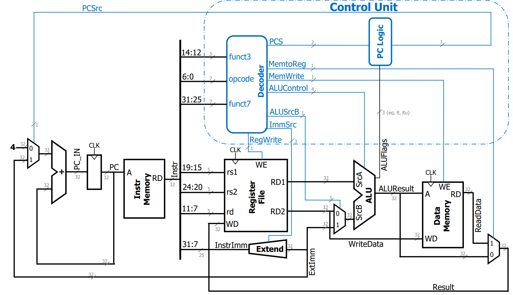<figcaption></figcaption></figure>

As in a single-cycled processor, the CU is just a decoder, the following table summarises the decoder behavior,

<figure>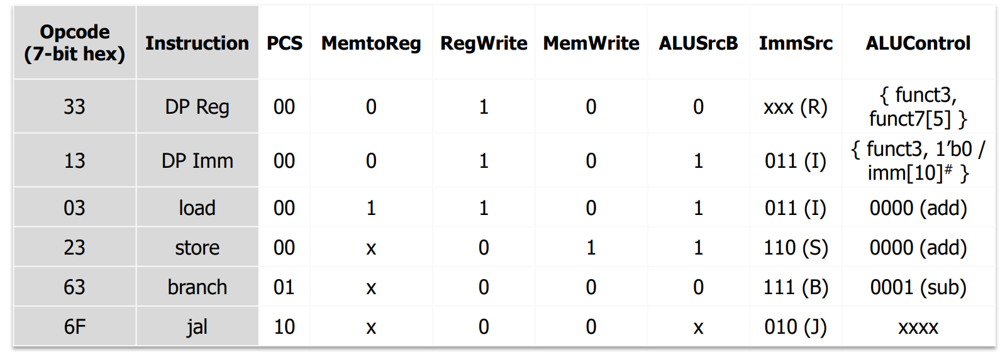<figcaption></figcaption></figure>

As you can save from the schematic above, the ALU will also output a 3-bit ALUFlags to the PC Logic, inside the Control Unit, and the PC logic is summarised as follows,

<figure>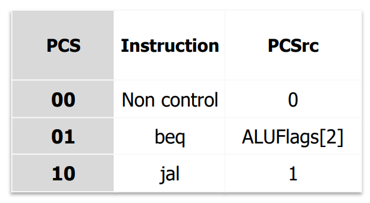<figcaption></figcaption></figure>

Inside the PC logic, we should be clear that it has two **inputs** (`PCS`, `ALUFlags[2:0]`) and one **output** (`PCSrc`)

* `PCS`: determines the **instruction category** for PC updates.
* `ALUFlags[2:0]`: Bits that describe the outcome of the ALU operation. The three bits are `{eq, lt, ltu}`.
* `PCSrc`: 1-bit control signal to choose the next PC Value.
  * `0`: use the **default PC+4** (fallthrough to next instruction).
  * `1`: use the **branch/jump target** (computed by ALU + immediate).

For now, our PC only supports the `beq`, it will support more in the following iteration.



#### PC Logic with all conditions

The schematic is the same as the above. But, the PC logic is complete, we will look at `func3` field in the instruction to decide which branch instruction is being chosen.

<figure>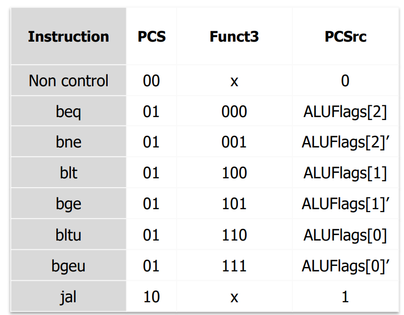<figcaption></figcaption></figure>



#### Support for `lui` and `auipc`

<figure>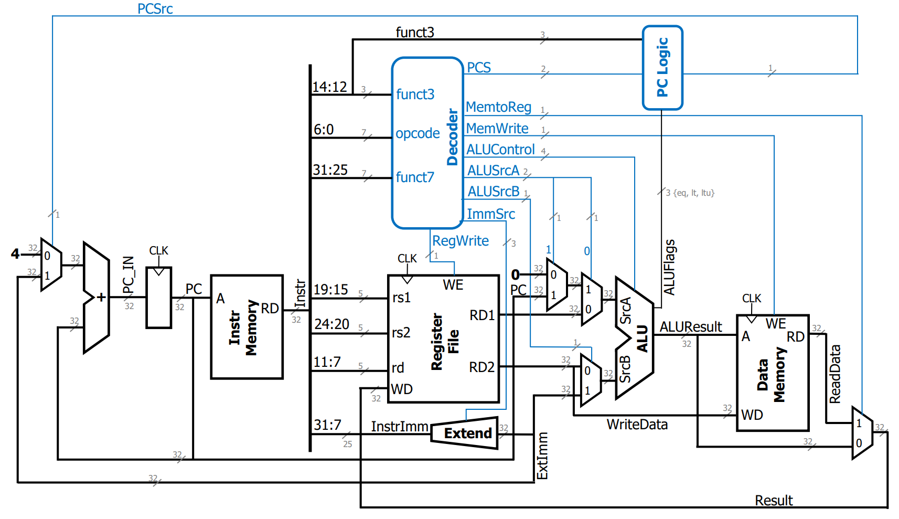<figcaption></figcaption></figure>

Here, we just add a 2-bit output named `ALUSrcA` from our decoder, these 2 bits will control whether the ALU SrcA will have the current `PC` as input. And regarding this, we have CU decoder table updated as follows,

<figure>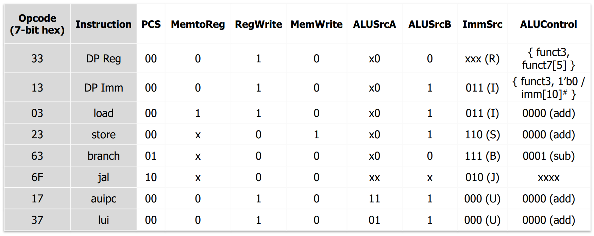<figcaption></figcaption></figure>


It is clear that we can see from DP Reg to branch instruction, the ALUSrcA is just `x0`, which means the first bit is Don't Care and the second bit is 0.




#### Support for link and `jalr`

<figure>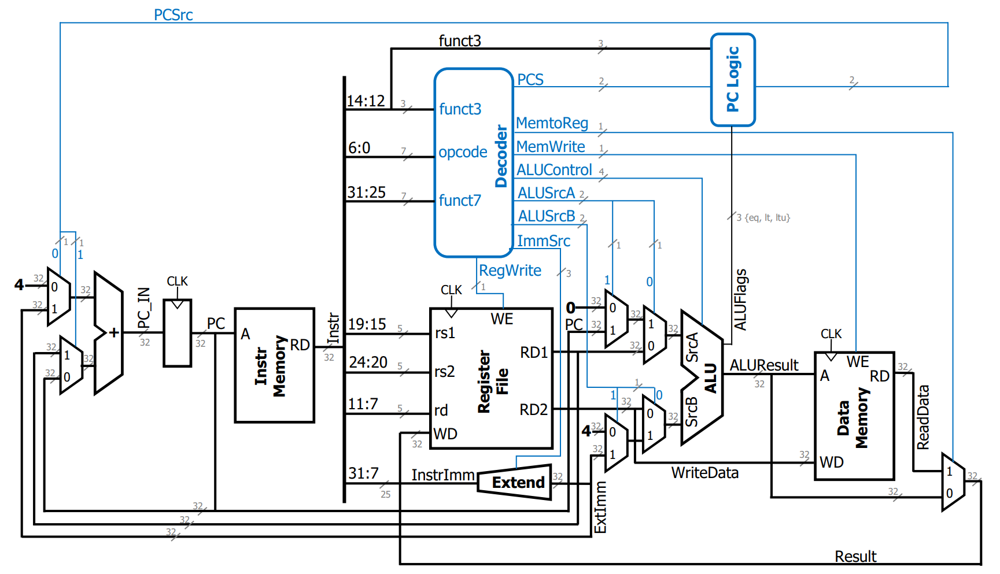<figcaption></figcaption></figure>

Here, we have two modifications:

1. change the `ALUSrcB` from 1-bit to 2-bit, thus adding another possibility for the immediate 4 to be the input of ALU SrcB.
2. change the `PCSrc` from 1-bit to 2-bit, thus adding another possibility for the PC value to be read from Register File `RD1`.

Thus, we have two changes for our tables, the first one is the CU decoder table

<figure>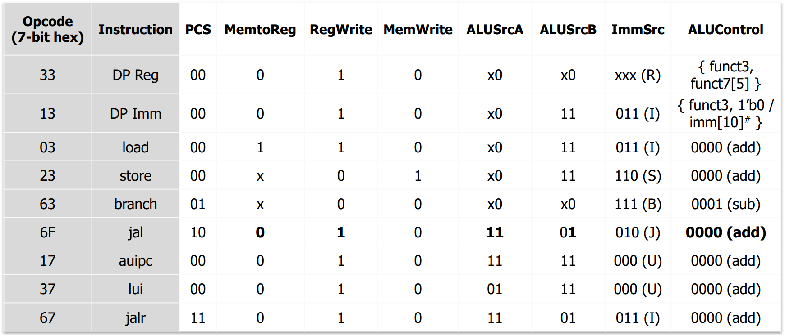<figcaption></figcaption></figure>


Here, we can clearly see that when our instruction is `jal`, the `ALUSrcA=11` makes sure the ALU SrcA is the current PC value. And `ALUSrcB=01` makes sure that the ALU SrcB is immediate 4. Then the ALU will add these two and store the result into `rd`.


And our PC Logic table will also change,

<figure>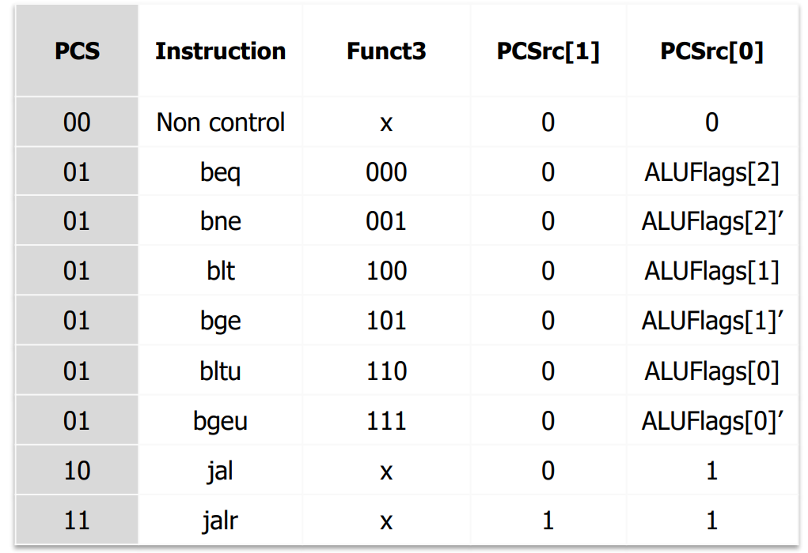<figcaption></figcaption></figure>


Again, we can see it clearly that when the instruction is `jalr`, `PCSrc[1]=1`, and this will load the value in `rs1` into the PC adder, and `PCSrc[0]=1` will load the immediate value into the PC adder. And now the new PC value will be the sum of these two values! (As `jalr rd, imm(rs1)` -> `rd=PC+4, PC=rs1+imm`.)




This is the whole content to build a simple single-cycle RISC-V processor. And we may notice the following,

* No datapath resource can be used more than once per instruction, so some must be duplicate
  * **Separate memories**: because fetch and load/store both need memory at the same time.
  * **Two adders**: because PC+4 and normal ALU addition both need addition in the same cycle.

> So, how can we make it faster? The answer is wait for Lec 04 😉!
