# Lec 05 - The Pipelined Processor

## Introduction

### Recap of the single cycle processor

In Lec 03, we have introduced how to implement a **single-cycled** RISC-V processor. In our design, we have noticed that different instructions will go through different **parts** of the datapath, thus causing the time taken for each instruction to complete to be different.

<figure><figcaption><p>A single cycle processor that we designed at Lec 03</p></figcaption></figure>

For example, let's assume

* Instruction and Data Memory needs 200ps
* ALU needs 120ps
* Adders needs 75ps
* Register File Access (reads: 100ps, writes: 60ps)

Then we will have,

<table><thead><tr><th width="85.5">Instr.</th><th width="90.5">I Mem</th><th width="94">Reg Rd</th><th width="99">ALU Op</th><th width="95">D Mem</th><th width="95.5">Reg Wr</th><th width="98.5">PC Incr</th><th width="100">Total</th></tr></thead><tbody><tr><td>DP</td><td>200</td><td>100</td><td>120</td><td></td><td>60</td><td></td><td>480</td></tr><tr><td><code>lw</code></td><td>200</td><td>100</td><td>120</td><td>200</td><td>60</td><td></td><td>680</td></tr><tr><td><code>sw</code></td><td>200</td><td>100</td><td>120</td><td>200</td><td></td><td></td><td>620</td></tr><tr><td><code>beq</code></td><td>200</td><td>100</td><td>120</td><td></td><td></td><td>75</td><td>495</td></tr><tr><td><code>j</code><del><code>al</code></del></td><td>200</td><td></td><td></td><td></td><td></td><td>75</td><td>275</td></tr></tbody></table>


`PC_Incr` is done in **parallel**, when things happen in parallel, we take the worst case timing. For branch instructions and the `jal` instructions here, as it needs to fecth the instruction (200ps) and then **decide** whether to increment PC or not. Thus we will count `PC_Incr` time into the calculation.


<details>

<summary>Why all these parts take time to execute?</summary>

It is because for all the Instruction Memory, Register File, ALU, Data Memory and Adders, they are implemented using a **lot of logic gates**, thus it confirm will have some propagation delay. So, it takes a certain amount of time for the signal to travel from the input to the output of that certain part.

</details>

And our single cycle processor's clock cycle time **must be** at least **larger than** the slowest instruction's execution time (usually, it is the `lw` that takes the longest time to complete). This will create some unwanted waste in resources, like adders.

### Make it Faster

Recall that the performance equation we have introduced in [Lec 01](https://wenbo-notes.gitbook.io/ddca-notes/lec/lec-01-history-technology-performance#instruction-count-ic-and-cpi) is,

$$
\text{CPU Time} = \text{Instruction Count} \times \text{CPI} \times \text{Clock Cycle Time}
$$

Here, since we cannot change IC, as it is determined by the compiler. For CPI, let's assume it is fixed now. Given that, how can we improve the performance? The answer will be easy, that is to **decrease the** Clock Cycle Time by using the technique called **pipelining**.

#### Five Stage Pipeline

> In this course, we will use a five-stage pipeline on our processor.

**Pipelining** is to "cut" our microarchitecture[^1] into different **stages** (in our case, it is 5), and each stage will take **one clock cycle** to complete. Thus, the clock cycle time can be decreased to a large extent.

For example, below is the image showing the fives stages of the `lw` instruction.

<figure>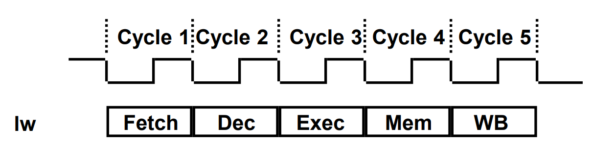<figcaption></figcaption></figure>

* **Fetch**: Instruction Fetch and update PC
* **Dec:** Registers Fetch and Instruction Decode
* **Exec**: Execute DP-type; calculate memory address
* **Mem**: Read/write the data from/to the Data Memory
* **WB**: Write the result data into the register file

To see clearly how we do this "cut", we can reuse the microarchitecture in Lec 03.

<figure>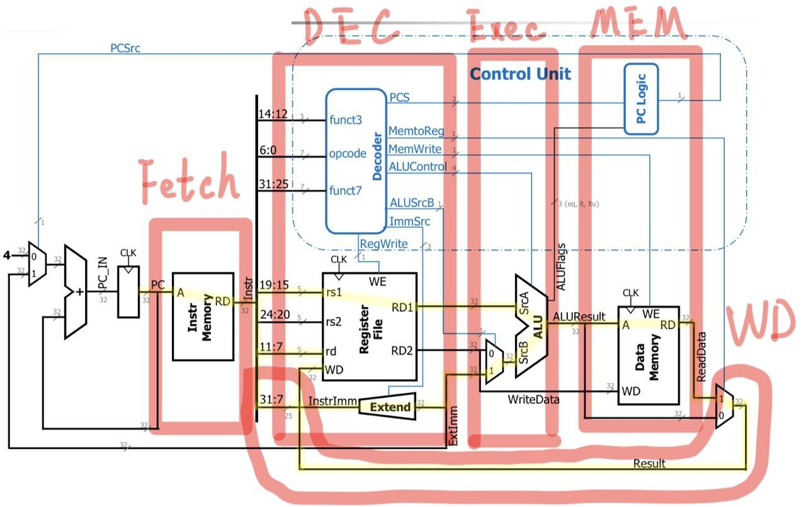<figcaption></figcaption></figure>


This is just an illustration, the real section may be a bit different. For example, in the first version of the design, PC Logic is in the Execute Stage.


After pipelining our processor, the clock cycle diagram to execute the instructions will look like as follows

<figure>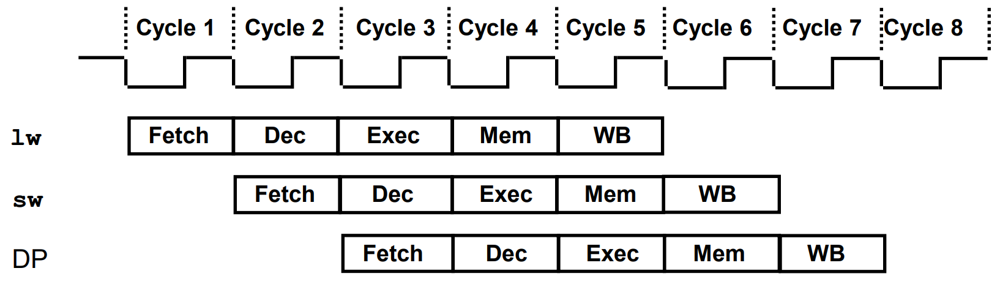<figcaption></figcaption></figure>

We can see that after the completion of the clock cycle 5, one instruction is completed every cycle, thus CPI = 1. We also call the first 4 cycles **overhead** as nothing completes during this time.

However, this pipeline isn't perfect, you may notice that **not every instruction** needs the **full 5 stages**. For example, `sw` doesn't need `WB`, branch and DP Reg/Imm doesn't need `Mem`, etc. Besides, there are still some **hazards** that we may encouter. (We will see them later in this lec)

<details>

<summary>Is the speed-up of the pipelined processor always same as the number of stages?</summary>

Not exactly. For example, a 5-stage pipelined processor doesn't necessarily have a 5x speed-up comparing to the single-cycle processor. As you can see from the following image,

<figure>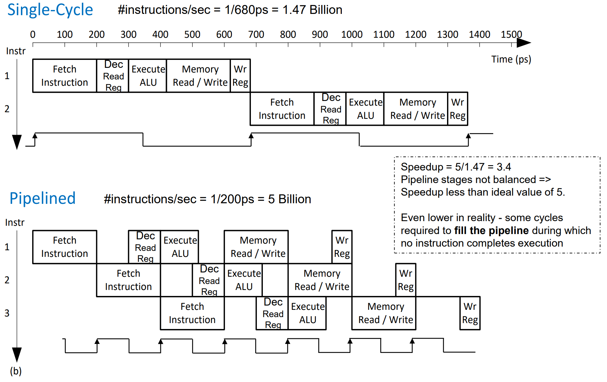<figcaption></figcaption></figure>

The reason for this is because that in the pipelined processor, our clock cycle time accommodates the **slowest stage**, while in the single-cycle processor, our clock cycle time accommodates the **slowest instruction**. But the **slowest instruction** isn't necessarily composed of 5x the **slowest stage**!

</details>

This lecture utilizes the classic five-stage pipeline as a foundational model. However, the fundamental instruction phases — Fetch, Decode, Execute, Memory Access, and Writeback — remain universal across deeper pipeline architectures.

## Implement a Pipelined Processor

As we have mentioned above, we need to "cut" our microarchitecture into 5 stages. To do this "cut", we are basically **adding registers** between each stage.

<figure>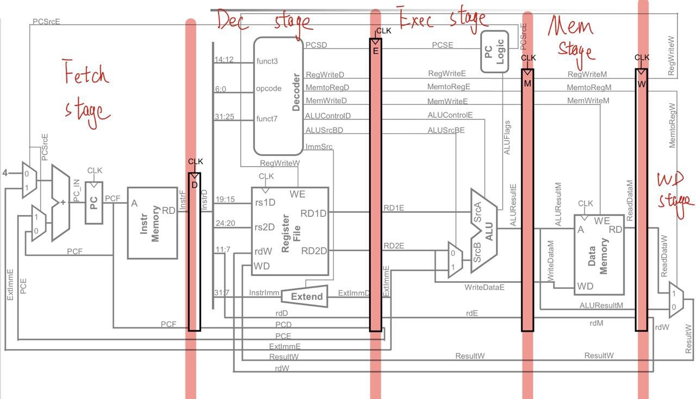<figcaption></figcaption></figure>

We have 5 stages, thus we need 4 "cuts"/registers. By adding registers, we can clearly see that now our [**critical path**](https://wenbo-notes.gitbook.io/ddca-notes/lec/lec-02-digital-system-design-and-verilog#critical-path) is shortened significantly! And this practice is the **soul** of pipelining!


#### Pipeline Register

1. **Naming convention**: We name the register by the **target** that it feeds the signal to. For example, the register D is named D because here the signals coming from the **source** (fetch stage) will go into the **target** (decode stage).
2.  **Real processor design**: In Verilog, we use several register to compose a big pipeline register, like the decode pipeline register shown as follows,<br>

    <pre class="language-verilog" data-line-numbers><code class="lang-verilog">always @(posedge CLK) begin
        PCSE        &#x3C;= PCSD;
        RegWriteE   &#x3C;= RegWriteD;
        MemtoRegE   &#x3C;= MemtoRegD;
        MemWriteE   &#x3C;= MemWriteD;
        ALUControlE &#x3C;= ALUControlD;
        ALUSrcAE    &#x3C;= ALUSrcAD;
        ALUSrcBE    &#x3C;= ALUSrcBD;
        RD1E        &#x3C;= RD1D;
        RD2E        &#x3C;= RD2D;
        ExtImmE     &#x3C;= ExtImmD;
        rdE         &#x3C;= rdD;
        PCE         &#x3C;= PCD;
        Funct3E     &#x3C;= Funct3D;
    end
    </code></pre>

    So, at each **posedge** of the clock, all the left hand register will copy the value from the right hand side. This will help us understand the [stalling and flushing](lec-05-the-pipelined-processor.md#flushing-vs.-stalling) later.


The smart you may notice that besides adding 4 registers, we also made some changes to some signals.

<figure>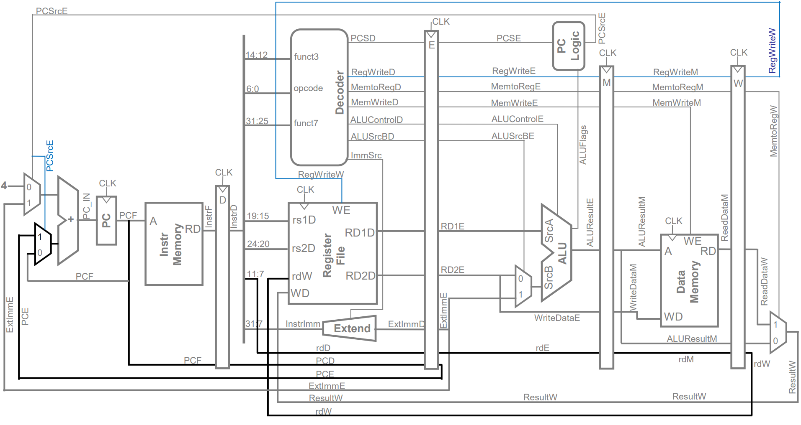<figcaption></figcaption></figure>



#### Delayed Signals

Several signals, like `RegWrite`, `MemtoReg` etc are delayed. Their names are also changed at each stage by adding the posfix `F, D, E, M, W` depending on which stage the signals are at.

We can think of this delay as, after we "cut" the microarchitecture, we still need to "store" the corresponding Control Unit signals and the Datapath signals to make sure that the operation done in **each stage** works correctly.



#### The cut of `rdW`

In the Fetch stage, the `rd` is no longer connected directly to the instruction decoder. Instead, we delay the `rd` signal by 3 stages and connect it to `rdW`, which means after the `WB` stage, we connect the `rd` back to the register file.

This is because we are using pipelining! Suppose we have the following instructions


```riscv
add x1, x2, x3
sub x4, x5, x6
```


If our `rd` is connected **directly** to the instruction decoder, the correct `rd` (`x1`) of the `add` will be overwritten by the `rd` (`x4`) of the `sub` instruction!



#### The multiplexer at PC

This multiplexer is added for the branch instructions and correspondingly, the `PC` signal is delayed by 2 stages so the multiplexer will choose between `PCF` and `PCE`.

This is because in the fetch stage, the PC will continue increasing by 4 without waiting for the actually completion of one instruction. However, if our branch is taken, we should use the "old" `PC` to add to `ExtImm`.



### Pipeline Hazards

Pipelining is not perfect, sometimes it can get into troubles. These troubles are called **pipeline hazards**. And normally, we have the following three hazards

1. [Structural Hazards](lec-05-the-pipelined-processor.md#structural-hazards)
2. [Data Hazards](lec-05-the-pipelined-processor.md#data-hazards)
3. [Control Hazards](lec-05-the-pipelined-processor.md#control-hazards)

#### Structural Hazards

**Structural harzards** happen when we attempt to use the same resource (usually it is the memory) by two different instructions at the same time.

For example, in the following diagram, at the fourth clock cycle, both the `lw` and `sw` are accessing the same memory because in real life, IROM and DMEM are both in the RAM.

<figure>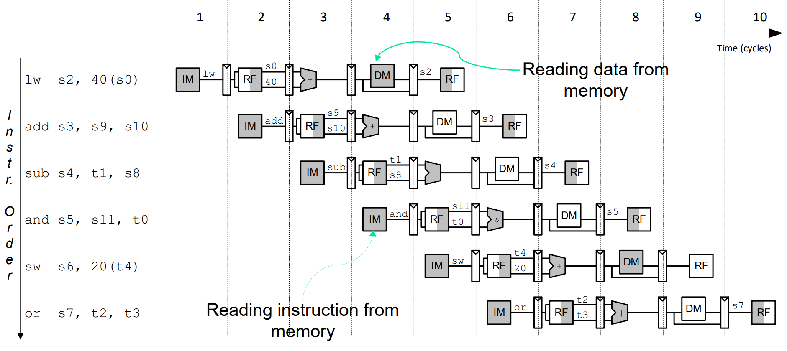<figcaption></figcaption></figure>

#### Data Hazards

**Data harzards** happen when we attempt to use data before it is ready. For example, an instruction's source operand(s) are produced by a prior instruction still in the pipeline. This hazard is also known as _RAW_ (**read after write**) hazard or _true data dependency_ and it occurs very frequently in practice.

For example, in the following diagram, the destination register `rd` of the `add` instruction is needed by the following `sub`, `or` and `and` as a source register `rs`.

<figure>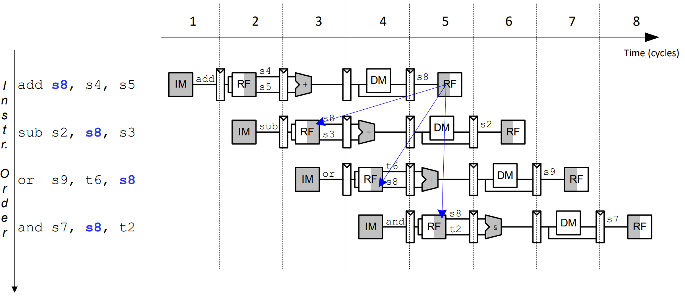<figcaption></figcaption></figure>

#### Control Hazards

**Control hazards** happen when we attempt to make a decision about program control flow before the condition has been evaluated and the new PC target address calculated. This usually happens in branch/jump instructions.

For example, in the branch instruction, the BTA (Branch Target Address) can only be known after the Execution stage. In this case, two more instructions will have been already fetched. And if the branch is taken, these two instructions shouldn't be completed.

<figure>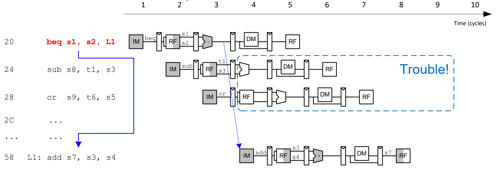<figcaption></figcaption></figure>

<details>

<summary>Self-Diagnostic Quiz</summary>

Use inline code (put the callee function into the caller function) can **always** reduce the control hazard in a pipelined processor?

***

**Ans**: No, it should be **sometimes**. This is because of the following three reasons:

1. **I-Cache Misses** (The Main Hazard): Inlining replicates code, significantly increasing the binary size ("code bloat"). If the expanded code exceeds the size of the Instruction Cache, it causes cache misses. A fetch from main memory (hundreds of cycles) is far more costly than the few cycles lost to a control hazard.
2. **Register Pressure**: Inlining forces the compiler to manage more variables simultaneously. If the processor runs out of registers, it causes "spilling" (saving data to stack memory), creating memory access delays that negate the speedup from removing the function call.
3. **Internal Branches Remain**: Inlining only removes the `CALL` and `RETURN` jumps. Any conditional branches (loops, if-else) _inside_ the inlined function still exist and still cause control hazards.

</details>

## Handle Pipeline Hazards

In this part, we will introduce how to handle the 3 types of pipeline harzards we have encountered above. As for the sake of this course, we will focus more on the [handling of the data hazards](lec-05-the-pipelined-processor.md#handle-data-hazards).

### Handle Structural Hazards

We can simply fix this hazard by using separate instruction and data memory.

### Handle Data Hazards

To handle data harzards, we will introduce five methods,

#### Use different clock edges

This means that we will write register file and [pipeline registers](#user-content-fn-2)[^2] at different edges of the clock.

For example, in the following diagram, we use `negedge` for register file and `posedge` for the pipeline state registers.

<figure>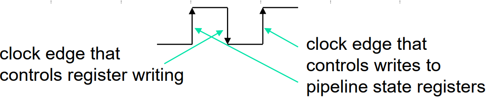<figcaption></figcaption></figure>

By following the above convention we made, here's the updated microarchitecture of our processor

<figure>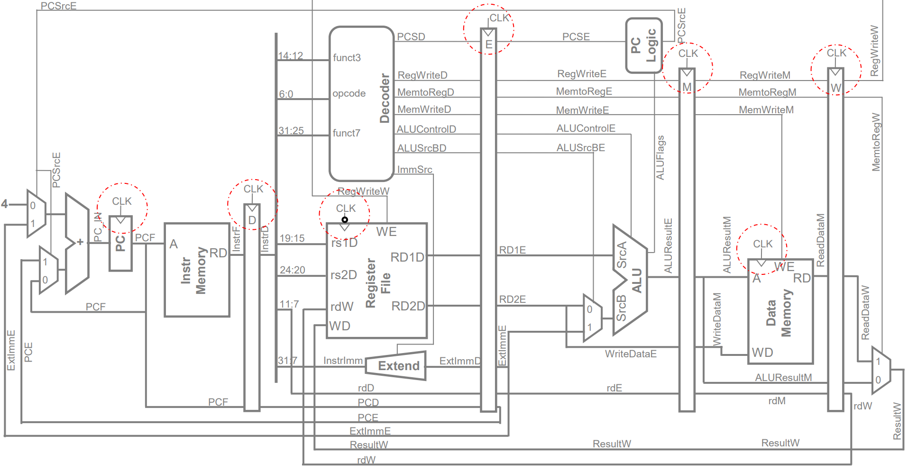<figcaption></figcaption></figure>

Using this technique to analyze the data hazard example above, we can see from the following graph that the third instruction `and` will successfully read the updated value stored in register `s8`.

<figure>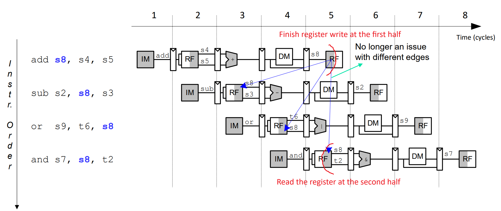<figcaption></figcaption></figure>

Given that, we will summarize the pros and cons of this technique as follows,

* **Pros**:
  * This technique can help reduce the "troublesome" instructions from 3 to 2 in our example [above](lec-05-the-pipelined-processor.md#data-hazards).
* **Cons**:
  * It will use 2 edges from the same clock and this is a practice discouraged in [CG3207.](https://wenbo-notes.gitbook.io/ddca-notes/lec/lec-02-digital-system-design-and-verilog#use-one-clock-for-the-entire-design)
  * The half cycle may not be enough to write the pipeline state register. In other words, reading the value from the register file and write it to a pipeline state register may take longer than half of a clock cycle.

#### Inserting NOPS

> In RISC-V, we can use `addi x0, x0, 0` as NOP.

The basic idea is that when there exists true data dependency between two instructions, we can insert NOPs between the these instructions to "delay" the data "transfer". So, if we have already implemented the [first technique of using different clock edges](lec-05-the-pipelined-processor.md#use-different-clock-edges), we should make sure the number of NOPs or independent useful instructions is **2** between the two instructions that have true data dependency.


This magic number 2 here is dependent on the microarchitecture of the processor. In other words, the number of stages you have in your processor.


For example, in the following diagram, `add` and `sub` have true data dependency. We can either insert two NOPs between `add` and `sub` or replace one of the NOPs with the independent useful instruction `orr`.

<figure>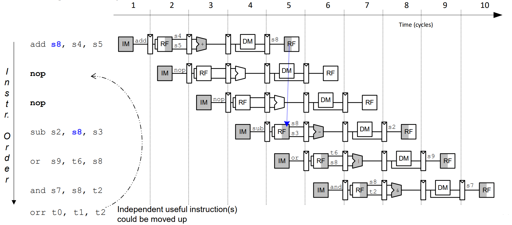<figcaption></figcaption></figure>

Now, we can summarize the pros and cons of this technique

* **Pros**:
  * It is easier to implement as the NOPs are inserted by the compiler during the compile time.
  * Inserting NOPs can solve almost **all** the hazards.
* **Cons**:
  * Insert NOPs will **waste code memory**.
  * As NOPs will do nothing, we won't treat them as real instructions when calculating the CPI. Thus, with more clock cycles and the same number of useful instructions, the **CPI will increase** and thus increase our CPU Time.
  * To know the number of NOPs or independant useful instructions to be inserted, the compiler needs to know the microarchitecture, like the number of stages in our pipeline processor and have we used different clock edges to write to register file and pipeline state registers, etc. This will make the code not very **portable**.

#### Data Forwarding

> This is the most challenging technique introduced in hanlding data hazards.

The basic idea in data forwarding is that the data is available on some pipeline register before it is written back to the register file (RF). So, we can take that data from where it is present, and pass it to where it is needed.



#### Execution Stage

> In this part, we will see the forwarding circuitry for W -> E and M -> E.

In the execution stage, we can check if the register read ([rs1E and rs2E](#user-content-fn-3)[^3]) by the instruction which is currently in Execute stage [**matches**](#user-content-fn-4)[^4] the register written ([rdM or rdW](#user-content-fn-5)[^5]) by the instruction which is currently in Memory or Writeback Stage. If so, we forward the **ready result** (usually is the ALUResult at Memory or Writeback Stage) to the Execution stage so now the input to ALU will come from M or W stage rather than the E stage register.

For example, we can see how the above forward logic works in the following graph,

<figure>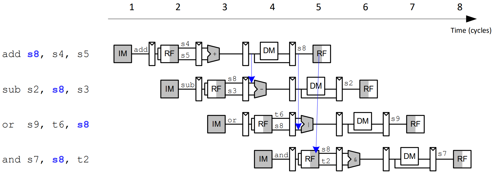<figcaption></figcaption></figure>

Suppose we have applied the [#use-different-clock-edges](lec-05-the-pipelined-processor.md#use-different-clock-edges "mention") technique, now the `add` instruction only has true data dependency with the `sub` and `or` instruction.

* In the `sub` instruction's E stage, we notice it needs `rs1E` to be the register `s8`. In the `add` instruction, its `rdM` in the M stage is register `s8` and it mathces with `rs1E`. Thus, we can forward  the ready ALUResult from `add` instruction's M stage to the E stage of the `sub` instruction.
* Similarly, in the `or` instruction's E stage, it needs `rs2E` to be the register `s8`. In the `add` instruction, its `rdW` in the W stage is register `s8` and it mathces with `rs2E`. Thus, we can forward the ready ALUResult (In W stage, it is ResultW) to the E stage of the `or` instruction.

To implement this fowarding logic, we will add **Hazard Unit** shown as follows in our microarchitecture to specifically handle the hazard.

<figure>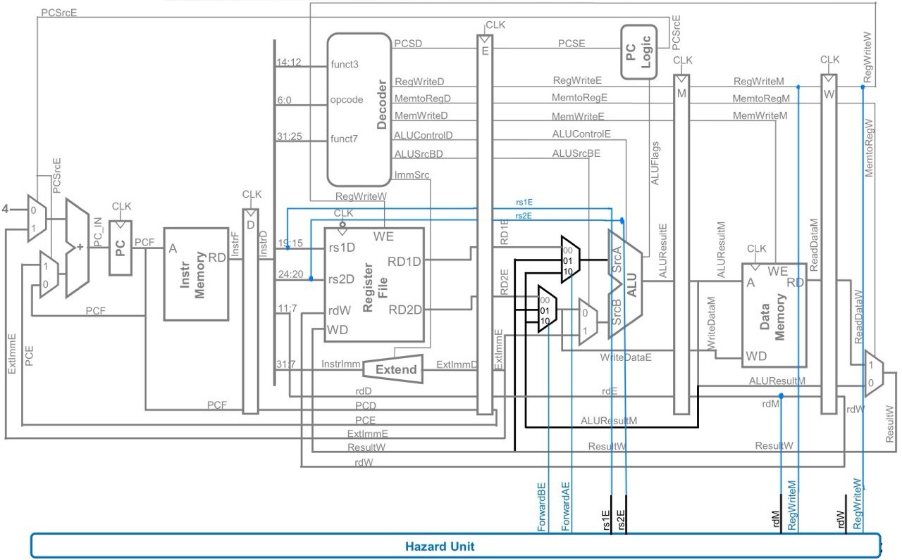<figcaption></figcaption></figure>

`rs1/2E`, `rdM/W` and `RegWriteM/W` are easy to pass as the **input** to the Hazard Unit, but the **output** `ForwardA/BE` which are used to control the multiplexer for the ALU SrcA and SrcB should follow exactly the following three cases


```verilog
// rs1E
if ((rs1E == rdM) && RegWriteM && (rdM != 0))      // Case 1
    ForwardAE = 2'b10;
else if ((rs1E == rdW) && RegWriteW && (rdW != 0)) // Case 2
    ForwardAE = 2'b01;
else                                               // Case 3
    ForwardAE = 2'b00;

// rs2E is similar, just replace rs1E with rs2E
if ((rs2E == rdM) && RegWriteM && (rdM != 0))      // Case 1
    ForwardBE = 2'b10;
else if ((rs2E == rdW) && RegWriteW && (rdW != 0)) // Case 2
    ForwardBE = 2'b01;
else                                               // Case 3
    ForwardBE = 2'b00;
```


* Condition 1 `rs1/2E == rdM/W` is about the **match**.
* Condition 2 `RegWriteM/W` ensures that the instruction (in our example, `add`) really **writes to the register**. If not (like `sw`, `branch`), there won't be any **data hazard**, thus no need to do data forwarding.
* Condition 3 `rdM/W ≠ 0` ensures that we are **not forwarding** from the `x0` register as there is no need to do so.

In total, we need 2 x 2 + 2 = 6, 5-bit comparators to do this data forwarding. `rs1/2E` each needs two comparators (2 x 2 = 4) and `rdM/W` needs another 2 but the can share result to another `Forward1/2E` signal.&#x20;


For DP-Reg instructions, the value is available at the Memory stage or at the Writeback stage before it is written back to the register file.




#### Mem-to-Mem Copy

> In this section, we will see the forwarding circuitry for W -> M.

Another situation that we should do the data forwarding is when there is a `lw` followed by a `sw` and the `sw` tries to store the value (`rs2`) that `lw` writes/loads to (`rd`).

In this case, we need to check if the register used in Memory stage by the `sw` instruction (`rs2`) matches register written by the `lw` in Writeback stage (`rd`). If so, we will forward the result.

<figure>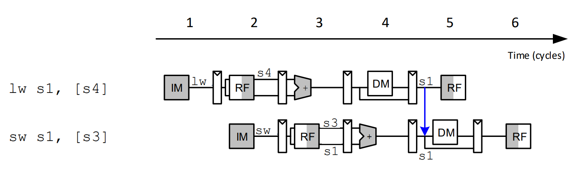<figcaption></figcaption></figure>

And our Hazard Unit will be updated to the following,

<figure>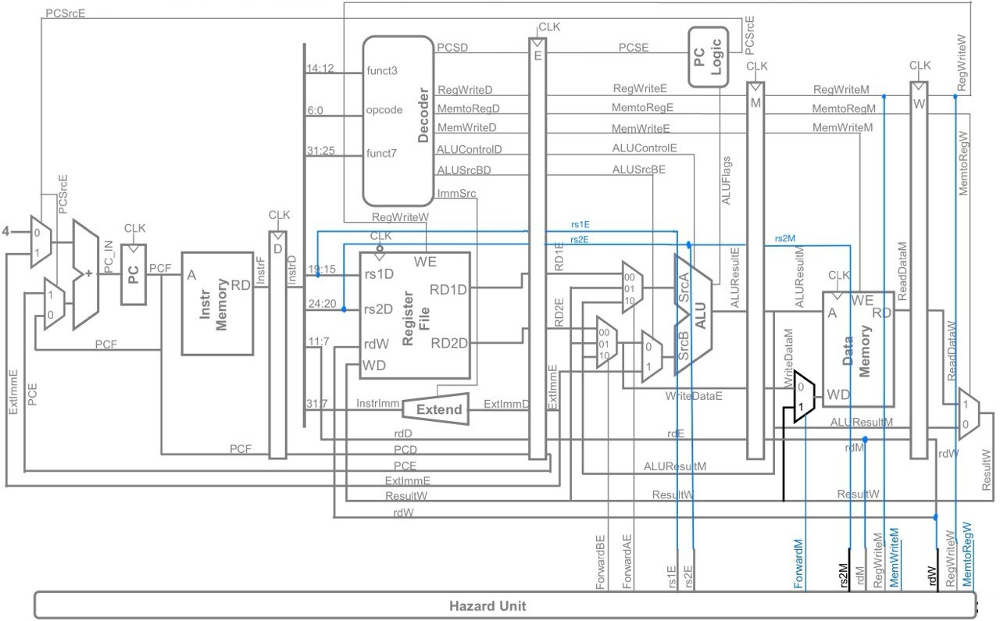<figcaption></figcaption></figure>

By now, we have added `ForwardM` as another **output** of our Hazard Unit, `rd2M` and `rdW` are two **inputs**. And the logic to derive when to set `ForwardM` will be as follows,

```verilog
ForwardM = (rs2M == rdW) & MemWriteM & MemtoRegW & (rdW != 0)
```

* Condition 1: `rs2M == rdW` is the basic match check
* Condition 2: `MemWriteM` ensures that the instruction at the Memory stage is the `sw`. (See the [Lec 03](https://wenbo-notes.gitbook.io/ddca-notes/lec/lec-03-risc-v-isa-and-microarchitecture#support-for-link-and-jalr), same for above, as only `sw` has `MemWrite == 1`)
* Condition 3: `MemtoRegW` ensures that the instruction at the Writeback stage is the `lw`
* Condition 4: `rdW ≠ 0` ensures that the `lw` at the Writeback stage have a non-`x0` destination.


#### Notes

1. For `lw` instruction, the value is ready **only** at the Writeback stage (after the Memory stage).
2. All the forwarding must be done **vertically**.&#x20;
   1. For M -> E to be done, the value must be ready at Memory stage and the next instruction must use that value as one of its ALU sources.
   2. For W -> E to be done, the **next instruction by the next instruction** (2 more instructions) should use that value as one of its ALU sources.
   3. For W -> M to be done, it only happens for `lw` followed by `sw` which meets the requirements at the beginning of this section.
3. If this Mem-to-Mem copy is used together with the **unoptimized** version of load and use hazard, stall will be triggered and one NOP will be inserted. In other words, if you use the basic version of load and use hazard below, the Mem-to-Mem copy won't have any effect.




#### Load and Use Hazard: Stalling

Suppose we have a `lw` instruction whose `rd` is one of the `rs` of the following instruction, for example, `and` instruction. As `and` is **followed** closely after the `lw`, we have a trouble shown as follows!

<figure>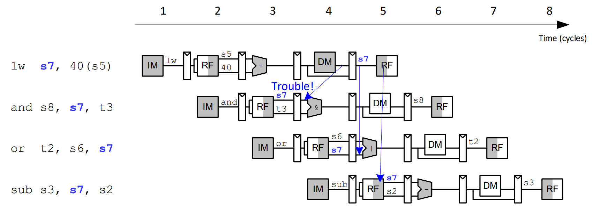<figcaption></figcaption></figure>

The problem is that in the 4th clock cycle, the `and` instruction needs `s7` but as `lw` is still in Mem stage, `s7` is still **not available**! To solve this problem, we will need to stall the Decode stage and Fetch stage for the `and` and `or` instruction in the above example. A result of this is that during the 6-th clock cycle, nothing will complete.

<figure>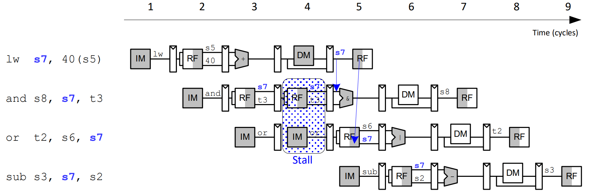<figcaption></figcaption></figure>

To implement it out, its circuitry will look like as follows,

<figure><figcaption></figcaption></figure>

We stall the PC update register so that whatever in the Fetch stage is still there and won't change, similar for the pipeline register D and the Decode stage. However, as the clock cycle moves forward by 1, the `lw` instruction will move to the Memory stage, while whatever in the Decode stage (`and` instruction in our example) will move forward to the Execution stage. This is not what we want, thus, we **flush** the pipeline register E at the same time we stall the pipeline register F and D.

The basic condition for detecting it will be


```verilog
lwStall = (MemtoRegE & (rs1D == rdE) | (rs2D == rdE))
// then we do
StallF = StallD = FlushE = lwStall // pseudo-code here
```


* Condition 1: `MemtoRegE` is to ensure the instruction at the execution stage is `lw`.
* Condition 2: `(rs1D == rdE) | (rs2D == rdE)` ensures that the instruction followed actually uses the `lw`'s `rd`. This is the earliest time we can detect such load-use hazard.

After 1 cycle, the forwarding circuitry (W -> E) will take care of delivering the correct data. However, how do we combine it with our Mem-to-Mem copy circuitry, and deal with the case when some instructions don't use `rs1` or `rs2`? Below is an example!


```verilog
wire rs1_active;
wire rs2_active;

// Check if instruction actually USES rs1
assign rs1_active = (OpcodeD != 7'b1101111) &&  // JAL
    (OpcodeD != 7'b0110111) &&  // LUI
    (OpcodeD != 7'b0010111);  // AUIPC

// Check if instruction REQUIRES rs2 for Hazard Stalling
assign rs2_active = (OpcodeD != 7'b1101111) &&  // JAL
    (OpcodeD != 7'b0110111) &&  // LUI
    (OpcodeD != 7'b0010111) &&  // AUIPC
    (OpcodeD != 7'b0000011) &&  // Load
    (OpcodeD != 7'b0010011) &&  // DP Imm
    (OpcodeD != 7'b1100111) &&  // JALR
    (OpcodeD != 7'b0100011);  // Store

assign lwStall = MemtoRegE && (rdE != 0) && (((rs1D == rdE) && rs1_active) || ((rs2D == rdE) && rs2_active));
```



These extra exceptions are just to improve performance. Not implementing them won't cause any functional issue, but will cause the performance loss.




#### W -> D Forwarding

In the [#use-different-clock-edges](lec-05-the-pipelined-processor.md#use-different-clock-edges "mention"), we use the negedge of the clock to read from the register file. What if we want to use the same posedge of the clock in our processor?

A problem will happen if we have the following instructions:


```riscv
addi x5, x1, 9
add  x7, x8, x9
add  x8, x8, x9
add  x6, x5, x2
```


Suppose we denote the clock cycle when the `addi`'s fetch happens as clock cycle 1. We may notice that after clock cycle 4, we should forward the result that will be stored in `x5` in clock cycle 5 to the Decode stage of the `add x6, x5, x2` so that it can use the upated value.

<figure>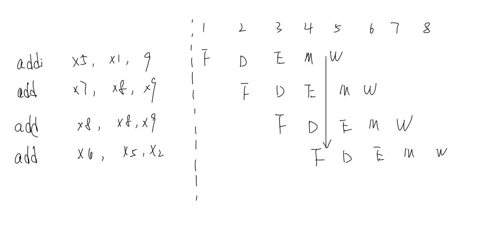<figcaption></figcaption></figure>

To handle this case, we can further modify our hazard unit to add two output signals `Forward1/2D`.


```verilog
Forward1D = (rs1D == rdW) & RegWriteW & (rdW != 0)
Forward2D = (rs2D == rdW) & RegWriteW & (rdW != 0)
```


* Conidition 1: `rs1/2D == rdW` ensures the Writeback stage `rd` matches with one of the decode stage `rs`.
* Condition 2: `RegWriteW` ensures that the Writeback stage will write back to the register file.
* Condition 3: `rdW ≠ 0` ensures that the Writeback stage `rd` is not `x0`.

Our updated circuitry will be as follows,

<figure>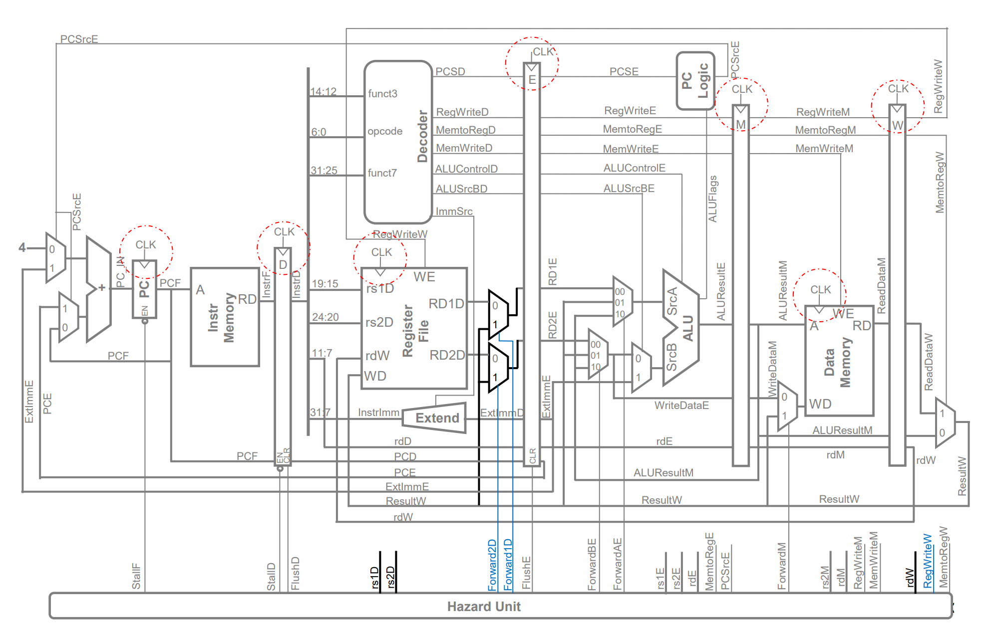<figcaption></figcaption></figure>



### Handle Control Hazards

Unlike the data hazards, which can be handled effectively using the techniques like data forwarding. There is no perfect way to handle the control hazards. In this section, we will introduce the **flushing** technique to handle the control hazards.

The key idea of **flushing** is to flush the two fetched instructions if the branch is taken. In our microarchitecture, if `PCSrcE == 1`, it means the branch is taken. Thus, the condition can be written as follows,


```verilog
FlushD = FlushE = PCSrcE;
// If we take care of the stalling
FlushE = lwstall || PCSrcE;
```


And its circuitry will be as follows,

<figure>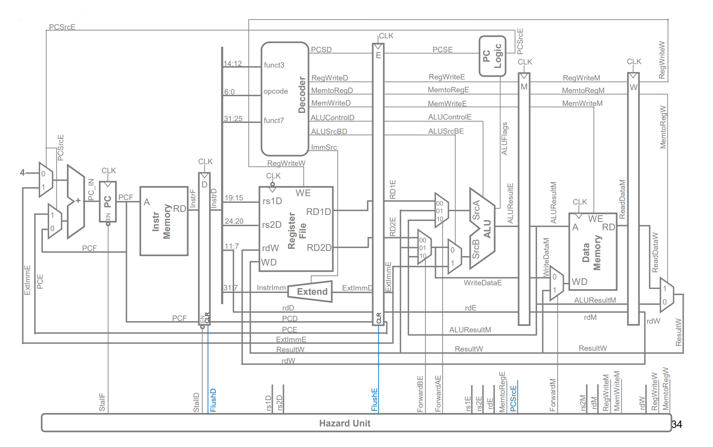<figcaption></figcaption></figure>

<details>

<summary>Flushing vs. Stalling</summary>

Stalling means **hold still** (instructions waits, waiting) while flushing means **wipe out** (instruction removed). Think of the following example

```verilog
// Decode pipeline register
PCSE <= PCSD;
```

Stalling the decode pipeline register E will cause PCSE to keep its **previous value** (not updating). Flushing the decode pipeline register E will cause PCSE to be **0**. And as this zero will be passed all the way till the end of the pipeline, and that's why we can think of flushing one pipeline statge as inserting one NOP.


In our real processor design, the big register is composed of many many small registers.


If any stage is stalled, (i) the previous stages should also be stalled, and (ii) the following stage should be flushed (think [load and use](https://wenbo-notes.gitbook.io/ddca-notes/lec/lec-05-the-pipelined-processor#load-and-use-hazard-stalling))

</details>

## Complete Hazard Handling Circuitry

The following is the complete hazard handling circuitry we have introduced in this lecture. However, it is not based on the [full microarchitecture in lec 03](https://wenbo-notes.gitbook.io/ddca-notes/lec/lec-03-risc-v-isa-and-microarchitecture#support-for-link-and-jalr).

<figure>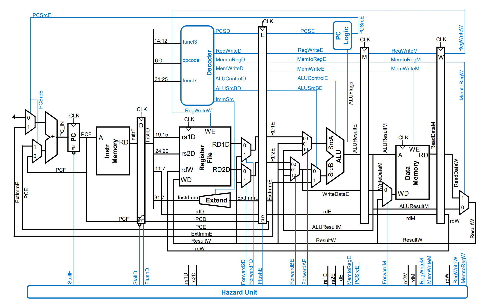<figcaption></figcaption></figure>


For the finals, be prepared to see some challenging questions that use a pipeline design that is not 5-stage, it can use 7-stage or 17 stages. Be aware of how to anaylze the execution time under these circumstances.


[^1]: including the Control Unit and Datapaths

[^2]: Write to pipeline registers can be thought of as **updating** the pipelined registers' values.

[^3]: `rs` is different from `RD`. `rs` stores the **index** of the register we want to read, e.g., if `rs1 = 1`, means we want to read from `x1` register. However, `RD` stores the **value** that we read from `rs` index register. e.g., If `rs1 = 1`, then `RD1` will store the value in register `x1`.

[^4]: "matches" just means whether `rs1E` or `rs2E` is **equal** to `rdM` or `rdW`.

[^5]: Similar as the `rs1` and `rs2`, `rd` stores the **index** of the register we want to write to. In other words, the destination register. And its correponding `WD` will store the **value** we will write to the `rd` register.
