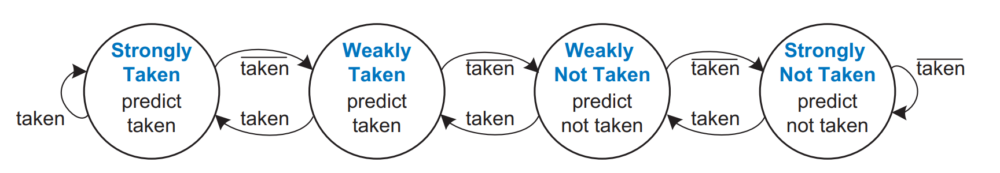
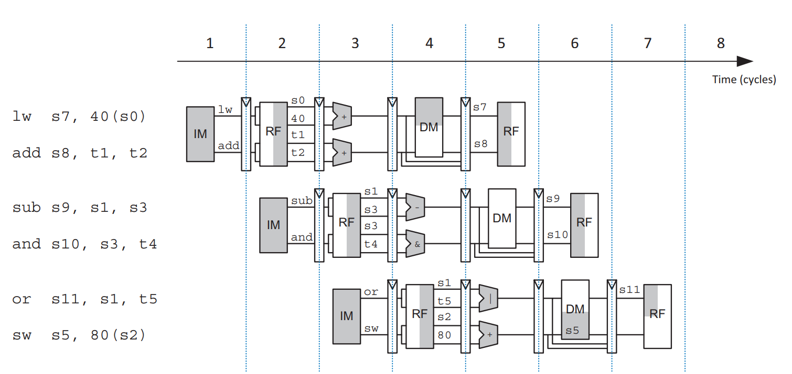
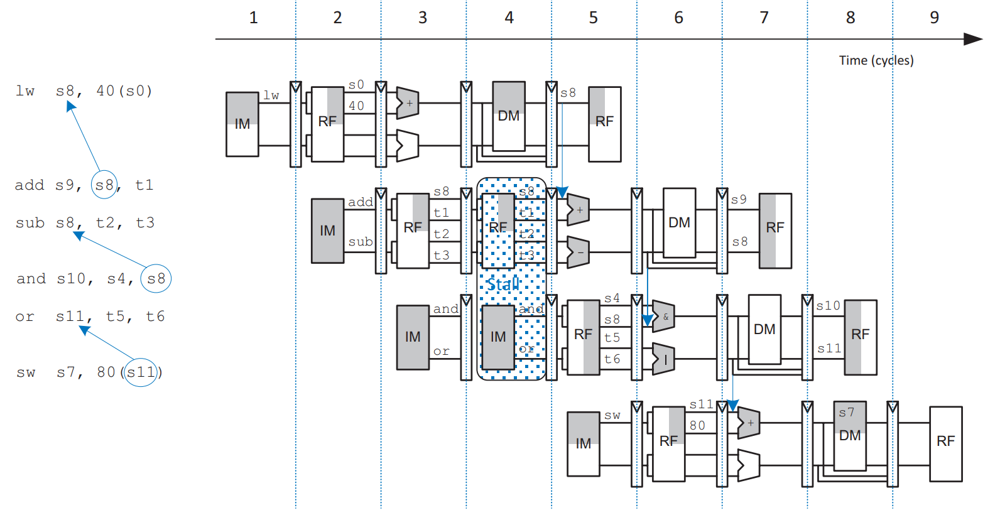
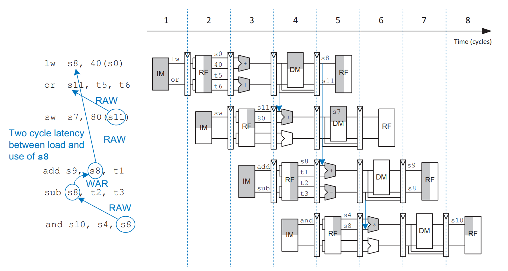
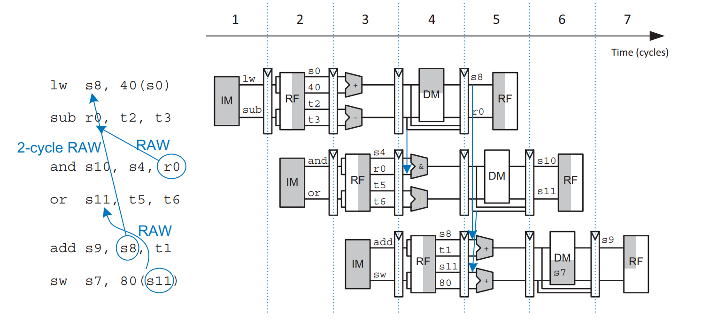
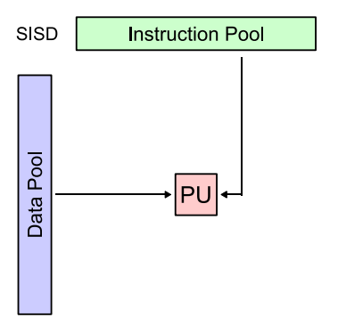
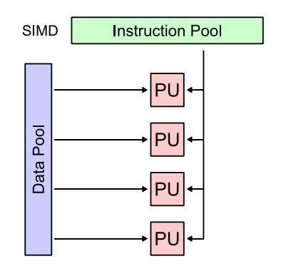
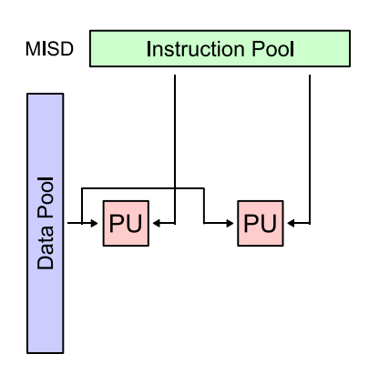
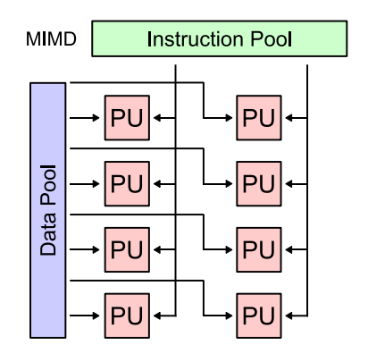
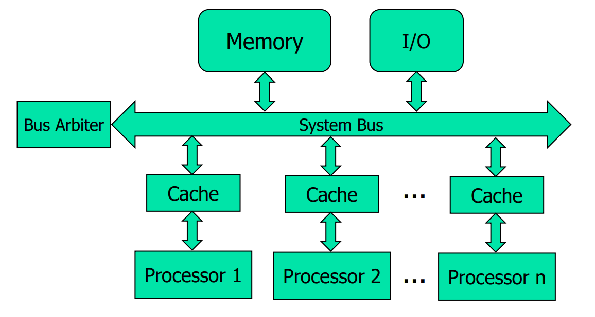

# Lec 06 - Advanced Processor

In this lecture, we will exploit different methods to extract even more performance from the pipelined processor that we built in [Lec 05](lec-05-the-pipelined-processor.md)!

## Branch Prediction

An ideal pipelined processor would have a CPI of 1. The branch misprediction penalty is a major reason of increased CPI. As pipelines get **deeper**, branches are resolved later in the pipeline. Thus, the **branch misprediction penalty** gets **larger** because all the instructions issued after the mispredicted branch must be **flushed**. To address this problem, most pipelined processors use a **branch predictor/prediction** to guess whether the branch should be taken.

In Lec 05, the way we [handle the control hazard](lec-05-the-pipelined-processor.md#handle-control-hazards) is to simply predict that branches are never taken.


**Branch misprediction penalty** is the **flushing** of all the instructions issued after the mispredicted branch.


### Static Branch Prediction

The simplest form of branch prediction checks the **direction** of the branch and predicts that [backward branches](lec-06-advanced-processor.md#backward-branches) are taken and [forward branches](lec-06-advanced-processor.md#forward-branches) are not.

#### Forward Branches

These are the branches that occur at the **beginning** of a loop to check a condition and **branch past the loop** when the condition is no longer met (e.g., in _for_ and _while_ loops). Loops tend to execute many times, so these forward branches are **usually not taken**.


```
Loop: beq s1, s2, Out
      1nd loop instr
           .
           .
           .
      last loop instr
      j Loop
Out:  fall out instr
```


#### Backward Branches

These are the branches that occur when a program reaches the **end** of a loop and **branches back to repeat the loop** (e.g., _do-while_ loop). Again, because loops tend to execute many times, these backward branches are **usually taken**.


```
Loop: 1st loop instr
      2nd loop instr
            .
            .
            .
      last loop instr
      bne s1, s2, Loop
      fall out instr
```


### Dynamic Branch Prediction

However, branches, especially forward branches, are difficult to predict without knowing more about the specific program. Therefore, most processors use **dynamic branch predictors/predictions**, which use the history of program execution to guess whether a branch should be taken.

Dynamic branch predictors maintain a table of the last several hundred (or thousand) branch instructions that the processor has executed. The table, called a **branch target buffer**, includes the destination of the branch and a history of whether the branch was taken.

To see it clearly, consider the following loop. The loop repeats 10 times, and the branch out of the loop (`bge s0, t0, done`) is taken only on the last iteration.


```armasm
      addi s1, zero, 0  # s1 = sum = 0
      addi s0, zero, 0  # s0 = i = 0
      addi t0, zero, 10 # to = 10
for:
      bge  s0, t0, done  # i >= 10?
      add  s1, s1, s0,   # sum = sum + i
      addi s0, s0, 1     # i = i + 1
      j    for           # repeat loop
done:
```


#### One-bit Dynamic Branch Predictor

A **one-bit dynamic branch predictor** remembers whether the branch was taken the **last time** and predicts that it will do the same thing the next time.

While the loop is repeating, it remembers that the **beq was not taken last time** and predicts that it should not be taken next time. This is a **correct prediction** until the last branch of the loop, when the branch does get taken. Unfortunately, if the loop is run again, the branch predictor **remembers that the last branch was taken**. Therefore, it **incorrectly predicts** that the branch should be taken when the loop is first run again.

In summary, a **one-bit dynamic branch predictor** mispredicts the **first** and **last** branches of a loop. And its accuracy is 80% if the loop repeats 10 times. In a loop with N iterations, the accuracy is

$$
\text{accuracy}=\frac{N-2}{N}\times100\%
$$


The accuracy of 80% doesn't apply to all cases! It is the accuracy only when the loop repeats 10 times!


#### Two-bit Dynamic Branch Predictor

A **two-bit dynamic branch predictor** can decrease the number of misprediction by having four states: Strongly taken, weakly takne, weakly not taken, and strongly not taken.

<figure><figcaption></figcaption></figure>

Using the same example [above](lec-06-advanced-processor.md#dynamic-branch-prediction), when the loop is repeating, it enters the **Strongly Not Taken** state and predicts that the branch should not be taken next time. This is correct until the last branch of the loop, which is taken and moves the predictor to the **Weakly Not Taken** state. When the loop is first run again, the branch predictor **correctly predicts** that the branch should not be taken and reenters the **Strongly Not Taken** state.

In summary, **two-bit dynamic branch predictor** mispredicts **only the last branch of a loop**. Thus, when the loop has N iterations, it has the accuracy of

$$
\text{accuracy}=\frac{N-1}{N}\times100\%
$$

### Speculative Execution

**Speculative execution** is a performance optimization technique where a computer system or CPU performs tasks ahead of time based on a guess, in order to avoid delays.

One good example is the branch prediction we have seen above. Another example will be the **load speculation**.

<details>

<summary>Self-Diagnostic Quiz</summary>


To better understand this quesiton, you may need to read the [out-of-order processor](lec-06-advanced-processor.md#out-of-order-processor) part first.


The instruction `sw x1, (x2)` followed by `lw x4, (x3)` can be unconditionally reordered, as there is no dependency between them.

***

**Ans**: False. This is because if `x2` and `x3` has the same value, then there will be a dependency between these two instructions and they cannot be reordered unconditionally. But if they don't have the same value, then the `lw` instruction can be scheduled before the store, this is what we called **load speculation**.

</details>

Speculative execution must have (hardware/software) mechanisms for

* Checking to see if the guess was correct
* Recovering from the effects of the instructions that were executed speculatively if the guess was incorrect.

## Deep Pipelining

> As we have seen from Lec 01, to increase performance, we would like to **speed up the clock** and/or **reduce the CPI**. For the CPI, we know that **stalling** and **flushing** will both increase the CPI.

As we have seen the technique of pipelining in Lec 05, it can reduce the clock cycle time and thus increase the clock speed. In real world, aside from the [advances in manufacturing](#user-content-fn-1)[^1], the easiest way to speed up the clock is to **chop the pipelines into more stages**. Each stage contains less logic, so it can run faster. Nowadays, 8-20 stages are commonly used.

However, the maximum number of pipeline stages is limited by the pipeline hazards, sequencing overhead, and cost.

> TODO: For the explanation of sequence overheads, Prof Rajesh has a very good explanation in Week 10 Lec! Include that once got time!

## Micro-Operations

> This technique is largerly used in CISC (Complex Instruction Set Computer).

It means the at run time, more **complex instructions** will be **decomposed** into a series of simple instructions called **micro-operations** (micro-ops or $$\mu$$-ops). These micro-operations can be executed on **simple datapaths**.


```armasm
; Using ARM Assembly as an example
; Complex Op
LDR R1, [R2], #4

; Micro-op Sequence
LDR R1, [R2]
ADD R2, R2, #4
```


The decoding process is done by the **hardware** and the micro-operations need not even be **valid instructions** in ISA. This will also increase code density, resulting in less IROM usage.

<details>

<summary>Micro-operations vs. pseudo-instructions</summary>

* **Pseudo-instructions**: The assembler splits pseudo-instructions (which are **not valid** instructions in the ISA) into **valid instructions** within the ISA. The instructions to which the pseudo-instruction is split into is visible to the programmer.
* **Micro-operations**: In case of micro-operations, the hardware splits the complex instructions (which are **valid instructions** in the ISA) into simple instructions/operations which are **not necessarily within the ISA**. Micro-operations are **invisible** to the programmer.

</details>

### Macro-op Fusion

This is exactly the opposite of the micro-operations. We have seen this earlier in [Lec 04](https://wenbo-notes.gitbook.io/ddca-notes/textbook/digital-building-blocks/arithmetic-circuits#macro-op-fusion)!

## Multiple Issue Processors

### Superscalar Processors

A **superscalar processor** issues several instructions at a time, each of which operates on one piece of data. Thus it contains multiple copies of the datapath hardware to execute multiple instructions simultaneously. The figure below shows a block diagram of a two-way superscalar processor that fetches and executes two instructions per cycle.&#x20;

<figure><figcaption></figcaption></figure>

#### Ideal Case

The ideal case for a two-way superscalar processor is that it can execute exactly two instructions on each cycle. This is shown in the following figure,

<figure><figcaption></figcaption></figure>

For this program, the proecssor has a CPI of 0.5. Designers commonly refer to the reciprocal of the CPI as the **instructions per cycle**, or **IPC**. This processor has an IPC of 2 on this program.

#### Real Case

As we all know, executing many instructions simultaneously is difficult because of dependencies. The following figure shows a pipeline diagram running a a program with [data dependencies](lec-05-the-pipelined-processor.md#data-hazards). The dependencies ni the code are indicated in <mark style="color:blue;">blue</mark>.

<figure><figcaption></figcaption></figure>

* **Cannot issue simultaneously**: The `add` instruction is dependent on `s8`, which is produced by the `lw` instruction, so it cannot be issued at the same time as `lw`.
* **Data Forwarding**: Additionally, the `add` instruction stalls for yet another cycle so that `lw` can forward `s8` to `add` in cycle 5.
* **Data Forwarding**: The other dependencies (between `sub` and `and` based on `s8`, and between `or` and `sw` based on `s11`) are handled by **forwarding** results produced in one cycle to be consumed in the next.

This program requires fives cycles to issue six instructions, for an IPC of $$6\div5=1.2$$.

<details>

<summary>Parallelism in temporal and spatial form</summary>

Recall that parallelism comes in temporal and spatial forms.

* **Pipelining** is a case of temporal parallelism.
* Using **multiple execution units** is a case of spatial parallelism.

**Superscalar processors** exploit **both** forms of parallelism to squeeze out performance far exceeding that of our single-cycle and multicycle processors

</details>

### Out-of-order Processor

To cope with the problem of dependencies, an **out-of-order processor** looks ahead across many instructions to issue **independent instructions** as rapidly as possible. The instructions can issue in a **different order** than that written by the programmer as long as dependencies[^2] are honored so that the program produces the intended result. This will increase the **Instruction Level Parallelism (ILP)** and thus increasing the **IPC** also.

Consider running the same program [above](lec-06-advanced-processor.md#real-case) on a two-way superscalar out-of-order processor. The processor can issue up to two instructions per cycle from anywhere in the program, as long as dependencies are observed. The following figure shows the data dependencies and the operation of the processor.

<figure><figcaption></figcaption></figure>

The constraints on issuing instructions are:

* **Cycle 1**
  * The `lw` instruction issues.
  * The `add`, `sub`, and `and` instructions are dependent on `lw` by way of `s8`, so they cannot issue yet. However, the `or` instruction is independent, so it also issues.
* **Cycle 2**
  * Remember that a two-cycle latency exists between issuing `lw` and a dependent instruction, so `add` cannot issue yet because of the `s8` dependence. `sub` writes `s8`, so it cannot issue before `add`, lest `add` receive the wrong value of `s8`. `and` is dependent on `sub`.
  * Only the `sw` instruction issues.
* **Cycle 3**
  * On cycle 3, `s8` is available (or, rather, will be when `add` needs it), so the `add` issues. `sub` issues simultaneously, because it will not write `s8` until after `add` consumes (e.g., reads) it.
* **Cycle 4**
  * The `and` instruction issues. `s8` is forwarded from `sub` to `and`.

This out-of-order processor issues the six instructions in four cycles, for an IPC of $$6\div4=1.5$$, which is more than the normal superscalar processor we have introduced above. In the real-world out-of-order processor, we will see three data dependencies (we have seen twn in the example above):



#### Read After Write (RAW)

In the example above, the dependence of `add` on `lw` by way of `s8` is sa **read after write (RAW)** hazard. `add` must not read `s8` until after `lw` has written it. Similarly, the dependence of `sw` on `or` by way of `s11` and of `and` on `sub` by way of `s8` are RAW dependencies.

This is the type of dependency we are accustomed to handling in the [pipelined processor (Lec 05)](lec-05-the-pipelined-processor.md#data-forwarding). To solve it, we can use

1. the **data forwarding logic** and
2. sometimes the **stalling technique**.



#### Write After Read (WAR)

The dependence between `sub` and `add` by way of `s8` is called a **write after read (WAR)** hazard or an **antidependence**. `sub` must not write `s8` before `add` reads `s8`, so that `add` receives the correct value according to the original order of the program.

A WAR hazard is not essential to the operation of the program. It is merely an artifact of the programmer’s choice to use the same register for two unrelated instructions. If the `sub` instruction had written `s3` instead of `s8`, then the dependency would disappear and `sub` could be issued before `add`.

To solve it, we can use the register renaming technique which will be introduced later!



#### Write After Write (WAW)

This hazard is not shown in the example above. It is called a **write afte write (WAW)** hazard or an **output dependence**. A WAW hazard occurs if an instruction attempts to write a register after a subsequent instruction has already written it. The hazard would result in the wrong value being written to the register. For example, in the following code, `lw` and `add` both write `s7`. The final value in `s7` should come from `add` according to the order of the program. If an out-of-order processor attempted to execute `add` first and then `lw`, a WAW hazard would occur.


```armasm
lw  s7, 0(t3)
add s7, s1, t2
```


WAW hazards are not essential either; again, they are artifacts caused by the programmer using the same destination register for two unrelated instructions.

To solve it, we can just **discard** the result of the unwanted instruction. For example, if the `add` instruction were issued first, then the program could eliminate the WAW hazard by discarding the result of the `lw` instead of writing it to `s7`. This is called **squashing** the `lw`.

> If we discard the value of `s7` in the `lw` instruction, why do we still need to execute the `lw`? This is because we want to make sure there won't be a **load access fault**!

Besides discarding, we can also use register renaming to solve this hazard.



> TODO: Prof Rajesh's Out-of-order execution slides 23-24 (Chapter 06) are awesome! Go back understand that!

### Register Renaming

Actually, the out-of-order processors use a technique called **register renaming** to eliminate WAR and WAW hazards. **Register renaming** adds some nonarchitectural renaming registers to the processor. For example, a processor might add 20 renaming registers, called `r0` to `r19`. The programmer cannot use these registers directly, because they are not part of the architecture. However, the processor is free to use them to eliminate hazards.

For example, in the example above, a WAR hazard occurred between the `sub s8, t2, t3` and `add s9, s8, t1` instructions based on reusing `s8`. The out-of-order processor could rename `s8` to `r0` for the `sub` instruction. Then, `sub` could be executed sooner, because `r0` has no dependency on the `add` instruction. The processor keeps a table of which registers were renamed so that it can consistently rename registers in subsequent dependent instructions. In this example, `s8` must also be renamed to `r0` in the `and` instruction, because it refers to the result of `sub`. The following figure shows the same program from [above](lec-06-advanced-processor.md#out-of-order-processor) on an out-of-order processor with register renaming.

<figure><figcaption></figcaption></figure>

The constraints on issuing instructions are:

* **Cycle 1**
  * The `lw` instruction issues.
  * The `add` instruction is dependent on `lw` by way of `s8`, so it cannot issue yet. However, the `sub` instruction is independent now that its destination has been renamed to `r0`, so `sub` also issues.
* **Cycle 2**
  * Remember that a two-cycle latency must exist between issuing `lw` and a dependent instruction, so `add` cannot issue yet because of the `s8` dependence.
  * The `and` instruction is dependent on `sub`, so it can issue. `r0` is forwarded from `sub` to `and`.
  * The `or` instruction is independent, so it also issues.
* **Cycle 3**
  * On cycle 3, `s8` is available, so the `add` issues.
  * `s11` is also available, so `sw` issues.

Now the out-of-order processor with register renaming issues the six instructions in three cycles, for an IPC of 2, which achieves the [ideal case](lec-06-advanced-processor.md#ideal-case)!

### VLIW Processor

In the above sections, we try to increase the parallelism from the hardware perspective. However, there is a technique that shifts the burden of identifying parallelism from hardware to the compiler. This technique is called **VLIW**.

In the VLIW processor, the **compiler** packs groups of independent instructions into the bundle, and the bundle can be thought of as one very long instruction. Hence the name.

Since determining the order of execution of operations (including which operations can execute simultaneously) is handled by the compiler, the processor does not need the scheduling hardware that the three methods described above require. Thus, VLIW CPUs offer more computing with **less hardware complexity** (but **greater compiler complexity**) than do most superscalar CPUs.

## Multithreading

> Here, all the stuff will still use one processor!

Multithreading starts from two problems:

1. Because the ILP of real programs tends to be fairly low, adding more execution units to a superscalar or out-of-order processor gives diminishing returns.
2. Memory is much slower than the processor. Most `lw` and `sw` instructions access a much smaller and faster memory called _cache_. However, when the instructions or data are not available in the cache, the processor may stall for 100 or more cycles while retrieving the information from the main memory.

**Multithreading** is a technique that helps keep a processor with many execution units busy even if

1. the ILP of a program is low or
2. the program is stalled waiting for memory

To explain multithreading, we need to define two new terms



#### Process

A program running on a computer is called a **process**. Computers can run **multiple processes simultaneously**. For example, you can play music on a PC while surfing the web and running a virus checker.

Also, if you click the icon to run a program on your PC. After clicking, the programming is running. And after the program is loaded into the memory, it is called **process**.



#### Thread

Each **process** consists of one or more **threads** that also run simultaneously. For example, a word processor may have one thread handling the user typing, a second thread spell-checking the document while the user works, and a third thread printing the document. In this way, the user does not have to wait, for example, for a document to finish printing before being able to type again.

The degree to which a process can be split into multiple threads that can run simultaneously defines its level of **thread-level parallelism (TLP)**.

> TODO: **All threads** are independent from each other?



**Multithreading** (whether software or hardware) lets **one processor** appear to do **multiple things at once**.

### Software Multithread

In a conventional processor, the threads only give the illusion of running simultaneously. The threads actually take turns being executed on the processor under control of the operating system (OS). When one thread’s turn ends, the OS saves its architectural state, loads the architectural state of the next thread, and starts executing that next thread. This procedure is called **context switching**. As long as the processor switches through all threads fast enough, the user perceives all of the threads as running at the same time.

Usually, there are ways for the context switching to happen in this scenario:



#### Co-operative Multitasking

In this case, the context switch happens when **one thread stalls**. The next thread to be run is determined by the OS scheduler.



#### Preemptive Multitasking

The context switch can be initiated through **timer interrupts**, without having to wait for the thread to stall.




This describes the **software-based concurrency** on a **single-core CPU**.


### Hardware Multithread

A **hardware multithreaded** processor contains more than one copy of its architectural state so that more than one thread can be active at a time.

For example, if we extended a processor to have four program counters and 128 registers, four threads could be available at one time. If one thread stalls while waiting for data from main memory, then the processor could context switch to another thread **without any delay**, because the program counter and registers are already available. Moreover, if one thread lacks sufficient parallelism to keep all execution units busy in a superscalar design, then another thread could issue instructions to the idle units.

Swithcing between threads can either be **fine-grained** or **coarse-grained**.



#### Fine-grained multithreading

**Fine-grained multithreading** switches between threads on each instruction and must be supported by hardware multithreading.


This is **temporal**.




#### Coarse-grained multithreading

**Coarse-grained multithreading** switches out a thread only on expensive stalls, such as long memory accesses due to cache misses.


This is **temporal**.




#### Simultaneous multithreading

This is also know as SMT or hyperthreading (called by Intel). If one thread can't keep all execution units busy, another thread can use them, so instructions from different threads execute at the same time, without duplication of functional units.


This is both **temporal** and **spatial**.




Multithreading does not improve the performance of an individual thread, because it does not increase the ILP. However, it does improve the overall **throughput** of the processor, because multiple threads can use processor resources that would have been idle when executing a single thread.

### Flynn's Taxonomy

There are four types of computer architectures in the Flynn's Taxonomy, we will introduce them one by one and give you some concrete examples for each of them.

#### Single Instruction stream Single Data stream (SISD)

It's essentially a sequential computer which exploits no parallelism in either the instruction or data stream.

<figure><figcaption></figcaption></figure>

One example is a single-thread or single-core processor.

#### Single Instruction stream Multiple Data streams (SIMD)

It's a computer which exploits multiple data streams against a single instruction stream to perform operations which may be naturally parallelized.

* Exploits **data parallelism**

<figure><figcaption></figcaption></figure>

The examples are **hardware accelerators** and **GPU**s.

#### Multiple Instruction streams Single Data stream (MISD)

As its name suggests, it's multiple instructions operating on one data stream.

<figure><figcaption></figcaption></figure>

This is an uncommon architecture and the examples are **autopilot** system of teh aeroplane, and the **systolic arrays** which are the heart of Google TPUs.

#### Multiple Instruction streams Multiple Data streams (MIMD)

Multiple autonomous processors simultaneously executing different instructions on different data.

* Exploits thread-level/task parallelism

<figure><figcaption></figcaption></figure>

The examples of MIMD architectures include **parallel /** **distributed systems**, using either one shared memory space or a distributed memory space.

> Why multithreading is MIMD?

## Multiprocessors

Modern processors have enormous numbers of transistors available. Using them to increase the pipeline depth or to add more execution units to a [superscalar processor](lec-06-advanced-processor.md#superscalar-processors) gives little performance benefit and wastes power. Around the year 2005, computer architects made a major shift to building multiple copies of the processor on the same chip; these copies are called **cores**.

A multiprocessor system consists of multiple processors and a method for communication between the processors. This system can be divided into two categories based on whether it has a shared memory at any level:

1. [Loosely Coupled Multiprocessor Systems](lec-06-advanced-processor.md#loosely-coupled-mutiprocessor-systems), and
2. [Tightly Coupled Multiprocessor Systems](lec-06-advanced-processor.md#tightly-coupled-mutiprocessor-systems)

### Loosely Coupled Mutiprocessor Systems

In this system, each node runs different OS instances and communicate by **passing messages** rather than through a shared memory. In this kind of system, we have two concrete examples

1. [Computer Clusters](lec-06-advanced-processor.md#clusters)
2. [Grid Computers](lec-06-advanced-processor.md#grid-computers)

#### Clusters

In a **clustered multiprocessor** system, each processor have its own local memory system instead of sharing memory.

It has nodes set to perform the same task, controlled and scheduled by software. These nodes are typically **hemogenous in hardware and software** and are housed in the same building / geography, interconnected using a dedicated network, have shared resources. This systme is often viewed as a single computer from outside, but it actually has a lot of noes (small computers) inside.

One example is the **supercomputer**.

#### Grid Computers

This system is **very loosely coupled**, which means **diverse computers/nodes** are connected via internet and they are geographically dispersed.

Within this system, each node performs a different task to reach a common goal. The nodes are typically heterogenous in hardware and autonomous in software.

One example is the **cryptocurrency mining tools**.

### Tightly Coupled Mutiprocessor Systems

Tightly coupled multiprocessor systems are usually mounted on the same mother board or within the same silicon die, communicates via **shared memory** and usually controlled by a single OS.

<figure><figcaption></figcaption></figure>

In this system, as you can see from the image above

* Each processor executes different programs and works on different data
* Each processor usually has one or more levels of private cache
* The processors share many resouces (e.g., higher level caches, memory, I/O device, interrupt system, etc.)
* All processors connected using a system bus.

However, for all the processors to communicate smoothly via the share memory, some mechanisms are needed to handle the conflict

1. **Arbitration mechanisms**: It two processors attempt to use the same resource **simultaneously**, this mechanism needs to deal with this situation.
2. **Mutual exclusion mechanisms**: This is used to protect resources (or a range of memory) which should not be used in a **concurrent** manner.
3. **Cache coherence ensurance mechanisms**: This is to ensure the cache coherence across all levels.
   1. **Bus snooping** and **directory-based mechanisms** are two examples.

In the tightly coupled multiprocessor system, we have two small parts

1. [Symmetric Multiprocessors](lec-06-advanced-processor.md#symmetric-multiprocessors)
2. [Heterogeneous Multiprocessors](lec-06-advanced-processor.md#heterogeneous-multiprocessors)

#### Symmetric Multiprocessors

**Symmetric multiprocessors** include two or more **identical processors** sharing a single main memory. The multiple processors may be separate chips or multiple cores on the same chip.

Multiprocessors can be used to

1. run more threads simultaneously, or
2. run a particular thread faster


Symmetric multiprocessors are good for situations like large data centers that have lots of thread-level parallelism available.


#### Heterogeneous Multiprocessors

**Heterogeneous multiprocessors** incorporate different types of cores and/or specialized hardware in a single system. And it can take the following two forms:

1. a heterogeneous system can incorporate cores with the same architecture but different microarchitectures, each with different power, performance, and area trade-offs.
2. another heterogeneous strategy is **accelerators**, in which a system contains special-purpose hardware optimized for performance or energy efficiency on specific types of tasks.


Heterogeneous systems are good for systems that have more varying or special-purpose workloads, such as mobile devices.


[^1]: this is mainly to reduce the propagation delay within the logic gates, so the same logic gate that built with the advanced manufacturing technology will have a **smaller** propagation delay.

[^2]: In short, there are three dependencies here:

    1. Read after Write (RAW)
    2. Write after Read (WAR)
    3. Write after Write (WAW)
