# Lec 08a - Embedded I/O Systems

## Introduction

**Input/Output (I/O)** systems are used to connect a computer with external devices called **peripherals**. In a personal computer, the devices typically include keyboards, monitors, printers, and wireless networks. In **embedded systems**, devices could include a toaster’s heating element, a doll’s speech synthesizer, an engine’s fuel injector, a satellite’s solar panel positioning motors, and so forth. A processor accesses an **I/O device** using the **address** and **data busses** in the same way that it accesses memory.

## System Interconnection

### The Generic Computer System

#### Generic Computer System Architecture

<figure>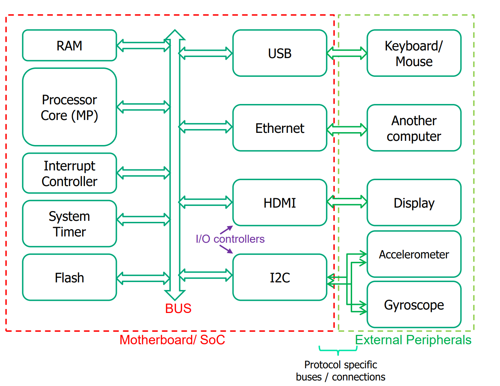<figcaption><p>Generic Computer System Diagram</p></figcaption></figure>

This system is architecturally divided into the internal **Motherboard or System on Chip (SoC)** and the **External Peripherals**. At the core, the **Processor** and **Memory (RAM/Flash)** communicate over a shared **System BUS,** managing high-speed operations alongside critical units like the **Interrupt Controller** and **System Timer**. This internal bus serves as the primary highway for data and instruction movement within the computer.

To communicate with the outside world, the processor utilizes I/O Controllers (such as USB, Ethernet, HDMI, and I<sup>2</sup>C) that reside on the motherboard. These controllers function as intermediaries: they bridge the internal system bus with protocol-specific connections, translating generic bus signals into the specific formats required by external devices like keyboards, displays, and sensors. This design isolates the high-speed processor from the diverse and often slower signaling requirements of external hardware.

### Bus Architectures

#### Single-tiered Bus Architecture

The generic computer sysmte we see from above is a very good example for the **single-tiered bus architecture**. This architecture connects every component — from the high-speed **Processor** and **RAM** to slower I/O devices — onto a single shared **System Bus**. While this design simplifies hardware connections, it creates a significant performance bottleneck because high-speed components must compete for the same bandwidth as slower peripherals, often forcing the CPU to wait.

#### Multi-tiered Bus Architecture

<figure>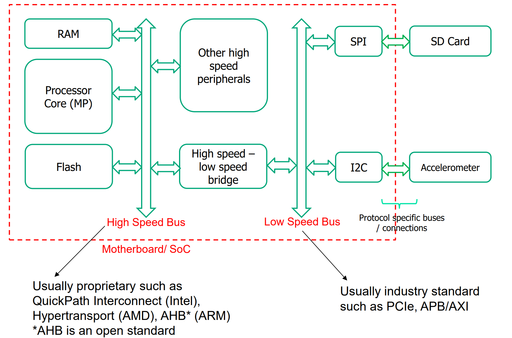<figcaption><p>Multi-tiered bus architecture</p></figcaption></figure>

To optimize performance, this architecture splits the system into two hierarchies using a **Bridge** that facilitates communication between them, ensuring that slow peripherals do not bottleneck the high-speed processor and memory.

* The **High-Speed Bus** connects critical core components like the **Processor** and **RAM**, often utilizing proprietary or specialized protocols to maximize throughput.
* Conversely, the **Low-Speed Bus** manages external interfaces (like **SPI** or **I**<sup>**2**</sup>**C**), relying on standardized protocols to ensure broad compatibility with various device manufacturers.

<details>

<summary>The Industry High-Speed and Low-Speed Bus Protocols</summary>

1. **High-Speed Bus (CPU** $$\leftrightarrow$$ **Memory):**
   1. **QPI (Intel) & HyperTransport (AMD)**: Proprietary/Private protocols. Optimized for specific CPUs.
   2. **AHB (ARM)**: Open standard. Used for high-speed On-Chip communication (Processor to RAM).
2. **Peripheral Bus (CPU** $$\leftrightarrow$$ **I/O)**
   1. **PCIe**: Industry standard for Off-Chip expansion (GPUs, WiFi Cards).
   2. **AXI vs. APB (The ARM Cousins)**:
      1. **AXI**: High-performance/bandwidth peripherals (e.g., Video engines).
      2. **APB**: Low-power/low-bandwidth peripherals (e.g., Timers, Keypads).

</details>

### Peripheral Registers

The processor communicates with external hardware (peripherals) using Peripheral Registers. To the software/processor, these peripherals just look like specific memory addresses.

<figure>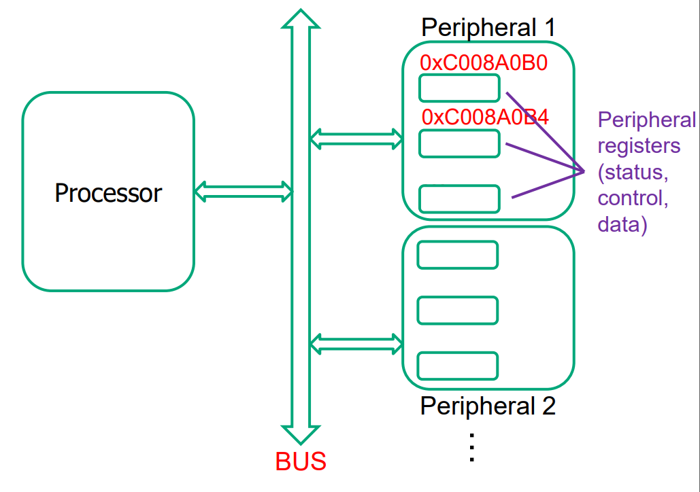<figcaption></figcaption></figure>

Instead of having complex, dedicated wiring for every single command a device might need, the device exposes a set of "registers" (memory locations). The processor interacts with them using standard memory instructions:

* `lw` (Load): Used to **Read** from a register (e.g., to check a status or get input data).
* `sw` (Store): Used to **Write** to a register (e.g., to send a command or output data).

The peripheral registers can be categorized into the following three types:

1. **Status Registers (Read)**: The processor reads these to check the hardware's condition (e.g., "Is the printer busy?" or "Is there new data available?").
2. **Control Registers (Write)**: The processor writes to these to issue commands or configure settings (e.g., "Start the timer" or "Enable interrupts").
3. **Data Registers (Read/Write)**: Used for the actual transfer of information. The processor reads from them to receive input and writes to them to send output

## Addressing Mechanisms

There are two ways that a processor can **address** an I/O device/register.

* Port-Mapped I/O
* Memory-Mapped I/O

### Port-Mapped I/O

Port-Mapped I/O (also known as Isolated I/O ) is a method where the processor treats "talking to peripherals" as a completely separate activity from "talking to memory." As a result, a memory location and an I/O device can essentially share the exact same address number because they exist on different "buses".

<figure>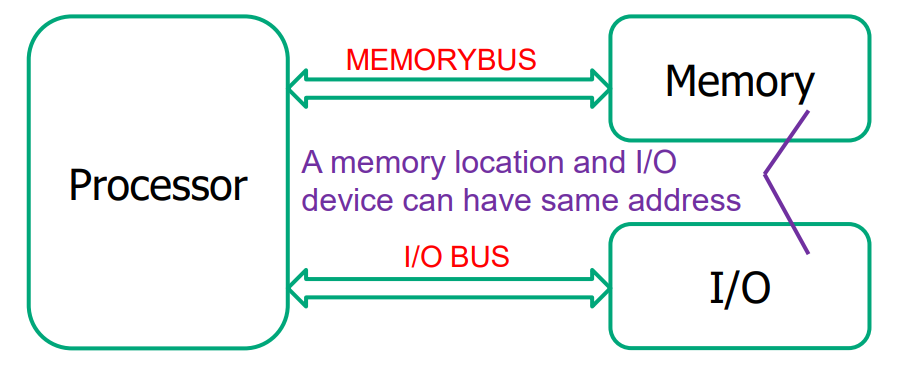<figcaption></figcaption></figure>

Because the address space for the Memory and the I/O are separated, the processor cannot use standard "Move" or "Load" instructions to access peripherals. It must use dedicated instructions (like `IN` and `OUT` on Intel x86 chips) specifically designed for I/O.

* Pros:
  * The memory can use **full range of addresses**
  * Simpler software because I/O code is clearly distinguishable from memory code
* Cons:
  * It is not compliant with the RISC philosophy (which prefers simplified, uniform Load/Store instructions for everything).
  * Requires extra physical pins on the CPU package to manage the distinction.

### Memory-Mapped I/O

A portion of the **address space** is dedicated to **I/O devices** rather than memory. For example, suppose that **physical addresses** in the range `0x20000000` to `0x20FFFFFF` are used for I/O. Each **I/O device** is assigned one or more memory addresses in this range.

* A **store** (`sw`) to the specified address sends data to the device.
* A **load** (`lw`) receives data from the device.&#x20;

This method of communicating with **I/O devices** is called **memory-mapped I/O**.


Software that communicates with an **I/O device** is called a **device driver**. For example, you might have downloaded or installed device drivers for your printer or other I/O device.


#### Hardware

In a system with **memory-mapped I/O**, a **load** or **store** may access either memory or an **I/O device**. The following figure shows the hardware needed to support two memory-mapped I/O devices.

<figure>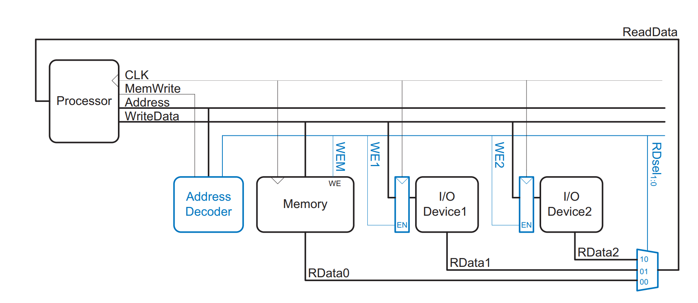<figcaption><p> Support hardware for memory-mapped I/O</p></figcaption></figure>

An **address decoder** determines which device communicates with the processor. It uses the **Address** and **MemWrite** signals to generate control signals for the rest of the hardware. The **ReadData multiplexer** selects between memory and the various **I/O devices**. **Write-enabled registers** hold the values written to the **I/O devices**.


This is technically the working principle of our [`Wrapper.v`](../../lab/lab-02-single-cylce-rv-processor.md#purpose-of-wrapper) used in our Labs!


While using MMIO may reduce the maximum possible memory as I/O devies will eat into the address space, this is not an issue for the 64-bit systems, but an issue for the 32-bit systems.

#### Software Complications in MMIO



#### Cache Issues

I/O devices and the CPU cache often disagree on what constitutes "truth." The cache wants to hold onto data to be fast, but I/O needs data to move immediately. This may cause the following problem:

* **Write buffering**: If you write to a peripheral (e.g., to turn on an LED), a "Write-Back" cache might hold that data in the cache and not send it to the actual hardware immediately. The LED stays off.
* **Stale Reads**: If you read a status register, the cache might give you an old value it stored 100 cycles ago, rather than the current state of the hardware.

To solve thos problem, we need to

* **Flush (After Writing)**: Software must force the cache to write data to the physical hardware immediately.
* **Invalidate (Before Reading)**: Software must force the cache to dump its stored value so it is forced to fetch a fresh value from the hardware.
* **Non-Cacheable Memory**: The most efficient method is if the cache controller allows you to designate the specific I/O address range as "non-cacheable."



#### Compiler Optimization (The `volatile` keyword)

Compilers try to be "smart" and remove "redundant" code, but this breaks I/O interactions and causes the following this problem: In standard memory, if you write to an address and immediately read it back, the value is the same. The compiler knows this and will optimize the read away.


```c
*UART_ADDR = var1; // Write to transmitter
var2 = *UART_ADDR; // Read from receiver
```


Without using `volatile`, the compiler will optimize it into the following code,

```c
var2 = var1;
```

This is not the hardward reality as the `UART_ADDR` might be a **Transmit Register** when we write to it, but a **Receive Register** when we read from it. They share the same address but are physically different hardware.

To solve this, we should use the `volatile` keyword. It tells the compiler: "The value at this address can change at any time, outside of your control. Do not optimize this code. Always read from memory."



#### Instruction Ordering

Even if we use `volatile` to stop the _compiler_ from reordering code, high-performance CPUs (hardware) might reorder instructions dynamically to run faster. In an [Out-of-Order processor](../lec-06-advanced-processor.md#out-of-order-processor) (OoO), the processor might see two instructions that look independent and swap them to maximize pipeline usage.


```c
*UART_ADDR = var1;          // 1. Write data
var2 = *UART_OUT_READY;     // 2. Check status
```


The CPU might decide to execute line 2 before line 1 because the resources for line 2 are available, causing us to check the status before the transaction has ever started. This is troublesome and not what we want!


The `volatile` keyword only prevents **compiler reordering**, but it does NOT stop **Processor (Hardware)** reordering.


To solve this, we need to use the special instructions which are called the **memory barriers** (like `fence()` in RISC-V or `mb()` in ARM). This creates a wall: "All operations before the fence must complete before any operation after the fence can begin."&#x20;


```riscv
# Write data to peripheral (Predecessor: Write)
sw    t1, 0(t0) 
# Barrier: Finish all Writes (w) before starting next Reads (r)
fence w, r  
# Read status register (Successor: Read)
lw    t2, 4(t0) 
```




#### Atomicity

When we need to update just _one specific bit_ in a register (like turning on one LED without affecting others), we cannot just write to that bit directly. We must perform a Read-Modify-Write sequence. This sequence takes multiple instructions. If an **interrupt** occurs in the middle of this sequence and modifies the same register, your main program will unknowingly overwrite the interrupt's changes when it resumes.


```c
tmp = *LED_ADDR;        // 1. Read current state (e.g., 00010100)
tmp = tmp | 00100000;   // 2. Modify local copy
// <--- INTERRUPT HAPPENS HERE (Handler changes LEDs to 11111111)
*LED_ADDR = tmp;        // 3. Write back (Writes 00110100)
```


The changes made by the interrupt handler (setting LEDs to all 1s) are completely destroyed because the main program overwrites them with its old, stale value.

To solve this, we should use the **Atomic Instructions** (supported by the RISC-V 'A' extension) like `amoor.w`. It performs the entire Read-Modify-Write sequence as a single, non-preemptible step. The hardware guarantees that no interrupt can happen in the middle of this instruction.


```riscv
li      t0, 0xC008A000   # Load LED_ADDR into t0
li      t1, 0x00100000   # Load bitmask (00100000) into t1

# --- ATOMIC FIX ---
# Syntax: amoor.w rd, rs2, (rs1)
# Action: *rs1 = *rs1 | rs2 (Atomically)
amoor.w zero, t1, (t0)   # destination 'zero' discards the old value
                         # t1 is the value to OR
                         # (t0) is the address
```




## Data Transfer Models

In this part, we study how data is actually transferred from the system's memory to the peripherals, and vice versa. We have already seen this part in [CG2111A Studio 2](https://app.gitbook.com/s/o4X8QvQZjJ2YsPgYhJDb/studio/studio-2-interrupts#three-modes-of-accessing-i-o), now we just refresh our memory a bit by introducing some new terms!

### Programmed I/O

In programmed I/O, the Processor acts as a "micromanager." It is personally responsible for moving every single byte of data. Its working mechanism is:

1. The processor executes a loop of **Load and Store instructions**.
2. It reads a piece of data from the peripheral register into a CPU register, then writes it to RAM (or vice versa).

This mechanism can be initiated by [**Polling**](https://app.gitbook.com/s/o4X8QvQZjJ2YsPgYhJDb/studio/studio-2-interrupts#polling) (checking repeatedly if the device is ready) or by an [**Interrupt**](https://app.gitbook.com/s/o4X8QvQZjJ2YsPgYhJDb/studio/studio-2-interrupts#interrupts-1). However, the cons is that it is inefficient for large data transfers (bulk transfers) because the processor is tied up moving data and cannot do any other useful work.

### Direct Memory Access

To solve the problem caused by the [#programmed-i-o](lec-08a-embedded-i-o-systems.md#programmed-i-o "mention"), we introduce/recap the third way to access I/O, which is called **Direct Memory Access (DMA)**. In this way, The Processor acts as a "delegator." It hires a specialized assistant (the **DMA Controller**) to handle the heavy lifting of data transfer. Its working mechanism is:

1. **Setup**: The CPU (OS) configures the DMA Controller by writing to its registers: **Source Address, Destination Address,** and **Number of Bytes** to transfer.
2. **Delegation**: The CPU assigns the DMA Controller as the **Bus Master.**
3. **Transfer**: The DMA Controller takes over the bus, generating addresses and managing signals to move data directly between Memory and the Peripheral.
4. **Parallel Work**: While DMA moves data, the **CPU is free** to perform other computations (as long as they use data in the cache/registers and don't need the system bus).
5. **Completion**: When finished, the DMA Controller raises an **Interrupt** to tell the CPU the job is done.

<figure>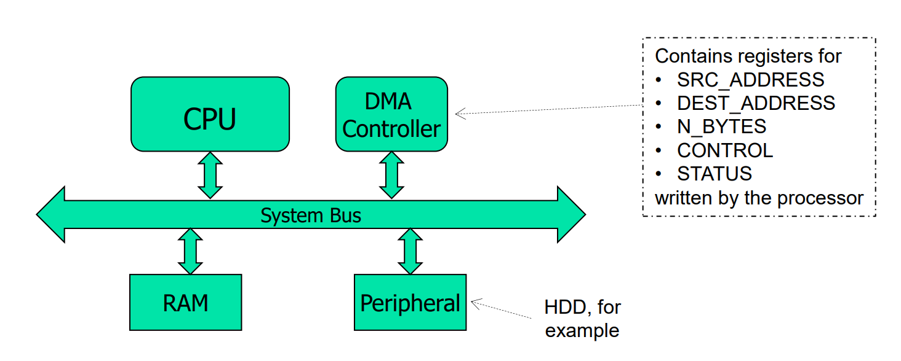<figcaption></figcaption></figure>

## Communication Protocols

The first time we have met the communication protocols is in [CG2111A Studio 9](https://app.gitbook.com/s/o4X8QvQZjJ2YsPgYhJDb/studio/studio-9-serial-communication), where we study the U(S)ART communication in detail. In this section, we will learn more interesting stuff!

### Transmission Width

Communication protocols can be classifed into two big categories using its **transmission width** characteristic:

1. **Parallel protocols**: use a number of parallel wires to transmit bits in parallel
   1. Examples: Processor-to-memory busses, AXI, AXI Stream, ild (prd-2005) protocols such as PCI, IDE, printer port
2. **Serial protocols**: data is sent through a single wire, one bit at a time
   1. Examples: Serial ATA (SATA), PCIe, I<sup>2</sup>C, SPI, UART, CAN.

<figure>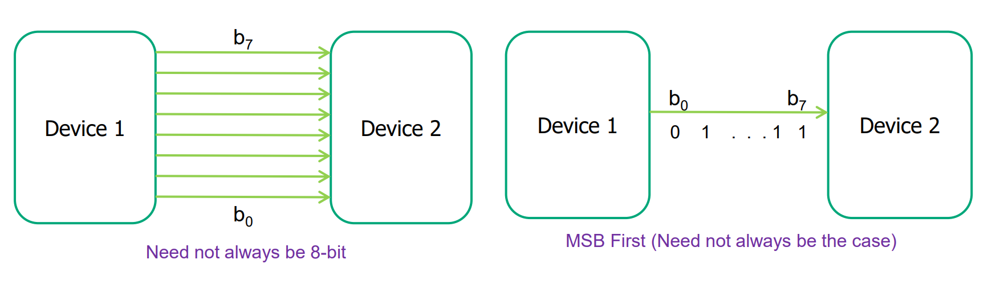<figcaption></figcaption></figure>


Device 1 is the **transmitter** and device 2 is the **receiver**.


#### Bus Skew and Cross Talk

Parallel protocols are used more often in **high-speed**, **low distance** transimission. This will have two main issues:

1. **Bus Skew**: Electrical signals travel at slightly different speeds on each wire.
2. **Cross-talk**: Signals on adjacent wires interfere with each other electromagnetically.

<figure>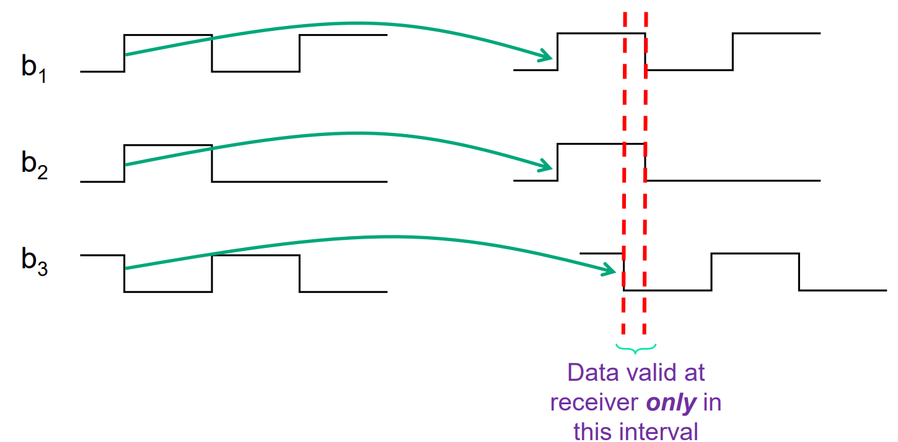<figcaption></figcaption></figure>

### Timing

A communication protocol can also be classified into two categories based on its **timing** characteristic:

#### **Synchronous**

In a synchronous protocol, one of the wires carries Clock. This allows the transmitter and receiver to have a **common time reference**. This kind of protocol is **faster**, but suffers from the same issue as the parallel protocols (cross-talk, bus skew etc).

<figure>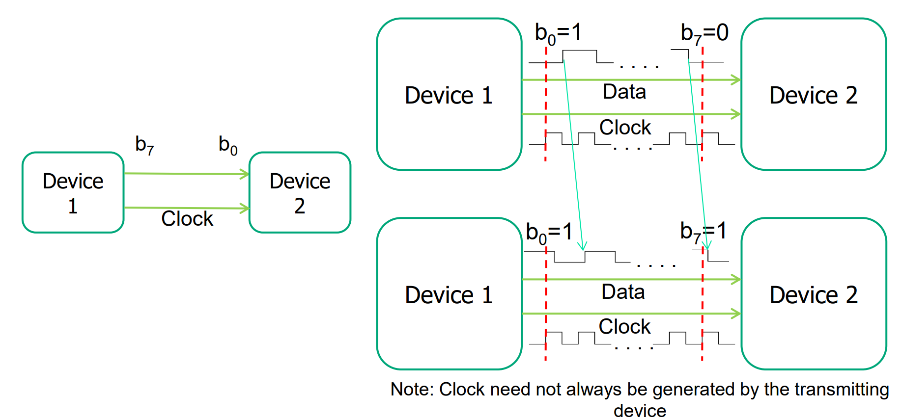<figcaption></figcaption></figure>

The examples for the **synchronous protocols** are **SPI, I**<sup>**2**</sup>**C, AXI,** and **AXI Stream**.

#### **Asynchronous**

In the asynchronous protocols, only **data** is transmitted, no Clock. As a result, the receiver needs to recover timing info from data, making this kind of protocol **slower** and has **more complicated hardware**.

<figure>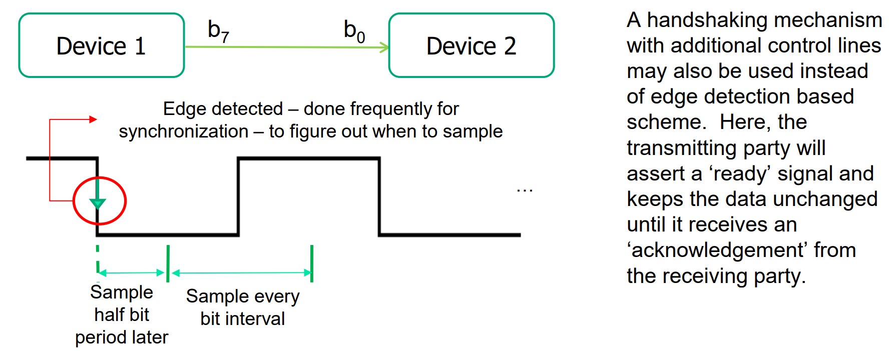<figcaption></figcaption></figure>

The examples for the **asynchronous protocols** are **UART, USB,** and **CAN**.

### Topology

A communication protocol can also be categorized into two groups based on its **topology** characteristic

* **Bus-based**: A number of devices are connected to the **same set** of wires (called a bus) and each device has a **unique address**.
  * Examples are **I**<sup>**2**</sup>**C, SPI, USB, AXI,** and **CAN**.
* **Point-to-point**: two devices have a dedicated link between them, so **no addressing** is needed.
  * Examples are **UART** and **AXI Stream**.

<figure>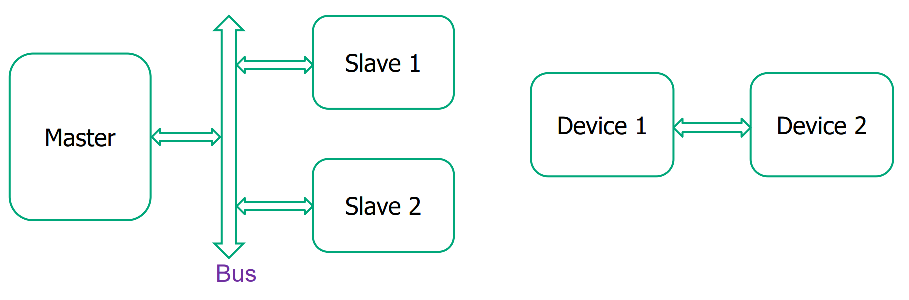<figcaption></figcaption></figure>

### Hierarchy

Based on the protocol's **hierarchy** property, the communication protocols can be divided into:

1. **Master-slave**: only a master device can initiate communication, decides which slave should respond, and (in some synchronous protocols) generates the clock.
   1. Examples are **I**<sup>**2**</sup>**C, SPI, USB, AXI,** and **AXI Stream**.
2. **Peer-to-peer**: Any device can initiate communication.
   1. Example is **Ethernet** (configuration dependent)

<figure>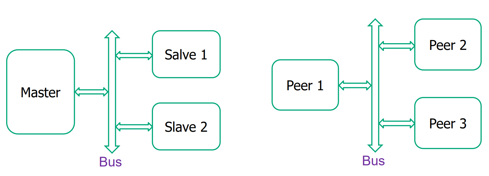<figcaption></figcaption></figure>

### Directionality

A communication protocol can be classified into three groups based on its **directionality** property

1. **Simplex:** single, unidirectional link, one-way interaction
   1. Example is the connection between processor and LEDs/switches, AXI Stream
2. **Half-duplex**: One bi-directional link, devices take turns to transmit and receive
   1. Examples are **I**<sup>**2**</sup>**C** and **USB 2.0**.
3. **Full-duplex:** At least two links, can transmit and receive at the same time.
   1. Examples are **SPI, UART**, and **USB 3.x**.

<figure>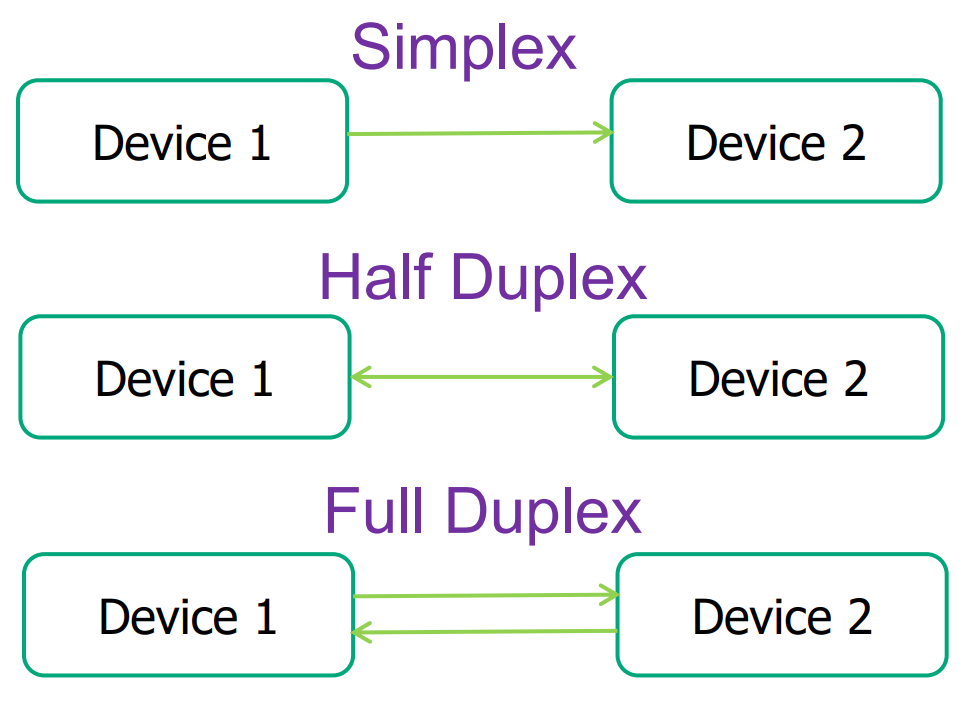<figcaption></figcaption></figure>

### Addressing

Based on the **addressing mechanism** of the communication protocols, they can be divided into:

1. **In-band**: address of the device being accessed (to select the device), as well as the data (read from or written to the device) are sent through the **same bus**.
   1. Examples are **I**<sup>**2**</sup>**C** and **USB**.
2. **Out-of-band**: **separate address bus**, a decoder enables (activates) the device.
   1. Example is **SPI**.

<figure>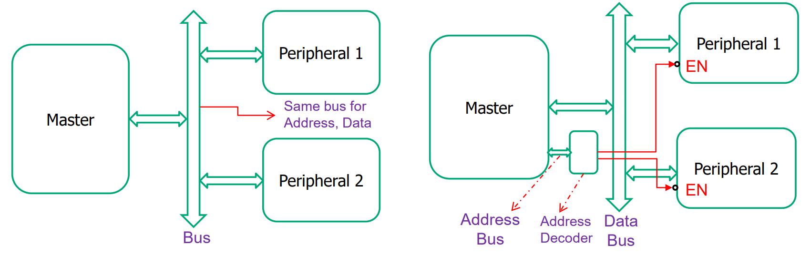<figcaption></figcaption></figure>

### Summary

The following table summarizes each protocol and its property

<table><thead><tr><th width="100">Protocol</th><th width="100">Transmission Width</th><th width="100">Timing</th><th width="100">Topology</th><th width="100">Hierarchy</th><th width="100">Directionality</th><th width="100">Addressing Mechanis</th></tr></thead><tbody><tr><td>UART</td><td>Serial</td><td>Asynchronous</td><td>Point-to-Point</td><td><em>Not specified</em></td><td>Full-Duplex</td><td>None needed (Point-to-Point)</td></tr><tr><td>I2C</td><td>Serial</td><td>Synchronous</td><td>Bus-based</td><td>Master-Slave</td><td>Half-Duplex</td><td>In-band</td></tr><tr><td>SPI</td><td>Serial</td><td>Synchronous</td><td>Bus-based</td><td>Master-Slave</td><td>Full-Duplex</td><td>Out-of-band (Decoder/CS) </td></tr><tr><td>USB</td><td>Serial</td><td>Asynchronous</td><td>Bus-based</td><td>Master-Slave</td><td><p>2.0: Half-Duplex</p><p></p><p>3.x: Full-Duplex</p></td><td>In-band</td></tr><tr><td>AXI</td><td>Parallel</td><td>Synchronous</td><td>Bus-based</td><td>Master-Slave</td><td><em>Not specified</em></td><td><em>Not specified</em></td></tr><tr><td>AXI Stream</td><td>Parallel</td><td>Synchronous</td><td>Point-to-Point</td><td>Master-Slave</td><td>Simplex</td><td>None needed (Point-to-Point)</td></tr><tr><td>CAN</td><td>Serial</td><td>Asynchronous</td><td>Bus-based</td><td><em>Not specified</em></td><td><em>Not specified</em></td><td><em>Not specified</em></td></tr><tr><td>Ethernet</td><td><em>Not specified</em></td><td><em>Not specified</em></td><td><em>Not specified</em></td><td>Peer-to-Peer</td><td><em>Not specified</em></td><td><em>Not specified</em></td></tr><tr><td>PCIe</td><td>Serial</td><td><em>Not specified</em></td><td><em>Not specified</em></td><td><em>Not specified</em></td><td><em>Not specified</em></td><td><em>Not specified</em></td></tr><tr><td>SATA</td><td>Serial</td><td><em>Not specified</em></td><td><em>Not specified</em></td><td><em>Not specified</em></td><td><em>Not specified</em></td><td><em>Not specified</em></td></tr></tbody></table>
