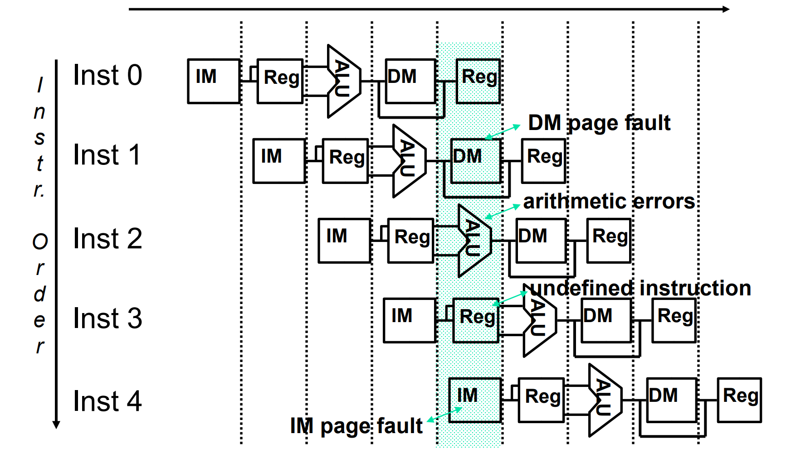
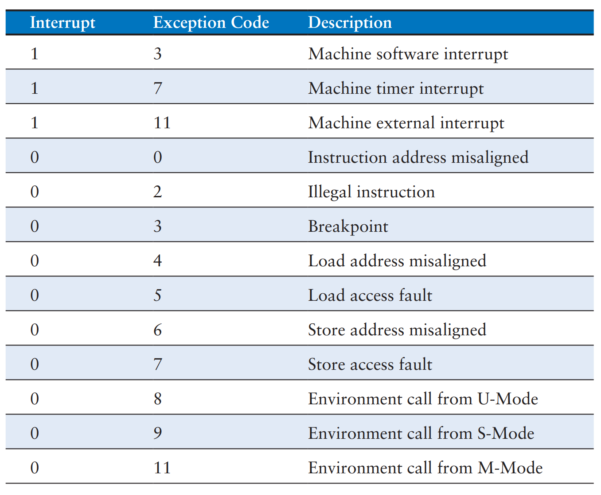

# Lec 08b - Exceptions

## Introduction

An **exception** is like an unscheduled function call caused by an **event** in hardware or software.&#x20;

### Dealing with Exceptions

An exception is treated as a form of [Control Hazard](../lec-05-the-pipelined-processor.md#control-hazards). When an exception occurs, the hardware pipeline must immediately change its flow. The sequence is as follows:

1. **Stop Execution**: The pipeline stops executing the offending instruction in midstream.
2. **Complete Predecessors**: Allow all instructions _prior_ to the exception to complete their execution.
3. **Flush Successors: Flush** (discard) all instructions following the offending instruction that are currently in the pipeline.
4. **Record State**:
   * Set a status register to show the cause (e.g., `mcause`).
   * Save the address of the offending/interrupted instruction (e.g., `mepc`).
5. **Transfer Control**: Jump to the prearranged exception handler address (e.g., the address found in `mtvec`).

### Two Types of Exceptions

Based on the source of the cause (either hardware or software), the exceptions can be further divided into two categories:



#### Interrupts

A **hardware** exception triggered by an input/output (I/O) device such as a keyboard is often called an **interrupt.**&#x20;

* **Asynchronous**: They are **asynchronous** to program execution, meaning they are caused by **external events** unrelated to the specific instruction currently running.
* **Examples & Pipeline Stage**: Examples include an **I/O service request** or a **hardware malfunction**. Because these are external, they can occur during **any** stage of the pipeline.
* **Pipeline Handling**: Because the current instruction isn't the cause of the issue, the processor can allow the instructions currently active in the pipeline to **complete** before passing control to the OS interrupt handler. The program is simply suspended and later resumed.
* **Register Status**: In the `mcause` register, bit 31 is set to 0 (`mcause[31] = 0`), resulting in a positive value. (See Table 6.6 in below)



#### Traps

Alternatively, the program may encounter an error condition caused by the **software**, such as an undefined instruction. Software exceptions are sometimes called **traps** or **exceptions** (in CG3207).

* **Synchronous**: These are **synchronous** to program execution, caused by **internal events** directly related to the instruction being executed.
* **Examples & Pipeline Stage**: The stage where these occur depends on the specific error:
  * **Fetch (F)** or Memory **(M) stages**: TLB or page faults.
  * **Decode (D) stage**: Undefined instruction.
  * **Execution (E) stage**: Arithmetic error.
* **Pipeline Handling**: The condition must be remedied by the handler for _that specific_ instruction. Therefore, the processor must stop the offending instruction **midstream** in the pipeline and immediately pass control to the OS trap handler.
* **Outcome**: After handling, the offending instruction may be retried (e.g., after a page fault is fixed), simulated (if the hardware doesn't support the instruction), or the program may be aborted.
* **Register Status**: In the `mcause` register, bit 31 is set to 1 (`mcause[31] = 1`), resulting in a negative value.



A crucial aspect of pipeline design is recognizing that **multiple exceptions can occur simultaneously in a single clock cycle**. Because different instructions occupy different stages of the pipeline at the same time, they might all encounter error conditions simultaneously.

The image below illustrates a scenario where instructions 1, 2, 3, and 4 all trigger exceptions in the same clock cycle (the highlighted vertical region).

<figure><figcaption></figcaption></figure>

The processor cannot handle four exceptions at once. The hardware must prioritize based on program order. The rule is: The earliest instruction in the program order is interrupted first.

In the example shown, Inst 1 is the earliest instruction in the sequence. Therefore, its Data Memory page fault will be handled first, and the subsequent instructions (Inst 2, 3, and 4) will be flushed from the pipeline.

## Exception Handler

In this section, we will discuss exceptions when running in M-mode. Exceptions that occur at other levels are similar but use registers associated with that mode.

### Exception Handling Software

**Exception handlers** use four special-purpose registers, called **control and status registers (CSRs)**, to handle an **exception**:



#### `mtvec`

The **machine trap-vector base-address register** (`mtvec`) holds the address of the **exception handler** code. The last two bits (`[1:0]`) indicate the exception handling modes: **direct** or **vectored**.

1. In **direct** mode, all exceptions branch to same address, that is, the base address encoded in bits `[31:2]` of `mtvec`.
2. In **vectored** mode, exceptions branch to an _offset_ from the base address, depending on the cause of the exception.



#### `mcause`

**The machine cause register** (`mcause`) stores a code indicating the specific reason the exception occurred. When the handler reads this register, it determines whether the trap was caused by an interrupt (e.g., timer) or an exception (e.g., illegal instruction) so it can respond appropriately



#### `mepc`

The **machine exception PC register** (`mepc`) stores the address of the instruction that was executing when the exception occurred. It serves as the return address for the handler; executing the `mret` instruction copies the value in `mepc` back to the program counter (PC), allowing execution to resume exactly where it left off (analogous to how `ra` stores the return address for a `jal` instruction).



#### `mscratch`

The **machine scratch register** (`mscratch`) holds a pointer to a dedicated memory area (a "scratchpad") used to save the state of the program registers (`x1`–`x31`). Since the exception handler needs to use these registers to do its work, it first stores their current values into the memory pointed to by `mscratch` to preserve the interrupted program's context.



When an exception occurs, the processor records the cause of an exception in `mcause` (see the following table), stores the **PC** of the excepting instruction in `mepc` and jumps to the exception handler at the address of the preconfigured in `mtvec`.

<figure><figcaption><p>Table 6.6 Common exception cause encodings</p></figcaption></figure>

After jumping to the address in `mtvec`, the **exception handler** reads the `mcause` register to examine what caused the **exception** and responds appropriately (e.g., by reading the keyboard on a **hardware interrupt**). It then either aborts the program or returns to the program by executing the **mret** (**machine exception return**) **instruction**, that jumps to the address in `mepc`. **Exception handlers** must use program registers (`x1`−`x31`) to handle exceptions, so they use the memory pointed to by `mscratch` to store and restore these registers.

<details>

<summary>CSRs for other modes</summary>

**Exception-related registers** are specific to the **operating mode**. **M-mode** registers are `mtvec`, `mepc`, `mcause`, and `mscratch`, and **S-mode** registers are `sepc`, `scause`, and `stvec`, `sscratch`. **H-mode** also has its own registers. Separate **exception registers** dedicated to each mode provide hardware support for multiple **privilege levels**.

</details>

### Exception Handling Hardware

While the software handler manages the logic, the hardware must perform specific physical actions to transfer control safely.



#### Pipeline Flushing

When an exception occurs, the hardware must **flush** the offending instruction and all instructions following it in the pipeline to prevent invalid state changes. (Note: In some specific interrupt cases, a full flush might not be strictly required, but is generally performed).



#### PC Loading Mechanism

The hardware needs a mechanism to forcibly load the Program Counter (PC) with the exception handler address.

* Implementation: This is typically achieved by expanding the PC Input Multiplexer (Mux).
* Control: A control unit signal (e.g., `PCSrc`) selects the "Exception Handler Address" input instead of the standard `PC+4` or Branch Target Address.

<figure><figcaption></figcaption></figure>



#### Hardware Trade-offs

We have seen that the last two bits of `mtvec` will indicate the exception handling mode. The choice between Direct and Vectored modes (set in `mtvec`) involves a hardware/software trade-off:

* **Direct Mode**:
  * _Hardware:_ Simpler (Fixed target address).
  * _Software:_ More complicated/slower. The handler must read `mcause` to determine the source and branch accordingly.
  * _RISC-V Note:_ Synchronous exceptions in RISC-V always use Direct mode (unlike ARM).
* **Vectored Mode**:
  * _Hardware:_ More complicated. Requires logic to calculate the target address (`Base + Offset`) based on the interrupt ID.
  * _Software:_ Simpler and faster latency. The hardware jumps directly to the specific code for that interrupt.



#### Register Preservation

RISC-V hardware is designed to be simple ("lean"), placing more burden on the software compared to architectures like ARM:

* **No Automatic Saving**: RISC-V hardware does **not** automatically save caller-saved registers to the stack (ARM often does). This requires explicit compiler support or inline assembly in the handler.
* **No Banked Registers**: RISC-V does **not** use "banked" registers (separate physical copies of registers like SP for exception modes). The handler shares the same register file as the user program, necessitating the use of `mscratch` to safely save context without corruption.



#### External Interrupt Controllers

Handling interrupts becomes complicated when a processor has many different sources (e.g., timer, UART, GPIO).

* To manage this, systems include a separate hardware unit called an **Interrupt Controller** tightly coupled to the processor.
* It handles enabling/disabling specific interrupts and prioritizing them.
* _Example:_ The **PLIC** (Platform-Level Interrupt Controller) in RISC-V or NVIC in ARM.



## Execution Modes and Privilege Levels

A **RISC-V** processor can operate in one of several **execution modes** with different **privilege levels**. **Privilege levels** dictate what instructions can be executed and what memory can be accessed. There are three main RISC-V privilege levels and one experimental privilege level. The privilege for each mode is M-mode > H-mode > S-mode > U-mode.



#### Machine Mode (M-mode)

Machine mode (M-mode) is the highest privilege level and the only mandatory mode (always available). It has full access to the system, including all physical memory and all CSRs.

* **Use Case**: Intended for low-level firmware (e.g., bootloaders, security monitors) rather than the main OS. It controls hardware initialization and system-wide configuration.
* **Registers**: Accesses all CSRs including `mstatus`, `mcause`, `mepc`, and `mtvec`.
* **Delegation**: M-mode can delegate specific exceptions and interrupts to Supervisor mode using the `medeleg` and `mideleg` registers, allowing the OS to handle them directly without M-mode intervention.
* **Return**: The `mret` instruction is used to return to a previous privilege level (M, S, or U). The target mode is determined by the MPP (Machine Previous Privilege) field in the `mstatus` register.



#### Superviser Mode (S-mode)

The **OS** runs in Supervisor mode (S-mode), providing a balance of access and restriction.

* **Use Case**: Manages system resources (memory, I/O) for user processes while being restricted from direct machine-level hardware manipulation.
* **Virtual Memory**: Uses the `satp` register to hold the page table address, enabling virtual memory management.
* **Registers**: Uses S-mode specific CSRs (`sstatus`, `scause`, `sepc`) which are restricted equivalents of M-mode registers.
* **Transitions**: An `ecall` executed here causes an M-mode exception (transitioning up to M-mode). The `sret` instruction is used to return to the privilege level (S or U) where the exception occurred.
* **Priority**: S-mode interrupts/exceptions generally have lower priority than M-mode.



#### User Mode (U-mode)

User applications that run on top of an **OS** typically run in **user mode (U-mode)**, the lowest privilege level. User programs do not have access to **privileged registers** or memory locations reserved for the OS.

* **Use Case**: Executes unprivileged applications in a **sandboxed environment**. This isolates programs from critical system components to enhance security and stability.
* **Restrictions**: U-mode has very limited access to CSRs and cannot directly handle hardware interrupts. Attempts to write to non-accessible registers trigger an **illegal instruction exception** (which escalates to M-mode or S-mode).
* **System Calls**: U-mode uses the `ecall` instruction to request services from the OS (running in S-mode).
* **Memory**: Uses page tables managed by S-mode to restrict access to specific memory regions ([memory protection](../../textbook/memory-systems.md#memory-protection)).



#### Hypervisor mode (H-mode)

An intermediate privilege level situated between M-mode and S-mode, intended for virtualization.

* **Function**: It allows a Type-1 Hypervisor to run multiple "Guest Operating Systems." The Guest OS thinks it is running in S-mode, but H-mode translates its requests and isolates different guests from each other.



The different modes keep the key state from being corrupted. So, how do these modes work together to create a secure system?



#### Privilege Transitions

The processor changes modes strictly through defined events to ensure security:

* **Escalating Privilege** (Moving Up): A program cannot simply "choose" to upgrade its mode. It must trigger an Exception or an Interrupt.
  * _Example:_ A User program needs to write to a file. It executes `ecall` (Environment Call). This triggers an exception, effectively "jumping" the processor into S-mode (OS) to handle the request.
* **Dropping Privilege** (Moving Down): The higher-privileged software returns control using specific return instructions.
  * _Example:_ The OS finishes writing the file. It executes `sret` (Supervisor Return), which restores the PC and drops the privilege level back to U-mode so the app can continue.



#### Isolation & Traps

The hierarchy prevents crashes in one program from killing the whole system.

* If a User program tries to access memory it doesn't own (e.g., the OS kernel memory), the hardware triggers a **Page Fault**.
* This fault is a **Trap** that pauses the user program and hands control to the OS (S-mode).
* The OS sees the illegal attempt and kills _only_ that specific user process, leaving the rest of the system running smoothly.



## Exception-Related Instructions

**Exception handlers** use special instructions to deal with **exceptions**. These instructions are called **privileged instructions** because they access **CSRs**. They are part of the base **RV32I** instruction set. The `mepc` and `mcause` registers are not part of the **RISC-V** program registers (`x1`−`x31`), so the **exception handler** must move these special-purpose (**CSR**) registers into the program registers to read and operate on them. **RISC-V** uses three instructions to read, write, or both read and write **CSRs**:

* `csrr` (read CSR),
* `csrw` (write CSR), and
* `csrrw` (read/write CSR).

For example,

1. `csrr t1, mcause` reads the value in `mcause` into `t1`;
2. `csrw mepc, t2` writes the value in `t2` into `mepc`; and
3. `csrrw t1, mscratch, t0` simultaneously reads the value in `mscratch` into `t1` and writes the value in `t0` into `mscratch`.


`csrrw` is an actual **RISC-V** instruction, but `csrr` and `csrw` are **pseudoinstructions**. `csrr` is implemented as `csrrs rd, csr, x0` and `csrw` as `csrrw x0, csr, rs`.


## Exception Handling Summary

In summary, when a processor detects an **exception**, it:

1. Jumps to the **exception handler** address held in `mtvec`.
2. The **exception handler** saves registers on a small stack pointed to by `mscratch` and then uses `csrr` (read **CSR**) to look at the cause of the exception (encoded in `mcause`) and respond accordingly.
3. When the handler is finished, it optionally increments `mepc` by 4, restores registers from memory and either aborts the program or returns to the user code using the `mret` instruction, which jumps to the address held in `mepc`.

<details>

<summary>Self-Diagnostic Quiz</summary>

Write an exception handler for dealing with the following two exceptions: illegal instruction (`mcause` = 2) and load address misaligned (`mcause` = 4). If an illegal instruction occurs, the program should simply continue executing after the illegal instruction. Upon a load address misaligned exception, the program should abort. If any other exception occurs, the program should attempt to re-execute the instruction.

***

**Solution**. The **exception handler** begins by preserving program registers that will be overwritten. It then checks for each **exception cause** and

1. continues executing just past the excepting instruction (i.e., at `mepc` + 4) upon an **illegal instruction exception**,
2. **aborts** upon a **misaligned load address**, or
3. attempts to **re-execute** the excepting instruction (i.e., returns to `mepc`) upon any other exception.

Before returning to the program, the handler restores any registers that were overwritten. To abort the program, the handler jumps to exit code located at the `exit` label (not shown). For programs running on top of an **OS**, the `j exit` instruction may be replaced by an **environment call** (`ecall`) with the return code stored in a program register such as `a0`.


```riscv
# M-mode exception handler
# Handles:
#   - Illegal instruction (mcause = 2) -> skip the bad instruction (mepc += 4)
#   - Load address misaligned (mcause = 4) -> abort program (jump to exit)
#   - Any other exception -> re-execute the same instruction (return to original mepc)

trap_handler:
    # Save registers we will use (t0-t2) using the temporary area pointed to by mscratch
    csrrw   t0, mscratch, t0     # swap t0 with mscratch (t0 now points to temp storage)
    sw      t1, 0(t0)            # save t1
    sw      t2, 4(t0)            # save t2

    # Read the cause of the exception
    csrr    t1, mcause           # t1 = exception cause

    # Check for illegal instruction (mcause = 2)
    li      t2, 2
    beq     t1, t2, illegal_instruction

    # Check for load address misaligned (mcause = 4)
    li      t2, 4
    beq     t1, t2, misaligned_load

    # For any other exception: re-execute the faulting instruction (default behavior)
    j       restore_and_return

illegal_instruction:
    # Skip over the illegal instruction
    csrr    t2, mepc             # t2 = address of illegal instruction
    addi    t2, t2, 4            # advance to next instruction
    csrw    mepc, t2             # update return address
    j       restore_and_return

misaligned_load:
    # Fatal error → abort program
    j       exit                 # jump to exit routine (not shown)

restore_and_return:
    # Restore saved registers
    lw      t1, 0(t0)
    lw      t2, 4(t0)
    csrrw   t0, mscratch, t0     # restore original t0 and put pointer back in mscratch

    mret                         # return from exception (PC ← mepc)

# ------------------------------------------------------------------
# Program termination (can be replaced with ecall for OS environments)
exit:
    # Example: infinite loop or system shutdown
    j       exit
```


</details>
