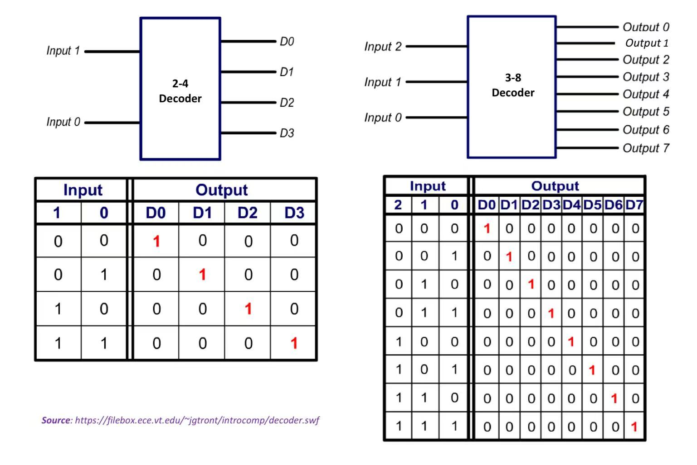
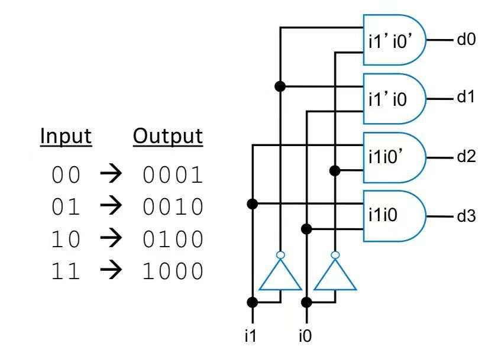
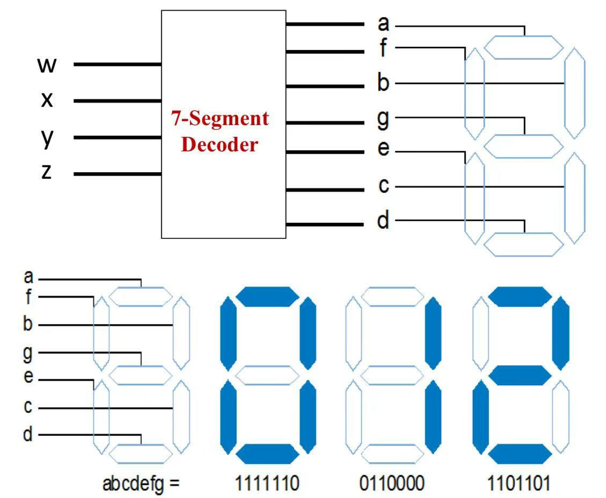
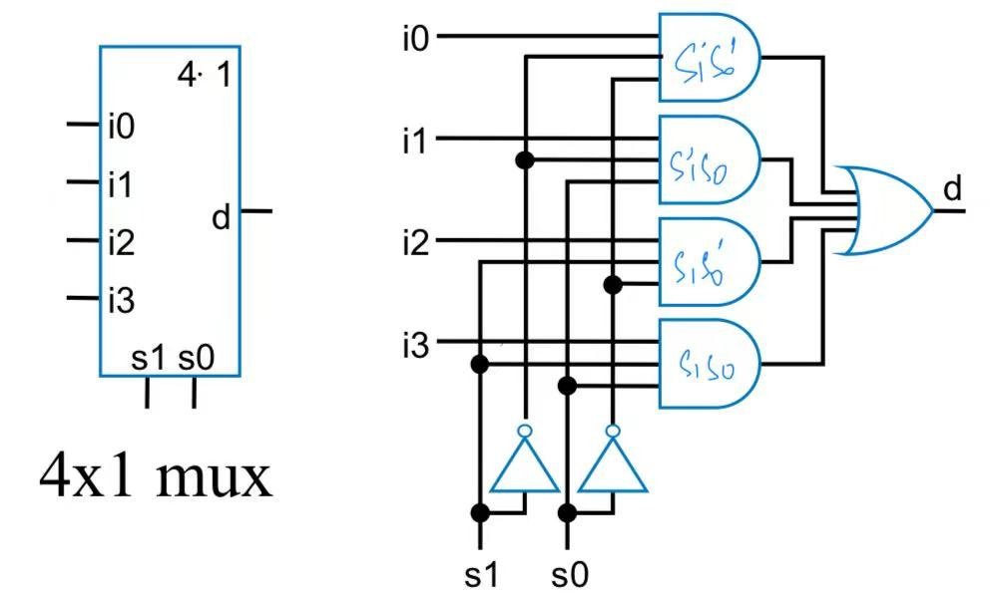
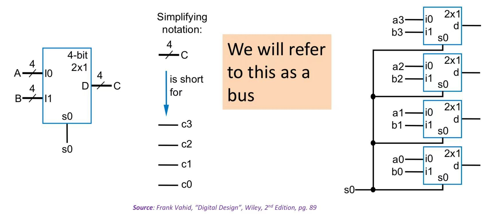
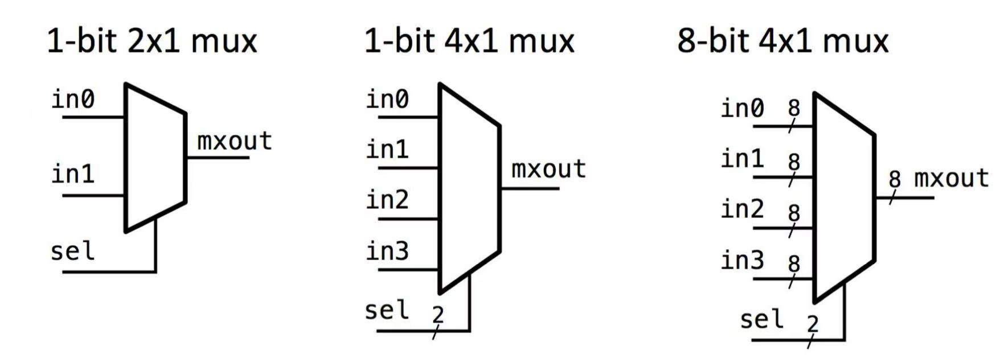
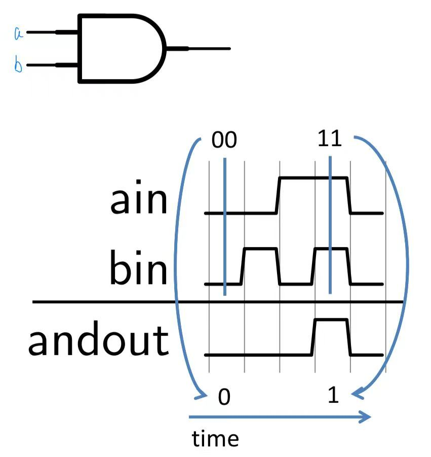

# Combinational Circuit

## Definition

A **Combinational Circuit** can provide output instantly based on the current input. It only listens for input signal and and generates output no matter what is the past input as it has no feedback or memory component.

Based on this property of caring only about the **present input**, we can use the idea of **function** in maths to vividly understand combinational circuits.

> Combinational circuits are [**functions**](#user-content-fn-1)[^1]

In the figure below, the combinational circuit actually acts as a function $$f$$. Given the same input (input signal) in whatever order, it will always generate the same output (output signal).

<figure><figcaption></figcaption></figure>

## Combinational Design Process



**Capture the function**

1. Form the truth table according to the given behavior, and write down the SOm or POM.
2. Form the equation (SOm or POM) directly by counting all the possible desired cases.



**Convert to circuit**

1. **Create equation:** First, if you used a truth table in Step 1, create equations
2. **Implement using gates**: For each output (term in the equation above), create a circuit[^2] corresponding to that output's equation.



### Example: Three 1s Pattern Detector

**Problem Statement (Behavior description)**: Detect three adjacent 1's in an 8-bit input. For example, 000**111**01 -> 1, 10110011 -> 0, 01110001 -> 1, etc.



**Capture the function**

There are 8 inputs here, and it will be too tedious if we create a truth table. So, we write the SOm directly, and it will be

$$
y=abc+bcd+cde+def+efg+fgh
$$

where  $$y$$ is the output,  $$a,b,c,d,e,f,g,h$$ describes the eight inputs



**Convert to Circuit**

1. **Create equation:** We have already create equation in step 1, and it is obviously not the **simplest standard form**. But we still can use the expression to implement the gate, it's just that it will be a bit tedious.
2. **Implement using gates**: For each output term, like $$abc$$, we will use a **AND** gate with three inputs and one output (denoted as abc on the output line). The final gate level implementation should look as follows

<figure><figcaption></figcaption></figure>



## Decoder

A decoder is a basic circuit that takes a **binary input number**, and **outputs** a corresponding **one-hot output.**


#### **Attention**

* **"One-hot"** means only **one bit** of the output is **high**, its **position** corresponds to the input value.
* Output width is always 2 to the power of input width. e.g., N-input decoder has $$2^N$$ outputs.


In general, decoders can be referred to as **n-m** decoders. e.g., 2-4 decoder, 3-8 decoder, etc.

<figure><figcaption></figcaption></figure>

### Internal Design

Based on the property of the decoder, to design a decoder, we can use **AND** gate for each output to detect input combination. e.g., the following is the internal design for a 2-4 decoder.

<figure><figcaption></figcaption></figure>

### Example: 7-Segment Decoder

A seven segment decoder is a basic circuit that maps a 4-bit binary input to a 7-bit binary output, where in the output, multiple bits can be set to **HIGH**, and each bit is connected to one LED.

<figure><figcaption></figcaption></figure>

#### Implement a 7-Segment Decoder



**Capture the Function**

Here, we form the truth table for the 7-segment decoder.

| Decimal | Input(wxyz) |  a  |  b  |  c  |  d  |  e  |  f  |  g  | abcdefg |
| ------- | :---------: | :-: | :-: | :-: | :-: | :-: | :-: | :-: | :-----: |
| 0       |     0000    |  1  |  1  |  1  |  1  |  1  |  1  |  0  | 1111110 |
| 1       |     0001    |  0  |  1  |  1  |  0  |  0  |  0  |  0  | 0110000 |
| 2       |     0010    |  1  |  1  |  0  |  1  |  1  |  0  |  1  | 1101101 |
| 3       |     0011    |  1  |  1  |  1  |  1  |  0  |  0  |  1  | 1111001 |
| 4       |     0100    |  0  |  1  |  1  |  0  |  0  |  1  |  1  | 0110011 |
| 5       |     0101    |  1  |  0  |  1  |  1  |  0  |  1  |  1  | 1011011 |
| 6       |     0110    |  1  |  0  |  1  |  1  |  1  |  1  |  1  | 1011111 |
| 7       |     0111    |  1  |  1  |  1  |  0  |  0  |  0  |  0  | 1110000 |
| 8       |     1000    |  1  |  1  |  1  |  1  |  1  |  1  |  1  | 1111111 |
| 9       |     1001    |  1  |  1  |  1  |  1  |  0  |  1  |  1  | 1111011 |


Inputs **1010 to 1111** are invalid BCD and can be treated as "don't care" or produce blank/error display depending on the design.




**Convert to Circuit**

1. **Create equation**: Here, we need to create a circuit for **each segment**, thus we should generate a K-map for each segment/output a,b,c,d,e,f,g, and then obtain the Boolean Expression for each segment/output.
2. **Implement using gates**: Nothing tricky here. Just use gates to implement out the Boolean expression for each segment.



Is 7-segment decoder a decoder?

Technically, a 7 segment decoder **cannot** be considered as a decoder because its output is **not one-hot**. In a 7 segment decoder, multiple bits in its output can be set to HIGH.

But, broadly speaking, in digital design, the term **"decoder"** is often used more broadly to mean

> A logic circuit that **translates** or **maps** an input pattern into a useful output format.

In that sense, a **7-segment decoder** "decodes" a 4-bit binary digit into **signals that drive the display segments**. So while it's not a pure one-hot decoder, it **serves a decoding function** — turning binary numbers into human-readable digits on a display.

### Notes



**In combinational circuit, each output bit has its own logic circuit**

In this 7-segment decoder example, we notice that each segment/output bit has its own **boolean expression**, a.k.a, has its own logic circuit. This is actually a very common design in **combinational circuit,** where **each output bit** is designed **independently**, using its own **Boolean expression** (derived from truth tables or K-maps).



## Multiplexer

### Definition

A multiplexer (MUX) is a device that **selects** **one of several input signals** and forwards it to a **single output line**. Thus, a multiplexer will have&#x20;

1. Several input signal lines
2. One or several select lines
3. "One" output signal line


#### Attention

* An $$n$$ **input** MUX requires a  $$\log_2(n)$$-bit **select**.
* "One" output doesn't exactly mean one-bit output, it depends on how you treat "one". e.g., one can represent one-bit, and it can also represent one pack of several bits. You will see this in the later example.


### Internal Design

The internal design of a multiplexer also uses an AND gate to "filter" each input signal according to the select line input and then combine them together using a OR gate.

<figure><figcaption>
The internal design of a 4x1 multiplexer
</figcaption></figure>

### Example: Use multiplexer to select multiple bits

This is done by combining several multiplexers together. e.g., the following is a 4bit 2x1 multiplexer, which means the two inputs are two 4-bit signal, and the one select line will select which 4-bit input will be forwarded to the output. (This is the meaning behind the "One" from above)

<figure><figcaption></figcaption></figure>

In the implementation, it is actually done by combining four 2x1 multiplexers which shares the same select line to select between A and B.

### Notes



**Multiplexer Drawing Convention**

MUXes are so common that they are often drawn using their own symbol.

<figure><figcaption></figcaption></figure>



## Timing Diagram

### Definition

Timing diagram is a diagram that shows the behavior of a circuit with **progression of time**.

### Example: AND Gate

The timing diagram for an AND gate is shown as follows,

<figure><figcaption></figcaption></figure>


#### Attention

1. A timing diagram can show **any** combination or order of input values.
2. The output at any point is calculated by looking at the input values **at that instance**. (Draw a vertical line)


[^1]: A function is a relation between a set of inputs and a set of permissible outputs with the property that each input is related to exactly one output.

[^2]: This means it should have **inputs, logic gate**, and **outputs**.
