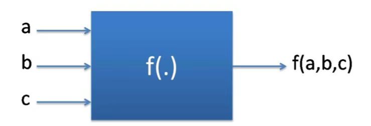
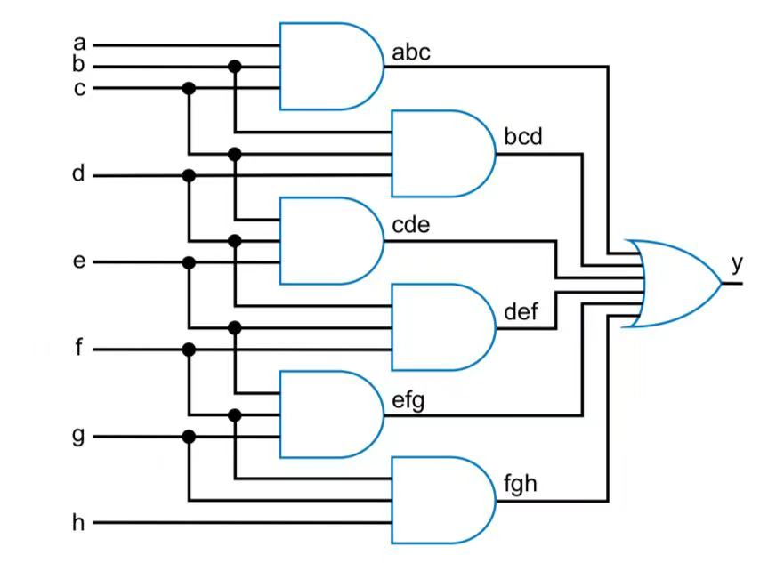

# Combinational Circuit

## Definition

A **Combinational Circuit** can provide output instantly based on the current input. It only listens for input signal and and generates output no matter what is the past input as it has no feedback or memory component.

Based on this property of caring only about the **present input**, we can use the idea of **function** in maths to vividly understand combinational circuits.

> Combinational circuits are [**functions**](#user-content-fn-1)[^1]

In the figure below, the combinational circuit actually acts as a function $$f$$. Given the same input (input signal) in whatever order, it will always generate the same output (output signal).

<figure><figcaption></figcaption></figure>

## Combinational Design Process



**Capture the function**

1. Form the truth table according to the given behavior, and write down the SOm or POM.
2. Form the equation (SOm or POM) directly by counting all the possible desired cases.



**Convert to circuit**

1. **Create equation:** First, if you used a truth table in Step 1, create equations
2. **Implement using gates**: For each output (term in the equation above), create a circuit[^2] corresponding to that output's equation.



### Example: Three 1s Pattern Detector

**Problem Statement (Behavior description)**: Detect three adjacent 1's in an 8-bit input. For example, 000**111**01 -> 1, 10110011 -> 0, 01110001 -> 1, etc.



**Capture the function**

There are 8 inputs here, and it will be too tedious if we create a truth table. So, we write the SOm directly, and it will be

$$
y=abc+bcd+cde+def+efg+fgh
$$

where  $$y$$ is the output,  $$a,b,c,d,e,f,g,h$$ describes the eight inputs



**Convert to Circuit**

1. **Create equation:** We have already create equation in step 1, and it is obviously not the **simplest standard form**. But we still can use the expression to implement the gate, it's just that it will be a bit tedious.
2. **Implement using gates**: For each output term, like $$abc$$, we will use a **AND** gate with three inputs and one output (denoted as abc on the output line). The final gate level implementation should look as follows

<figure><figcaption></figcaption></figure>



[^1]: A function is a relation between a set of inputs and a set of permissible outputs with the property that each input is related to exactly one output.

[^2]: This means it should have **inputs, logic gate**, and **outputs**.
