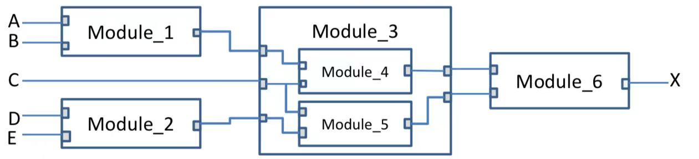
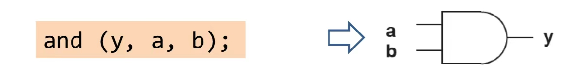
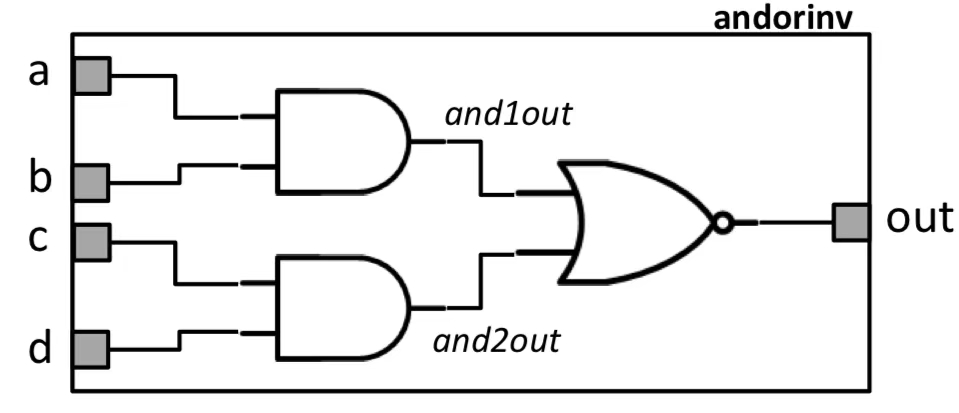
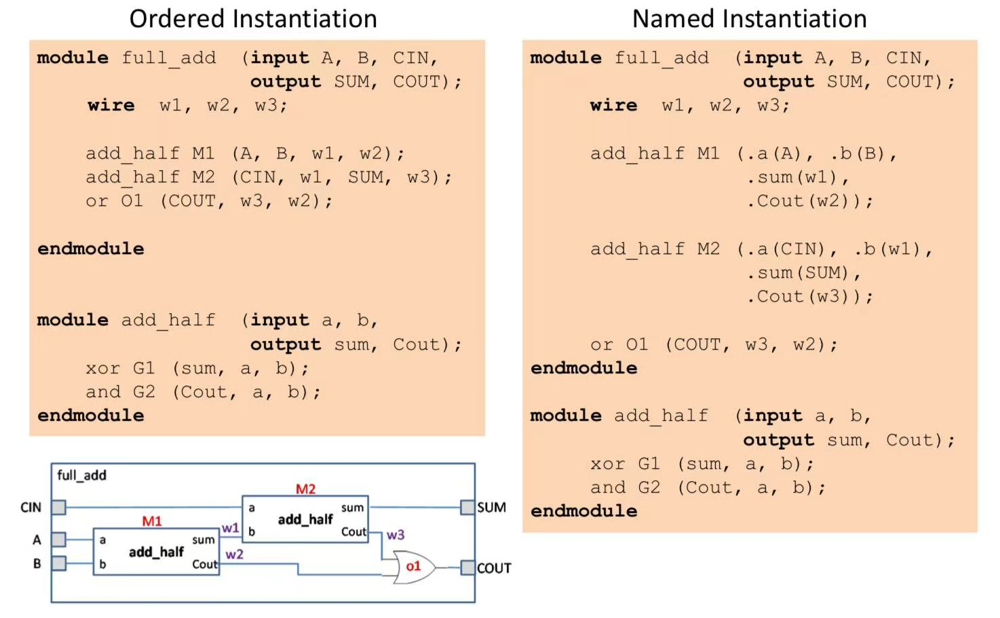
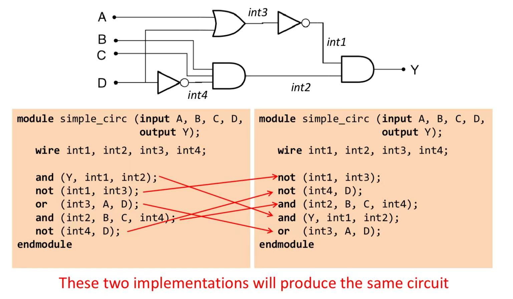
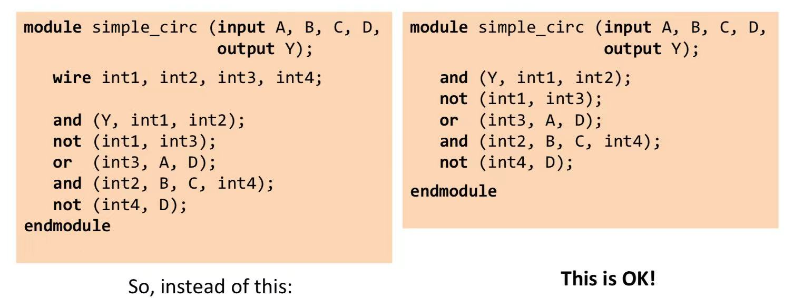

# Verilog Intro

## Hardware Description Language

**H**ardware **D**escription **L**anguage, a.k.a HDL, is a **programming-like** language that is used to describe hardware.

HDLs are **synthesized** (and optimized) to hardware primitives while software languages are sometimes **compiled** to primitive instructions.

<details>

<summary>Verilog HDL vs. Software Program</summary>

As we have studied in CS1010, a software program, like a C program will be compiled into machine code. And this machine code, which is stored as an executable, can be executed directly by the CPU.

But for HDL, things are different.

</details>

## Verilog Basics

### Modules

* In Verilog, designs are broken down into **modules**
* A **module** is a **container** that the designer can use to **encapsulate** a unit of functionality.
* Modules can contain code to describe hardware and also instances of other modules.
  * Good designs consist of sufficient (but not excessive) **levels of hierarchy**, with modules containing instances of modules, that contain instances of other modules.
* At each level in the hierarchy, a module instance is treated as a "black-box" — the internals are unknown.

<figure><figcaption></figcaption></figure>

#### Verilog Module Declaration



**Use the** `module` **keyword and a list of ports**

```verilog
module somename (port1, port2, port3);
```

The above declaration describes a module with 3 **ports**, each a single wire



**Describe the direction of ports using** `input` **and** `output`

```verilog
module somename (input port1, port2,
                 output port3);
```

The above describes a module with two inputs and one output.



`endmodule` **keyword**

The `endmodule` keyword indicates the end of statements that comprise the module description.



#### Gate-Level Primitives

Verilog provides us with basic **primitives** to model Boolean gates: `and`, `nand`, `or`, `nor`, `not`, `xor`, `xnor`.



**Gate-Level Primitives Example**

The following Verilog code represents an `and` gate with inputs connected to wires `a` and `b`, and output connected to wire `y`.

<figure><figcaption></figcaption></figure>


The [**single**](#user-content-fn-1)[^1] output is always the **first argument.**




**Wires**

We can declare **internal wires** in a module, using the `wire` keyword

```verilog
wire int_signal;
```

This creates a named (1-bit) wire that can be used to connect gates together.



**Examples with** `wire`

To describe the following circuit,

<figure><figcaption></figcaption></figure>

The HDL we write will be

```verilog
module andorinv (input a, b, c, d,
                 output out);
       wire and1out, and2out;
       
       and (and1out, a, b);
       and (and2out, c, d);
       nor (out, and1out, and2out);
endmodule
```


Note that we can also add **gate identifiers** for each gate. And in the following code, `g1`, `g2`, and `g3` are three gate identifiers.

```verilog
module andorinv (input a, b, c, d,
                 output out);
       wire and1out, and2out;
       
       and g1 (and1out, a, b);
       and g2 (and2out, c, d);
       nor g3 (out, and1out, and2out);
endmodule
```




#### Module Instantiation

In Verilog, we can use existing modules within new modules through **instantiation**.



**Ordered Instantiation**

To instantiate a module, we can use the following syntax

```verilog
add_half M1 (A, B, w1, w2);
```

where `M1` is the name of this instance, and `A`, `B`, `w1`, `w2`, are four arguments.


This kind of instantiation is called **ordered instantiation** because the order of the arguments passed matters! Thus, it is error-prone and usually not recommended.




**Named Instantiation**

During module instantiation, we can specify the parameter that the argument will be passed in explicitly. For example,

```verilog
add_half M1 (.a(A),
             .b(B),
             .sum(w1),
             .Cout(w2));
```

where `.a`, `.b`, `.sum` and `.Cout` are the name of each parameter in the definition of module `add_half`.



**Example: Implementing a full adder using two half adders**

<figure><figcaption></figcaption></figure>



### Verilog Assignments

Implementing larger circuits using individual gate, a.k.a [#gate-level-primitives](verilog-intro.md#gate-level-primitives "mention") can be tedious. For example, till now, to implement an `AND` gate, we use,

```verilog
and (y, a, b);
```

But Verilog allows us to use combinational logic **expressions** through the `assign` keyword. So, now, to implement an `AND` gate, we can use

```verilog
assign y = a & b;
```

This is called a **continuous assignment**. As it is always permanently assigned. It also allows us to assign the result of a Boolean expression to a signal.

#### Verilog Assignment Operators

| Operator    | Name                     | Result Width                     | Description                                                               |
| ----------- | ------------------------ | -------------------------------- | ------------------------------------------------------------------------- |
| `&&`        | Logical AND              | `1` or `0` (1-bit)               | Returns `1` if **both operands are non-zero**; otherwise `0`.             |
| `&`         | Bitwise AND              | Same width as the widest operand | Performs **bitwise AND** between corresponding bits.                      |
| \|\|        | Logical OR               | `1` or `0` (1-bit)               | Returns `1` if **either one of the operands is non-zero**; otherwise `0`. |
| \|          | Bitwise OR               | Same width as the widest operand | Performs **bitwise OR** between corresponding bits.                       |
| `!`         | Logical NOT              | `1` or `0` (1-bit)               | Returns `1` if operand is zero; otherwise `0`.                            |
| `~`         | Bitwise NOT (Complement) | Same width as the widest operand | Inverts every bit in the operand.                                         |
| `^`         | Bitwise XOR              | Same width as the widest operand | Performs **bitwise XOR** between operands.                                |
| `~^` / `^~` | Bitwise XNOR             | Same width as the widest operand | Performs **bitwise XNOR** (inverse of XOR).                               |
| `~&` / `&~` | Bitwise NAND             | Same width as the widest operand | Performs **bitwise NAND**                                                 |

#### Example



**The use of continuous assignment makes life much easier**

To implement the following circuit using continuous assignment, we only need one line of code

<figure><figcaption></figcaption></figure>

And that is,

```verilog
assign out = ~((a & b) | (c & d));
```


Remember that all assign statements happen **concurrently** (at the same time)




**Use continuous assignment to implement a multiplexer**

This can be done by **conditional assignment** (almost same as in C). So, to implement a 1-bit 2x1 multiplexer, we can use

```verilog
assign y = sel ? x1 : x0;
```

The signal `y` will be connected to `x1` if `sel` is 1, else it is connected to `x0`.



### Vectors in Verilog

> So far, we are only dealing with 1-bit signals. What happens if we want to use multi-bit signals?

Luckily, Verilog has a special construct for handling multi-bit signals (`wire`). Formed by specifying a range:

```verilog
wire [31:0] databus;
```

Vector is also supported when specifying multi-bit module ports (`input`, `output`)

```verilog
module add16 (input [15:0] a, b,    // Both a, b are 16 bits long
              output [15:0] sum,    // sum is 16 bits long
              output cout);         // cout is 1 bit long
endmodule
```


By convention, we label the MSB using the higher number, and the LSB using 0. So, a 16-bit signal will be `[15:0]`, an 8-bit signal will be `[7:0]`, and a 64-bit signal will be `[63:0]`.


#### Bit Selection in Vectors

We can select **individual bit** of the vector. For example,

```verilog
assign y = some[3]; // assign 4th bit of some to y
```

We can also select a **range** of the vector. For example,

```verilog
assign z = some[4:3]; // assign 5th and 4th bit of some to a two-bit signal z
```


In Verilog, **widths of vectors** in assignments **should match**!


### Miscs



**Number Literals**

Verilog allows us to use **number literals** to assign a fixed bit pattern to a signal. A **number literal** has the following structure,

```
<size>'<radix><value>
```

* `<size>` is the width **in bits**
* `<radix>`: `b` for binary, `o` for octal, `h` for hex, `d` for decimal
* `<value>`: the number you want, with as many optional underscores as needed (for readability)

**Example**

```verilog
4'b0000        // 4 binary bits 0000
8'h4F          // = 8'b01001111
8'b0100_1111   // Same as above. Note the use of underscore
1'b1           // a single 1
```


#### Attention

1.  If you assign a literal to a **larger** signal, it is **zero-padded** at the MSB:\


    ```verilog
    wire [5:0] = 4'b1001; // x = 001001
    ```
2.  If you assign a literal ot a **smaller** signal, it is **truncated** at the MSB:\


    ```verilog
    wire[3:0] = 6'b110011; // x = 0011;
    ```




**Concatenation**

It is sometimes very useful to be able to concatenate a number of signals into a single signal. In Verilog, the concatenation is signified by curly brackets (`{`, `}`) enclosing a list. For example,

```verilog
wire [3:0] a, b;
wire [7:0] y;
assign y = {a, b};
```

**Examples**

```verilog
assign b = {a[3:0], 4'b0000};   // b is 8-bit
assign c = {{4{a[3]}}, a[3:0]}; // c is 8-bit
```

The second line of code utilises the **replication** feature of concatenation in Verilog



**Parameters**

A **parameter** in Verilog is a constant that is local to a module. It can be declared either in the module header or in the module body (we will not use the second paradigm).


This is different from the parameter of a function that we have learned in C, Java or other Programming language. Attention!


For example,

```verilog
module some_mod #(parameter SIZE=8, WIDTH=16) (
  input [SIZE-1:0] X, Y,
  output [WIDTH-1:0] Z);
```



### Notes



**Structural Verilog**

The process of using Verilog HDL to describe the gate-level circuit directly is called **structural Verilog**.



**The order of statements doesn't matter in each Verilog** `module`

In the Verilog `module`, the **order** of statements is **unimportant**. Each statement describes a piece of hardware. There is **no sequence of steps** when doing **structural Verilog**.&#x20;

<figure><figcaption></figcaption></figure>



**Note on** `wire`

In the Verilog `wire`, usually there is no need to declare 1-bit wires for connecting modules. Tools will infer these wires automatically by matching names.

<figure><figcaption></figcaption></figure>


This only applies for 1-bit wires in instantiation.




[^1]: Why single? Because a gate cannot have two outputs.
