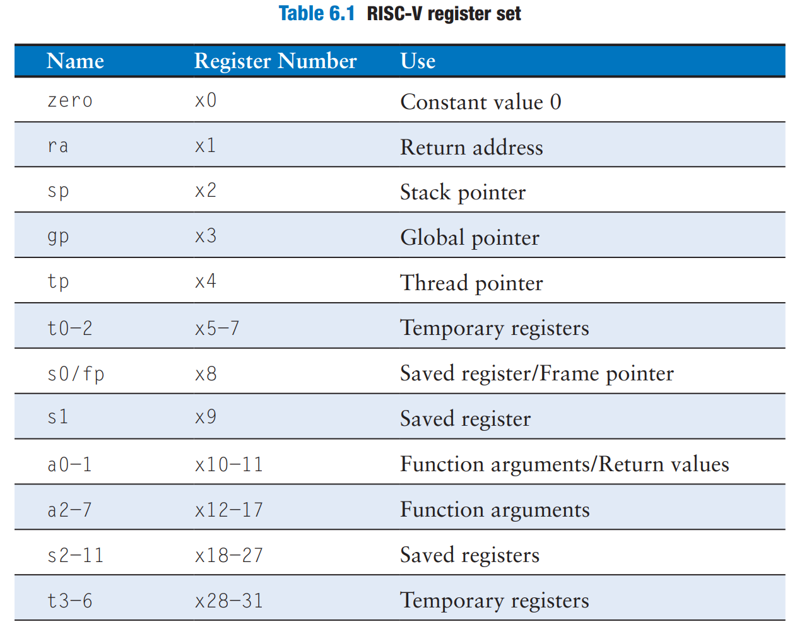
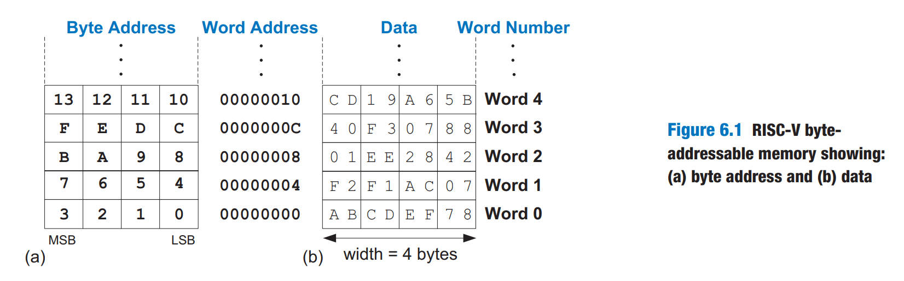

# Assembly Language

_Assembly language_ is the human-readable representation of the computer's native language. Each assembly language instruction specifies both the operation to perform and the operands on which to operate. We introduce simple arithmetic instructions and show how these operations are written in assembly language. We then define the RISC-V instruction operands:

1. registers
2. memory
3. constants

## Instructions

One of the most common operations computers perform is **addition**. Code Example 6.1 shows code for adding variables `b` and `c` and writing the result to `a`.




```c
a = b + c;
```





```armasm
add a, b, c
```





#### Code Explanation

1. The first part of the assembly instruction, `add`, is called the _mnemonic_ and indicates what operation to perform.
2. The operation is performed on `b` and `c`, the _source operands_, and the result is written to `a`, the _destination operand_.


Code Example 6.2 shows that subtraction is similar to addition. The `sub` instruction format is the same as the `add` instruction: destination operand, followed by two sources.&#x20;




```c
a = b - c;
```





```armasm
sub a, b, c
```




This consistent instruction format is an example of the first design principle:

> Regularity supports simplicity.

Instructions with a consistent number of operands — in this case, two sources and one destination — are easier to encode and handle in hardware. More complex high-level code translates into multiple RISC-V instructions, as shown in Code Example 6.3




```c
a = b + c - d;
```





```armasm
add t, b, c # t = b + c
sub a, t, d # a = t - d
```





#### Code Explanation

1. In RISC-V assembly language, only single-line comments are used. They begin with a hash symbol (`#`) and continue until the end of the line.


Using multiple assembly language instructions to perform more complex operations is an example of the second design principle of computer architecture:

> Make the common case fast.

The RISC-V instruction set makes the common case fast by including only simple, commonly used instuctions. The number of instructions is kept small so that the hardware required to decode the instruction and its operands can be simple, small and fast. More elaborate operations that are less common are performed using sequences of multiple simple instructions. Thus RISC-V is a _reduced instruction set computer (RISC)_ architecture. Architectures with many complex instructions, such as Intel's x86 architecture, are _complex instruction set computers (CISC)_. For example, x86 defines a "string move" instruction that copies a string (a series of chars) from one part of memory to another. Such an operation requires many, possibly even hundreds, of simple instructions in a RISC machine. However, the cost of implementing complex instructions in a CISC architecture is added hardware and overhead that slows down the simple instructions.

A RISC architecture, such as RISC-V, minimizes the hardware complexity and the necessary instrcution encoding by **keeping the set of distinct instructions small**. For example, an instruction set with 64 simple instructions would need $$\log_264=6$$ bits to encode the operation, whereas an instruction set with 256 instructions would need $$\log_2256=8$$ bits of encoding per instruction. In a CISC machine, even though the complex instructions may be used only rarely, they add overhead to all instructions, even the simple ones.

## Operands: Registers, Memory and Constants

An instruction operates on _operands_. In Code Example 6.2 above, the variables `a`, `b` and `c` are all operands. But computers operate on 1's and 0's, not variable names. The instructions need a physical location from which to retrieve the binary data.


Computers use various locations to hold operands in order to optimize for speed and data capacity.


Operands stored as constants or in registers are accessed quickly, but they hold only a small amount of data. Additional data must be accessed from memory, which is large but slow.


RISC-V is called a 32-bit architecture because it operates on 32-bit data.


### Registers

Instructions need to access operands quickly so that they can run fast, but operands stored in memory take a long time to retrieve. Therefore, most architectures specify a small number of registers that hold commonly used operands. The RISC-V architecture has 32 registers, called the _register set_, stored in a small multiported memory called a [_register file_](https://wenbo-notes.gitbook.io/ddca-notes/textbook/digital-building-blocks/memory-arrays#register-files)_._ The fewer the registers, the faster they can be accessed. This leads to the third design principle:

> Smaller is faster.

Code Example 6.4 shows the `add` instruction with register operands. The variables `a`, `b`, and `c` are arbitrarily placed in `s0`, `s1`, and `s2`. The name `s1` is pronounced "register s1" or simply "s1". The instruction adds the 32-bit values contained in `s1 (b)` and `s2 (c)` and writes the 32-bit result to `s0 (a)`.&#x20;




```c
a = b + c;
```





```armasm
# s0 = a, s1 = b, s2 = c
  add  s0, s1, s2      # a = b + c
```




Code Example 6.5 shows RISC-V assembly code using a register, `t0`, to store the intermediate calculation of `b+c`.




```c
a = b + c - d;
```





```armasm
# s0 = a, s1 = b, s2 = c, s3 = d, t0 = t
  add  t0, s1, s2   # t = b + c
  sub  s0, t0, s3   # a = t - d
```




### The Register Set

Table 6.1 lists the name and use for each of the 32 RISC-V registers. Registers are numbered 0 to 31 and are given a spcial name to indicate a regsiter's conventional purpose.

<figure><figcaption></figcaption></figure>


#### Table Explanation

1. The `zero` register always holds the constant 0; values written to it are discarded.
2. Registers `s0` to `s11` (registers 8-9 and 18-27) and `t0` to `t6` (register 5-7 and 28-31) are used for storing variables;
3. `ra` and `a0` to `a7` have special uses during function calls
4. Register 2 to 4 are also called `sp`, `gp`, `tp` and will be discussed later
5. **TODO: Questions, why aren't registers organized in a more neated way, e.g., t0-t6 organized together?**


### Constants/Immediates

In addition to register operations, RISC-V instructions can use constant or _immediate_ operands. These constants are called _immediates_ because their values are immediately available from the instruction and do not require a register or memory access. Code Example 6.6 shows the add immediate instruction, `addi`, that adds an immediate to a register.




```c
a = a + 4;
b = a - 12
```





```armasm
# s0 = a, s1 = b
  add s0, s0, 4    # a = a + 4
  add s1, s0, -12  # b = a - 12
```




In assembly code, the immediate can be written in decimal, hexadecimal, or binary. Hexadecimal constants in RISC-V assembly language start with `0x` and binary constants start with `0b`, as they do in C.


Immediates are 12-bit two's complement numbers, so they are sign-extended to 32 bits.


The `addi` instruction is a useful way to initialize register values with small constants. Code Example 6.7 initializes the variables `i`, `x`, and `y` to 0, 2032, -78, respectively.




```c
i = 0;
x = 2032;
y = -78;
```





```armasm
# s4 = i, s5 = x, s6 = y
  addi s4, zero, 0        # i = 0
  addi s5, zero, 2032     # x = 2032
  addi s6, zero, -78      # y = -78
```




To create larger constants, use a _load upper immediate_ instruction (`lui`) followed by an add immediate instruction (`addi`), as shown in Code Example 6.8. The `lui` instruction loads a 20-bit immediate into the most significant 20 bits of the instruction and places zeros in the least significant bits.




```c
int a = 0xABCDE123;
```





```armasm
lui s2, 0xABCDE    # s2 = 0xABCDE000
addi s2, s2, 0x123 # s2 = 0xABCDE123
```




### Memory

In RISC-V architecture, instructions operate exclusively on registers, so data stored in memory must be moved to a register before it can be processed. By using a combination of memory and registers, a program can access a large amount of data fairly quickly.


The RVI RISC-V architecture uses 32-bit memory addresses and 32-bit data words.


RISC-V uses a _byte-addressable_ memory. That is, each byte in memory has a unique address, as shown in Figure 6.1 (a).

<figure><figcaption></figcaption></figure>

A 32-bit word consists of four 8-bit bytes, so each word address is a multiple of 4. The MSB is on the left and the LSB is on the right. The order of bytes within a word is discussed further later. Both the 32-bit word address and the data value in Figure 6.1 (b) are given in hexadecimal. For example, data word `0xF2F1AC07` is stored at memory address 4. By convention, memory is drawn with low memory addresses toward the bottom and high memory addresses toward the top.

The _load word_ instruction, `lw`, reads a data **word** from **memory** into a **register**. Code Example 6.10 loads memory word 2, located at address 8, into `a (s7)`. The `lw` instruction specifies the memory address using an _offset_ added to a _base register_.




```c
a = mem[2];
```





```armasm
# s7 = a
  lw s7, 8(zero)  # s7 = data at memory address (zero + 8)
```





#### Code Explanation

1. Here the _base register_ is the **zero register**
2. The _offset_ is 8, because we want to load word 2 into the register, and each word is 4 bytes. So the offset is 8.


The _store word_ instruction, `sw`, writes a data word from a register into memory. Code Example 6.11 writes the value 42 from register `t3` into memory word 5, located at address 20.




```c
mem[5] = 42;
```





```armasm
addi t3, zero, 42   # t3 = 42
sw   t3, 20(zero)   # data value at memory address 20 = 42
```



