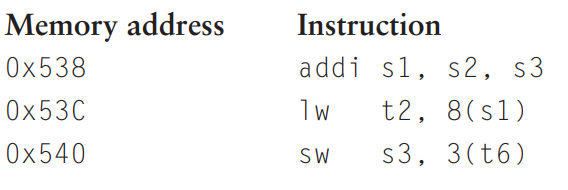
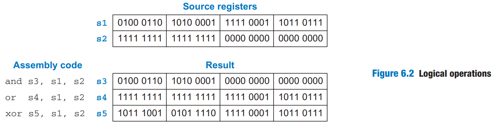
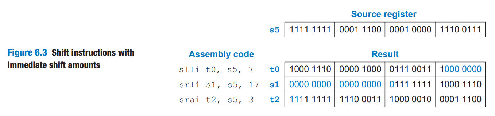
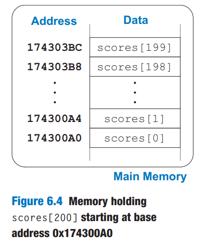
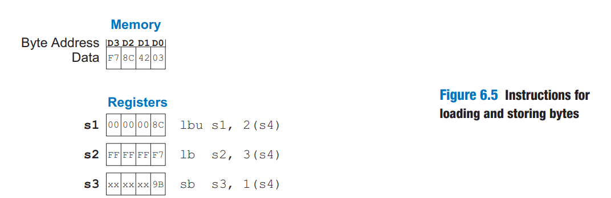
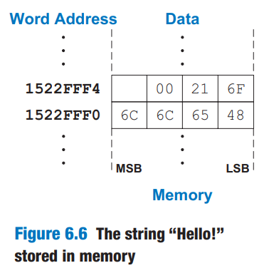
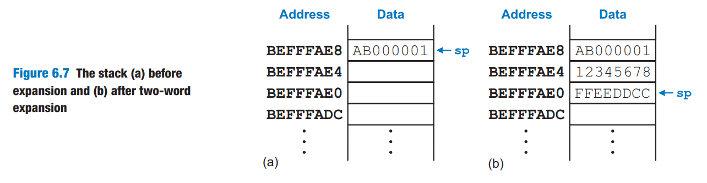
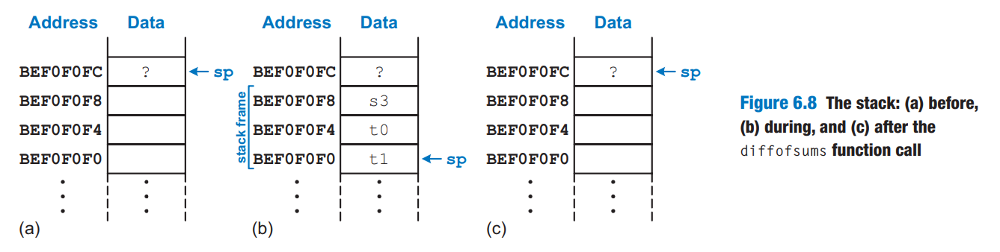
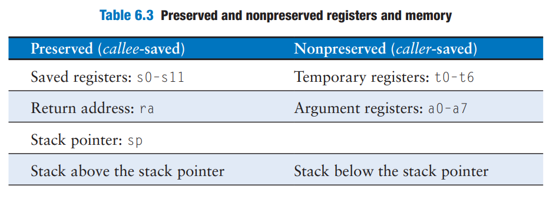

# Programming

In this section, we begin by discussing program flow and instructions that support high-level languages like C. Then, we explore how to translate the high-level constructs into RISC-V assembly code.

## Program Flow

Like data, instructions are stored in memory. Each instruction is 32 bits (4 bytes) long, as we will discuss later, so consecutive instruction addresses increase by four. For example, in the code snippet below, the `addi` instruction is located in memory at address `0x538` and the next instruction, `lw`, is at address `0x53C`.

<figure><figcaption></figcaption></figure>

### Program Counter

The _program counter —_ also called the PC — keeps track of the current instruction. The PC holds the memory address of the current instruction and increments by four after each instruction completes so that the processor can read or _fetch_ the next instruction from memory. For example, when `addi` instruction is executing, PC is `0x538`. After `addi` instruction completes, PC increments by four to `0x53C` and the processor fetches the `lw` instruction at that address.

## Logical, Shift, and Multiply Instructions

The RISC-V architecture defines a variety of logical and arithmetic instructions. We introduce these instructions briefly here because they are necessary to implement higher-level constructs.

### Logical Instructions

RISC-V _logical operations_ include `and`, `or` and `xor`. These each operate bitwise on two source registers and write the result to a destination register, as shown in Figure 6.2. Immediate versions of these logical operations, `andi`, `ori`, and `xori`, use one source register and a 12-bit sign-extended immediate.

<figure><figcaption></figcaption></figure>

* The `and` instruction is useful for _clearing_ or _masking_ bits. (e.g., forcing bits to 0). See more from [NUS CG2111A Notes](https://wenbo-notes.gitbook.io/cg2111a-notes/studio/studio-1-gpio-programming#clear-certain-bits).
* The `or` instruction is useful for _set_ bits in a register (e.g., for bit to be 1). See more from [NUS CG2111A Notes](https://wenbo-notes.gitbook.io/cg2111a-notes/studio/studio-1-gpio-programming#set-certain-bits).
* A logical NOT operation can be performed with `xori s8, s1, -1`. Remember that -1 (0xFFF) is sign-extended[^1] to 0xFFFFFFFF (all 1's). XOR with all 1's inverts all the bits, so `s8` will get the one's complement of `s1`.

### Shift Instructions

_Shift instructions_ shift the value in a register left or right, dropping bits off the end. RISC-V shift operations are

1. `sll`: shift left logical
2. `slr`: shift right logical
3. `sra`: shift right arithmetic


The difference and example of the above three operations can be seen from the [previous notes](https://wenbo-notes.gitbook.io/ddca-notes/textbook/digital-building-blocks/arithmetic-circuits#shifters-and-rotators).


These shifts specify the shift amount in the second source register. Immediate versions of each instruction are also available (`slli`, `srli`, and `srai`), where the amount to shift is specified by a 5-bit unsigned immediate.

Figure 6.3 shows the assembly code and resulting register values for `slli`, `srli`, and `srai` when shifting by an immediate value. `s5` is shifted by the immediate amount, and the result is placed in the destination register.

<figure><figcaption></figcaption></figure>

As discussed in the [previous notes,](https://wenbo-notes.gitbook.io/ddca-notes/textbook/digital-building-blocks/arithmetic-circuits#shifters-and-rotators)&#x20;

* shifting a value by N is equivalent to multiplying it by $$2^N$$
* shifting a value right by N is equivalent to dividing it by $$2^N$$
  * **arithmetic right shifts** divide two's complement numbers, while
  * **logical right shifts** divide unsigned numbers

### Multiply Instructions

As we have seen in [previous notes](https://wenbo-notes.gitbook.io/ddca-notes/textbook/digital-building-blocks/arithmetic-circuits#multiplication), multiplying two N-bit numbers produces a 2N-bit product. The RISC-V architecture provides various _multiply instructions_ that result in 32- or 64-bit products. These instructions are not part of RVI321 but are included in teh RVM (RISC-V multiply/divide) extension.

* The _multiply instruction_ (`mul`) multiplies two 32-bit numbers and produces a 32-bit product. `mul s1, s2, s3` multiplies the values in `s2` and `s3` and places the **least significant** 32 bits of the product in `s1`; the **most significant** 32 bits of the product are discarded.
* Three versions of the "multiply high" operation exist: `mulh`, `mulhsu`, and `mulhu`. These instructions put the high 32 bits of the multiplication result in the destination register.
  * `mulh` (multiply high signed signed) treats both operands as signed.
  * `mulhsu` (multiply high signed unsigned) treats the first operand as signed and the second as unsigned.
  * `mulhu` (multiply high unsigned unsigned) treats both operands as unsigned.

Using a series of two instructions — one of the "multiply high" instructions followed by the `mul` instruction — will place the entire 64-bit result of the 32-bit multiplication in the two registers designated by the user. For example, the following code multiplies 32-bit signed numbers in `s3` and `s5` and places the 64-bit product in `t1` and `t2`. That is `{t1, t2} = s3 x s5`.


```armasm
mulh t1, s3, s5;
mul  t2, s3, s5;
```


## Branching

_Branch instructions_ modify the flow of the program so that the processor can fetch instructions that are not in sequential order in memory. They modify the PC to skip over sections of code or to repeat previous code.

* _Conditional branch_ instructions perform a test and branch only if the test is TRUE.
* _Unconditional branch_ instructions, called _jumps_, always branch.

### Conditional Branches

The RISC-V instruction set has six conditional branch instructions, eahc of which take two source registers and a label indicating where to go.

1. `beq` (_branch if equal_) branches when the values in the two source registers are equal.
2. `bne` (_branch if not equal_) branches when they are unequal.
3. `blt` (_branch if less than_) branches when the value in the **first** source register is **less than** the value in the **second**.
4. `bge` (_branch if greater than or equal to_) branches when the **first** is greater than or equal to the **second**.
   1. `blt` and `bge` treat the operands as signed numbers, while
   2. `bltu` and `bgeu` treat the operands as unsigned (the fifth and sixth conditional branch instructions in RISC-V)

Code Example 6.12 illustrates the use of `beq`. When the program reaches the branch if equal instruction (`beq`), the value in `s0` is equal to the value in `s1`, so the branch is taken. Thus, the next instruction executed is the `add` instruction just after the label called `target`. The `addi` and `sub` instructions between the branch and the label are not executed.


```armasm
 addi s0, zero, 4   # s0 = 0 + 4 = 4
 addi s1, zero, 1   # s1 = 0 + 1 = 1
 slli s1, s1, 2     # s1 = 1 << 2 = 4
 beq s0, s1, target # s0 == s1, so branch is taken
 addi s1, s1, 1     # not executed
 sub s1, s1, s0     # not executed
target:
 add s1, s1, s0     # s1 = 4 + 4 = 8
```



#### Code Explanation

1. Assembly code uses _labels_ to indicate instruction locations in the program. A label refers to the instruction just after the label. When the assembly code is translated into machine code, these labels correspond to instruction addresses (as will be discussed later).
2. RISC-V assembly labels are followed by a colon (`:`).
3. Most programmers indent their instructions but not the labels to help make labels stand out.


In Code Example 6.13, the branch is not taken because `s0` is equal to `s1`, and the code continues to execute directly after the `bne` (branch if not equal) instruction. **All** instructions in this code snippet are executed. (Including the instruction under `target`)


```armasm
 addi s0, zero, 4   # s0 = 0 + 4 = 4
 addi s1, zero, 1   # s1 = 0 + 1 = 1
 slli s1, s1, 2     # s1 = 1 << 2 = 4
 bne s0, s1, target # s0 != s1? No (4==4), branch not taken
 addi s1, s1, 1     # s1 = 4 + 1 = 5
 sub s1, s1, s0     # s1 = 5 - 4 = 1
target:
 add s1, s1, s0     # s1 = 1 + 4 = 5
```


### Unconditional Branches

A program can jump — that is, unconditionally branch — using one of three instructions:

1. _jump_ (`j`): jumps directly to the instruction at specified label. See Code Example 6.14
2. _jump and link_ (`jal`): will be discussed later in function calls.
3. _jump register_ (`jr`): will be discussed later in function calls.


```armasm
 j target          # jump to target
 srai s1, s1, 2    # not executed
 addi s1, s1, 1    # not executed
 sub s1, s1, s0    # not executed
target:
 add s1, s1, s0    # s1 = s1 + s0
```



#### Code Explanation

1. After the `j` instruction executes, this program unconditionally continues executing the `add` instruction at the label `target`. All of the instructions between the jump and the label are skipped.


## Conditional Statements

This section shows how to translate the high-level constructs (`if/else`, and `switch/case`) into RISC-V assembly language.

### If Statements

Code Example 6.15 shows how to translate an if statement into RISC-V assembly code.




```c
if (apples == oranges)
    f = g + h;
apples = oranges - h;
```





```armasm
# s0 = apples, s1 = oranges
# s2 = f, s3 = g, s4 = h
    bne s0, s1, L1   # skip if (apples != oranges)
    add s2, s3, s4   # f = g + h
L1: sub s0, s1, s4   # apples = oranges - h
```





#### Code Explanation

1. The assembly code for the if statement tests the opposite condition of the one in the high-level code.


### If/else Statements

Code Example 6.16 shows an example `if/else` statement.




```c
if (apples == oranges)
    f = g + h;
else
    apples = oranges - h;
```





```armasm
# s0 = apples, s1 = oranges
# s2 = f, s3 = g, s4 = h
    bne s0, s1, L1   # skip if (apples != oranges)
    add s2, s3, s4   # f = g + h
    j L2
L1: sub s0, s1, s4   # apples = oranges - h
L2:
```





#### Code Explanation

1. The assembly code tests for (`apples ≠ oranges`). If that opposite condition is TRUE, `bne` skips the if block and executes the else block. Otherwise, the if block executes and finishes with a jump (`j`) past the else block.


### Switch/case Statements

A case statement is equivalent to a series of nested if/else statements. Code Example 6.17 shows two high-level code snippets with the same functionality: they calculate whether to dispense $20, $50, or $100 from an ATM depending on the button pressed.




```c
switch (button) {
    case 1: 
        amt = 20; 
        break;
    case 2: 
        amt = 50; 
        break;
    case 3: 
        amt = 100; 
        break;
    default: 
        amt = 0;
}

// equivalent function using
// if/else statements
if (button == 1) {
    amt = 20;
} else if (button == 2) {
    amt = 50;
} else if (button == 3) {
    amt = 100;
} else {
    amt = 0;
}
```





```armasm
# s0 = button, s1 = amt
case1:
    addi t0, zero, 1    # t0 = 1
    bne s0, t0, case2   # button == 1?
    addi s1, zero, 20   # if yes, amt = 20
    j done              # break out of case
case2:
    addi t0, zero, 2    # t0 = 2
    bne s0, t0, case3   # button == 2?
    addi s1, zero, 50   # if yes, amt = 50
    j done              # break out of case
case3:
    addi t0, zero, 3    # t0 = 3
    bne s0, t0, default # button == 3?
    addi s1, zero, 100  # if yes, amt = 100
    j done              # break out of case
default:
    add s1, zero, zero  # amt = 0
done:
```





#### Code Explanation

1. The RISC-V assembly implementation is the nearly the same as the high-level code snippet.


## Getting Loopy

### While Loops

The while loop in Code Example 6.18 determines the value of `x` such that $$2^x=128$$. It executes seven times, until `pow=128`.




```c
// Determines the power of x such that 2^x = 128
int pow = 1;
int x = 0;

while (pow != 128) {
    pow = pow * 2;
    x = x + 1;
}
```





```armasm
# s0 = pow, s1 = x
    addi s0, zero, 1      # pow = 1
    add s1, zero, zero    # x = 0
    addi t0, zero, 128    # t0 = 128
while:
    beq s0, t0, done      # pow = 128?
    slli s0, s0, 1        # pow = pow * 2
    addi s1, s1, 1        # x = x + 1
    j while               # repeat loop
done:
```





#### Code Explanation

1. Like [if/else statements](programming.md#if-else-statements), the assembly code for while loops tests the opposite condition of the one in the high-level code.


### Do-while Loops

Code Example 6.19 illustrates such a loop.




```c
// Determines the power of x such that 2^x = 128
int pow = 1;
int x = 0;

do {
    pow = pow * 2;
    x = x + 1;
} while (pow != 128);
```





```armasm
# s0 = pow, s1 = x
    addi s0, zero, 1      # pow = 1
    add  s1, zero, zero   # x = 0
    addi t0, zero, 128    # t0 = 128
while:
    slli s0, s0, 1        # pow = pow * 2
    addi s1, s1, 1        # x = x + 1
    bne  s0, t0, while    # pow != 128?
done:
```





#### Code Explanation

1. Unlike the [previous example](programming.md#while-loops), the branch checks the same condition as in the high-level code.


### For Loops

Code Example 6.20 adds the numbers from 0 to 9.




```c
// Add the numbers from 0 to 9
int sum = 0;
int i;

for (i = 0; i < 10; i = i + 1) {
    sum = sum + i;
}
```





```armasm
# s0 = i, s1 = sum
    addi s1, zero, 0      # sum = 0
    addi s0, zero, 0      # i = 0
    addi t0, zero, 10     # t0 = 10
for:
    bge  s0, t0, done     # i >= 10?
    add  s1, s1, s0       # sum = sum + i
    addi s0, s0, 1        # i = i + 1
    j    for              # repeat loop
done:
```





#### Code Explanation

1. The for loop in the high-level code checks the `<` condition to continue, so the assembly code checks the opposite condition, ≥, to exit the loop.


## Arrays

Figure 6.4 shows a 200-element array of **integer** scores stored in memory. Each consecutive element address increases by 4, the number of bytes in an integer.

<figure><figcaption></figcaption></figure>

Code Example 6.21 is a grade inflation algorithm that adds 10 points to each of the scores. The code for initializing the `scores` array is not shown.




```c
int i;
int scores[200];

for (i = 0; i < 200; i += 1) {
    scores[i] = scores[i] + 10;
}
```





```armasm
# s0 = scores base address, s1 = i

    addi s1, zero, 0   # i = 0
    addi t2, zero, 200 # t2 = 200

for:
    bge  s1, t2, done  # if i >= 200 then done
    slli t0, s1, 2     # t0 = i * 4
    add  t0, t0, s0    # address of scores[i]
    lw   t1, 0(t0)     # t1 = scores[i]
    addi t1, t1, 10    # t1 = scores[i] + 10
    sw   t1, 0(t0)     # scores[i] = t1
    addi s1, s1, 1     # i = i + 1
    j    for           # repeat
done:
```





#### Code Explanation

1. Assume that `s0` is initially `0x174300A0`, the base address of the array.
2. The index into the array is a variable (`i`) that increments by 1 for each array element, so we multiply it by 4 before adding it to the base address.


### Bytes and Characters

In RISC-V assembly, the _load_ byte (`lb`), _load byte unsigned_ (`lbu`), and _store byte_ (`sb`) instructions access individual bytes in memory.

* `lb` sign-extends the byte to fill the entire 32-bit register
* `lbu` zero-extends the byte to fill the entire 32-bit register
* `sb` stores the **least significant byte** of the 32-bit register into the specified byte address in memory.

All these three instructions are illustrated in Figure 6.5, with the base address, `s4`, being `0xD0`.

<figure><figcaption></figcaption></figure>


#### Code Explanation

1. `lbu s1, 2(s4)` loads the byte at memory address `0xD2` into the least significant byte of `s1` and fills the remaining register bits with 0.
2. `lb s2, 3(s4)` loads the byte at memory address `0xD3` into the least significant byte of `s2`and sign-extends the byte into the upper 24 bits of the register.
3. `sb s3, 1(s4)` stores the least significant byte of `s3` (0x9B) into memroy byte address at 0xD1; it replaces `0x42` with `0x9B`. The more significant bytes of `s3` are ignored.


In C, the null character (0x00) signifies the end of a string. For example, Figure 6.6 shows the string "Hello!" (`0x48 65 6C 6C 6F 21 00`) stored in memory.

<figure><figcaption></figcaption></figure>

## Function Calls

When a function calles another, the calling function, the _caller_, and the called function, the _callee_, must agree on where to put the arguments and the return value. In RISC-V programs,

* the caller conventionally places up to eight arguments in registers `a0` to `a7` before making the function call,
* the callee places the return value in register `a0` before finishing.

By following this convention, both functions know where to find the arguments and return value, even if the caller and callee were written by different people.


The caller stores the return address in the _return address register_ `ra` at the same time it jumps to the callee using the jump and link instruction (`jal`). Specifically, the callee must leave the _saved registers_ (`s0-s11`), the return address (`ra`), and the _stack_, a portion of memory used for temporary variables, unmodified.


### Function Calls and Returns

RISC-V uses the _jump and link_ instruction (`jal`) to call a function and _jump register_ instruction (`jr`) to return from a function. Code Example 6.22 shows the `main` function calling the `simple` function. `main` is the caller and `simple` is the callee.




```c
int main() {
    simple();
    // ...
}

// void mains the function
// returns no value
void simple() {
    return;
}
```





```armasm
0x00000300 main:   jal simple  # call function
0x00000304 ...
...        ...

0x0000051c simple: jr ra       # return
```





#### Code Explanation

1. The instruction `jal simple` performs two tasks:
   1. it jumps to the target instruction located at `simple` (0x0000051C)
   2. it stores the _return address_, the address of the instruction **after** `jal` (in this case, 0x00000304) in the return address register (`ra`).


### Input Arguments and Return Values

As we have seen earlier, by RISC-V convention, functions use `a0` to `a7` for input arguments and `a0` for the return value. In Code Example 6.23, the function `diffofsums` is called with four arguments and returns on result. `result` is a local variable, which we choose to keep in `s3`. (Saving and restoring registers will be discussed soon).




```c
int main() {
    int y;
    // ...
    y = diffofsums(2, 3, 4, 5);
    // ...
}

int diffofsums(int f, int g, int h, int i) {
    int result;
    result = (f + g) - (h + i);
    return result;
}
```





```armasm
# s7 = y
main:
    ...
    addi a0, zero, 2   # argument 0 = 2
    addi a1, zero, 3   # argument 1 = 3
    addi a2, zero, 4   # argument 2 = 4
    addi a3, zero, 5   # argument 3 = 5
    jal  diffofsums    # call function
    add  s7, a0, zero  # y = returned value
    ...
# s3 = result
diffofsums:
    add t0, a0, a1     # t0 = f+g
    add t1, a2, a3     # t1 = h+i
    sub s3, t0, t1     # result = (f+g)−(h+i)
    add a0, s3, zero   # put return value in a0
    jr  ra             # return to caller
```





#### Code Explanation

1. According to RISC-V convention, the calling function, `main`, places the function arguments from left to right into the input registers, `a0` to `a7`, before calling the function. The called function, `diffofsums`, stores the return value in the return register, `a0`.
2. When a function with more than eight arguments is called, the additional input arguments are placed on the stack, which we discuss next.


### The Stack

The stack (We have learned this idea of stack in [NUS CS1010](https://wenbo-notes.gitbook.io/cs1010-notes/lec-tut-lab-exes/lecture/lec-06-call-stacks-arrays#stack-frame)!) is memory that is used as scratch space — that is, to save **temporary information** within a function. Each function may allocate stack space to store local variables and to use as scratch space, but the function must deallocate it before returning.


The RISC-V stack grows down in memory. That is, the stack expands to lower memory addresses when a program needs more scratch space.


#### Stack Pointer

The stack pointer, `sp` ([register `x2`](https://wenbo-notes.gitbook.io/ddca-notes/textbook/architecture/assembly-language#the-register-set)), is an ordinary RISC-V register that, by convention, _points_ to the _top of the stack._ `sp` starts at a high memory address and decrements to expand as needed. Figure 6.7(b) shows the stack expanding to allow two more data words of temporary storage. To do so, `sp` decrements by 8 to become `0xBEFFFAE0`.

<figure><figcaption></figcaption></figure>

One of the important uses of the stack is to **save and restore registers** that are used by a function. Recall that a function should calculate a return value but have no other unintended side effects. In particular, a function should not modify any registers besides `a0`, the one containing the return value.

The `diffofsums` function in Code Example 6.23 violates thsi rule because it modifies `t0`, `t1`, and `s3`. If `main` had been using these registers before the call to `diffofsums`, their contents would have been corrupted by the function call.

To solve this problem, a function saves registers on the stack before it modifies them and then restores them from the stack before it returns. Specifically, it performs the following steps:

1. Makes space on the stack to store the values of one or more registers
2. Stores the values of the registers on the stack
3. Executes the function using the registers
4. Restores the original values of the registers from the stack
5. Deallocates space on the stack

Code Example 6.24 shows an improved version of `diffofsums` that saves and restores `t0`, `t1`, and `s3`.




```c
int main() {
    int y;
    // ...
    y = diffofsums(2, 3, 4, 5);
    // ...
}

int diffofsums(int f, int g, int h, int i) {
    int result;
    result = (f + g) - (h + i);
    return result;
}
```





```armasm
# s3 = result
diffofsums:
    addi sp, sp, −12   # make space on stack to
                       # store three registers
    sw   s3, 8(sp)     # save s3 on stack
    sw   t0, 4(sp)     # save t0 on stack
    sw   t1, 0(sp)     # save t1 on stack
    add  t0, a0, a1    # t0 = f + g
    add  t1, a2, a3    # t1 = h + i
    sub  s3, t0, t1    # result = (f + g) − (h + i)
    add  a0, s3, zero  # put return value in a0
    lw   s3, 8(sp)     # restore s3 from stack
    lw   t0, 4(sp)     # restore t0 from stack
    lw   t1, 0(sp)     # restore t1 from stack
    addi sp, sp, 12    # deallocate stack space
    jr   ra            # return to caller
```




Figure 6.8 shows the stack before, during, and after a call to the `diffofsums` function from Code Example 6.24.

<figure><figcaption></figcaption></figure>


#### Code Explanation

1. The stack starts at `0xBEF0F0FC`. `diffofsums` makes room for three words on the stack by decrementing the stack pointer `sp` by 12.
2. It then stores the current values held in `t0`, `t1`, and `s3` in the newly allocated space. It executes the rest of the function, changing the values in these three registers.
3. At the end of the function, `diffofsums` restores the values of these registers from the stack, deallocates its stack space, and returns.
4. When the function returns, `a0` holds the result, but there are no other side effects: `t0`, `t1`, `s3`, and `sp` have the same values as they did before the function call.


The stack space that a function allocates for itself is called its _stack frame_. `diffofsums`'s stack frame is three words deep. The principle of modularity tells us that each function should access only its own stack frame, not the frames belonging to other functions.


Saving a register value on the stack is called _pushing_ a register onto the stack. Restoring the register value from the stack is called _popping_ a register off of the stack.


### Preserved Registers

Code Example 6.24 assumes that all of the used registers (`t0`, `t1`, and `s3`) must be saved and restored. If the calling function does not use those registers, the effort to save and restore them is wasted. To avoid this waste, RISC-V divides registers into _preserved_ and _nonpreserved_ categories.


Preserved registers must contain the same values at the beginning and end of a called function because the caller expects preserved register values to be the same after the call.


As we have seen from the [RISC-V registers set](https://wenbo-notes.gitbook.io/ddca-notes/textbook/architecture/assembly-language#the-register-set) before,

* The preserved registers are `s0` to `s11` (hence their name, _saved_), `sp` and `ra`.
* The nonpreserved registers, also called _scratch_ registers, are `t0` to `t6` (hence their name, _temporary_) and `a0` to `a7`, the argument registers.


A function can change the nonpreserved registers freely (no need to save and restore) but must save and restore any of the preserved registers that is uses.


Code Example 6.25 shwos a further improved version of `diffofsums` that saves only `s3` on the stack, `t0` and `t1` are nonpreserved registers, so they need not be saved.




```c
int main() {
    int y;
    // ...
    y = diffofsums(2, 3, 4, 5);
    // ...
}

int diffofsums(int f, int g, int h, int i) {
    int result;
    result = (f + g) - (h + i);
    return result;
}
```





```armasm
# s3 = result
diffofsums:
    addi sp, sp, −4    # make space on stack to store one register
    sw   s3, 0(sp)     # save s3 on stack
    add  t0, a0, a1    # t0 = f + g
    add  t1, a2, a3    # t1 = h + i
    sub  s3, t0, t1    # result = (f + g) − (h + i)
    add  a0, s3, zero  # put return value in a0
    lw   s3, 0(sp)     # restore s3 from stack
    addi sp, sp, 4     # deallocate stack space
    jr   ra            # return to caller
```




Because a callee function may freely change any nonpreserved registers, the caller must save any nonpreserved registers containing essential information before making a function call and then restore these regsiters afterward. For these reasons, preserved registers are also called _callee-saved_ and nonpreserved registers are called _caller-saved_.

Table 6.3 summarizes which registers are preserved.

<figure><figcaption></figcaption></figure>

The stack above the stack pointer is **automatically preserved**, as long as the callee does not write to memory addresses above `sp`.

[^1]: Sign-extended logical immediates are somewhat unusual. Many other architectures, such as MIPS and ARM, zero-extended the immediate for logical operations.
