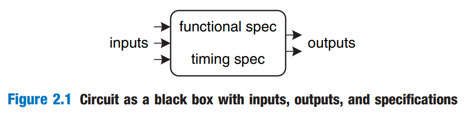
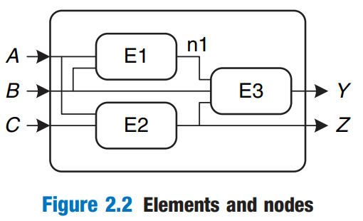

# Combinational Logic Design

> In this chapter, we will focus on the **Logic** and **Digital Circuits** level abstraction.

## Introduction

In digital electronics, a _circuit_ is a network that processes discrete-valued variables. A circuit can be viewed as a black box, shown in Figure 2.1, with

* one or more discrete-valued _input terminals_
* one or more discrete-valued _output terminals_
* a _functional specification_ describing the relationship between inputs and outputs
* a _timing specification_ describing the delay between inputs changing and outputs responding.

<figure><figcaption></figcaption></figure>

Peering inside the black box, circuits are composed of nodes and elements.

* An _element_ is itself a circuit with inputs, outputs, and a specification.
* A _node_ is a wire, whose voltage conveys a discrete-valued variable. Nodes are classfied as _input, output,_ or _internal_.
  * Inputs receive values from the external world.
  * Outputs deliver values to the external world.
  * Wires that are not inputs and outputs are called internal nodes.

Figure 2.2 illustrates a circuit with three elements, E1, E2 and E3, and six nodes, Nodes A, B, and C are inputs. Y and Z are outputs. n1 is an internal node between E1 and E3.

<figure><figcaption></figcaption></figure>

## Combinational vs. Sequential Circuits

Digital circuits are classified as _combinational_ or _sequential._

* A _combinational circuit_'s outputs depend **only** on the current values of the inputs; in other words, it combines the current input values to compute the output. For example, a logic gate is a combinational circuit.
* A _sequential circuit's_ outputs depend on both current and previous values of the inputs; in other words, it depends on the input sequence.

A combinational circuit is _memoryless_, but a sequential circuit has _memory_.

## Rules of Combinational Composition

This rule states that

> We can build a large combinational circuit from smaller combinational circuit elements.

A circuit is combinational if it consists of interconnected circuit elements such that

* Every circuit element is itself combinational.
* Every node of the circuit is either designated as an input to the circuit or connects to exactly one output terminal of a circuit element.
* The circuit contains no cyclic paths: every path through the circuit visits each circuit node at most once.

## Sum up

Large circuits such as microprocessors can be very complicated, so we use the principles from [from-zero-to-one](../from-zero-to-one/ "mention") to manage the complexity. Viewing a circuit as a black box with a well-defined interface and function is an application of abstraction and modularity. Building the circuit out of smaller circuit elements is an application of hierarchy. The rules of combinational composition are an application of discipline.

* The function specification of a combinational circuit expresses the output values in terms of the current input values. And it is usually expressed as a truth table or a Boolean equation.
* The timing specification of a combinational circuit consists of lower and upper bounds on the delay from input to output.
