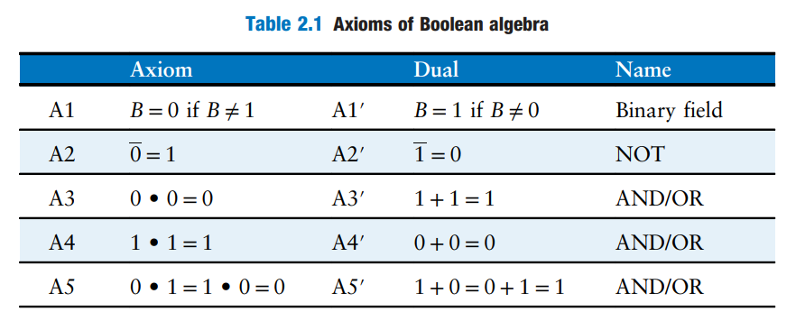
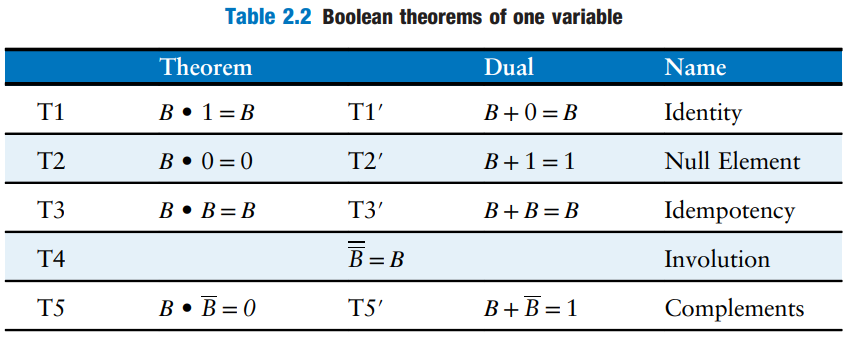
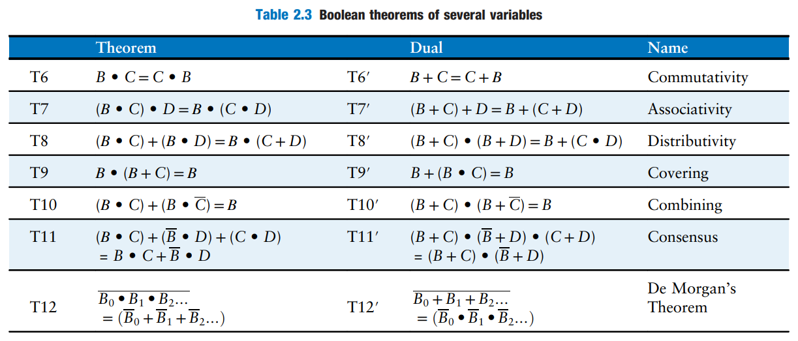

# Boolean Algebra

In the previous section, we learned how to write a Boolean expression given a truth table. However, that expression does not necessarily lead to the simplest set of logic gates. Just as you use algebra to simplify mathematical equations, you can use _Boolean algebra_ to simplify Boolean equations.

Boolean algebra is based on a set of **axioms** that we assume are correct. **Axioms are unprovable in the sense that a definition cannot be proved.** From these axioms, we prove all the theorems of Boolean algebra.

## Axioms

Table 2.1 states the axioms of Boolean algebra. These five axioms and their duals define Boolean variables and the meanings of NOT, AND, and OR.

<figure><figcaption></figcaption></figure>

Axioms and theorems of Boolean algebra obey the principle of _duality_, which states that

> If the symbols 0 and 1 and the operators $$\cdot$$ (AND) and $$+$$ (OR) are interchanged, the statement will still be correct.


We use the prime (`'`) to denote the _dual_ of a statement.


## Theorems

The following 17 theorems can all be derived by the axioms above. Prof. Massimo stated that you should do this proof of all these theorems **once in a life time**.

### Theorems of One Variable

Theorems T1 to T5 in Table 2.2 describe how to simplify equations involving one variable.

<figure><figcaption></figcaption></figure>

### Theorems of Several Variables

Theorems T6 to T12 in Table 2.3 describe how to simplify equations involving more than one Boolean variable.

<figure><figcaption></figcaption></figure>

### The Truth behind it All

The curious reader might wonder how to prove that a theorem is true. In Boolean algebra, proofs of theorems with a finite number of variables are easy: just show that the theorem holds for all possible values of these variables. This method is called _perfect induction_ and can be done with a truth table.


In short, we can use truth table to prove a theorem thanks to the **discrete nature** of Boolean Algebra.

