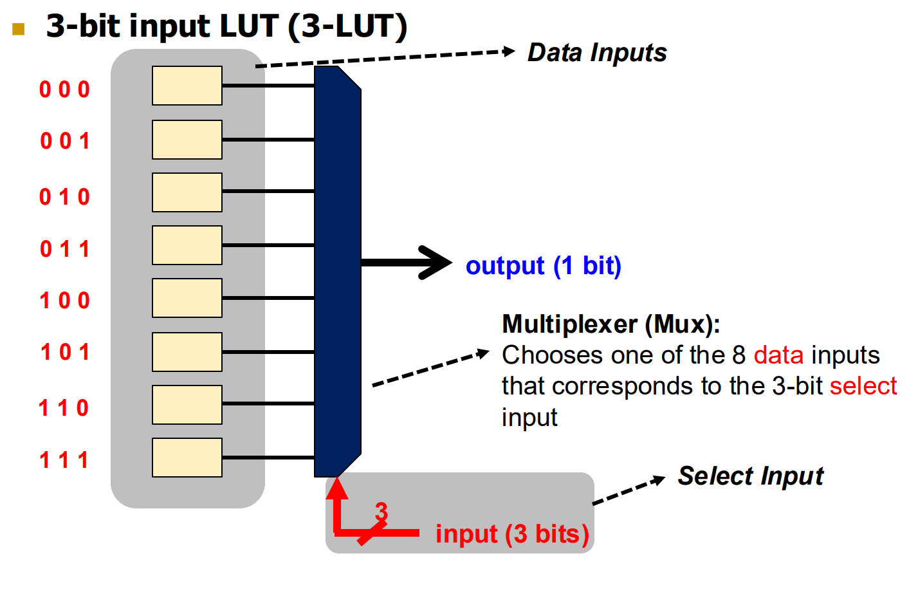

# Combinational Building Blocks

## Multiplexer

### Logic Using Multiplexer

We can use multiplexer to implement a **look up table (LUT).** For example, below is a 3-bit input LUT (3-LUT) implemented using a multiplexer.

<figure><figcaption></figcaption></figure>


3-LUT can implement **any** 3-bit input function!


Maybe a better way to visualize this is to think about the the [SoP](https://wenbo-notes.gitbook.io/ddca-notes/textbook/combinational-logic-design/boolean-equations#sum-of-products-form), the function we want to implement using gates is just a **sum of products**. But, by using a multiplexer, we can actually integrate each minterm in a **multiplexer** and then use the number of variable bits as **select bits**.
