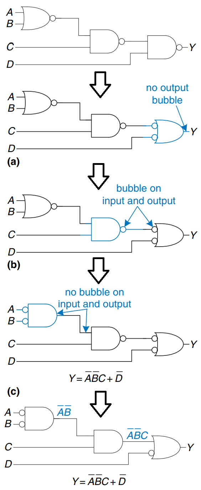

# Multilevel Combinational Logic

Logic in sum-of-products form is called _two-level logic_ because it consists of literals connected to a level of AND gates connected to a level of OR gates. Designers often build circuits with more than two levels of logic gates. These multilevel combinational circuits may use less hardware than their two-level conuterparts. **Bubble pushing** is especially helpful in analyzing and designing multilevel circuits.

## Bubble pushing

You may recall from [CMOS Transistor section](../from-zero-to-one/cmos-transistors.md) that CMOS circuits prefer NANDs and NORs over ANDs and ORs. But reading the equation by inspection from a multilevel circuit with NANDs and NORs can get pretty hairy. So, the **Bubble pusing** is a helpful way to redraw these circuits so that the bubbles cancel out and the function can be more easily determined.

The guidelines for bubble pushing are as follows:

* Begin at the output of the circuit and work toward the inputs.
* Push any bubbles on the final output back toward the inputs so that you can read an equation in terms of the output (for example, Y), instead of the complement of the output (Y). (**Use De-Morgan's Law**)
* Working backward, draw each gate in a form so that bubbles cancel. If the current gate has an input  bubble, draw the preceding gate with an output bubble. If the current gate does not have an input bubble, draw the preceding gate without an output bubble.

Below is an example of bubble pushing

<figure><figcaption></figcaption></figure>
