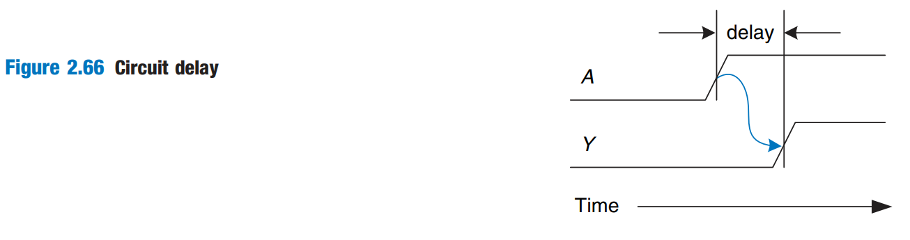
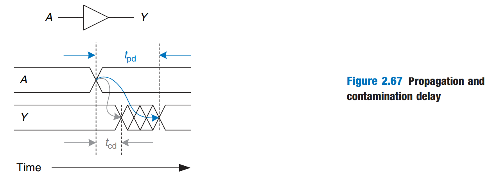

# Timing

In previous sections, we have been concerned primarily with whether the circuit works — ideally, using the fewest gates. However, as any seasoned circuit designer will attest, one of the most challenging issues in circuit design is _timing_: making a circuit run fast.

An output takes time to change in response to an input change. This is the _timing specification_ we are talking at the start of this chapter. Figrue 2.66 shows the delay between an input change and the subsequent output change for a buffer. The figure is called a _timing diagram_; it portrays the _transient response_ of the buffer circuit when an input changes.

<figure><figcaption></figcaption></figure>

We measure delay from the 50% point of the input signal, A, to the 50% point of the output signal, Y. The 50% point is the point at which the signal is half-way (50%) between its LOW and HIGH values as it transitions.

## Propagation and Contamination Delay

Combinational logic is characterized by its _propagation delay_ and _contamination delay_.

* The _propagation delay_, $$t_{\text{pd}}$$, is the **maximum** time from when an input changes until the output or puts **reach their final value**.
* The _contamination delay_, $$t_{\text{cd}}$$, is the **minimum** time from when an input changes until any output **starts to change its value**.

For example, Figure 2.67 illustrates a buffer's propagation delay and contamination delay in blue and gray, respectively.

<figure><figcaption></figcaption></figure>

The figure shows that A is initially either HIGH or LOW and changes to the other state at a particular time; we are interested only in the fact that it changes, not what value it has. In response, Y changes some time later.

The arcs indicate that Y may **start to change** $$t_{\text{cd}}$$ after A transitions and that Y definitely **settles to its new value** within $$t_{\text{pd}}$$.

### Critical Path

Propagation and contamination delays are also determined by the _path_ a signal takes from input to output.

There are two paths in a combinational circuit:

1. The _critical path_, which is the longest and therefore the slowest, path from input to output.
2. The _short path_, which as its name suggested, is the shortest path from input to output.

Thus,

1. The _propagation delay_ of a combinational circuit is the sum of the propagation delays through each element on the _critical path_.
2. The _contamination delay_ is the sum of contamination delays through each element on the _short path_.

## Glitches

So far we have discussed the case where a single input transition causes a single output transition. However, it is impossible that a single input transition can cause _multiple_ output transitions. These are called _glitches_ or _hazards_.


Although glitches usually don't cause problems, it is important to realize that they exist and recognize them when looking at timing diagrams.

