# Arithmetic Circuits

> This part is almost the same NUS CG3207 Lec 04 - Arithmetic for Computers. So, I will combine the information together here.

Arithmetic circuits are the central building blocks of computers. Computers and digital logic perform many arithmetic functions: addition, subtraction, comparisons, shifts, multiplication, and division. This section describes hardware implementations for all of these operations.

## Addition

Addition is one of the most common operations in digital systems. If you still remember, we've introduced [here](https://wenbo-notes.gitbook.io/ddca-notes/textbook/from-zero-to-one/number-systems#recap) that all binary arithmetics can be done using adders! We first consider how to add two 1-bit binary numbers. We then extend to N-bit binary numbers. Adders also illustrate trade-offs between speed and complexity.

### Half Adder&#x20;

We begin by building a 1-bit _half adder_. As shown in Figrue 5.1, the half adder has two inputs, A and B, and two outputs, $$S$$ and $$C_{\text{out}}$$. $$S$$ is the sum of A and B. If A and B is 1, $$S$$ is 2, which cannot be represented with a single binary digit. Instead, it is indicated with a carry out $$C_{\text{out}}$$ **in the next column**.

<figure>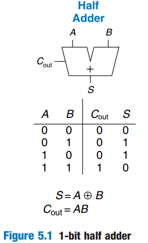<figcaption></figcaption></figure>

In a multi-bit adder, $$C_{\text{out}}$$ is added or _carried in_ to the next most significant bit (or into the next column). However, the half adder lacks a $$C_{\text{in}}$$ input to accept $$C_{\text{out}}$$ of the previous column. The _full adder_, described in the next section, solves this problem.

### Full Adder

A _full adder_ accepts the carry in $$C_{\text{in}}$$ as shown in Figure 5.3. The figure also shows the output equations for $$S$$ and $$C_{\text{out}}$$.

<figure>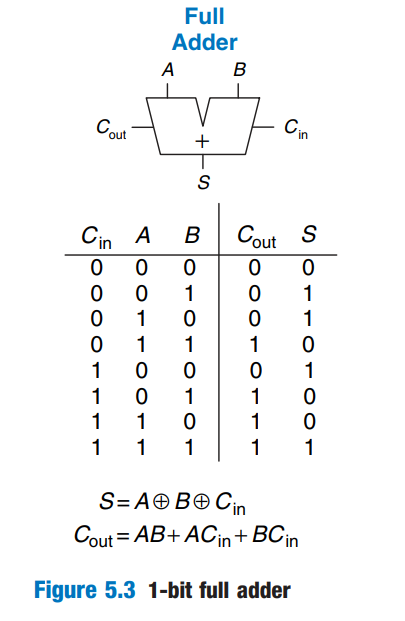<figcaption></figcaption></figure>

### Carry Propagate Adder

An N-bit adders sums two N-bit inputs, A and B, and a carry in $$C_{\text{in}}$$ to produce an N-bit result $$S$$ and a carry out $$C_{\text{out}}$$. It is commonly called a _carry propagate adder_ (CPA) because the carry out of one bit propagates into the next bit. The symbol for CPA is shown in Figure 5.4; it is drawn just like a full adder except that A, B, and S are buses rather than single bits. Three common CPA implementations are called

1. [Ripple-carry adders](arithmetic-circuits.md#ripple-carry-adder)
2. [Carry-lookahead adders](arithmetic-circuits.md#carry-lookahead-adder)
3. Prefix adders (FYI)

<figure>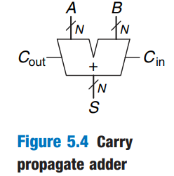<figcaption></figcaption></figure>

#### Ripple-Carry Adder

The simplest way to build an N-bit carry propagate adder is to chain together N full adders. The $$C_{\text{out}}$$ of one stage acts as the $$C_{\text{in}}$$ of the next stage, as shown in Figure 5.5 for 32-bit addition. This is called a _ripple-carry adder_.

<figure>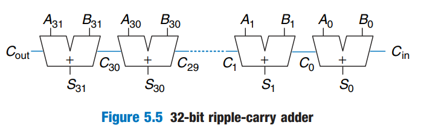<figcaption></figcaption></figure>

The ripple-carry adder has the disadvantage of being **slow** when N is large. As $$S_{31}$$ depends on $$C_{30}$$, which depends on $$C_{29}$$, and so forth all the way back to $$C_{\text{in}}$$. We say that the carry _ripples_ through the carry chain. The delay of the adder, $$t_{\text{ripple}}$$ grows directly with the number of bits, as given in Equation 5.1, where $$t_{\text{FA}}$$ is the delay of a full adder,

$$
t_{\text{ripple}}=Nt_{\text{FA}}
$$

> In Ripple-Carry Adder, the main disadvantage is that the **carry** propagates very slow. Can we accelerate the process of knowing the carry of an adder quicker? Here comes the **carry-lookahead adder**.

#### Carry-Lookahead Adder

A _carry-lookahead_ adder (CLA) is another type of carry propogate adder that solves the problem caused by ripple-carry adder by dividing the adder into _blocks_ and providing circuitry to quickly determine the **carry out** of a block[^1] as soon as the [**carry in**](#user-content-fn-2)[^2] is known. Thus it is said to _look ahead_ across the blocks rather than waiting to ripple through all the full adders inside a block.

CLAs use _generate_ (G) and _propogate_ (P) signals that describe how a column or block determines the carry out.

* The $$i$$-th column of an adder is said to _generate_ a carry if it produces a carry out independent of the carry in. Hence, we have $$G_i=A_iB_i$$.
* The $$i$$-th column of an adder is said to _propagate_ a carry it is produces a carry [whenever there is a carry in](#user-content-fn-3)[^3]. Thus, we have $$P_i=A_i+B_i$$.


One great advantage here is that both $$G_i$$ and $$P_i$$ depend only on the two inputs number $$A_i$$ and $$B_i$$, instead of the need of knowing the "carry-in" ($$C_{i-1}$$) of that block.


Using the $$G_i$$ and $$P_i$$, we can rewrite the carry out for each block of full adder ($$C_i$$)

$$
\begin{align*}
C_1&=p_0C_0+g_0 \\
C_2&=p_1C_1+g_1=p_1p_0C_0+p_1g_0+g_1\\
\cdots\\
C_i&=p_iC_{i-1}+g_i
\end{align*}
$$

Let's say we want to build a 32-bit carry-lookahead adder. Doing the above manipulation for 32 stages is cumbersome. However, we can do four stages first (a.k.a, implement a 4-bit carry-lookahead adder first as the fundamental block).

<figure>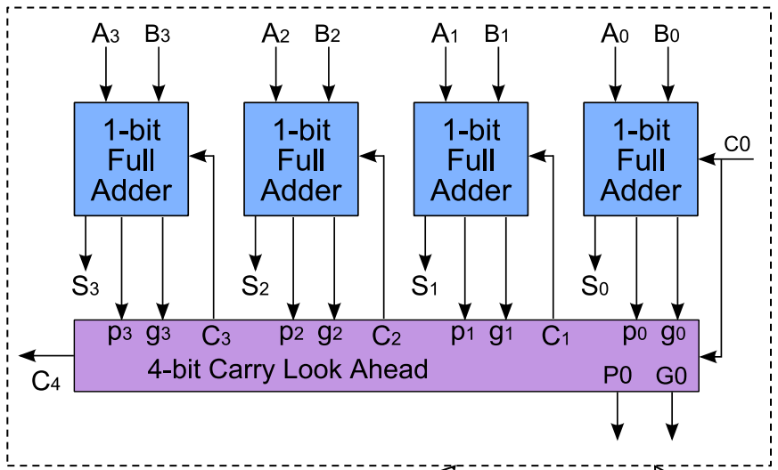<figcaption></figcaption></figure>

Using this fundamental block (4-bit carry-lookahead adder), we can build bigger adders. Figure 5.6 (a) shows a 32-bit carry-lookahead adder composed of **eight** 4-bit blocks. Each block contains a 4-bit ripple-carry adder and some lookahead logic to compute the carry out of the unit given the carry in, as shown in Figure 5.6 (b).&#x20;

<figure>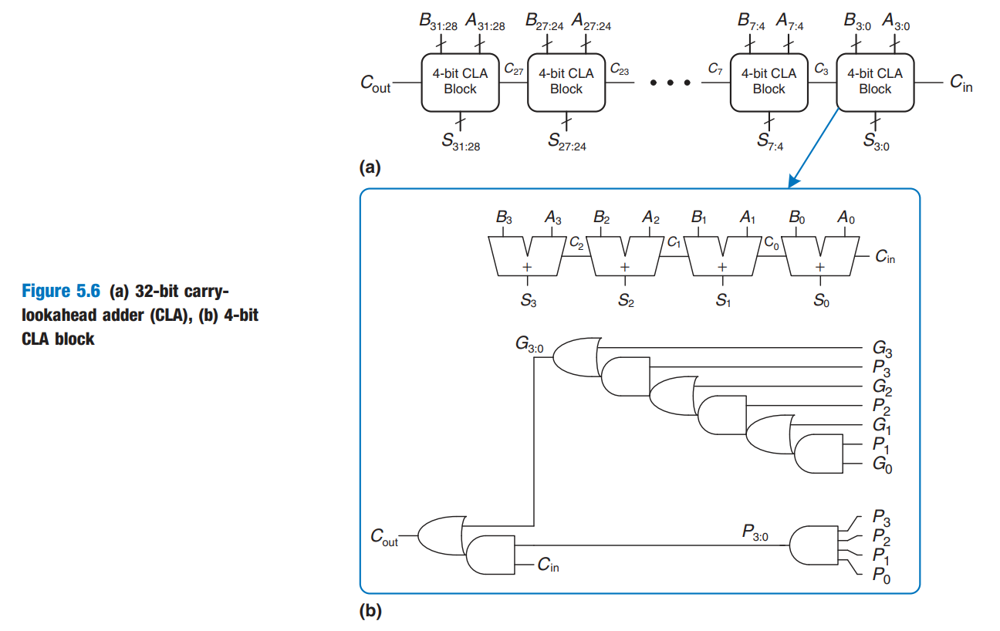<figcaption></figcaption></figure>


#### Image Explanation

1. The AND and OR gates needed to compute the single-bit generate and propagate signals, $$G_i$$ and $$P_i$$, from $$A_i$$ and $$B_i$$ are left out for brevity.
2. The block propagate ($$P_i$$) and generate ($$G_i$$) signals for 4-bit blocks ($$i$$ refers to the block number here),
   1. $$P_0=p_3p_2p_1p_0$$, $$P_0$$ is the same as $$P_{[3:0]}$$ shown in the figure above
   2. $$G_0=g_3+p_3(g2+p2(g1+p1g_0))$$, $$G_0$$ is the same as $$G_{[3:0]}$$ shown in the figure above.
3. The ripple effect is avoided within a unit, but the ripple carry effect will be present between units. Nevertheless, the delays are significantly lowe than the orginal ripple carry adder.


### Putting it all together

HDLs provide the `+` operation to specify a CPA. HDL Example 5.1 describes a CPA with carries in and out




```verilog
module adder #(parameter N = 8)
              (input  logic [N-1:0] a, b,
               input  logic         cin,
               output logic [N-1:0] s,
               output logic         cout);
  assign {cout, s} = a + b + cin;
endmodule
```





```verilog
module adder #(parameter N = 8)
              (input  [N-1:0] a, b,
               input          cin,
               output [N-1:0] s,
               output         cout);
  assign {cout, s} = a + b + cin;
endmodule
```




## Subtraction

Recall from [previous part](https://wenbo-notes.gitbook.io/ddca-notes/textbook/from-zero-to-one/number-systems#signed-binary-number-representation) that adders can add positive and negative numbers using [two's complement number representation](https://wenbo-notes.gitbook.io/ddca-notes/textbook/from-zero-to-one/number-systems#id-2s-complement). Substraction is almost as easy:

1. flip the sign of the second number
2. then add it


Flipping the sign of a two's complement number is done by inverting the bits and adding 1.


Thus, subtraction is performed with a single CPA by adding $$A+\bar B$$ with $$C_{\text{in}}=1$$. Figure 5.9 shows the symbol for a subtractor and the underlying hardware for performing $$Y=A-B$$.&#x20;

<figure>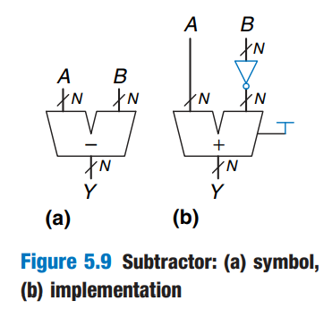<figcaption></figcaption></figure>


An N-bit subtractor needs **N NOT gates**. This is tricky! Don't just see from the figure and then deduce that only one NOT gate is needed!


HDL Example 5.2 describes a subtractor.




```verilog
module subtractor #(parameter N = 8)
                   (input  logic [N-1:0] a, b,
                    output logic [N-1:0] y);
  assign y = a - b;
endmodule
```





```verilog
module subtractor #(parameter N = 8)
                   (input  [N-1:0] a, b,
                    output [N-1:0] y);
  assign y = a - b;
endmodule
```




### Signed Addition/Subtraction

In the signed addition/subtraction, we have four flages, N(egative), Z(ero), C(array), V(Overflow), to indicate the status of our result. The following part will explain when certain flag is set,


Before that, let's make some clarifications or conventions first.

1. We denote the LSB at bit 0 or 0-th bit, so on and so forth for all the remaining bits.
2. When we add two N-bit numbers, we will get a N+1 bit number. However, we treat the MSB (the N-th bit) as the **carry bit**, and the remaining N bits are the **result**. So, again when we say the MSB of the **result**, we are referring to the (N-1)-th bit actually.


#### Signed Addition

<figure>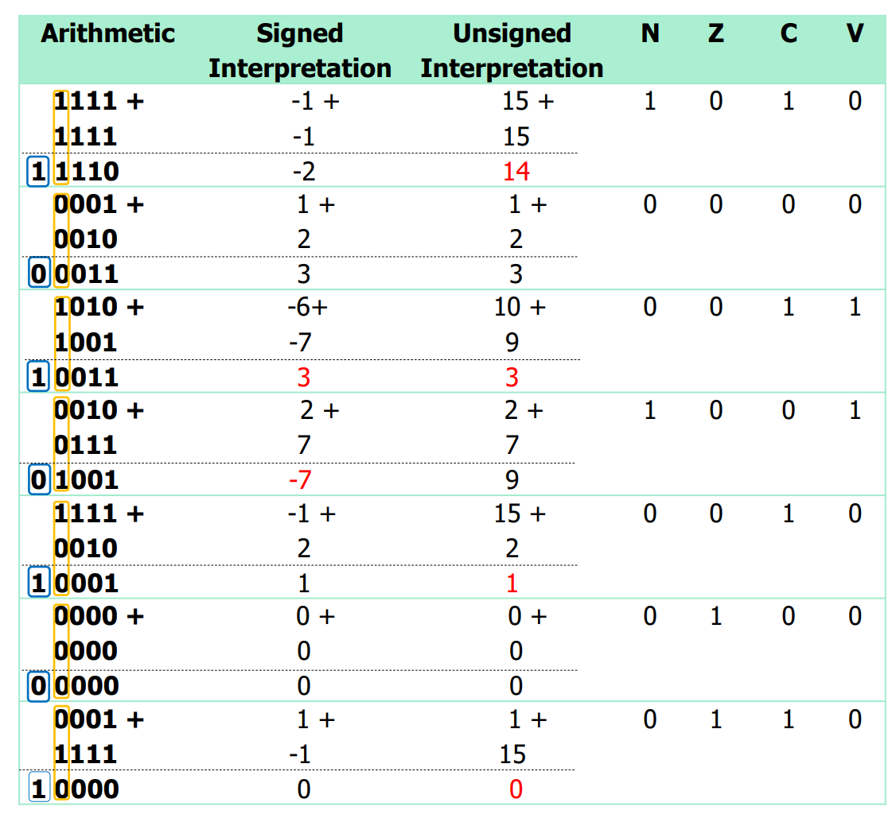<figcaption></figcaption></figure>

By observing the addition examples above, we may find out that

1. For _unsigned addition_, carry=1 indicates that the result is wrong.
2. For _signed addition_,
   1. Overflow occurs when (+ve) + (+ve) = (-ve) or (-ve) + (-ve) = (+ve), a.k.a, two negative number addition gives out a positive number or two positive number addition gives a negative number
      1. To determine the overflow flag, we always treat the two operands as **signed**! So, this process is just to see that if the sign bits (MSB) of the **operands** are the same, and is different from that of the **result** (the (N-1)-th bit), there is an overflow.
      2. Overflow can never occur when you add two numbers of different signs
      3. Carry and overflow are **unrelated** (However, carry is sometime called "unsigned overflow")
   2. Carry flag is set when the value in the <mark style="color:blue;">blue rectangle</mark> is one.
   3. Negative flag is determined by only looking at the MSB of the result. (the (N-1)-th bit actually)
   4. Zero flag is determined by only looking at the N-bit result.


#### Notes

1. In addition, there are some small tips
   1. N flag and Z flag cannot be 1 simultaneously.
   2. Z flag and V flag can be set simultaneously. e.g., 1000+1000=0000 with carry out 1, and the interpretation of the result to be 0.
2. The hardware as well as the instruction used for performing both signed and unsigned addition are the same
   1. The hardware doesn't know and doesn't care if we are dealing with signed or unsigned.
   2. Only the _interpretation_ of the result and/or the way the _condition codes_ are used are different.
   3. So, first use signed/unsigned to write out the two operands, then just do the binary addition on these two operands and derive the flags.


#### Signed Subtraction

<figure>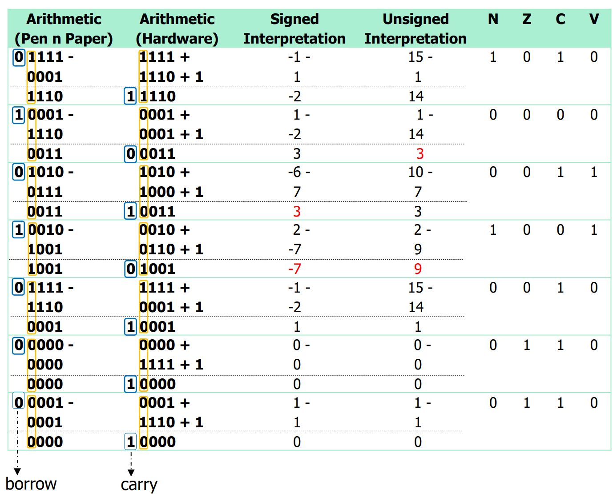<figcaption></figcaption></figure>

By observing the subtraction examples above, we can find out that

1. For _unsigned_ subtraction, **borrow** indicates that the result is wrong.
   1. In ARM, **carry** is just **NOT borrow**. However, in Intel, **carry** is **borrow**, but in subtraction, it will flip the carry bit to get the carry flag when it is subtraction.
2. For _signed_ subtrcation,
   1. Overflow occurs at when (+ve) - (-ve) = (-ve) or (-ve) - (+ve) = (+ve).
      1. And similar to the signed addition, we always treat the two operands as **signed**. So, if the sign bits (MSB) of the **operands** are different, and the **result** has a sign same as that of the second operand, there is an overflow.
      2. Overflow can never occur in subtraction when operands are of the **same sign**.
   2. Carry flag is set when you are looking at the hardware version. Or the flip the borrow in pen\&paper version.


#### Notes

1. The hardware as well as the instruction used for performing both signed and unsigned subtraction are the same
   1. The hardware doesn't know and doesn't care if we are dealing with signed or unsigned.
   2. Only the _interpretation_ of the result and/or the way the _condition codes_ are used are different.
   3. So, first use signed/unsigned to write out the two operands, then just do the binary subtraction on these two operands and derive the flags.


***

In summary, we know the following points from the human interpretation side,

1. When C = 1, it indicates the **unsigned addition result** is wrong.
2. When C = 0, it indicates that the **unsigned subtraction** **result** is wrong.
3. When V = 1, it indicates that both **signed addition** and **signed subtraction** result are wrong.

***

For RISC-V, NZCV is **irrelevant** only when ALU does the **addition**. But, it is still recommended to go through how each flag of the NZCV is generated during [addition](arithmetic-circuits.md#signed-addition).

Instead, in RISC-V, NZCV is **relevant** when ALU does the **subraction**. Again, it is important to go through how NZCV is generated during [subtraction](arithmetic-circuits.md#signed-subtraction). In RISC-V, the subtraction can be done in

* `sub`
* branch/slt variants

In pure `sub` instruction, the NZCV may not be that useful. But in branch/slt variants, this NZCV flag, which is not stored as bits for use by future instructions, becomes much more useful. The different comparisons, like `eq`, etc, are implemented using these NZCV flags.

| Comparison | Signed/Unsigned | Condition | Implemented as | Uses                  |
| ---------- | --------------- | --------- | -------------- | --------------------- |
| eq         | Both            | A == B    | Z              | Z flag                |
| ne         | Both            | A ≠ B     | ¬Z             | Z flag                |
| lt         | Signed          | A < B     | N ⊕ V          | Signed overflow logic |
| ge         | Signed          | A ≥ B     | ¬(N ⊕ V)       | Signed overflow logic |
| ltu        | Unsigned        | A < B     | ¬C             | Borrow logic          |
| geu        | Unsigned        | A ≥ B     | C              | Borrow logic          |


#### Table Explanation

1. For the `lt` and `ge`, whch are for signed numbers, we must first make sure there is **no overflow**, then check the N flag.
2. For the `ltu` and `geu`, use the ARM borrow logic to understand. If `A<B`, then A-B will need a borrow, thus the carry flag is 0, and vice versa.
3. `sltu` is useful to check whether the subtraction of two numbers will need a **borrow** or not.


<details>

<summary>Multi-word arithmetic in RISC-V</summary>

Suppose we want to do 64-bit addition and subtraction in RISC-V. We use `[t0:t1]` to store the 64-bit number A and `[t2:t3]` to store the 64-bit number B. And `[t4:t5]` to store the final result.

For the addition, we have,


```armasm
add   t4, t0, t2        # low  word sum
sltu  t6, t4, t0        # carry = (sum < t0)
add   t5, t1, t3        # high word sum
add   t5, t5, t6        # add carry
```


For the subtraction, we have,


```armasm
sub   t4, t0, t2        # low  word diff
sltu  t6, t0, t2        # borrow = (t0 < t2)
sub   t5, t1, t3        # high word diff
sub   t5, t5, t6        # add carry
```


So, in summary, we have

| Operation   | Condition for carry/borrow | Equivalent test            | RISC-V instruction |
| ----------- | -------------------------- | -------------------------- | ------------------ |
| Addition    | carry                      | `(sum < A)` or `(sum < B)` | `sltu t6, sum, t0` |
| Subtraction | borrow                     | `(A < B)`                  | `sltu t6, t0, t2`  |

</details>

## Comparators

A _comparator_ determines whether two binary numbers are equal or if one is greater or less than the other. A comparator receives two N-bit binary numbers A and B. There are two common types of comparators.

* A _equality comparator_ produces a single output indicating whether A is equal to B (`A==B`).
* A _magnitude comparator_ produces one or more outpus indicating the relative values of A and B.



**Equality comparator**

The eqaulity comparator is the simpler piece of hardware. Figure 5.11 shows the symbol and implementation of a 4-bit equality comparator. It first checks to determine whether the corresponding btis in each column of A and B are equal using XNOR gates. The numbers are equal if all of the columns are equal.

<figure>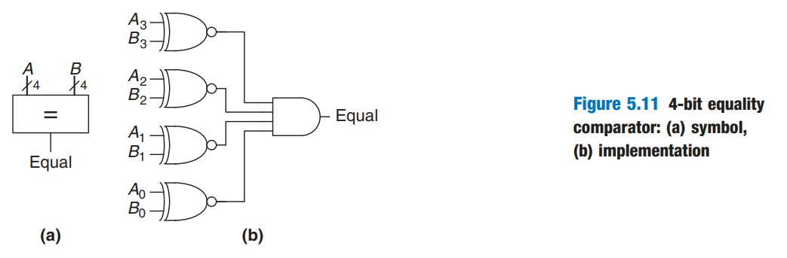<figcaption></figcaption></figure>



**Magnitude comparator**

Magnitude comparison is usually done by computing `A-B` and looking at the sign (most significant bit) of the resulf as shown in Figure 5.12. If the result is negative (e.g., the sign bit is 1), then A is less than B. Otherwise A is greater than or equal to B.

<figure>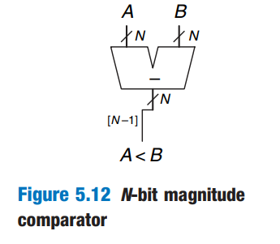<figcaption></figcaption></figure>


Here, the \[N-1] means the output is the $$(N-1)^{\text{th}}$$ bit of the result N.&#x20;




HDL Example 5.3 shows how to ues various comparison operations.




```verilog
module comparator #(parameter N = 8)
                   (input  logic [N-1:0] a, b,
                    output logic        eq, neq, lt, lte, gt, gte);
  assign eq  = (a == b);
  assign neq = (a != b);
  assign lt  = (a < b);
  assign lte = (a <= b);
  assign gt  = (a > b);
  assign gte = (a >= b);
endmodule
```





```verilog
module comparators #(parameter N = 8)
                    (input  [N-1:0] a, b,
                     output         eq, neq,
                     output         lt, lte,
                     output         gt, gte);
  assign eq  = (a == b);
  assign neq = (a != b);
  assign lt  = (a < b);
  assign lte = (a <= b);
  assign gt  = (a > b);
  assign gte = (a >= b);
endmodule
```




## ALU

An _Arithmetic/Logical Unit_ (ALU) combines a variety of mathematical and logical operations into a single unit. For example, a typical ALU might perform addition, subtraction, magnitude comparison, AND, and OR operations. The ALU forms the heart of most computer systems.

Figure 5.14 shows the symbol for an $$N$$-bit ALU with N-bit inputs and outputs.

<figure>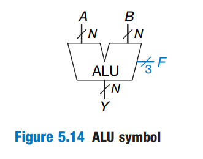<figcaption></figcaption></figure>

The ALU receives a control signal F that specifies which function to perform. Table 5.1 lists typical functions that the ALU can perform.

<figure><figcaption></figcaption></figure>

Figure 5.15 shows an implementation of the ALU.

<figure>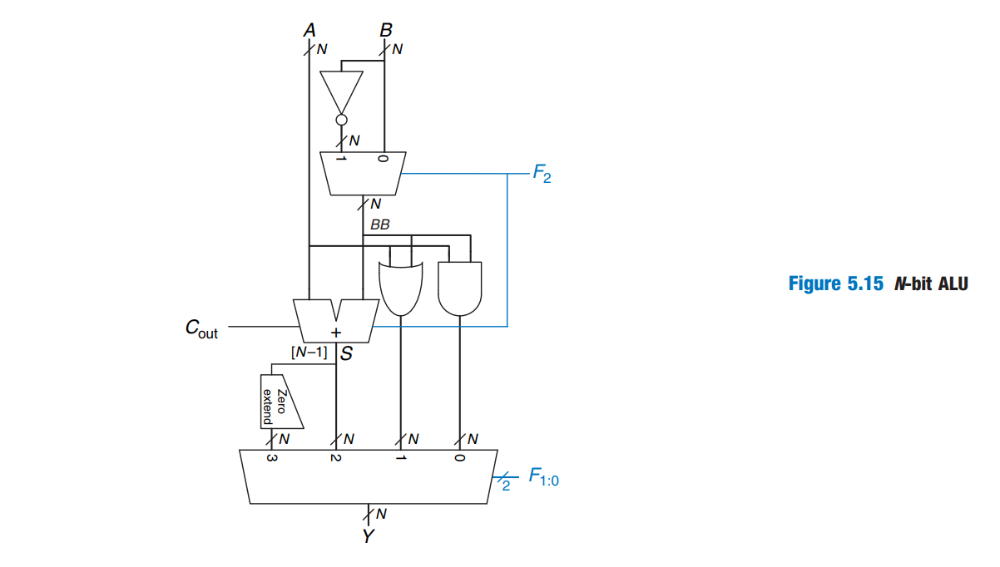<figcaption></figcaption></figure>


#### Image Explanation

1. $$F_2$$ is also the carry in to the adder.
2. In two's complement arithmetic, $$\bar B+1=-B$$.
3. When $$F_{\text{[2:0]}}=111$$, the ALU performs the _set if less than_ (SLT) operation. When $$A<B$$, $$Y=1$$. Otherwise, $$Y=0$$. In other words, Y is set to 1 if A is less than B.
   1. SLT is performed by computing `S=A-B`. If S is negative (e.g., the sign bit is set), A is less than B. The _zero extend unit_ produces an N-bit output by concatenating is 1-bit input with 0's in the most significant bits. The sign bit ( $$(N-1)^{\text{th}}$$ bit) of S is the input to the zero extend unit.
4. The AND and OR gate shown in the figure above both need **32 2-input** AND/OR gate to implement! **NOT One!**
5. The multiplexer to select whether one of the input sources is the $$N$$-bit $$\bar B$$ or $$B$$ can be implemented using $$N$$ 2-input [XOR gates](https://wenbo-notes.gitbook.io/ddca-notes/lab/resources/verilog-lifesaver#hint), where one input of the XOR gate is 1-bit from the $$N$$-bit $$B$$, the other is from the 1-bit signal $$F_2$$.


Some ALUs produce extra outputs, called _flags_, that indicate information about the ALU output. For example, an _overflow flag_ indicates that the result of the adder overflowed. A _zero flag_ indicates that teh ALU output is 0.

### HDL Implementation

The HDL for an $$N$$-bit ALU is shown as follows




```verilog
module alu32(input  logic [31:0] A, B,
             input  logic [2:0]  F,
             output logic [31:0] Y);
  logic [31:0] S, Bout;
  
  assign Bout = F[2] ? ~B : B;
  assign S = A + Bout + F[2];
  
  always_comb
    case (F[1:0])
      2'b00: Y <= A & Bout;
      2'b01: Y <= A | Bout;
      2'b10: Y <= S;
      2'b11: Y <= S[31];
    endcase
endmodule
```




> **TODO:** Wait for adding LOL.



## Shifters and Rotators

_Shifters_ and _rotators_ move bits and multiply or divide by powers of 2. There are several kinds of commonly used shifters:



#### **Logical shifter**

It shifts the number to the left (LSL) or right (LSR) and fills empty spots with 0's. For example,

```
11001 LSR 2 = 00110; 11001 LSL 2 = 00100;
```



#### **Arithmetic shifter**

It is the same as logical shifter, but on right shifts fills the most significant bits with a copy of the old most significant bit (msb). This is useful for multiplying and dividing signed numbers. Arithmetic shift left (ASL) is the same as logical shift left (LSL) because we will fill the empty spots at **righ**t with 0, this doesn't matter much. For example,

```
11001 ASR 2 = 11110; 11001 ASL 2 = 00100;
```



#### **Rotator**

It rotates number in **circle** such that empty spots are filled with bits shifted off the other end.

```
11001 ROR 2 = 01110; 11001 ROL 2 = 00111;
```



A N-bit shifter can be built from N N:1 multiplexers. This input is shifted by 0 to N-1 bits, depending on the value of the $$\log_2N$$-bit select lines (`shamt`). Figure 5.16 shows the symbol and hardware of 4-bit shifters. The operators `<<`, `>>`, and `>>>` typically indicate shift left, logical shift right, and arithmetic shift right, respectively.

<figure>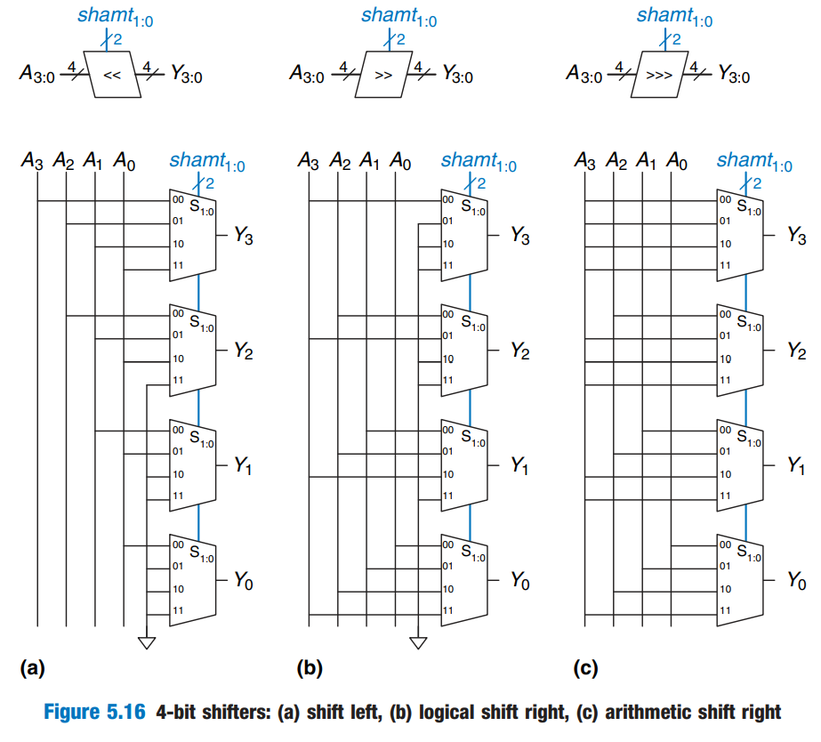<figcaption></figcaption></figure>


#### Image Explanation

1. For the Figure 5.16(b), which is about `srl` (shift right logical), we can divide it into four cases
   1. `shamt = 00` (no shift), then output $$Y_{[3:0]}=A_{[3:0]}$$.
   2. `shamt = 01` (srl 1 bit), then output $$Y_{[3:0]}=\{0,~A_{[3:1]}\}$$
   3. `shamt = 10` (srl 2 bits), then output $$Y_{[3:0]}=\{00,~A_{[3:2]}\}$$
   4. `shamt = 11` (srl 3 bits),  then output $$Y_{[3:0]}=\{000,~A_3\}$$
2. Such a shifter shown in the Figure 5.16 which can combinationally shift an input by an arbitrary amount is called a **barrel shifter**.


If we want to use this idea to build a [32-bit shifter](#user-content-fn-4)[^4], we need 32 x 32-to-1 multiplexer, which has a very high hardware usage. To solve this problem, let's introduce the [hardware-efficient shifter](arithmetic-circuits.md#hardware-efficient-shifter).

### Hardware-efficient Shifter

This hardware-efficient shifter only needs 5 x 32 x 2-to-1 multiplexer. And below is the implementation for the 32-bit `srl` shifter.

<figure>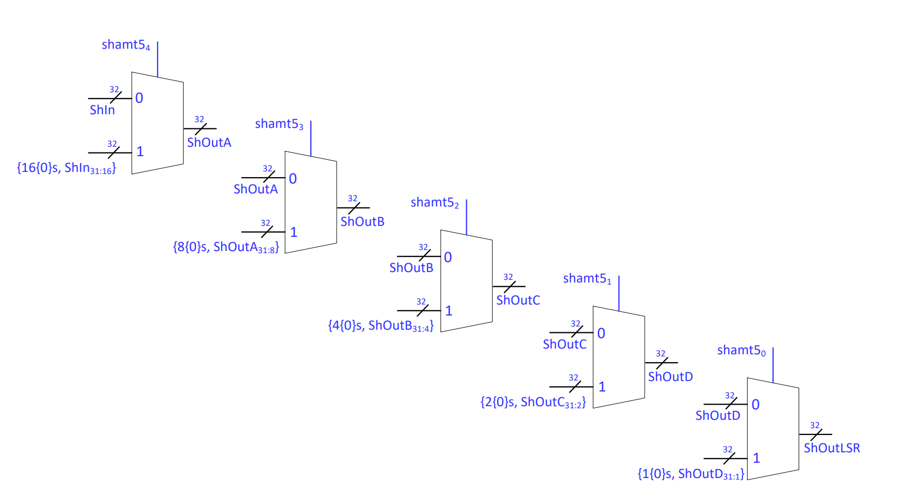<figcaption></figcaption></figure>

This shifter uses a **logarithmic, staged design** that decomposes any shift amount into a combination of small, power-of-two shifts. Each stage doubles the shift capacity, making the circuit both elegant and efficient.

To add support for `sll` and `sra`, the easiest way is to implement a 3-to-1 multiplexer, controlled by the shift type info from the instruction.


```verilog
module shiftByNPowerOf2
//module Shifter
#(
    parameter i = 0
)  // exponent
(
    input [1:0] Sh,
    input flagShift,
    input [31:0] ShTempIn,
    output reg [31:0] ShTempOut
);

    always @(Sh, ShTempIn, flagShift) begin
        if (flagShift)
            case (Sh)
                2'b00:   ShTempOut = {ShTempIn[31-2**i:0], {2 ** i{1'b0}}};  // SLL
                2'b10:   ShTempOut = {{2 ** i{1'b0}}, ShTempIn[31:2**i]};  // SRL    
                2'b11:   ShTempOut = {{2 ** i{ShTempIn[31]}}, ShTempIn[31:2**i]};  // SRA
                //2'b01: ShTempOut = { ShTempIn[2**i-1:0], ShTempIn[31:2**i] } ;  	// ROR is not supported by RISC-V
                default: ShTempOut = ShTempIn;  // invalid
            endcase
        else ShTempOut = ShTempIn;
    end

endmodule

```


However, more efficient ways to combine the shifts exist though. For example, when $$\text{shamt5}_4=1$$, the input can be from another small "multiplexer[^5]" that gives

* $$\{16\{0\},~\text{ShIn}_{31:16}\}$$ for `srl`
* $$\{16\{\text{ShIn}_{31}\},~\text{ShIn}_{31:16}\}$$ for `sra`

```verilog
// Improved code for uploading!
```

## Multiplication

In the [previous part](https://wenbo-notes.gitbook.io/ddca-notes/textbook/from-zero-to-one/number-systems#multiplication), we have seen that multiplication is nothing but shift then add, by shift, we form the _partial products_.

In general, a $$N$$x$$N$$ multiplier multiplies two $$N$$-bit numbers and produces a 2$$N$$-bit result. Multiplication of 1-bit binary numbers is equivalent to the AND operation, so AND gates are used to form the partial products.

### Array Multiplier

Figure 5.18 shows the symbol, function, and implementation of an **unsigned** 4x4 multiplier.

<figure>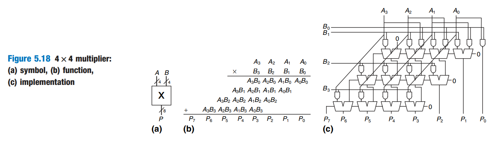<figcaption></figcaption></figure>

The unsigned multiplier receives the multiplicand and multiplier, $$A$$ and $$B$$, and produces the product $$P$$. Figure 5.18(b) shows how partial products are formed. Each partial product is a single multipler bit ($$B_3,B_2,B_1,\text{ or }B_0$$) AND the mutiplicand bits ($$A_3,A_2,A_1,A_0$$). With $$N$$-bit operands, there are $$N$$ partial products and $$N-1$$ stages of 1-bit adders. For example, for a 4x4 multiplier, the partial product of the first row is $$B_0$$ AND ($$A_3,A_2,A_1,A_0$$). This partial product is added to the shifted second partial product, $$B_1$$ AND ($$A_3,A_2,A_1,A_0$$). Subsequent rows of AND gates and adders form and add the remaining partial products.

This array multiplier is **combinational** because the whole multiplication (all ANDs and adds) happens in **one clock cycle**. Maybe [this video](https://www.youtube.com/watch?v=lf8wcTRb8NY) will be good on explaining the critical path and hardware analysis of the array multiplier.

### Sequential Multiplier

Suppose that we may not want to do the mutiplication in one single cycle, we can use the **sequential multiplier**. Its workflow is given as follows,

<figure>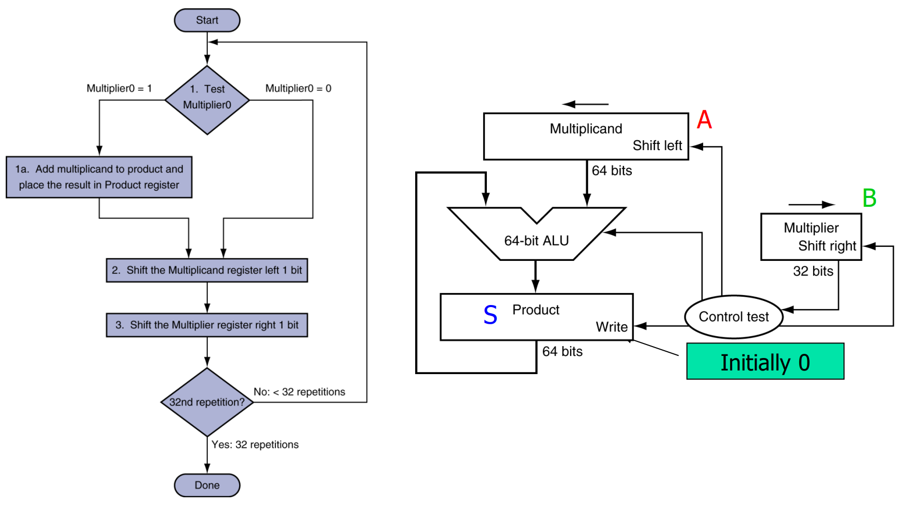<figcaption></figcaption></figure>

To understand it better, let's step through an example. Let `S=000000, A=011, B=101` (initial values)

1. $$B_0=1$$ (original $$B_0=1$$)
   1. add: `S = S + A = 000000 + 000011 = 000011`
   2. `A = A << 1;` Thus `A = 000110`
   3. `B = B >> 1;` Thus `B = 010`
2. $$B_0=0$$ (original $$B_1=0$$)
   1. no addition required here
   2. `A = A << 1;` Thus `A = 001100`
   3. `B = B >> 1;` Thus `B = 001`
3. $$B_0=1$$ (original $$B_2=1$$)
   1. add: `S = S + A = 000011 + 001100 = 001111`

#### Improved Sequential Multiplier

The idea is to always align $$A$$ to the "high-side" (3 most significant bits of S in 3-bit multiplication) and then perform the addition. Then shift S to the right and do not shift A. And the least significant bits of S populated with B, which keeps getting shifted to the right with S (avoids the need for an extra register for B). Its workflow is shown as follows,

<figure>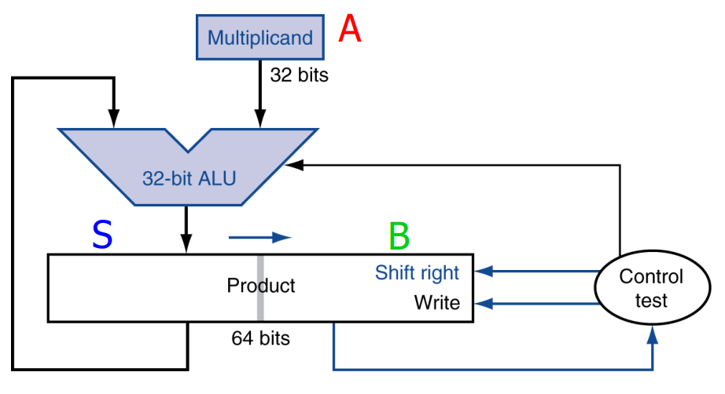<figcaption></figcaption></figure>

Again, stepping through an example will make it easier to understand. Let `S = 0000101 (000B), A = 011` (initial values)

1. $$S_0=1$$ (original $$B_0=1$$)
   1. add `S = S + A000 = 000101 + 011000 = 011101`
   2. `S = S >> 1;` Thus `S = 001110`
2. $$S_0=0$$ (original $$B_1=0$$)
   1. no addition required
   2. `S = S >> 1;` Thus `S = 000111`
3. $$S_0=1$$ (original $$B_2=1$$)
   1. add `S = S + A000 = 000111 + 011000 = 011111`
   2. `S = S >> 1;` Thus `S = 001111`, which is the final result


But ther e is a problem with the improved sequential multiplier, what if the 32-bit ALU generates a carry out? Where should the carry out go?


### HDL Implementation

The HDL for a multiplier is in HDL Example 5.4. As with adders, the synthesis tools may pick the most appropriate design given the timing constraints.




```verilog
module multiplier #(parameter N = 8)
                   (input  logic [N-1:0]    a, b,
                    output logic [2*N-1:0] y);
  assign y = a * b;
endmodule
```





```verilog
module multiplier #(parameter N = 8)
                   (input  [N-1:0]    a, b,
                    output [2*N-1:0] y);
  assign y = a * b;
endmodule
```




## Division


Before continue this section, let's make some convention. Given $$A\div B = Q+R$$, we say

* $$A$$ is the dividend
* $$B$$ is the divisor
* $$Q$$ is the quotient
* $$R$$ is the remainder


Binary division can be performed using the following algorithm for $$N$$-bit unsigned numbers in the range $$[0,~2^N-1]$$.


```
R' = 0
for i = N-1 to 0
    R = {R' << 1, A_i}
    D = R - B
    if D < 0 then Q_i = 0, R' = R // R < B
    else          Q_i = 1, R' = D // R >= B
R = R'
```


1. The _partial remainder_ $$R$$ is initialized to 0 ($$R'=0$$), and the most significant bit of the **dividend** $$A$$ becomes the least significant bit of $$R$$ ($$R=\{R'<<1,~ A_i\}$$).
2. The **divisor** $$B$$ is subtracted from this partial remainder to determine whether it fits ($$D = R-B$$).
   1. If the difference $$D$$ is negative (e.g., the sign bit of $$D$$ is 1), then the quotient bit $$Q_i$$ is 0 and the difference is discarded.
   2. Else, the difference $$D$$ is positive. Then the quotient bit $$Q_i$$ is 1 and the remainder $$R$$ becomes $$D$$.
   3. In any event, the partial remainder is then doubled (left-shited by one column), the next most significant bit of $$A$$ becomes the least significant bit of $$R$$, and the process repeats.
3. The process (step 2) repeats and the result satisfies $$\frac{A}{B}=Q+\frac{R}{B}$$.


$$N$$-bit operands yield $$N$$-bit quotient and remainder. Here, we want to show that the divisor and quotient and remainder shares the same bit-width, but actually the dividend can have $$2N$$ bits.


Below a more straight-forward example,

<figure>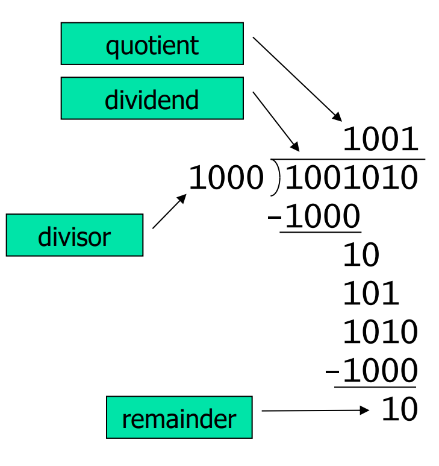<figcaption></figcaption></figure>

This approach is called **long division approach**, which is basically similar to what we have seen above. But it is in a more straight-forward way

1. If divisor $$\leq$$ dividend bits
   1. 1 bit in quotient, subtract
2. Otherwise
   1. 0 bit in quotient, bring down next dividend bit


This illustration is more straight-forward, but less complete. Thus it is good for doing the hand-by-hand calculation. But for the systematic approach to implement in the hardware, please go review the first pseudocode.


### Array Divider

Figure 5.22 shows a schematic of a 4-bit array divider. The divider computes $$A/B$$ and produces a quotient $$Q$$ and a remainder $$R$$. The legend shows the symbol and schematic for each block in the array divider.

<figure>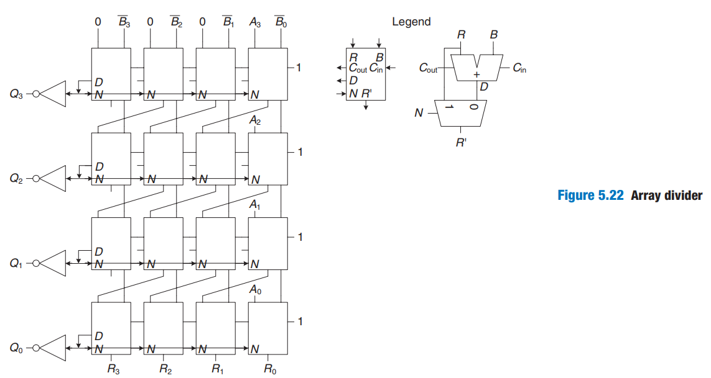<figcaption></figcaption></figure>

1. Each row performs one iteration of the division algorithm. Specifically, each row calculates the difference $$D = R-B$$. (Recall that $$R+\bar B+1=R-B$$).
2. The multiplexer select signal, $$N$$ ( for **N**egative), receives 1 when a row's difference $$D$$ is negative. So $$N$$ is driven bby the most significant bit of $$D$$, which is 1 when the difference is negative.
3. Each quotient bit ($$Q_i$$) is 0 when $$D$$ is negative and 1 otherwise. The multiplexer passes $$R$$ to the next row if the difference is negative and $$D$$ otherwise. (In the legend)
4. The following row shifts the new partial remainder left by one bit (a good example to show that "shifting is just rewiring"), appends the next most significant bit of $$A$$, and then repeats the process.

The delay of an $$N$$-bit array divider increases proportionally to $$N^2$$ because the carry must ripple through all $$N$$ stages in a row before the sign is determined and the multiplexer can select $$R$$ or $$D$$. This repeats for all $$N$$ rows.

### Sequential Divider

Similar to the [#sequential-multiplier](arithmetic-circuits.md#sequential-multiplier "mention"), we can also do the divider sequentially,

<figure>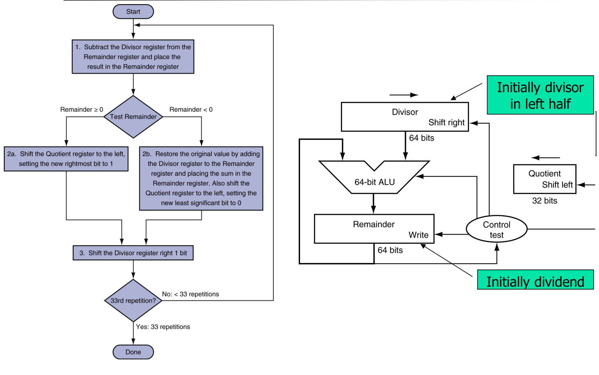<figcaption></figcaption></figure>

To understand it better, again, let's step through an example. For example, 00000111 (dividend) is divided by 0010 (divisor).

<figure>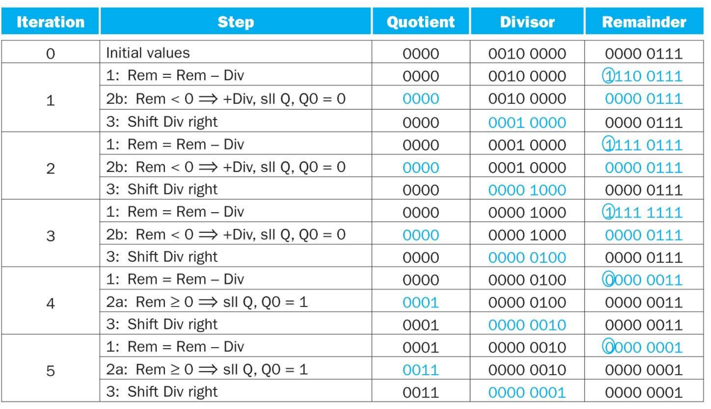<figcaption></figcaption></figure>

### Signed Multiplication/Division



#### Signed vs. Unsigned Multiplication

When you multiply two **n-bit numbers**,

* the **lowest n bits** (the _least significant half_) of the product are **identical** whether the numbers are interpreted as signed or unsigned.
* Only the **upper n bits** differ (because sign extension affects those).

That’s why:

* `MUL` (in RISC-V) gives just the _lower n bits_.
* `MULH` / `MULHU` (RISC-V) give the _upper n bits_, for signed/unsigned respectively.



#### Macro-op fusion

“Macro-op fusion” means the processor can **fuse** `mul` and `mulh` internally and perform **a single 64-bit multiply**, returning both halves if needed.

We know that RISC-V has **separate instructions** for multiplication:

* `mul` → lower 32 bits of product
* `mulh` → upper 32 bits (signed × signed)
* `mulhu` → upper 32 bits (unsigned × unsigned)
* `mulhsu` → upper 32 bits (signed × unsigned)

If we implement them _literally_, it looks like three separate multipliers are needed. But **in hardware**, we don’t have to do three full multiplications. Instead, we can compute _one 64-bit result_ internally and just output different parts or interpret sign bits differently.

So, even though RISC-V has multiple `mul` variants, we don’t necessarily perform multiple physical multiplications.



#### Signed/Unsigned always matters in Division

**Unlike multiplication**, signed and unsigned division _don’t share any bits_ of result. We can’t reuse the same division result for both. For example,

| Dividend | Divisor | Signed?            | Result                                                                       | Notes           |
| -------- | ------- | ------------------ | ---------------------------------------------------------------------------- | --------------- |
| 6        | 3       | signed or unsigned | 2                                                                            | Same either way |
| 6        | -3      | signed             | -2                                                                           | (because sign)  |
| 6        | -3      | unsigned           | invalid (divisor interpreted as 4294967293 if 32-bit!)                       |                 |
| -6       | 3       | signed             | -2                                                                           | okay            |
| -6       | 3       | unsigned           | big number ≈ 0x55555554 (because -6 -> 0xFFFFFFFA interpreted as 4294967290) |                 |

So **division results** sometimes **completely change** depending on whether you treat numbers as signed or unsigned — even if you use the same bit pattern.



#### Simple trick for signed multiplication/division

Signed division (and signed multiplication) can be done using the same _unsigned_ operation unit if you:

1. Record the sign of both operands.
2. Take their absolute values (convert negatives to positives).
3. Perform **unsigned division** (or multiplication).
4. If exactly one operand was negative, negate the result.

But there are some wierd scenarios. For example, if we want to do the following multiplication,

$$
-2^{31}\times-1=2^{31}
$$

The result cannot fit into a 32-bit register. This is an overflow (same trick to detect overflow as we have discussed in [signed addition/subtraction](arithmetic-circuits.md#signed-addition))!



## Number Systems

Computers operate on both integers and fractions. So far, we have only considered representing signed or unsigned integers. This section introduces fixed- and floating-point number systems that can represent **rational numbers**.

* [Fixed-point numbers](arithmetic-circuits.md#fixed-point-number-systems) are analogous to decimals; some of the bits represent the integer part, and the rest represent the fraction
* Floating-point numbers are analogous to scientific notation, with a mantissa and an exponent.

### Fixed-Point Number Systems

_Fixed-point notation_ has an implied _binary point_ between the integer and fraction bits, analogus to the decimal point between the integer and fraction digits of an ordinary decimal number. For example, Figure 5.23(a) shows a fixed-point number with four integer bits and four fraction bits. Figure 5.23(b) shows the implied binary point in blue, and Figure 5.23(c) shows the equivalent decimal value.

<figure>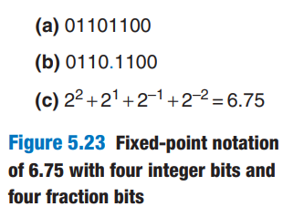<figcaption></figcaption></figure>


#### Notes

1. This notation is not so standard.
2. The position of the binary point affects the _arnge_ (difference between the largest and smallest representable numbers) and _precision_ (smallest possible difference between any two numbers)


#### Signed Fixed-Point

Signed fixed-point numbers can use either two's complement or sign/magnitude notation. Figure 5.24 shows the fixed-point representation of $$-2.375$$ using both notations with four integer and four fraction bits.

<figure>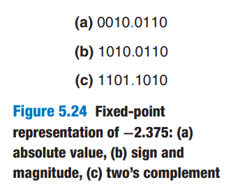<figcaption></figcaption></figure>

The implicit binary point is shown in <mark style="color:blue;">blue</mark> for clarity.

* In **sign/magnitude form**, the most significant bit is used to indicate the sign.
* The **two's complement representation** is formed by inverting the bits of the **absolute value** and adding 1 to the least significant (righmost) bit. In this case, the least significant bit position is in the $$2^{-4}$$ column.
  * In this example, we have: 00100110 -> 11011001 -> 11011010


In general, we use _Ua.b_ to denote an **unsigned fixed-point number** with _a_ integer bits and _b_ fraction bits. _Qa.b_ denotes a **signed** (two's complement) fixed point number with _a_ integer bits (including the sign bit) and _b_ fractional bits.


<details>

<summary>A trick to quickly find the binary representation of a fraction using fixed-point notation</summary>

1. First, write the fraction is to $$\frac{A}{B}$$, where $$A$$ is any integer, and $$B$$ is an integer which is $$2^n$$.
2. Use binary to represent $$A$$ and find out $$n$$.
3. Move the binary point from behind the rightmost bit $$n$$ bits forward.

For example, we want to calculate $$0.625$$,

1. $$0.625=\frac{5}{8}=\frac{5}{2^3}$$
2. $$5=101$$
3. $$0.625=0.101$$
4. Fit into eight bit representation, it will become 0000.1010

</details>

#### Fixed-Point Calculation

> Fixed-point **addition** and **subtraction** is simple because the position of the binary point won't change. But **multiplication** and **division** are a bit tedious. So, here we will only talk about the fixed-point number **multiplication** and **division**.

Actually, from the small [trick](arithmetic-circuits.md#a-trick-to-quickly-find-the-binary-representation-of-a-fraction-using-fixed-point-notation) we mentioned above, we see that fixed-point notation has an implicit **scale factor**, which is $$2^{\text{number of fraction bits}}$$.

For example, If we have **2 fractional bits**, the scale factor is $$2^2=4$$. That means every stored integer actually represents $$\text{stored/4}$$. So, `00000110₂ = 6` actually means $$6/4=1.5$$.

Knowing this, we can clearly see that when we multiply two numbers in fixed-point, both are _already scaled_. For example, let's compute

| Variable | Actual value | Stored (binary) | Decimal equivalent (stored) |
| -------- | ------------ | --------------- | --------------------------- |
| a        | 1.5          | 00000110        | 6                           |
| b        | 2.5          | 00001010        | 10                          |

When we do `a*b`, we will have `00111100₂`. Since we scaled each input by $$2^2=4$$, the product is scaled by $$4*4=16=2^4$$. So to get back to the same scalor factor, which is 2 fractional bits, we must divide the product by 4 (shift right by 2 bits). Thus, we have `00111100₂ >> 2 = 00001111₂`. This gives our stored value to be 15 and our actual value to be $$15/4=3.75$$.

> But, in the above scenario, we assumed a short multiply, e.g., n-bit × n-bit = n-bit.

When we want to do a long multiplication,

* an **overflow** may happen, which basically is that our result bits cannot fit the multiplication result.
* an **underflow** may also happen, which means the multiplication result is representable, but **not accurately**, because our fractional bits are too few.

### Floating-Point Number Systems

Floating-point numbers are analogous to scientific notation. They circumvent the limitation of having a constant number of integer and
&#x20;fraction bits, allowing the representation of very large and very small
&#x20;numbers. Like scientific notation, floating-point numbers have a _sign_,
&#x20;_mantissa_ (M), _base_ (B), and _exponent_ (E), as shown below

$$
\pm M\times B^E
$$

For example, the number $$4.1\times10^3$$ is the decimal scientific notation for 4100. It has a mantissa of 4.1, a base of 10, and an exponent of 3. The
&#x20;decimal point _floats_ to the position right after the most significant digit. Floating-point numbers are base 2 with a binary mantissa. 32 bits are
&#x20;used to represent 1 sign bit, 8 exponent bits, and 23 mantissa bits.

The exponent
&#x20;needs to represent both positive and negative exponents. To do so, floating point uses a _biased_ exponent, which is the original exponent plus a constant bias. 32-bit floating-point uses a bias of 127. For example, for the
&#x20;exponent 7, the biased exponent is 7 + 127 = 134 = 10000110<sub>2</sub>. For
&#x20;the exponent −4, the biased exponent is: −4 + 127 = 123 = 01111011<sub>2</sub>.


This notation conforms to the IEEE 754 floating-point standard. In this notation, the first bit of the fraction/mantissa is **always** 1.


To put it all together, let's examine two examples:



#### Represent unsigned number in IEEE 754

Suppose we want to represent 228<sub>2</sub> = 11100100<sub>2</sub> = 1.11001<sub>2</sub> x 2<sup>7</sup> using floating point system, it will be as follows,



<figure>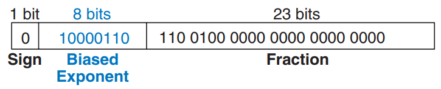<figcaption></figcaption></figure>

#### Represent signed number in IEEE 754

Suppose we want to write -58.25<sub>2</sub> in floating point (IEEE 754)

1. Convert decimal to binary: 58.25<sub>2</sub> = 11101001<sub>2</sub>
2. Write in binary scientific notation: 1.1101001 x 2<sup>5</sup>
3. Fill in fields: Sign bit = 1, Biased Expoenent = 5 + 127 = 10000100<sub>2</sub>, 23 fraction bits = 110 1001 0000 0000 0000 0000.

<figure>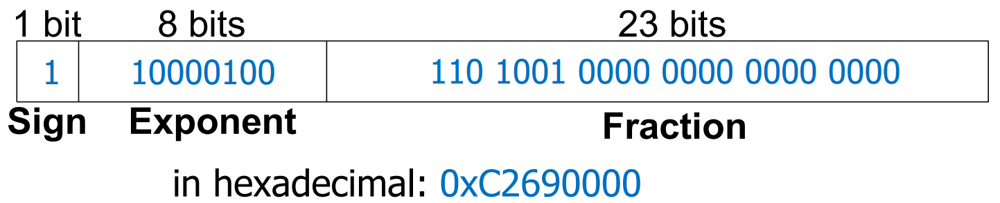<figcaption></figcaption></figure>



#### Special Cases

The IEEE floating-point standard has special cases to represent numbers
&#x20;such as zero, infinity, and illegal results.

<figure>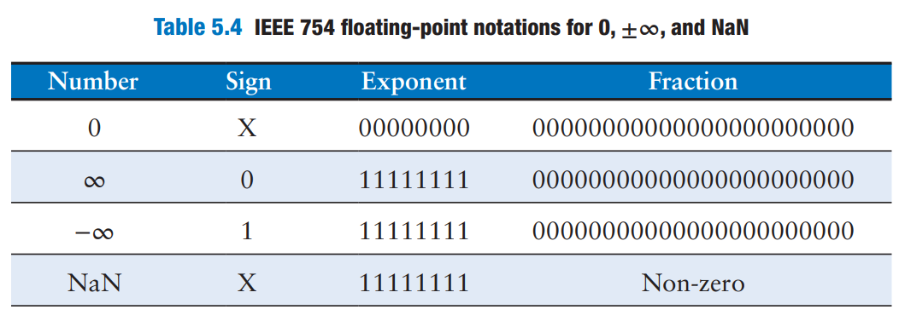<figcaption></figcaption></figure>

#### More formats

So far, we have examined 32-bit floating-point numbers. This format is
&#x20;also called _single-precision_, _single,_ or _float_. The IEEE 754 standard also defines 64-bit _double-precision_ numbers (also called _doubles_) and 128-
bit _quadruple-precision_ numbers (also called _quads_) that provide greater
&#x20;precision and greater range. Table 5.5 shows the number of bits used for
&#x20;the fields in each format.

<figure>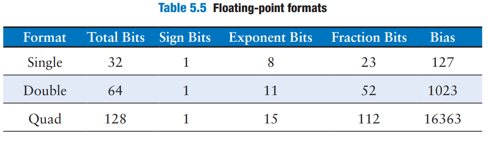<figcaption></figcaption></figure>

#### Rounding

Arithmetic results that fall outside of the available precision must round
&#x20;to a neighboring number. The rounding modes are

1. round down,
2. round
   &#x20;up,
3. [round toward zero](#user-content-fn-6)[^6]
4. /, and
5. round to nearest.

The default rounding
&#x20;mode is round to nearest. In the round-to-nearest mode, if two numbers
&#x20;are equally near, the one with a 0 in the least significant position of the
&#x20;fraction is chosen.

For example, we want to round 1.100101 (1.578125) to only 3 fraction bits

1. round down: 1.100
2. round up: 1.101
3. round toward zero: 1.100
4. round to nearest: 1.101 (1.625 is close to 1.578125 than 1.5 is)


#### Notes

1. A number _overflows_ when its magnitude is too large to
   &#x20;be represented.
2. A number _underflows_ when it is too tiny to be
   &#x20;represented.

In round-to-nearest mode, **overflows** are rounded up to $$\pm\infty$$
&#x20;and **underflows** are rounded down to 0.


#### Floating-Point Calculation



#### Addition

The steps for adding floating-point numbers with the same sign are as follows:

1. Extract exponent and fraction bits.
2. Prepend leading 1 to form the mantissa.
3. Compare exponents.
4. Shift smaller mantissa if necessary.
5. Add mantissas.
6. Normalize mantissa and adjust exponent if necessary.
7. Round result.
8. Assemble exponent and fraction back into floating-point number.

For example,

<figure>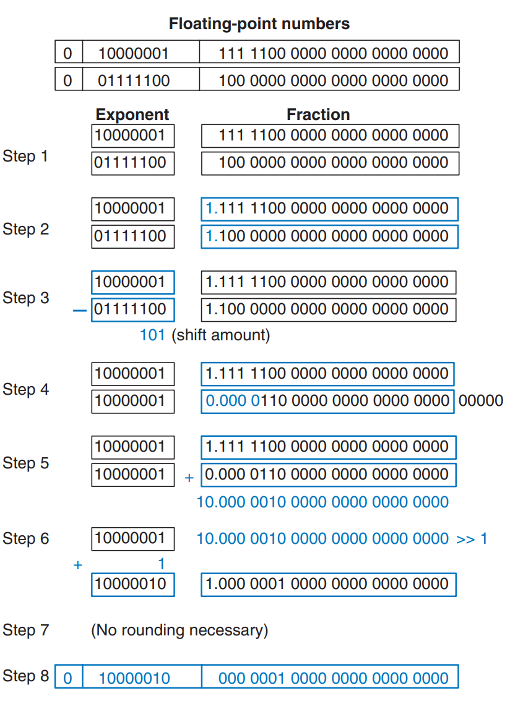<figcaption></figcaption></figure>



#### Multiplication

1. Unpack the numbers
   1. Assume A=0\_0111\_110 and B= 0\_1001\_010, we want to calculate A x B.
2. Sign of result = xor of signs of the numbers
   1. 0 xor 0 = 0.
3. Add the two exponents using integer math. Subtract the
   &#x20;bias **once** from the result.
   1. E = 0111 + 1001 - 0111 = 1001
4. Multiply significands (mantissas) via integer math
   1. S = 1.110 x 1.010 = 10.001100
5. Normalize the significand and adjust exponent if necessary
   1. S = 1.00011, E = 1001 + 1 = 1010
6. Round the significand (mantissa)
   1. S = 1.000 (assuming rounding mode is round toward zero)
7. Pack it back
   1. Result = 0\_1010\_000



[^1]: Here, one block is a one-bit full adder.

[^2]: Here, the “carry-in” refers to the **initial** carry input of the adder. Each adder has only one carry-in signal; for multi-bit adders, this single carry-in propagates through the stages of the adder to produce carries for subsequent bits.

[^3]: This means, when there is a carry in, the column will always produce a carry out, which **propagates** the carry in it receives.

[^4]: Input and output of the shifter is a 32-bit number, and thus the select line `shamt` will be $$\log_232=5$$ bits.

[^5]: the actual implementation is to use AND gates.

[^6]: It's just simply _chop off_ (truncate) the extra fraction bits. No rounding up at all, no matter whether it’s positive or negative.
