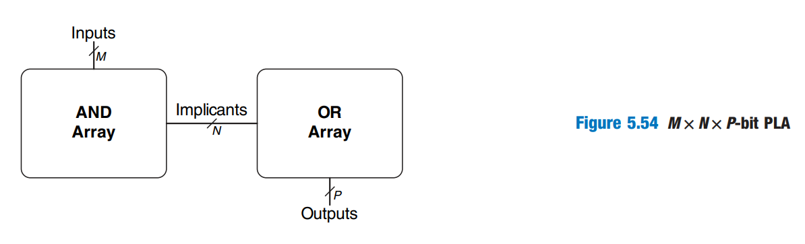
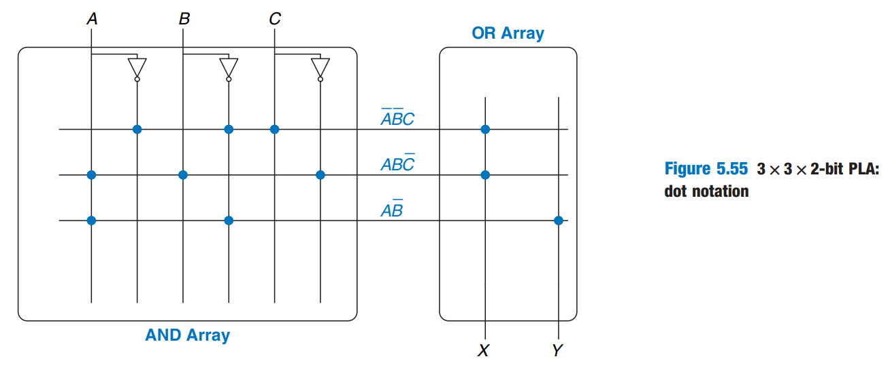
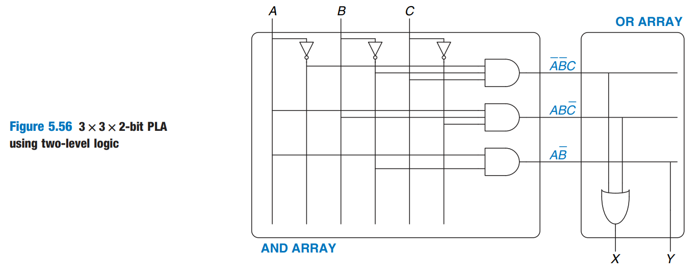
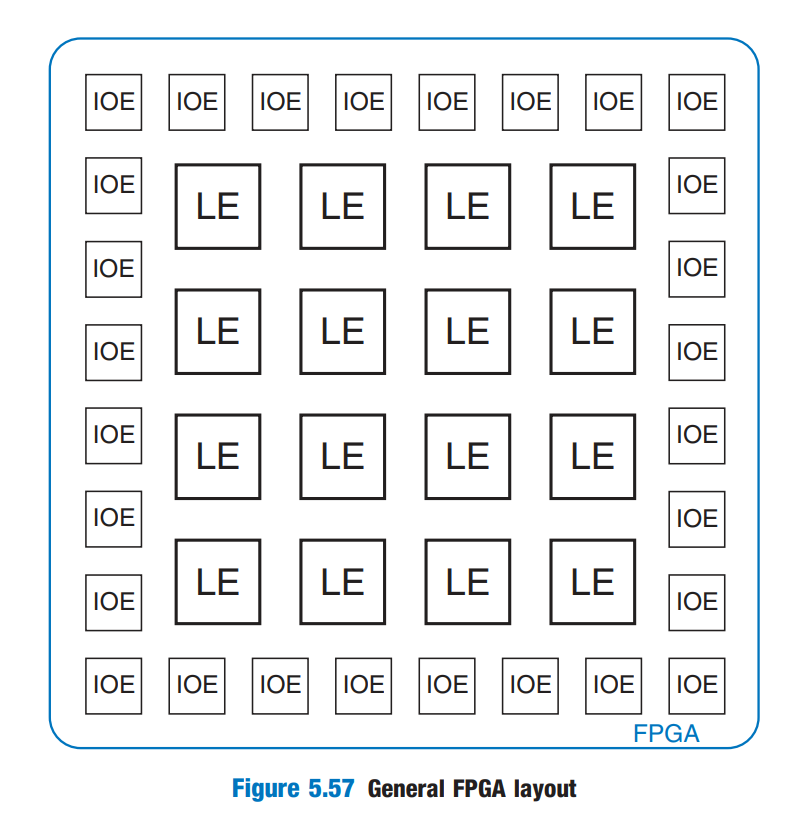

# Logic Arrays

Like memory (bits cells organized into an 2-D array to store data), **gates** can be organized into regular arrays. If the connections are made programmable, the _logic arrays_ can be configured to perform any function without the use having to connect wires in specific ways. Most logic arrays are also reconfigurable, allowing designs to be modified without replacing the hardware. Reconfigurability is valuable during development and is also useful in the field, because a system can be upgraded by simply downloading the new configuration.

This sections introduces two types of logic arrays:

1. Programmable logic arrays (PLAs): the older technology, perform only combinational logic functions.
2. Field programmable logic arrays (FPGAs): perform both combinational and sequential logic.

## Programmable Logic Array

_Programmble logic arrays (PLAs)_ implement two-level combinational logic in [sum-of-products (SOP)](https://wenbo-notes.gitbook.io/ddca-notes/textbook/combinational-logic-design/boolean-equations#sum-of-products-form) form. PLAs are built from and AND array followed by an OR array, as shown in Figure 5.54.

<figure><figcaption></figcaption></figure>

The inputs (in true and complementary form) drive an AND array, which produces implicants, which in turn are ORed together to form the outputs. An MxNxP-bit PLA has M inputs, N implicants, and P outputs.

Figure 5.55 shows the dot notation for a 3x3x2-bit PLA performing functions $$X=\bar A\bar BC+A\bar B\bar C$$ and $$Y=A\bar B$$. Each row in the AND array forms an implicant. Dots in each row of the AND array indicate which literals comprise the implicant. The AND array in Figure 5.55 forms three implicants: $$\bar A\bar BC,A\bar B\bar C$$, and $$A\bar B$$. Dots in the OR array indicate which implicants are part of the output function.

<figure><figcaption></figcaption></figure>

Figure 5.56 shows how PLAs can be built using two-level logic. An alternative implementation is given later.

<figure><figcaption></figcaption></figure>

_Simple programmable logic devices (SPLDs)_ are souped-up PLAs that add registers and various other features to the basic AND/OR planes. However, SPLDs and PLAs have largely been displaced by FPGAs, which are more felxible and efficient for building large systems.

## Field Programmable Gate Array

A _field programmable gate array (FPGA)_ is an array of reconfigurable gates. FPGAs are built as an array of configurable _logic elements_ (LEs), also referred to as _configurable logic blocks (CLBs)_. Each LE can be configured to perform combinational or sequential functions. Figure 5.57 shows a general block diagram of an FPGA.

<figure><figcaption></figcaption></figure>

The LEs are surrounded by _input/output elements (IOEs)_ for interfacing with the outside world. The IOEs connected LE inputs and outputs to pins on the chip package. LEs can connect to other LEs and IOEs through programmable routing channels.

The designer configures an FPGA by first creating a schematic or HDL description of the design. The design is then synthesized onto the FPGA. The synthesis tool determines how the LUTs, multiplexers, and routing channels should be configured to perform the specified functions. This configuration information is then downloaded to the FPGA.


**TODO**: If have time, go back to review Example 5.6 on H\&H 2nd edtion, page 277 to know how each LE works in FPGA.

