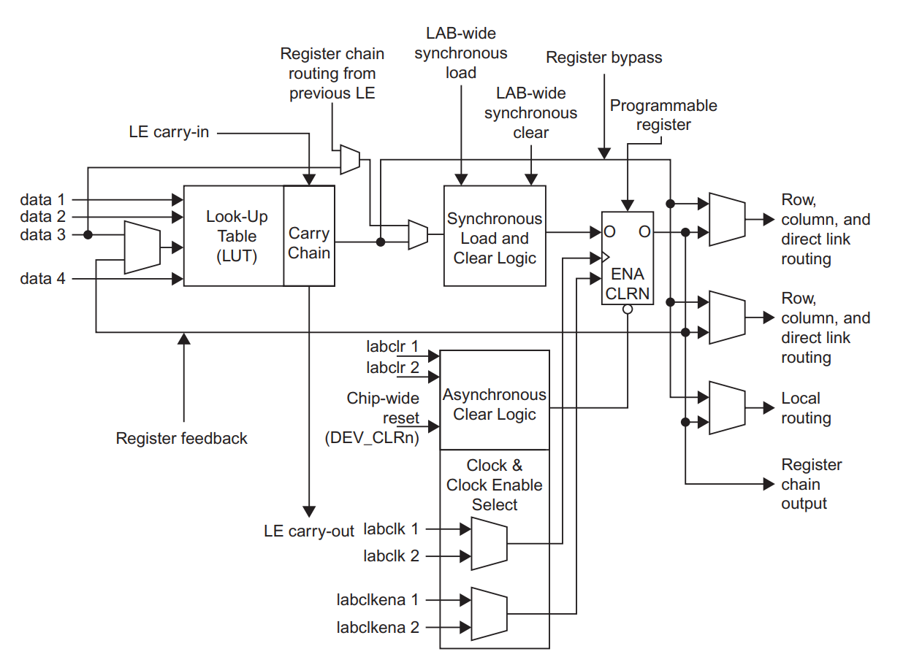
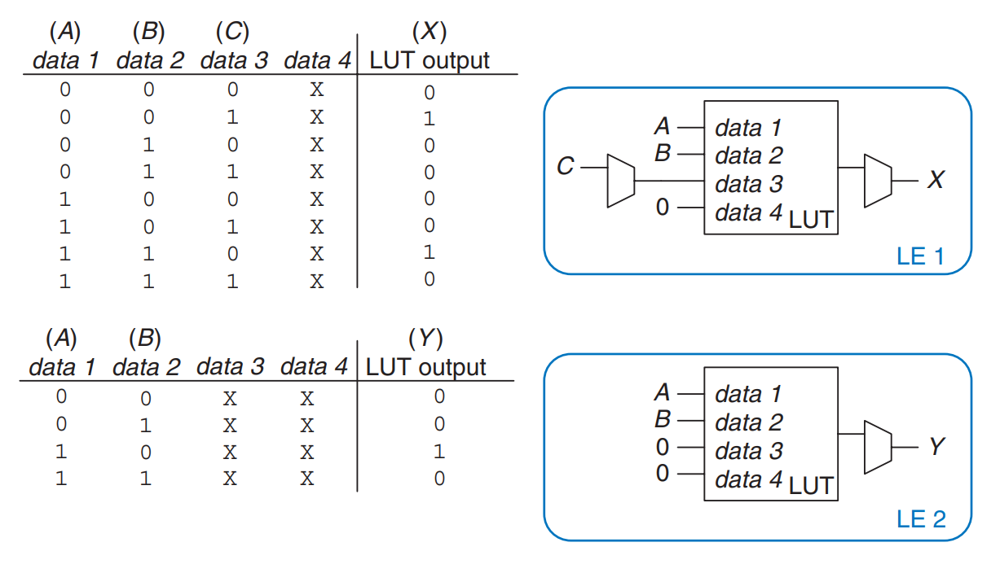
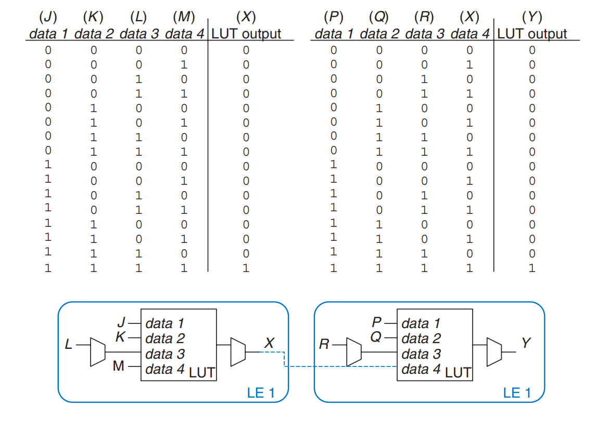

# Logic Arrays

Like memory (bits cells organized into an 2-D array to store data), **gates** can be organized into regular arrays. If the connections are made programmable, the _logic arrays_ can be configured to perform any function without the use having to connect wires in specific ways. Most logic arrays are also reconfigurable, allowing designs to be modified without replacing the hardware. Reconfigurability is valuable during development and is also useful in the field, because a system can be upgraded by simply downloading the new configuration.

This sections introduces two types of logic arrays:

1. Programmable logic arrays (PLAs): the older technology, perform only combinational logic functions.
2. Field programmable logic arrays (FPGAs): perform both combinational and sequential logic.

## Programmable Logic Array

_Programmble logic arrays (PLAs)_ implement two-level combinational logic in [sum-of-products (SOP)](https://wenbo-notes.gitbook.io/ddca-notes/textbook/combinational-logic-design/boolean-equations#sum-of-products-form) form. PLAs are built from and AND array followed by an OR array, as shown in Figure 5.54.

<figure><figcaption></figcaption></figure>

The inputs (in true and complementary form) drive an AND array, which produces implicants, which in turn are ORed together to form the outputs. An MxNxP-bit PLA has M inputs, N implicants, and P outputs.

Figure 5.55 shows the dot notation for a 3x3x2-bit PLA performing functions $$X=\bar A\bar BC+A\bar B\bar C$$ and $$Y=A\bar B$$. Each row in the AND array forms an implicant. Dots in each row of the AND array indicate which literals comprise the implicant. The AND array in Figure 5.55 forms three implicants: $$\bar A\bar BC,A\bar B\bar C$$, and $$A\bar B$$. Dots in the OR array indicate which implicants are part of the output function.

<figure><figcaption></figcaption></figure>

Figure 5.56 shows how PLAs can be built using two-level logic. An alternative implementation is given later.

<figure><figcaption></figcaption></figure>

_Simple programmable logic devices (SPLDs)_ are souped-up PLAs that add registers and various other features to the basic AND/OR planes. However, SPLDs and PLAs have largely been displaced by FPGAs, which are more felxible and efficient for building large systems.

## Field Programmable Gate Array

A _field programmable gate array (FPGA)_ is an array of reconfigurable gates. FPGAs are built as an array of configurable _logic elements_ (LEs), also referred to as _configurable logic blocks (CLBs)_. Each LE can be configured to perform combinational or sequential functions. Figure 5.57 shows a general block diagram of an FPGA.

<figure><figcaption></figcaption></figure>

The LEs are surrounded by _input/output elements (IOEs)_ for interfacing with the outside world. The IOEs connected LE inputs and outputs to pins on the chip package. LEs can connect to other LEs and IOEs through programmable routing channels.

Two of the leading FPGA manufacturers are Intel (formerly Altera Corp.) and Xilinx, Inc.. **Figure 5.60** shows a single **LE** from Intel’s Cyclone IV FPGA, introduced in 2009. The key elements of the **LE** are a **4-input lookup table** (**LUT**) and a **1-bit register**. The **LE** also contains **configurable multiplexers** to route signals through the **LE**. The **FPGA** is configured by specifying the contents of the **LUTs** and the **select signals** for the **multiplexers**.

<figure><figcaption>
<strong>Figure 5.6</strong> Cyclone IV Logic Element (LE)
</figcaption></figure>

Each **Cyclone IV LE** has one **4-input LUT** and one **flip-flop**. By loading the appropriate values into the **LUT**, it can be configured to perform any function of up to four variables. Configuring the **FPGA** also involves choosing the **select signals** that determine how the **multiplexers** route data through the **LE** and to neighboring **LEs** and **IOEs**. **Altera** groups 16 **LEs** together to create a **logic array block** (**LAB**) and provides **local connections** between **LEs** within the **LAB**.

In summary, each **Cyclone IV LE** can perform one **combinational** and/or **registered function**, which can involve up to four variables. Other brands of **FPGAs** are organized somewhat differently, but the same general principles apply. For example, **Xilinx**’s **7-series FPGAs** use **6-input LUTs** instead of **4-input LUTs**.

The designer configures an FPGA by first creating a schematic or HDL description of the design. The design is then synthesized onto the FPGA. The synthesis tool determines how the LUTs, multiplexers, and routing channels should be configured to perform the specified functions. This configuration information is then downloaded to the FPGA.

Example 5.8: Functions built using LEs

Explain how to configure one or more Cyclone IV LEs to perform the following functions: (a) $$X=\bar A \bar BC+AB\bar C$$ and $$Y=A\bar B$$ (b) Y = JKLMPQR. You may show interconnection between LEs as needed.

***

**Sol:** (a) Configure two **LEs**. One **LUT** computes **X** and the other **LUT** computes **Y**, as shown in **Figure 5.61**.

<figure><figcaption>
<strong>Figure 5.61</strong> LE configuration for two functions of up to four inputs each
</figcaption></figure>

For the first **LE**, inputs **data 1**, **data 2**, and **data 3** are **A**, **B**, and **C**, respectively (these connections are set by the **routing channels**). **data 4** is a don’t care but must be tied to something, so it is tied to 0. For the second **LE**, inputs **data 1** and **data 2** are **A** and **B**, respectively; the other **LUT** inputs are don’t cares and are tied to 0. Configure the final **multiplexers** to select the **combinational outputs** from the **LUTs** to produce **X** and **Y** (not shown in Figure 5.61). In general, a single **LE** can compute any function of up to four input variables in this fashion.

(b) Configure the **LUT** of the first **LE** to compute **X = JKLM** and the **LUT** on the second **LE** to compute **Y = XPQR**. Configure the final **multiplexers** to select the **combinational outputs** **X** and **Y** from each **LE**. This configuration is shown in **Figure 5.62**.

<figure><figcaption>
<strong>Figure 5.62</strong> LE configuration for one function of more than four inputs
</figcaption></figure>

**Routing channels** between **LEs**, indicated by the dashed blue lines, connect the output of **LE 1** to the input of **LE 2**. In general, a group of **LEs** can compute functions of **N** input variables in this manner.

Example 5.9: More Logic Element Examples

How many Cyclone IV LEs are required to build each of the following circuits?

1. 4-input AND
2. 7-input XOR
3. Y = A(B + C + D + E) + $$\bar A$$(BCDE)
4. 12-bit shift register
5. 32-bit 2:1 multiplexer
6. 16-bit counter

***

**Sol**: The key is to remember that one LE has one LUT which can deal with any function up to 4 variables and a flip-flop.

1. **1**: The LUT can perform any function of up to 4 inputs.
2. **2**: The first LUT can compute a 4-input XOR. The second LUT can XOR that output with three more inputs.
3. **3**: One LUT computes B + C + D + E, a function of 4 inputs. A second LUT computes BCDE, a different function of 4 inputs. A third LUT uses 3 inputs (these two outputs and A) to compute Y.
4. **12**: A shift register contains one flip-flop per bit.
5. **32**: A 2:1 multiplexer is a function of three inputs: S, D0, and D1, so it requires one LUT per bit.

Example 5.10 LE Delay

Alyssa P. Hacker is building a finite state machine that must run at 200MHz. She uses a Cyclone IV FPGA with the following specifications: tLE = 381 ps per LE, tsetup = 76 ps, and tpcq = 199 ps for all flip-flops. The wiring delay between LEs is 246 ps. Assume that the hold time for the flip-flops is 0. What is the maximum number of levels of LEs that her design can use between two registers?

***

**Sol:** Alyssa uses the [Equation we have learn before](../sequential-logic-design/timing-of-sequential-logic.md#setup-time-constraint) to solve for the maximum propagation delay of the logic: $$t_{pd}\le T_c-(t_{pcq}+t_{setup})$$.

Thus, **t****pd****&#x20;= 5 ns − (0.199 ns + 0.076 ns)**, so **t****pd** <i class="fa-less-than-equal">:less-than-equal:</i> **4.725 ns**. The delay of each **LE** plus **wiring delay** between **LEs**, **t****LE+wire**, is **381 ps + 246 ps = 627 ps**. The **maximum number** of **LEs**, **N**, is **N t****LE+wire****&#x20;≤ 4.725 ns**. Thus, **N = 7**.

