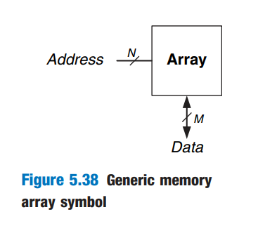
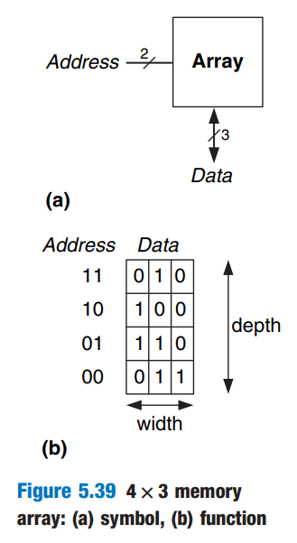
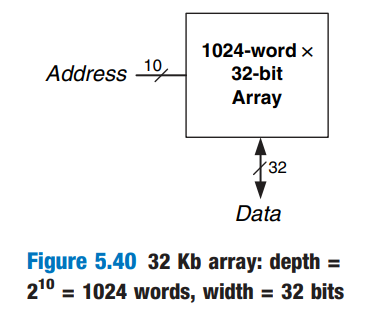
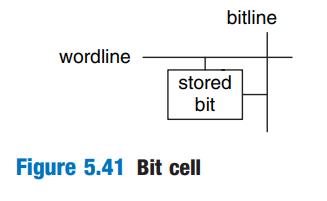
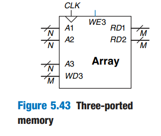
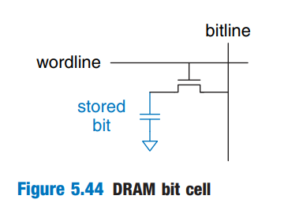
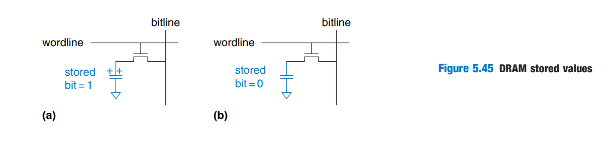

# Memory Arrays

The previous sections introduced arithmetic and sequential circuits for manipulating data. Digital systems also require _memories_ to store the data used and generated by such circuits. Registers built from flip-flops are a kind of memory that stores all small amounts of data. This section describes _memory arrays_ that can efficiently store large amounts of data.

## Overview

Figure 5.38 shows a generic symbol for a memory array. The memory is organized as a two-dimensional array of memory cells. The memory reads or writes the contents of the rows of the array. This row is specified by an _Address_. The value read or written is called _Data_. An array with N-bit addresses and M-bit data has $$2^N$$ rows and M columns. Each row of data is called a _word_. Thus, the array contains $$2^N$$ M-bit words.

<figure><figcaption></figcaption></figure>

Figure 5.39 shows a memory array with two address bits and three data bits. The two address bits specify one of the four rows (data words) in the array. Each data word is three bits wide. Figure 5.39 (b) shows some possible contents of the memory array.

<figure><figcaption></figcaption></figure>

The _depth_ of an array is the number of rows, and the _width_ is the number of columns, also called the word size. The size of an array is given as _depth x width_. Figure 5.39 is a 4-word x 3-bit array, or simply 4x3 array. The symbol for a 1024-word x 32-bit array is shown in Figure 5.40. The total size of this array is 32 kilobits (Kb).

<figure><figcaption></figcaption></figure>

### Bit Cells

Memory arrays are built as an array of _bit cells_, each of which stores 1 bit of data. Figure 5.41 shows that each bit cell is connected to a _wordline_ and a _bitline_. For each combination of address bits, the memory asserts a single wordline that activates the bit cells in that row. When the wordline is HIGH, the stored bit transfers to or from the bitline. Otherwise, the bitline is disconnected from the bit cell. The circuitary to store the bit varies with memory type.

<figure><figcaption></figcaption></figure>

* To read a bit cell, the bitline is initially left floating (Z). Then the wordline is turned ON, allowing the stored value to drive the bitline to 0 or 1.
* To write a bit cell, the bitline is strongly driven to the desired value. Then the wordline is turned ON, connecting the bitline to the stored bit. The strongly driven bitline overpowers the contents of the bit cell, writing the desired value into the stored bit.

### &#x20;Organization

Figure 5.42 shows the internal organization of a 4x3 memory array. Of course, practical memories are much larger, but the behavior of larger arrays can be extrapolated from the small array. In this example, the array stores the data from Figure 5.39 (b).

<figure><figcaption></figcaption></figure>

During a memory read, a wordline is asserted, and the corresponding row of bit cells drives the bitlines HIGH or LOW. During a memory write, the bitlines are driven HIGH or LOW first and then a wordline is asserted, allowing the bitline values to be stored in that row of bit cells.

For example,

* to read _Address 10_, the bitlines are left floating, the decoder asserts $$\text{wordline}_{2}$$, and the data stored in the row of bit cells (100) reads out onto the Data bitlines ($$\text{Data}_{2:0}$$).
* To write the value 001 to _Address 11_, the bitlines are driven to the value 001, then $$\text{wordline}_{3}$$ is asserted and the new value (001) is stored in the bit cells.

### Memory ports

All memories have one or more _ports_. Each port gives read and/or write access to on memory address. The previous examples (including Figure 5.42) were all single-ported memories.

_Multiported_ memories can access several addresses simultaneously. Figure 5.43 shows a three-ported memory with two read ports and one write port.

<figure><figcaption></figcaption></figure>

Port 1 reads the data from address _A1_ onto the read data output RD1. Port 2 reads the data from Address _A2_ onto RD2. Port 3 writes the data from the write data input _WD3_ into address A3 on the rising edge of the clock if the write enable WE3 is asserted.

### Memory Types

Memory arrays are specified by their size (depth x width) and the number of ports. All memory arrays store data as an array of bit cells, but they differ in how they store bits. And memory is classified based on how they store bits in the bit cell.

* RAM (Random Access Memory): volatile
  * Dynamic RAM (DRAM): stores data as a charge on a capacitor
  * Static RAM (SRAM): stores data using a pair of cross-coupled inverters.
* ROM (Read Only Memory): nonvolatile

## Dynamic Random Access Memory (DRAM)

_Dynamic RAM (DRAM)_ stores a bit as the presence of absence of charge on a capacitor. Figure 5.44 shows a DRAM bit cell. The bit value is stored on a capacitor. The nMOS transistor behaves as a switch that either connects or disconnects the capacitor from the bitline. When the wordline is asserted, the nMOS transistor turns ON, and the stored bit value transfers to or from the bitline.

<figure><figcaption></figcaption></figure>

As shown in Figure 5.45 (a), when the capacitor is charged to $$V_{\text{DD}}$$, the stored bit is 1; when it is discharged to GND (Figure 5.45 (b)), the stored bit is 0. The capacitor node is _dynamic_ because it is not actively drive HIGH or LOW by a transistor tied to $$V_{\text{DD}}$$ or GND. Instead, it is tied to a transistor tied to a bitline, which is "dynamic".

<figure><figcaption></figcaption></figure>

Upon a read, data values are transferred from the capacitor to the bitline. Upon a write, data values are transferred from the bitline to the capacitor. Reading destroys the bit value stored on the capacitor, so the data word must be restored (rewritten) after each read. Even when DRAM is not read, the contents must be refreshed (read and rewritten) every few milliseconds, because the charge on the capacitor gradually leaks away.
