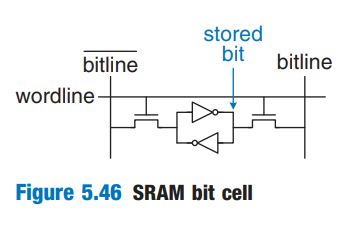
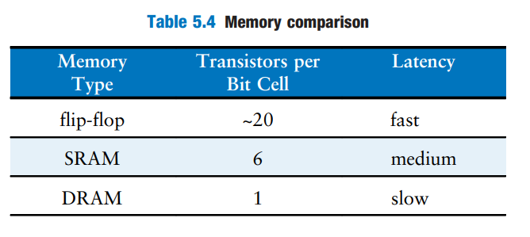
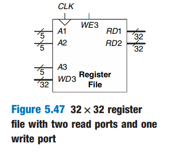
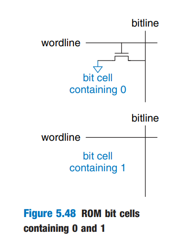
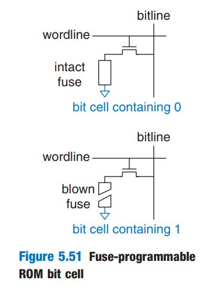
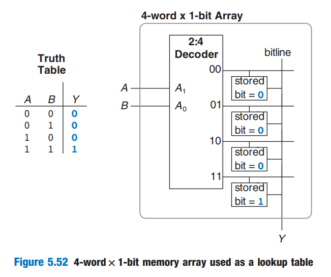
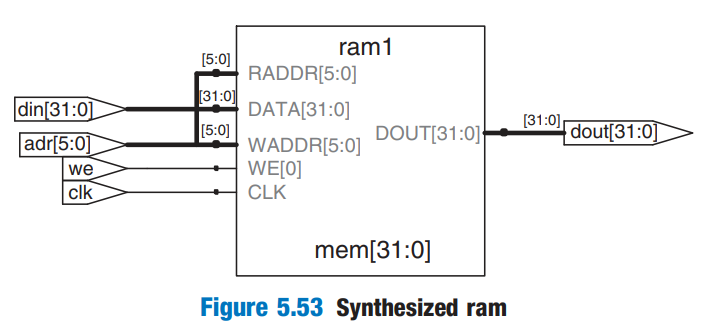

# Memory Arrays

The previous sections introduced arithmetic and sequential circuits for manipulating data. Digital systems also require _memories_ to store the data used and generated by such circuits. Registers built from flip-flops are a kind of memory that stores all small amounts of data. This section describes _memory arrays_ that can efficiently store large amounts of data.

## Overview

Figure 5.38 shows a generic symbol for a memory array. The memory is organized as a two-dimensional array of memory cells. The memory reads or writes the contents of the rows of the array. This row is specified by an _Address_. The value read or written is called _Data_. An array with N-bit addresses and M-bit data has $$2^N$$ rows and M columns. Each row of data is called a _word_. Thus, the array contains $$2^N$$ M-bit words.

<figure><figcaption></figcaption></figure>

Figure 5.39 shows a memory array with two address bits and three data bits. The two address bits specify one of the four rows (data words) in the array. Each data word is three bits wide. Figure 5.39 (b) shows some possible contents of the memory array.

<figure><figcaption></figcaption></figure>

The _depth_ of an array is the number of rows, and the _width_ is the number of columns, also called the word size. The size of an array is given as _depth x width_. Figure 5.39 is a 4-word x 3-bit array, or simply 4x3 array. The symbol for a 1024-word x 32-bit array is shown in Figure 5.40. The total size of this array is 32 kilobits (Kb).

<figure><figcaption></figcaption></figure>

### Bit Cells

Memory arrays are built as an array of _bit cells_, each of which stores 1 bit of data. Figure 5.41 shows that each bit cell is connected to a _wordline_ and a _bitline_. For each combination of address bits, the memory asserts a single wordline that activates the bit cells in that row. When the wordline is HIGH, the stored bit transfers to or from the bitline. Otherwise, the bitline is disconnected from the bit cell. The circuitary to store the bit varies with memory type.

<figure><figcaption></figcaption></figure>

* To read a bit cell, the bitline is initially left floating (Z). Then the wordline is turned ON, allowing the stored value to drive the bitline to 0 or 1.
* To write a bit cell, the bitline is strongly driven to the desired value. Then the wordline is turned ON, connecting the bitline to the stored bit. The strongly driven bitline overpowers the contents of the bit cell, writing the desired value into the stored bit.

### &#x20;Organization

Figure 5.42 shows the internal organization of a 4x3 memory array. Of course, practical memories are much larger, but the behavior of larger arrays can be extrapolated from the small array. In this example, the array stores the data from Figure 5.39 (b).

<figure><figcaption></figcaption></figure>

During a memory read, a wordline is asserted, and the corresponding row of bit cells drives the bitlines HIGH or LOW. During a memory write, the bitlines are driven HIGH or LOW first and then a wordline is asserted, allowing the bitline values to be stored in that row of bit cells.

For example,

* to read _Address 10_, the bitlines are left floating, the decoder asserts $$\text{wordline}_{2}$$, and the data stored in the row of bit cells (100) reads out onto the Data bitlines ($$\text{Data}_{2:0}$$).
* To write the value 001 to _Address 11_, the bitlines are driven to the value 001, then $$\text{wordline}_{3}$$ is asserted and the new value (001) is stored in the bit cells.

### Memory ports

All memories have one or more _ports_. Each port gives read and/or write access to on memory address. The previous examples (including Figure 5.42) were all single-ported memories.

_Multiported_ memories can access several addresses simultaneously. Figure 5.43 shows a three-ported memory with two read ports and one write port.

<figure><figcaption></figcaption></figure>

Port 1 reads the data from address _A1_ onto the read data output RD1. Port 2 reads the data from Address _A2_ onto RD2. Port 3 writes the data from the write data input _WD3_ into address A3 on the rising edge of the clock if the write enable WE3 is asserted.

### Memory Types

Memory arrays are specified by their size (depth x width) and the number of ports. All memory arrays store data as an array of bit cells, but they differ in how they store bits. And memory is classified based on how they store bits in the bit cell.

* RAM (Random Access Memory): volatile
  * Dynamic RAM (DRAM): stores data as a charge on a capacitor
  * Static RAM (SRAM): stores data using a pair of cross-coupled inverters.
* ROM (Read Only Memory): nonvolatile

## Dynamic Random Access Memory (DRAM)

_Dynamic RAM (DRAM)_ stores a bit as the presence of absence of charge on a capacitor. Figure 5.44 shows a DRAM bit cell. The bit value is stored on a capacitor. The nMOS transistor behaves as a switch that either connects or disconnects the capacitor from the bitline. When the wordline is asserted, the nMOS transistor turns ON, and the stored bit value transfers to or from the bitline.

<figure><figcaption></figcaption></figure>

As shown in Figure 5.45 (a), when the capacitor is charged to $$V_{\text{DD}}$$, the stored bit is 1; when it is discharged to GND (Figure 5.45 (b)), the stored bit is 0. The capacitor node is _dynamic_ because it is not actively drive HIGH or LOW by a transistor tied to $$V_{\text{DD}}$$ or GND. Instead, it uses a **capacitor** to store the bit.

<figure><figcaption></figcaption></figure>

Upon a read, data values are transferred from the capacitor to the bitline. Upon a write, data values are transferred from the bitline to the capacitor. Reading destroys the bit value stored on the capacitor, so the data word must be restored (rewritten) after each read. Even when DRAM is not read, the contents must be refreshed (read and rewritten) every few milliseconds, because the charge on the capacitor gradually leaks away.

## Static Random Access Memory (SRAM)

_Static RAM (SRAM)_ is _static_ because stored bits do not need to be refreshed. Figure 5.46 shows an SRAM bit cell. The data bit is stored on cross-coupled inverters like the one we have discussed [before](https://wenbo-notes.gitbook.io/ddca-notes/textbook/sequential-logic-design/latches-and-flip-flops#bistable-element).

<figure><figcaption></figcaption></figure>

Each cell has two outputs, $$\text{bitline}$$ and $$\overline {\text{bitline}}$$. When the wordline is asserted, both nMOS transistors turn on, and data values are transferred to or from bitlines. Unlike DRAM, if noise degrades the value of the stored bit, the cross-coupled inverters restore the value.

## Area and Delay

Flip-flops, SRAM, and DRAMs are all volatile memories, but each has different area and delay characteristics. Table 5.4 shows a comparison of these three types of volatile memory.

<figure><figcaption></figcaption></figure>

* **Flip-flop:** The data bit stored in **flip-flop** is available immediately at its output. But flip-flops take at least 20 transistors to build.
* **DRAM vs. SRAM:**
  * DRAM latency is longer than that of SRAM because its bitline is not actively driven by a transistor, but by a capacitor. DRAM must wait for charge to move (relatively) slowly from the capacitor to the bitline.
  * DRAM also fundamentally has lower throughput[^1] than SRAM, because it must refresh data periodically and after a read.
  * DRAM technologies such as _synchronous DRAM (SDRAM)_ and _double data rate (DDR)_ SDRAM have been developed to overcome this problem. SDRAM uses a clock to pipeline memory accesses. DDR SDRAM, sometimes called simply DDR, uses both the rising and falling edges of the clock to access data, thus doubling the throughput for a given clock speed.


#### Notes

1. Generally, the more transistors a device has, the more area, power, and cost it requires.
2. Memory latency and throughput also depend on memory size; larger memories tend to be slower than smaller ones if all else is the same.


## Register Files

Digital systems often use a number of registers to store temporary variables. (we've learned in ARM Assembly!) This group of registers, called a _register file_, is usually built as a small, multiported SRAM array, because it is more [**compact**](#user-content-fn-2)[^2] than an array of flip-flops.

Figure 5.47 shows a 32-register x 32-bit three-ported register file built from a three-ported memory similar to that of Figure 5.43.

<figure><figcaption></figcaption></figure>

The register file has two read ports (A1/RD1 and A2/RD2) and one write port (A3/WD3). The 5-bit addresses, A1, A2, and A3, can each access all $$2^5=32$$ registers (a.k.a. 32 memory addresses with each memory address connecting to a register made up of 32 bit cells, a.k.a. a 32-bit register). So, two registers can be read and one register can be written simultaneously.

## Read Only Memory

_Read Only Memory (ROM)_ stores a bit as the presence or absence of a transistor. Figure 5.48 shows a simple ROM bit cell.

<figure><figcaption></figcaption></figure>

* To read the cell, the bitline is weakly pulled HIGH. Then the wordline is turned ON.
* (No write for ROM): During manufacturing, if the transistor is present, it pulls the bitline LOW. If it is absent, the bitline remains HIGH.


The contents of the ROM bit cell  in Figure 5.48 are specified during manufacturing by the presence or absence of a transistor in each bit cell.


### Programmable ROM

A _programmable ROM (PROM)_ places a transistor in every bit but provides a way to connect or disconnect the transistor to the ground.

Figure 5.51 shows the bit cell for a _fuse-programmable ROM_. The user programs the ROM by applying a high voltage to selectively blow fuses. If the fuse is present, the transistor is connected to GND and the cell holds 0. If the fuse is destroyed, the transistor is disconnected from ground and the cell holds a 1. This is also called a **one-time programmable ROM**, because the fuse cannot be repaired once it is blown.

<figure><figcaption></figcaption></figure>

### Reprogrammble ROM

_Reprogrammable ROMs_ provides a reversible mechanism for connecting or disconnecting the transistor to GND.



**Erasable PROMs (EPROMs)**

The EPROMs replace the nMOS transistor and fuse with a _floating-gate transistor_. The floating gate is not physically attached to any other wires. When suitable high voltages are applied, electrons tunnel through an insulator onto the floating gate, turning on the transistor and connecting the bitline to the wordline (decoder output). When the EPROM is exposed to intense ultraviolet (UV) light for about half an hour, the electrons are knocked off the floating gate, turning the transistor off. These actions are called _programming_ and _erasing_, respectively.



**Electrically erasable PROMs (EEPROMs) and Flash memory**

EEPROMs and Flash memory use similar principles but include circuitry on the chip for erasing as well as programming, so no UV light is necessary.

* EEPROM bit cells are individually erasable.
* Flash memory erases larger blocks of bits and is cheaper because fewer erasing circuits are needed.




In summary, modern ROMs are not really **read only**; they can be programmed (written) as well. The difference between RAM and ROM is that ROMs take a longer time to write but are **nonvolatile**.


## Logic Using Memory Arrays

Although they are used primarily for data storage, memory arrays can also perform combinational logic functions. For example, memory arrays used to perform logic are called _loopup tables (LUTs)_. Figure 5.52 shows a 4-word x 1-bit memory array used as a lookup table to perform the function Y=AB.

<figure><figcaption></figcaption></figure>

Using memory to perform logic, the user can look up the output value for a given input combination (address). Each address corresponds to a row in the truth table, and each data bit corresponds to an output value.


Usually, we use ROM as a lookup table (LUT).


## Memory HDL

HDL Example 5.7 describes a $$2^N$$-word x M-bit RAM. The RAM has a synchronous enabled write. In other words, writes occur on the rising edge of the clock if the write enable `we` is asserted. Read occur immediately. When power is first applied, the contents of the RAM are unpredictable.


```verilog
module ram #(parameter N = 6, M = 32)
            (input  logic         clk,
             input  logic         we,
             input  logic [N-1:0] adr,
             input  logic [M-1:0] din,
             output logic [M-1:0] dout);
  logic [M-1:0] mem [2**N-1:0];
  
  always_ff @(posedge clk)
    if (we) mem[adr] <= din;
  
  assign dout = mem[adr];
endmodule
```


This code will be synthesized into the following RAM circuit.

<figure><figcaption></figcaption></figure>

HDL Example 5.8 describes a 4-word x 3-bit ROM. The contents of the ROM are specified in the HDL `case` statement. A ROM as small as this one may be synthesized into logic gates rather than an array. Note that the [seven-segment decoder](https://wenbo-notes.gitbook.io/ddca-notes/textbook/hardware-description-languages/more-combinational-logic#case-statements) example synthesizes into a ROM.


```verilog
module rom(input  logic [1:0] adr,
           output logic [2:0] dout);
  always_comb
    case (adr)
      2'b00: dout <= 3'b011;
      2'b01: dout <= 3'b110;
      2'b10: dout <= 3'b100;
      2'b11: dout <= 3'b010;
    endcase
endmodule
```


[^1]: Memory throughput is the rate at which data can be read from or written to a computer's memory (RAM) in a given amount of time, typically measured in bytes per second.

[^2]: As we have seen above, SRAM uses less transistors to build than flip-flops.
