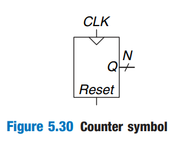
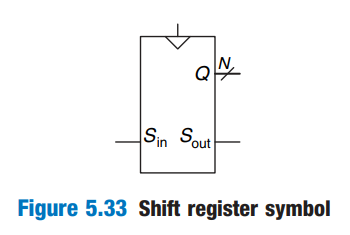
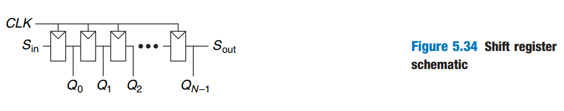
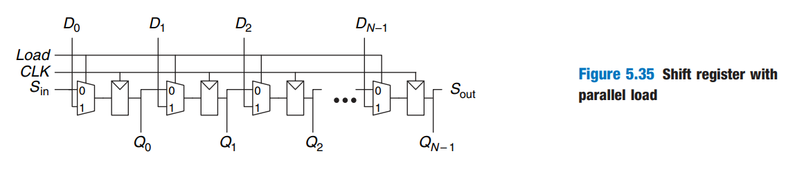

# Sequential Building Blocks

This section examines sequential building blocks, including counters and shift registers.

## Counters

An N-bit _binary counter_, shown in Figure 5.30, is a sequential arithmetic circuit with clock and reset inputs and an N-bit output Q. _Reset_ initializes the output to 0. The counter then advances through all $$2^N$$ possible outupts in binary order, incrementing on the rising edge of the clock.

<figure><figcaption></figcaption></figure>

Figure 5.31 shows an N-bit counter composed of an adder and a resettable register. On each cycle, the counter adds 1 to the value stored in the register. HDL Example 5.5 describes a binary counter with asynchronous reset.




```verilog
module counter #(parameter N = 8)
                (input  logic       clk,
                 input  logic       reset,
                 output logic [N-1:0] q);
  always_ff @(posedge clk, posedge reset)
    if (reset) q <= 0;
    else       q <= q + 1;
endmodule
```





```verilog
module counter #(parameter N = 8)
                (input        clk,
                 input        reset,
                 output reg [N-1:0] q);
  always @(posedge clk or posedge reset)
    if (reset) q <= 0;
    else       q <= q + 1;
endmodule
```




## Shift Registers

A _shift register_ has a clock, a serial input $$S_{\text{in}}$$, a serial output $$S_{\text{out}}$$, and $$N$$ parallel outputs $$Q_{\text{N-1:0}}$$, as shown in Figure 5.33. On each rising edge of the clock, the new bit is shifted from $$S_{\text{in}}$$ and all the subsequent contents are shifted forward. The last bit in the shift register is available at $$S_{\text{out}}$$. Shift registers can be viewed as _sequential-to-parallel_ converters. The input is provided serially (one bit at a time) at $$S_{\text{in}}$$. After N cycles, the past N inputs are available in parallel at Q.

<figure><figcaption></figcaption></figure>

A shift register can be constructed from N flip-flops connected in series, as shown in Figure 5.34. Some shift registers also have a reset signal to initialize all of the flip-flops.

<figure><figcaption></figcaption></figure>

A related circuit is called a _parallel-to-serial_ converter that loads N bits in parallel, then shifts then out one at a time. A shift register can be modified to perform both serial-to-parallel and parallel-to-serial operations by adding a parallel input $$D_{\text{N-1:0}}$$, and a control signal _LOAD_, as shown in Figure 5.35. When _LOAD_ is asserted, the flip-flops are loaded in parallel from the D inputs. Otherwise, the shift register shifts normally.

<figure><figcaption></figcaption></figure>

HDL Example 5.6 describes such a shift register.




```verilog
module shiftreg #(parameter N = 8)
                 (input  logic       clk,
                  input  logic       reset, load,
                  input  logic       sin,
                  input  logic [N-1:0] d,
                  output logic [N-1:0] q,
                  output logic       sout);
  always_ff @(posedge clk, posedge reset)
    if (reset)      q <= 0;
    else if (load)  q <= d;
    else            q <= {q[N-2:0], sin};
  
  assign sout = q[N-1];
endmodule
```





```verilog
module shiftreg #(parameter N = 8)
                 (input        clk,
                  input        reset, load,
                  input        sin,
                  input  [N-1:0] d,
                  output reg [N-1:0] q,
                  output       sout);
  always @(posedge clk or posedge reset)
    if (reset)      q <= 0;
    else if (load)  q <= d;
    else            q <= {q[N-2:0], sin};
  
  assign sout = q[N-1];
endmodule
```



