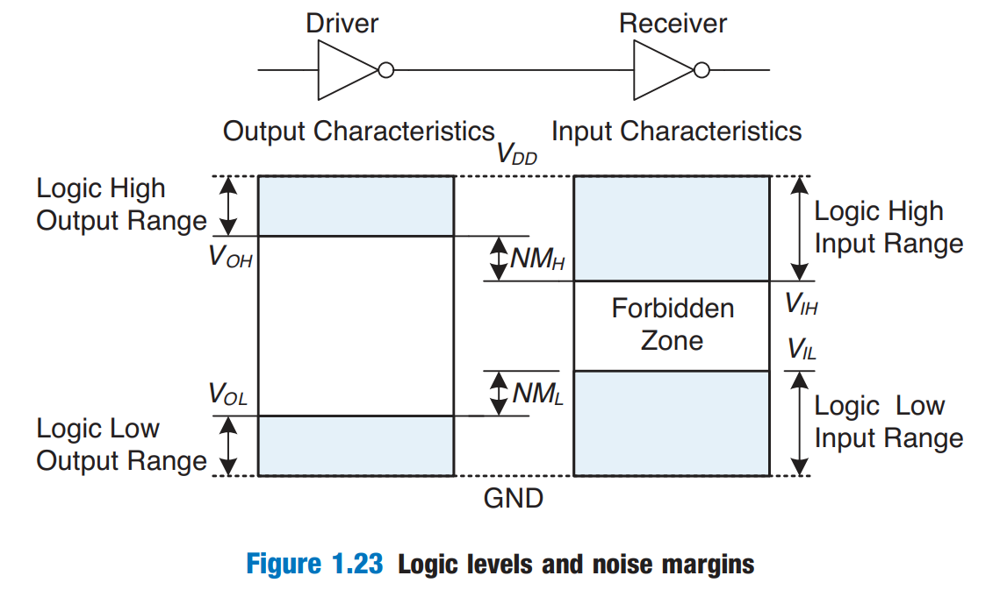
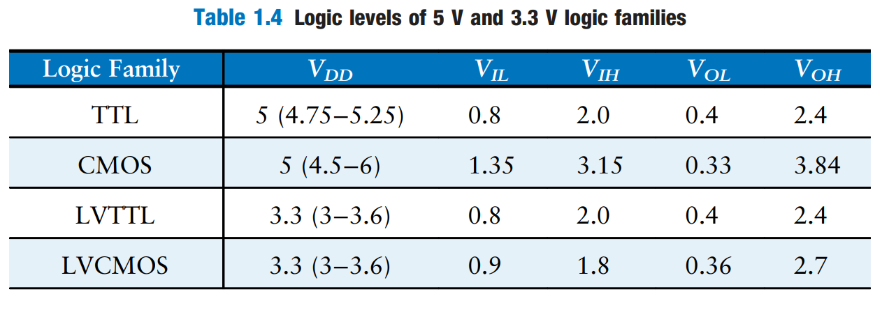

# Beneath the Digital Abstraction

A digital system uses discrete-level variables, such as 0 and 1. However, the variables are represented by continuous physical quantities such as the voltage on the wire. Hence, the designer must choose a way to relate the continuous value to the discrete value. And this can be done by defining the **logic levels**.

## Supply Voltage

Before we talk about the logic levels, let's look at the supply voltage first. The _supply voltage_ is the highest voltage in the system which comes from the power supply and is usually called $$V_\text{DD}$$. And the lowest voltage in the system is 0V, also called _ground_ or GND.

Nowadays, the $$V_\text{DD}$$ can range from 5V, 3.3V, 1.8V, 1.5V, 1.2V, etc. And it differs from different logic gate family.

## Logic Levels

Basically, there are four logic levels. They are $$V_\text{OH}, V_\text{OL}, V_\text{IH}, V_\text{IL}$$, which are called output and input high and low logic levels.

<figure><figcaption></figcaption></figure>

If, for some reason such as noise of faulty components, the receiver's input should fall in the _forbidden zone_ between $$V_\text{IL}$$ and $$V_\text{IH}$$, the behavior of the gate is unpredictable. So, for two logic gates to be connected safely, the rule of thumb will be

> $$V_\text{OH}>V_\text{IH}$$ and $$V_\text{OL}<V_\text{IL}$$


Note that the **driver** and the **receiver** are two logic gates, which may come from one logic family or not. But each logic gate will have its own 4 logic levels.


## Noise Margins

The _noise margin_ is the amount of noise that could be added to a worst-case output such that the signal can still be interpreted as a valid input. As can be seen in Figure 1.23, the low and high noise margins are, respectively,

$$
\text{NM}_L=V_{\text{IL}}-V_{\text{OL}}\\
\text{NM}_H=V_{\text{OH}}-V_{\text{IH}}
$$

## The Static Discipline

To avoid inputs falling into the forbidden zone, digital logic gates are designed to conform to the _static discipline_. The static discipline requires that, given logically valid inputs, every circuit element will produce logically valid outputs.

The choice of $$V_\text{DD}$$ and logic levels is arbitrary, but all gates that communicate must have compatible logic levels. (This means must follow the rule of thumb above) Therefore, gates are grouped into _logic families_ such that all gates in a logic family obey the static discipline when used with other gates in the family. Logic gates in the same logic family snap together like Legos in that they use consistent power supply voltages and logic levels.

<figure><figcaption></figcaption></figure>
