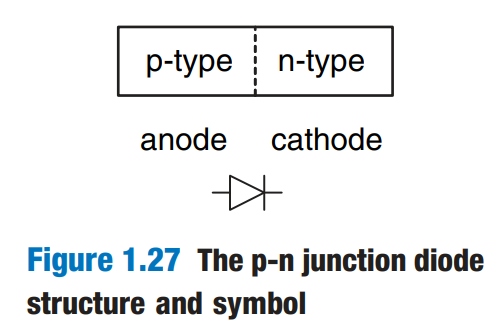
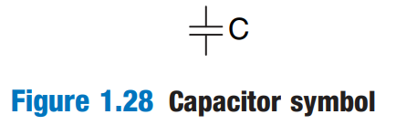
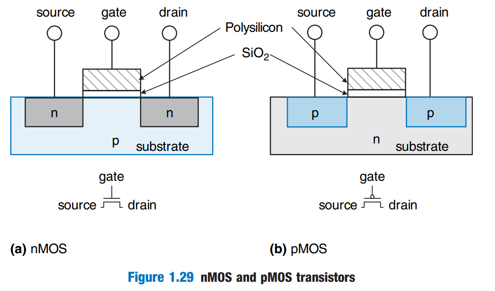
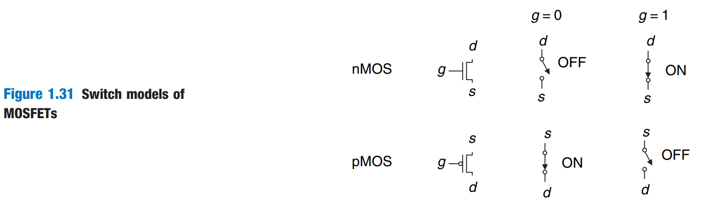
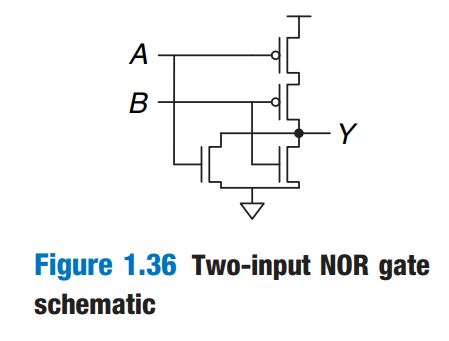

# CMOS Transistors

_Transistors_ are electrically controlled switches that turn ON or OFF when a voltage or current is applied to a control terminal. The two main types of transistors are

1. bipolar junction transistors (BJT)
2. metal-oxide-semiconductor field effect transistors (MOSFETs or MOS transistors, pronounced "moss-fets" or "M-O-S", respectively)

Nowadays, MOSFETs are the building blocks of almost all digital systems.

## Semiconductors

MOSFETs are built from silicon.

## Diodes

The junction between p-type and n-type silicon is called a _diode_. The p-type region is called the _anode_ and the n-type region is called the _cathode_, as illustrated in Figure 1.27.

<figure><figcaption></figcaption></figure>

When the voltage on the anode rises above the voltage on the cathode, the diode is _forward biased_, and current flows through the diode from the anode to the cathode. But when the anode voltage is lower than the voltage on the cathode, the diode is _reverse biased_, and no current flows. The diode symbol intuitively shows that current only flows in **one direction**.

## Capacitors

A _capacitor_ consists of two conductors separated by an insulator. When a voltage V is applied to **one of the conductors**, the conductor accumulates electric charge Q and the other conductor accumulates the opposite charge -Q.

The _capacitance_ C of the capacitor is the ratio of charge to voltage: $$C=Q/V$$. The capacitance is proportional to the size of the conductors and inversely proportional to the distance between them. The symbol of a capacitor is shown in Figure 1.28.

<figure><figcaption></figcaption></figure>

Capacitance is important because charging or discharging a conductor takes time and energy. More capacitance means that a circuit will be slower and require more energy to operate. Speed and energy will be discussed throughout this book.

## nMOS and pMOS Transistor

A MOSFET is a sandwich of several layers of conducting and insulating materials. This sandwich consists of a conducting layer called the _gate_ on top of an insulating layer of _silicon dioxide_ ( $$\text{SiO}_2$$) on top of the silicon wafer, called the _subtrate_.

<figure><figcaption></figcaption></figure>

There are two flavors of MOSFETs: nMOS and pMOS. Figure 1.29 shows cross-sections of each type.

nMOS transistors need a p-type substrate, and pMOS transistors need an n-type substrate. To bulid both flavors of transistors on the same chip, manufacturing processes typically start with a p-type wafer, then implant n-type regions called _wells_ where the pMOS transistors should go. These processes that provide both flavors of transistors are called Complementary MOS or _CMOS_. CMOS processes are used to build the vast marjority of all transistors fabricated today.

In summary, CMOS processes give us two types of electrically controlled switches, as shown in Figure 1.31. The voltage at the gate (g) regulates the flow of current between the sources (s) and drain (d). nMOS transistors are OFF when the gate is 0 and ON when the gate is 1. pMOS are just the opposite: ON when the gate is 0 and OFF when the gate is 1.

<figure><figcaption></figcaption></figure>

## CMOS Logic Gates

We can easily use CMOS Transistors to build any inverting logic gate (e.g., NOR, NAND, etc). Figure 1.34 shows the general form to do so.

<figure><figcaption></figcaption></figure>

The slash (/) across the input wire indicates that the gate may receive multiple inputs.

### Pull-up and Pull-down

nMOS transistors are good at passing 0's, so a pull-down network of nMOS transistors is placed between the output and GND to pull the output down to 0. pMOS transistors are good at passing 1's, so a pull-up network of pMOS transistors is placed between the output and $$V_{\text{DD}}$$ to pull the output to 1.

If both pull-up and pull-down networks were ON simultaneously, a _short circuit_ would exist between $$V_{\text{DD}}$$ and GND. On the other hand, if both of these networks are OFF simultaneously, the output would be connected to neither $$V_{\text{DD}}$$ or GND, and we say that the output _floats_.

So, in a properly functioning logic gate, one of the networks should be ON and the other OFF at any given time, so that the output is pulled HIGH or LOW but not shorted or floating. This can be guaranteed by the following rule

### Rule of Conduction Complements

This rule states that

> When nMOS transistors are in series, the pMOS transistors must be in parallel. When nMOS transistors are in parallel, the pMOS transistors must be in series.

### Example: Two-input NOR Gate

To build a two-input NOR Gate using CMOS transistors, we can follow the steps below



**Describe the behavior**

For a two-input NOR Gate, it is known that when either one of your inputs is 1, the output will be 0.



**Choose the corresponding CMOS transistor to implement step 1**

Note the two keywords in our behavior,

1. "output will be 0" -> the output is pulled-down to 0 -> we should use nMOS Transistors to implement the pull-down network
2. "either" -> means the nMOS transistors should be in **parallel**



**Draw the schematic**

<figure><figcaption></figcaption></figure>



How about using CMOS to create non-inverting gate?

To do so, we can simly add another NOT gate after the inverting logic gate. 😂

## Power Consumption

_Power consumption_ is the amount of energy used per unit time. Digital systems draw both _dynamic_ and _static_ power. Dynamic power is the power used to charge capacitance as signals change between 0 and 1. Static power is the power used even when signals do not change overheat if it draws too much power.

> Logic gates and the wires that connect them have capacitance.

The energy drawn from the power supply to charge a capacitance C to $$V_{\text{DD}}$$ is $$CV_{\text{DD}}^2$$. If the voltage on the capacitor switches at frequency $$f$$ (e.g., $$f$$ times per second), it charges the capacitor $$f/2$$ times and discharges it $$f/2$$ times per second. Discharging does not draw energy from the power supply, so the dynamic power consumption is

$$
\text{P}_{\text{Dynamic}}=\frac{1}{2}CV_{\text{DD}}^2f
$$

Electrical systems draw some current even when they are idle. When transistors are OFF, they leak a small amount of current. The total static current, $$I_{\text{DD}}$$, is also called the _leakage current_. The static power consumption is proportional to this static current:

$$
\text{P}_{\text{static}}=I_{\text{DD}}V_{\text{DD}}
$$
