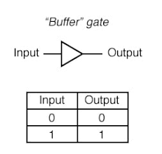

# Logic Gates

After knowing how to use binary variables (e.g., `1001`) to represent information, we explore digital systems that perform operations on these binary variables.

_Logic gates_ are simple digital circuits that take one one or more binary inputs and produce a binary output.

## Buffer

A _buffer_ is a one-input logic gate that simply copies the input to the output.

<figure><figcaption></figcaption></figure>


From a logical point of view, a buffer is no different from a wire, so it might seem useless. However, from the analog point of view, the buffer might have desirable characteristics such as the ability to deliver large amounts of current to a motor or the ability to quickly send its output to many gates. This is an example of why we need to consider multiple levels of abstraction to fully understand a system; the digital abstraction hides the real purpose of a buffer.

