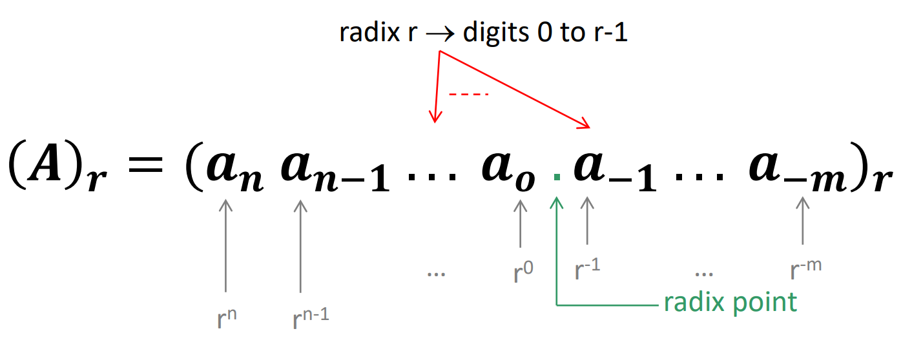
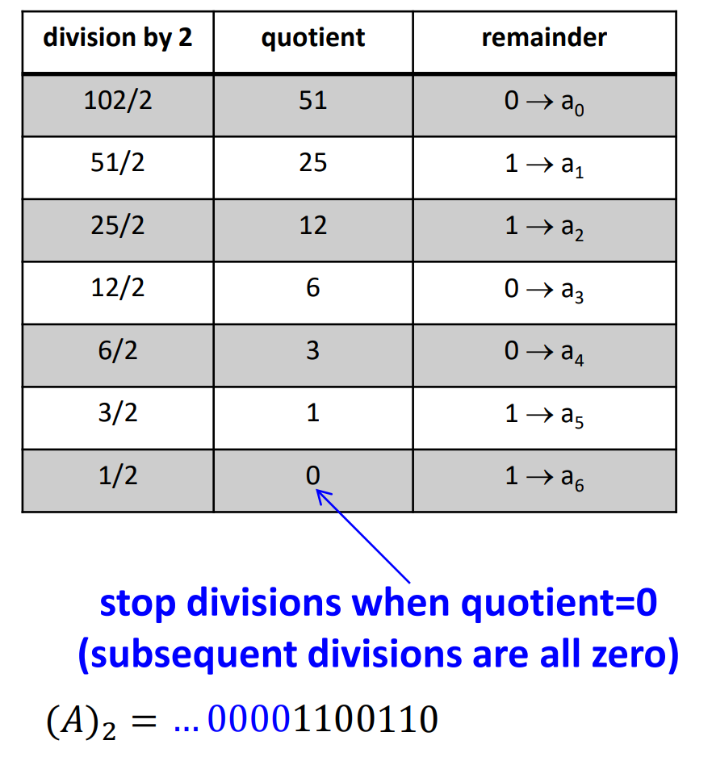
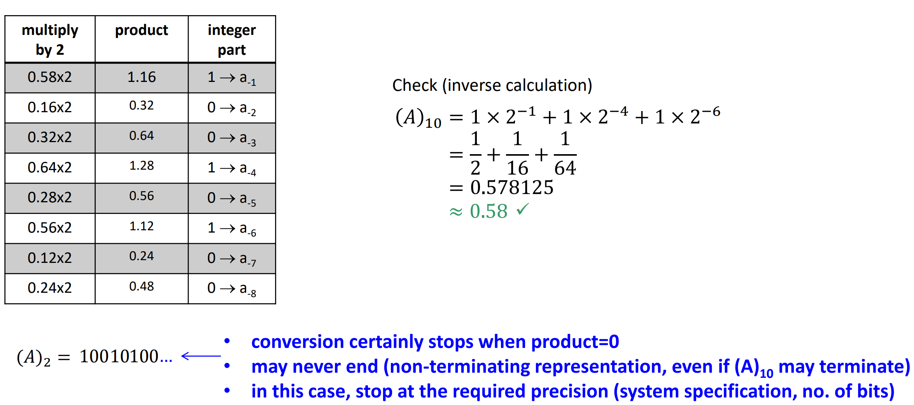
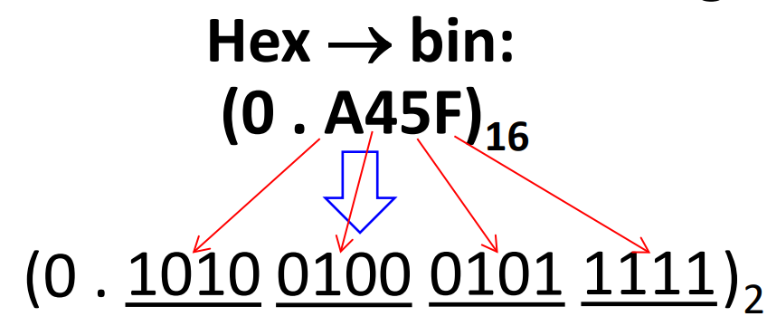
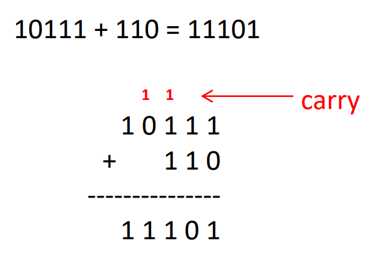
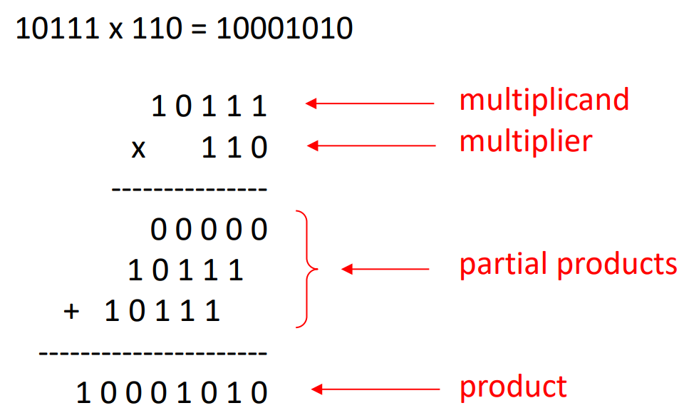
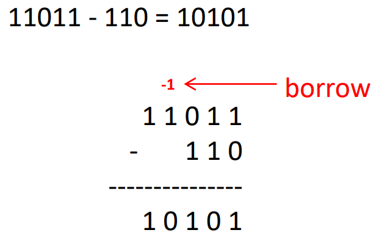
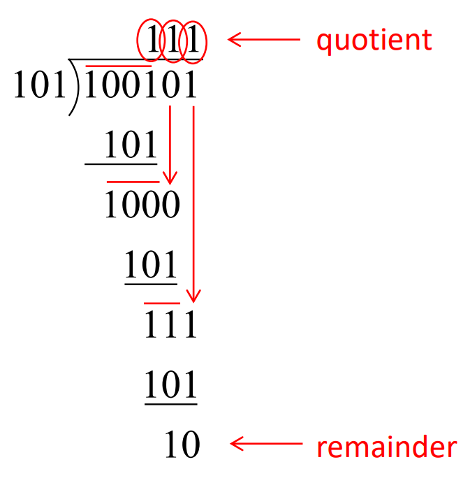
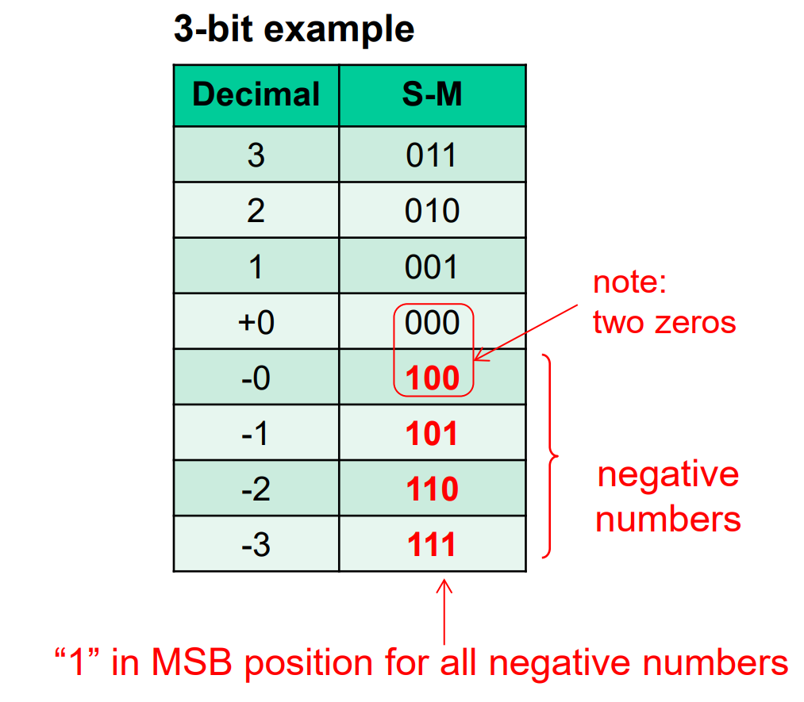
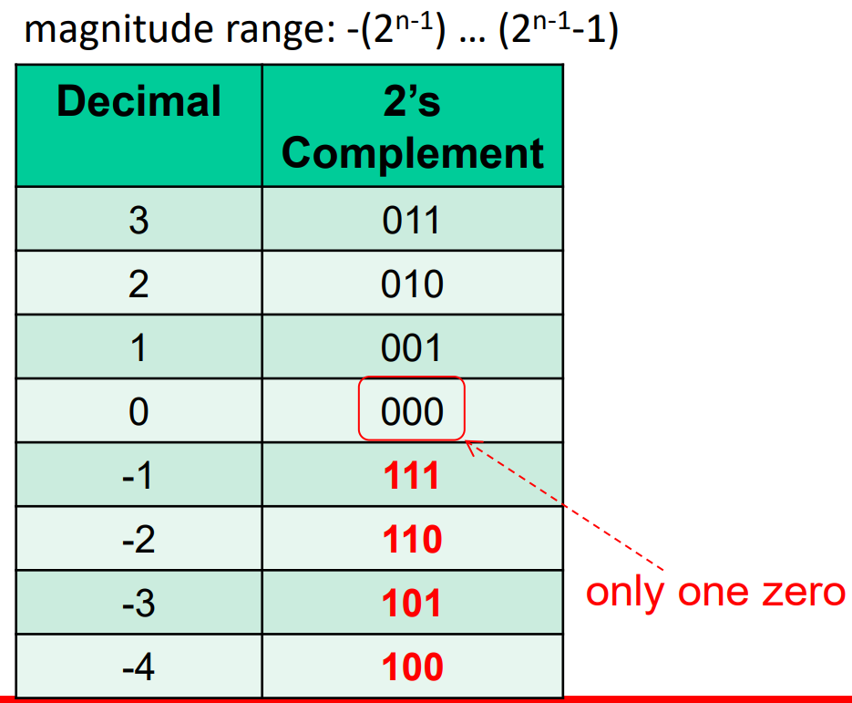

# Number Systems

## Positional Number System

In a positional number system, we have&#x20;

1. radix (or base)
2. radix point (`.`)
3. numerals made of digits (0->r-1)
4. each digit has its weight

In general, the generic number system with radix r is

<figure><figcaption></figcaption></figure>


After the radix point, in the **fraction part**, the weight for each digit starts from $$r^{-1}$$ to $$r^{-m}$$.


## Radix Conversion

### Binary, Octal, Hex to Decimal

This will be trivial. In general, from any radix r to decimal, we just need to calculate the weighted sum of all digits.

$$
\begin{align*}
(A)_r&=(a_na_{n-1}\cdots a_0\cdot a_{-1}\cdots a_{-m})_r\\
(A)_{10}&=a_n\times r^n+a_{n-1}\times r^{n-1}+\cdots+a_0\times r^0+a_{-1}\times r^{-1}+\cdots a_{-m}\times r^{-m}\\
&=\sum_{i=-m}^{n}(a_i\times r^i)
\end{align*}
$$

### Decimal to Binary, Octal, Hex

This conversion needs to be divided into two parts

1. Integer part
2. Fractional part



**Integer Part**

We do **repeated division by r** and **take the remainder**. Below is an example to convert $$102_{10}$$ to its binary equivalent:

<figure><figcaption></figcaption></figure>


#### Notes

1. In this method, we only care about the **remainder**, the quotient only determines when we will stop our division, but it won't appear in the radix r conversion result.
2. The first remainder is the LSB, the last remainder is the MSB.




**Fractional Part**

Similarly, we do **repeated multiplication by r** and **take the integer part**. Below is an example to convert $$0.58_{10}$$ to its binary equivalent:

<figure><figcaption></figcaption></figure>



### Conversion among Hex, Octal and Binary



**Hex <-> Binary**

1. Hex -> Binary: Each Hex Digit -> 4 bits
2. Binary to Hex: Grouping 4 bits of binary -> 1 Hex digit

For example, from hex to bin in fractional

<figure><figcaption></figcaption></figure>


From Binary to Hex, we start the grouping from the radix point and add zeros if necessary to have all groups of 4 bits.

* For Integers, add zeros on its **left**
* For fractions, add zeros on its **right**




**Octal <-> Binary**

Similar as He <-> Binary, but the 1 octal bit = 3 binary bits and thus the grouping should be done in 3 binary bits.



**Hex <-> Octal**

Use binary as an intermediate step



<details>

<summary>Bytes, Nibbles, and All that Jazz</summary>

1. A group of 8 bits is called a _byte_.
2. A group of four bits, or half a byte, is called a _nibble_.
3. Microprocessors[^1] handle data in chunks called _words_.


The size of a word depends on the architecture of the microprocessor. For example, most computers nowadays had 64-bit processors, indicating that they operate on 64-bit words.


</details>

## Binary Arithmetic

### Addition

The addition is almost the same as what we have learned in primary schools.

<figure><figcaption></figcaption></figure>


Pay attention to what is a _carry_ here. As in decimal addition, if the sum of two numbers is greater than what fits in a single digit, we _carry_ a 1 into the next column.


### Multiplication

Multiplication uses the same but a slightly different rule as in decimal system. In Binary system, the multiplication is done by

1. shift
2. then add

<figure><figcaption></figcaption></figure>


From the example above, we see that in binary system, multiplication can be simplified into an inexpensive adder as in digital system, shift is for free (just wiring)


### Substraction

The substraction in binary is totally the same as what we learned in primary school about the decimal substraction.

<figure><figcaption></figcaption></figure>


Similary, pay attention to the _borrow_ here.


### Division

In Binary division, we do almost the same thing as in the decimal division. For example,

<figure><figcaption></figcaption></figure>


Notice that division is basically shift and substract!


#### Recap

We may notice that in the binary arithmetic, there are actually two kinds of operation 1) add and 2) substract. However, as we know that substraction can be performed by adding a **negative number**. It means for our digital system, we may only need adders to perform all binary arithmetic operations.

> Challenge: This requires an appropriate representation of the negative binary numbers to inexpensively carry out subtractions.
>
> * reuse the unsigned adder for signed operations

To solve this challenge, we'll introduce the signed binary number representations in digital systems

## Signed Binary Number Representation

There are three ways to represent a signed number:

1. Sign-magnitude
2. 1's complement
3. 2's complement

### Signed Magnitude

In signed magnitude convention, we have

* MSB is the sign (0 is positive, 1 is negative)
* Subsequent bits are the magnitude

For example, the below is a 3-bit example for sign magnitude

<figure><figcaption></figcaption></figure>


Note that one **obvious disadvantage** for sign magnitude is that there are two representations for 0! This is troublesome as in assembly language, we may encouter a lot of comparison with 0, and using signed magnitude means that now 1 comparison -> 2 comparison!


### 1's Complement

The 1's complement in binary system is actually derived from the famous **diminished-radix complement representation**, which states that

> A "new" operation: diminished radix complement $$A^*$$ of an **n**-digit integer **A** with radix **r** defined as
>
> <p align="center"><span class="math">A^*=r^n-1-A</span></p>

Thus, in our binary system (radix r = 2), we have **1's complement** to be defined as

$$
A^*=2^n-1-A
$$

By practice, we find that there is a simpler way to find 1's complement of a binary number, that is

> reverse all bits

For example,

```
1001 -> 1's complement: 0110
1100 -> 1's complement: 0011
```

In summary, to get the 1's complement of a number, we should start from its magnitude A

* If $$A\geq0$$, just take the magnitude (n bits)
* If $$A<0$$, take the 1's complement of the magnitude (n bits). If binary, just flip all bits.


However, the issue that 0 has two representations still exist in 1's complement representation. 0 can be represented by `000` or `111`.


### 2's Complement

To solve the "0" problem above, we introduce 2's complement representation, which is just adding 1 to the 1's complement.

In short, finding the 2's complement representation of a number, we also start from its magnitude A

* If $$A\geq0$$, just take the magnitude (n bits)
* If $$A<0$$, take the 2's complement of the magnitude (n bits). If binary, just flip all bits and then add 1!

For example, the following table is a 3-bit 2's complement representation example

<figure><figcaption></figcaption></figure>

Now, we have solved the problem of 2 representations for number 0!


#### Notes

1. In Binary Arithmetic,
   1. **substraction** is performed by taking the two's complement of the second number, then adding. Make sure after changing the second number, the first number and the second number has **the same number of digits.** (Use Sign extension if necessary)
   2. **addition** is just adding two numbers and **discard any final carry bit**. (In subtraction, also need to discard the final carry bit)
2. **Sign extension** in 2's complement representation is achieved by copying the MSB.
3. 2's complement is used widely in nowaday's digital systems.


<details>

<summary>A trick of 2's complement</summary>

In 2's complement representation, we can also see the MSB as having a **negative weighted value**. For example, to convert `111` in 2's complement to decimal, we can have

```
111 = 1 * 2^-2 + 1 * 2^1 + 1 * 2^0
    = -4 + 2 + 1
    = -1
```

</details>

## More about carry and overflow

> This part is basically from an awesome explanation about overflow flag and carry flag form [idallen.com](https://teaching.idallen.com/dat2343/10f/notes/040_overflow.txt).

First and foremost, do not confuse the "carry" flag with the "overflow" flag in integer arithmetic. Each flag can occur on its own, or both together. The CPU's ALU doesn't care or know whether you are doing signed or unsigned mathematics; the ALU always sets both flags appropriately when doing any integer math. The ALU doesn't know about signed/unsigned; the ALU just does the binary math and sets the flags appropriately. It's up to you, the programmer, to know which flag to check after the math is done.

### Carry Flag

The rules for turning on the carry flag in binary/integer math are two:

1. The carry flag is set if the addition of two numbers causes a carry
   &#x20;out of the most significant (leftmost) bits added. e.g., `1111+0001=0000 (carry flag is turned on)`.
2. The carry (borrow) flag is also set if the subtraction of two numbers
   &#x20;requires a borrow into the most significant (leftmost) bits subtracted. e.g., `0000 - 0001 = 1111 (carry flag is turned on)`.

Otherwise, the carry flag is turned off (zero). For example

```
0111 + 0001 = 1000 (carry flag is turned off [zero])
1000 - 0001 = 0111 (carry flag is turned off [zero])
```


In unsigned arithmetic, watch the carry flag to detect errors.
&#x20;In signed arithmetic, the carry flag tells you nothing interesting.


### Overflow Flag

The rules for turning on the overflow flag in binary/integer math are two:

1. If the sum of two numbers with the sign bits off yields a result number
   &#x20;with the sign bit on, the "overflow" flag is turned on.  e.g., `0100 + 0100 = 1000 (overflow flag is turned on)`.
2. If the sum of two numbers with the sign bits on yields a result number
   &#x20;with the sign bit off, the "overflow" flag is turned on. e.g., `1000 + 1000 = 0000 (overflow flag is turned on)`.

Otherwise, the overflow flag is turned off. For example,

```
0100 + 0001 = 0101 (overflow flag is turned off)
0110 + 1001 = 1111 (overflow flag is turned off)
1000 + 0001 = 1001 (overflow flag is turned off)
1100 + 1100 = 1000 (overflow flag is turned off)
```

Note that you only need to look at the sign bits (leftmost) of the three
&#x20;numbers to decide if the overflow flag is turned on or off.&#x20;

* If you are doing two's complement (signed) arithmetic, overflow flag on
  &#x20;means the answer is wrong —  you added two positive numbers and got a negative, or you added two negative numbers and got a positive.
* If you are doing unsigned arithmetic, the overflow flag means nothing
  &#x20;and should be ignored.

Note that a negative and positive added together cannot be wrong, because the sum is between the addends. Since both of the addends fit within the allowable range of numbers, and their sum is between them, it must fit as well. Mixed-sign addition never turns on the overflow flag.


In signed arithmetic, watch the overflow flag to detect errors.
&#x20;In unsigned arithmetic, the overflow flag tells you nothing interesting.


<details>

<summary>FYI: How the ALU calculates the Overflow Flag</summary>

As we have seen above, the overflow flag only matters when we are in **signed arithmetic**, or more specifically, in the 2's complement representation discipline.

In short, there are two methods to set the Overflow Flag in ALU

1. **Method 1**: Look at the sign bit of the two operands and the result, 0 0 -> 1 or 1 1 -> 0, means got overflow.
2.  **Method 2**:  Do the XOR operation of the carry coming into the sign bit (if
    &#x20;any) with the carry going out of the sign bit (if any). Overflow happens
    &#x20;if the carry in **does not equal** the carry out.

    ```
    Examples (2-bit signed 2's complement binary numbers):

        11
       +01
       ===
        00

       - carry in is 1
       - carry out is 1
       - 1 XOR 1 = NO OVERFLOW


        01
       +01
       ===
        10

       - carry in is 1
       - carry out is 0
       - 1 XOR 0 = OVERFLOW!
    ```

</details>

[^1]: In this textbook, "Microprocessor" and "processor" are used interchangeably.
