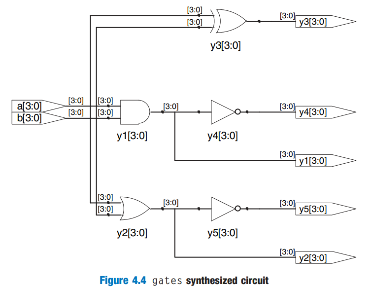
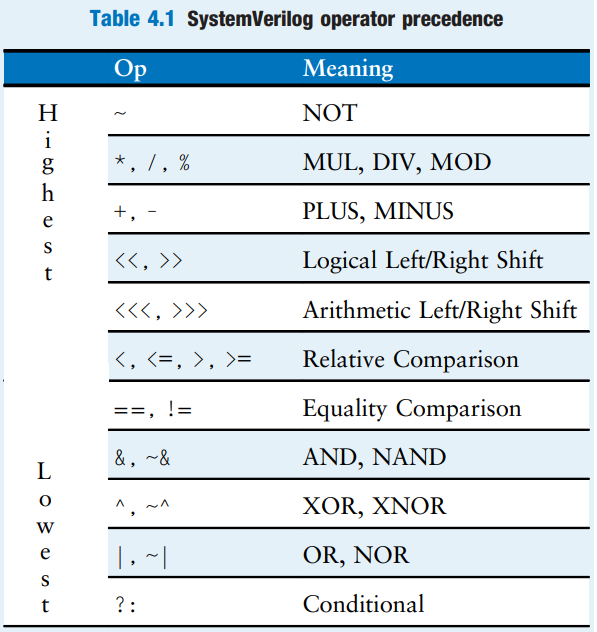

# Combinational Logic

Recall that we are disciplining ourselves to design synchronous sequential circuits, which consist of combinational logic and registers. The outputs of combinational logic depend only on the current inputs. This section describes how to write **behavioral** models of combinational logic with HDLs.

## Bitwise Operators

_Bitwise_ Operators act on **single-bit** signals or on **multi-bit** busses. For example, the `gates` module in HDL Example 4.3 demonstrates bitwise operations on 4-bit busses for most common basic logic functions.




```verilog
module gates(input  logic [3:0] a, b,
             output logic [3:0] y1, y2, y3
                                y4, y5, y6);
    /* five different two-input logic
       gates acting on 4-bit busses */
    assign y1 = a & b;    // AND
    assign y2 = a | b;    // OR
    assign y3 = a ^ b;    // XOR
    assign y4 = ~(a ^ b); // XNOR
    assign y5 = ~(a & b); // NAND
    assign y6 = ~(a | b); // NOR
endmodule
```





```verilog
module gates(input  [3:0] a, b,
             output [3:0] y1, y2, y3
                          y4, y5, y6);
  /* Five different two-input logic
     gates acting on 4 bit busses */
  assign y1 = a & b;    // AND
  assign y2 = a | b;    // OR
  assign y3 = a ^ b;    // XOR
  assign y4 = ~(a ^ b); // XNOR
  assign y5 = ~(a & b); // NAND
  assign y6 = ~(a | b); // NOR
endmodule
```




The schematic for the above code snippet may look like as follows,

<figure><figcaption></figcaption></figure>

### Operators, Operands, Expression and Statements

Using the `gate` module shown in Example 4.3,

1. `~`, `^`, `|` are examples of SystemVerilog/Verilog _operators_.
2. `a`, `b`, and `y1` are _operands_
3. A combination of operators and operands, such as `a & b`, `~(a | b)`, is called an _expression_
4. A complete command such as `assign y4 = ~(a & b);` is called a _statement_

### Continuous Assignment Statement

`assign out = in1 op in2;` is called a _continuous assignment statement_. Continuous assignment statements end with a semicolon. Anytime the inputs on the right side of the `=` in a continuous assignment state change, the output on the left side is recomputed. Thus, continuous assignment statements describe combinational logic.

## Comments and White Space

SystemVerilog/Verilog comments are just like those in C or Java. SystemVerilog/Verilog is case-sensitive. `y1` and `Y1` are different signals in SystemVerilog/Verilog.

SystemVerilog/Verilog is not picky about the use of white space (e.g., spaces, tabs, and line breaks). Nevertheless, proper indenting and use of blank lines is helpful to make nontrivial designs readable.


Be consistent in your use of capitalization and underscores in signal and module names. This text uses all lower case. Module and signal names must not begin with a digit.


## Reduction Operators

Reduction operators imply a multiple-input gate acting on a single bus. HDL Example 4.4 describes an eight-input AND gate with inputs $$a_7,a_6,\cdots,a_0$$.




```verilog
module and8(input  logic [7:0] a,
            output logic       y);
  assign y = &a;
  // &a is much easier to write than
  // assign y = a[7] & a[6] & a[5] & a[4] &
  // a[3] & a[2] & a[1] & a[0];
endmodule
```





```verilog
module and8(input  [7:0] a,
            output       y);
  assign y = &a;
  // &a is much easier to write than
  // assign y = a[7] & a[6] & a[5] & a[4] &
  // a[3] & a[2] & a[1] & a[0];
endmodule
```




Analogous reduction operators exist for OR, XOR, NAND, and XNOR gates. Recall that a multiple-input XOR performs **parity**, returning TRUE if an odd number of inputs are TRUE.

## Conditional Assignment

_Conditional Assignments_ select the output from among alternatives based on an input called the _condition_. This is pretty useful for describing the **multiplexer** in combinational logic.



**2:1 multiplexer**

HDL Example 4.5 illustrates a 2:1 multiplexer using conditional assignment.




```verilog
module mux2(input  logic [3:0] d0, d1,
            input  logic       s,
            output logic [3:0] y);
    assign y = s ? d1 : d0;
endmodule
```



#### Code Explanation

1. `? :` is especially useful for describing a multiplexer because, based on the first input, it selects between two others.
2. `? :` is also called a _ternary operator_, which is same to C and Java.





```verilog
module mux2(input  [3:0] d0, d1,
            input        s,
            output [3:0] y);
  assign y = s ? d1 : d0;
endmodule
```






**4:1 Multiplexer**

HDL Example 4.6 shows a 4:1 multiplexer based on the same principle as the 2:1 multiplexer in HDL Example 4.5.




```verilog
module mux4(input  logic [3:0] d0, d1, d2, d3,
            input  logic [1:0] s,
            output logic [3:0] y);
    assign y = s[1] ? (s[0] ? d3 : d2)
                    : (s[0] ? d1 : d0);
endmodule
```





```verilog
module mux4(input  [3:0] d0, d1, d2, d3,
            input  [1:0] s,
            output [3:0] y);
  assign y = s[1] ? (s[0] ? d3 : d2)
                  : (s[0] ? d1 : d0);
endmodule
```






## Internal Variables

_Internal Variables_ refer to the variables that are neither inputs nor outputs but are used only internal to the module. They are similar to local variables in programming languages. Example 4.7 shows how they are used in HDLs.




```verilog
module fulladder(input  logic a, b, cin,
                 output logic s, cout);
  logic p, g;
  
  assign p = a ^ b;
  assign g = a & b;
  assign s = p ^ cin;
  assign cout = g | (p & cin);
endmodule
```



#### Code Explanation

1. In this example, the signal `p` and `g` are two **internal variables.**
2. HDL assignments (`assign` in SystemVerilog/Verilog) take place **concurrently**. This is different from conventional programming language like C or Java. In HDL, the order of statements doesn't matter.





```verilog
module fulladder(input  a, b, cin,
                 output s, cout);
  wire p, g;
  
  assign p    = a ^ b;
  assign g    = a & b;
  assign s    = p ^ cin;
  assign cout = g | (p & cin);
endmodule
```



#### Code Explanation

1. In Verilog, _wires_ are used to represent internal variables whose values are defined by `assign` statements such as `assign p = a ^ b`.
2. Wires technically have to be declared only for multibit busses, but it is good practice to include them for all internal variables; their declaration could have been ommited in this example.




## Precedence

Table 4.1 summarises the operator precedence in SystemVerilog

<figure><figcaption></figcaption></figure>

## Numbers

Numbers can be specified in binary, octal, decimal, or hexadecimal (bases 2, 8, 10, and 16, respectively).

* The size, e.g., the number of bits, may optionally be given, and leading zeros are inserted to reach this size.
* Underscores (`_`) in numbers are ignored and can be helpful in breaking long numbers into more readable chunks.

The following table shows numbers are written in SystemVerilog/Verilog.

| Numbers        | Bits | Base | Val | Stored         |
| -------------- | ---- | ---- | --- | -------------- |
| `3'b101`       | 3    | 2    | 5   | 101            |
| `'b11`         | ?    | 2    | 3   | 000 ... 0011   |
| `8'b11`        | 8    | 2    | 3   | 00000011       |
| `8'b1010_1011` | 8    | 2    | 171 | 10101011       |
| `3'd6`         | 3    | 10   | 6   | 110            |
| `6'o42`        | 6    | 8    | 34  | 100010         |
| `8'hAB`        | 8    | 16   | 171 | 10101011       |
| `42`           | ?    | 10   | 42  | 00 ... 0101010 |


#### Table Explanation

1. It is a better practice to explicitly give the size of the numbers.
2. An exception is that, `0` and `1` are SystemVerilog idioms for filling a bus with all 0s and all 1s, respectively.


### Z's and X's

HDLs use `z` to indicate a floating value, `z` is particularly useful for describing a tristate buffer, whose output floats when the enable is 0. Similarly, HDLs use `x` to indicate an invalid logic level.

> **TODO:** Read through tristate buffer if have time.


Seeing `x` (SystemVerilog/Verilog) or `u` (VHDL) values in simulation is almost always an indication of a bug or bad coding practice.


## Bit Swizzling

Often it is necessary to operate on a subset of a bus or to concatenate (join together) signals to form busses. These operations are collectively known as _bit swizzling_. In HDL Example 4.12, `y` is given the 9-bit value $$c_2c_1d_0d_0d_0d_0c_0101$$ using bit swizzling operations.


```verilog
assign y = {c[2:1], {3{d[0]}}, c[0], 3'b101};
```


## Delays

HDL statements may be associated with delays specified in arbitrary units. They are helpful during simulation to predict how fast a circuit will work (if you specify meaningful delays) and also for debugging purposes to understand cause and effect (deducing the source of a bad output is tricky if all signals change simultaneously in the simulation results).


These delays are ignored during synthesis! Thus, it is highly **not recommended** to use delays in combinational circuits!


The delay of a gate produced by the synthesizer depends on its $$t_{\text{pd}}$$ and $$t_{\text{cd}}$$ specifications, not on numbers in HDL code.

HDL Example 4.13 adds delays to the original function from HDL Example 4.1, $$y=\bar a\bar b\bar c+a\bar b\bar c+a\bar bc$$.




```verilog
`timescale 1ns/1ps
module example(input  logic a, b, c,
               output logic y);
  logic ab, bb, cb, n1, n2, n3;
  
  assign #1 {ab, bb, cb} = ~{a, b, c};
  assign #2 n1 = ab & bb & cb;
  assign #2 n2 = a & bb & cb;
  assign #2 n3 = a & bb & c;
  assign #4 y = n1 | n2 | n3;
endmodule
```



#### Code Explanation

1. SystemVerilog/Verilog can include a timescale directive that indicates the value of each time unit. The statement is of the form `timescale unit/precision`. In this file, each unit is 1 ns, and the simulation has 1 ps precision.
2. If no timescale directive is given in the file, a default unit and precision (usually 1 ns for both) is used.





```verilog
`timescale 1ns/1ps
module example(input  a, b, c,
               output y);
  wire ab, bb, cb, n1, n2, n3;
  
  assign #1 {ab, bb, cb} = ~{a, b, c};
  assign #2 n1 = ab & bb & cb;
  assign #2 n2 = a & bb & cb;
  assign #2 n3 = a & bb & c;
  assign #4 y = n1 | n2 | n3;
endmodule
```



