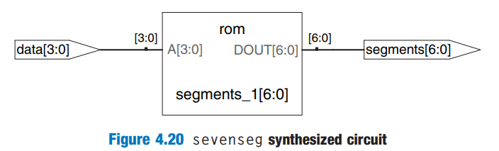

# More Combinational Logic

`always` statements can also be used to describe combinational logic behaviorally if the sensitivity list is written to respond to changes in all of the inputs and the body prescribes the output value for every possible input combination.

HDLs support _blocking_ and _nonblocking assignments_ in an `always` statement.

* A group of blocking statements are evaluated in the order in which they appear in the code, just as one would expect in a standard programming language.
* A gourp of nonblocking assignments are evaluated **concurrently**; all of the statements are evaluated before any of the signals on the left hand sides are updated.


In a SystemVerilog/Verilog `always` statement, `=` indicates a blocking assignment, and `<=` indicates a nonblocking assignment (also called a concurrent assignment).

Do not confuse either type with continuous assignment using the `assign` statement, `assign` statements must be used **outside** `always` statements and are also evaluated **concurrently**.


HDL Example 4.23 defines a full adder using intermediate signals `p` and `g` to compute `s` and `cout`. It produces the same circuit as code Example 4.7, but uses `always` statements in place of assignment statements.




```verilog
module fulladder(input  logic a, b, cin,
                 output logic s, cout);
  logic p, g;
  
  always_comb begin
    p    = a ^ b;        // blocking
    g    = a & b;        // blocking
    s    = p ^ cin;      // blocking
    cout = g | (p & cin); // blocking
  end
endmodule
```



#### Code Explanation

1. For reasons that will be discussed later, in SystemVerilog/Verilog `always` statement, it is best to use **blocking assignments** for combinational logic and **nonblocking assignments** for sequential logic.





```verilog
module fulladder(input  a, b, cin,
                 output reg s, cout);
  reg p, g;
  
  always @(*) begin
    p    = a ^ b;        // blocking
    g    = a & b;        // blocking
    s    = p ^ cin;      // blocking
    cout = g | (p & cin); // blocking
  end
endmodule
```



#### Code Explanation

1. In this case, an `@(a, b, cin)` would have been equivalent to `@(*)`. However, `@(*)` is better because it avoids common mistakes of missing signals in the stimulus/sensitivity list.
2. Point 1 in SystemVerilog also applies here.
3. Because `p` and `g` appear on the left hand side of an assignment in an `always` statement, they must be declared to be `reg`.




## Case statements

A better application of using `always` statement for combinational logic is a seven-segment display that takes advantage of the `case` statement that **must appear inside** an `always` statement.

HDL Example 4.24 uses `case` statements to describe a seven-segment display decoder based on its truth table.




```verilog
module sevenseg(input  logic [3:0] data,
                output logic [6:0] segments);
  always_comb
    case (data)
      // abc_defg
      0: segments = 7'b111_1110;
      1: segments = 7'b011_0000;
      2: segments = 7'b110_1101;
      3: segments = 7'b111_1001;
      4: segments = 7'b011_0011;
      5: segments = 7'b101_1011;
      6: segments = 7'b101_1111;
      7: segments = 7'b111_0000;
      8: segments = 7'b111_1111;
      9: segments = 7'b111_0011;
      default: segments = 7'b000_0000;
    endcase
endmodule
```



#### Code Explanation

1. The `default` clause is a convenient way to define the output for all cases not explicitly listed, guaranteeing combinational logic.
2. In SystemVerilog/Verilog, `case` statement must appear inside `always` statements.





```verilog
module sevenseg(input  [3:0] data,
                output reg [6:0] segments);
  always @(*)
    case (data)
      // abc_defg
      0:       segments = 7'b111_1110;
      1:       segments = 7'b011_0000;
      2:       segments = 7'b110_1101;
      3:       segments = 7'b111_1001;
      4:       segments = 7'b011_0011;
      5:       segments = 7'b101_1011;
      6:       segments = 7'b101_1111;
      7:       segments = 7'b111_0000;
      8:       segments = 7'b111_1111;
      9:       segments = 7'b111_1011;
      default: segments = 7'b000_0000;
    endcase
endmodule
```




This HDL code will synthesize into a [ROM](../digital-building-blocks/memory-arrays.md#memory-hdl) containing the 7 outputs for each of the
&#x20;16 possible inputs. This utilises the property of [logic using memory arrays](../digital-building-blocks/memory-arrays.md#logic-using-memory-arrays).

<figure><figcaption></figcaption></figure>

A `case` statement implies combinational logic if all possible input combinations are defined; otherwise it implies sequential logic, because the output will keep its old value in the undefined cases.

## If statements

`always` statements may also contain `if` statements. The `if` statement may be followed by an `else` statement. If all possible input combinations are handled, the statement implies combinational logic; otherwise, it produces sequential logic (like the [latch in the previous section](sequential-logic.md#latches))


In SystemVerilog/Verilog, `if` statements must appear inside of `always` statements.


## Truth Tables with Don't Cares

As examined previously, truth tables may include don't care's to allow more logic simplification. HDL Example 4.27 shows how to describe a priority circuit with don't cares.




```verilog
module priority_casez(input  logic [3:0] a,
                      output logic [3:0] y);
  always_comb
    casez (a)
      4'b1???: y <= 4'b1000;
      4'b01??: y <= 4'b0100;
      4'b001?: y <= 4'b0010;
      4'b0001: y <= 4'b0001;
      default: y <= 4'b0000;
    endcase
endmodule
```



#### Code Explanation

1. The `casez` statement acts like a `case` statement except that it also recognizes `?` as don't care.





```verilog
module priority_casez(input  [3:0] a,
                      output reg [3:0] y);
  always @(*)
    casez (a)
      4'b1???: y = 4'b1000;
      4'b01??: y = 4'b0100;
      4'b001?: y = 4'b0010;
      4'b0001: y = 4'b0001;
      default: y = 4'b0000;
    endcase
endmodule
```




## Blocking and Nonblocking Assignments

The following guidelines explain when and how to use each type of assignment. If these guidelines are not followed, it is possible to write code that appears to work in simulation but synthesizes to incorrect hardware.



1.  Use `always_ff @(posedge clk)` and **nonblocking assigments** to model **synchronous sequential logic.**

    <pre class="language-verilog" data-line-numbers><code class="lang-verilog">always_ff @(posedge clk) begin
      n1 &#x3C;= d;  // nonblocking
      q  &#x3C;= n1; // nonblocking
    end
    </code></pre>
2.  Use **continuous assignments** to model **simple combinational logic**.

    <pre class="language-verilog" data-line-numbers><code class="lang-verilog">assign y = s ? d1 : d0;
    </code></pre>
3.  Use `always_comb` and **blocking assignments** to model **more complicated combinational logic** where the `always` statement is helpful.<br>

    <pre class="language-verilog" data-line-numbers><code class="lang-verilog">always_comb begin
      p    = a ^ b;        // blocking
      g    = a &#x26; b;        // blocking
      s    = p ^ cin;
      cout = g | (p &#x26; cin);
    end
    </code></pre>
4. Do not make assignments to the **same signal** in more than one `always` statement or **continuous assignment statement**.



1.  Use `always @ (posedge clk)` and **nonblocking assigments** to model **synchronous sequential logic.**

    <pre class="language-verilog" data-line-numbers><code class="lang-verilog">always @(posedge clk) begin
      n1 &#x3C;= d;  // nonblocking
      q  &#x3C;= n1; // nonblocking
    end
    </code></pre>
2.  Use **continuous assignments** to model **simple combinational logic**.

    <pre class="language-verilog" data-line-numbers><code class="lang-verilog">assign y = s ? d1 : d0;
    </code></pre>
3.  Use `always @ (*)` and **blocking assignments** to model **more complicated combinational logic** where the `always` statement is helpful.<br>

    <pre class="language-verilog" data-line-numbers><code class="lang-verilog">always @ (*)
      p    = a ^ b;        // blocking
      g    = a &#x26; b;        // blocking
      s    = p ^ cin;
      cout = g | (p &#x26; cin);
    end
    </code></pre>
4. Do not make assignments to the **same signal** in more than one `always` statement or **continuous assignment statement**.




Inside an `always @ (posedge clk)` block, it is possible to use the `if/case` statements, but the **signals** inside the `if/case` statements should use **blocking assignment** `=`, but **always keep in mind** which signal you want it to be a real register, then use **nonblocking assignment** `<=` on that signal (it can be assigned anywhere as long as it is in the `always @ (posedge clk)`)


```verilog
reg done;

always @(posedge CLK) begin
    if (...) begin
        ...
    end
    done <= 1;
    else begin
        ...
        done <= 1;
    end
ebd
```


