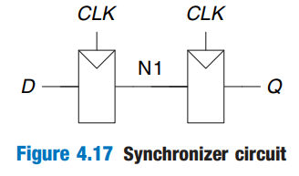

# Sequential Logic

HDL synthesizers recognize certain idioms and turn them into specific sequential circuits. Other coding styles may simulate correctly but synthesize into circuits with blatant or subtle errors. This section presents the proper idioms to describe registers and latches.

## Registers

The vast majority of modern commercial systems are built with registers using positive edge-triggered D flip-flops. HDL Example 4.17 shows the idiom for such flip-flops.

In SystemVerilog/Verilog `always` statements, signals keep their old value until an event in the sensitivity list takes place that explicitly causes them to change. Hence, such code, with appropriate sensitivity lists, can be used to describe sequential circuits with memory. For example, the flip-flop includes only `clk` in the sensitive list. It remembers its old value  of `q` until the next rising edge of the `clk`, even if `d` changes in the interim.

In contrast, SystemVerilog/Verilog [continuous assignment statements](https://wenbo-notes.gitbook.io/ddca-notes/textbook/hardware-description-languages/combinational-logic#continuous-assignment-statement) (`assign`) are reevaluated **anytime** **any of the inputs** on the right hand side changes. Therefore, such code necessarily describes combinational logic.




```verilog
module flop(input  logic       clk,
            input  logic [3:0] d,
            output logic [3:0] q);
  always_ff @(posedge clk)
    q <= d;
endmodule
```



#### Code Explanation

1.  In general, a SystemVerilog `always` statement is written in the form\


    <pre class="language-verilog" data-line-numbers><code class="lang-verilog">always @(sensitivity list)
      statement;
    </code></pre>
2. The `statement` is executed **only when** the event specified in the `sensitivity list` occurs. In this example, the statement is `q <= d` (pronounced "q gets d"). Hence, the flip-flop copies `d` to `q` on the positive edge of the clock and otherwise remembers the old state of `q`. Note that sensitivity lists are also referred to as stimulus lists.
3. `<=` is called a _nonblocking assignment_. Think of it as a regular `=` sign for now; we'll return to the more subtle points later. Note that `<=` is used instead of `assign` inside an `always` statement.
4. **(SystemVerilog Specific)** As will be seen in subsequent sections, `always` statements can be used to imply flip-flops, latches, or combinational logic, depending on the **sensitivity list** and **statement**. Because of this flexibility, it is easy to produce the wrong hardware inadvertently. SystemVerilog introduces `always_ff`, `always_latch`, and `always_comb` to reduce the risk of common errors. `always_ff` behaves like `always` but is used exclusively to imply flip-flops and allows tools to produce a warning if anything else is implied.





```verilog
module flop(input        clk,
            input  [3:0] d,
            output reg [3:0] q);
  always @(posedge clk)
    q <= d;
endmodule
```



#### Code Explanation

1. Point 1-3 from SystemVerilog Code Explanation applies to Verilog also.
2. All signals on the left hand side of `<=` or `=` in an `always` statement must be declared as `reg`. In this example, `q` is both an output and a `reg`, so it is declared as `output reg [3:0]`.
3. Declaring a signal as `reg` does not mean the signal is actually the output of a register!!! All it means is that the signal appears on the left hand side of an assignment in an `always` statement. We will see later examples of `always` statements describing combinational logic in which the output is declared `reg` but does not come from a flip-flop.




### Resettable Registers

When simulation begins or power is first applied to a circuit, the output of a flip flop or register is unknown. This is indicated with `x` in SystemVerilog/Verilog. Generally, it is a good practice to use resettable registers so that on powerup you can put your system in a known state. The reset may be either **asynchronous** or **synchronous**. Recall that asynchronous reset occurs immediately, wheras synchronous reset clears the output only on the next rising edge of the clock. HDL Example 4.18 demonstrates the idioms for flip-flops with asynchronous and synchronous resets.




```verilog
module flopr(input  logic       clk,
             input  logic       reset,
             input  logic [3:0] d,
             output logic [3:0] q);
  // asynchronous reset
  always_ff @(posedge clk, posedge reset)
    if (reset) q <= 4'b0;
    else       q <= d;
endmodule

module flopr(input  logic       clk,
             input  logic       reset,
             input  logic [3:0] d,
             output logic [3:0] q);
  // synchronous reset
  always_ff @(posedge clk)
    if (reset) q <= 4'b0;
    else       q <= d;
endmodule
```





```verilog
module flopr(input        clk,
             input        reset,
             input  [3:0] d,
             output reg [3:0] q);
  // asynchronous reset
  always @(posedge clk, posedge reset)
    if (reset) q <= 4'b0;
    else       q <= d;
endmodule

module flopr(input        clk,
             input        reset,
             input  [3:0] d,
             output reg [3:0] q);
  // synchronous reset
  always @(posedge clk)
    if (reset) q <= 4'b0;
    else       q <= d;
endmodule
```




### Enabled Registers

Enabled registers respond to the clock only when the enable is asserted. HDL Example 4.19 shows an asynchronously resettable enabled register that retains its old value if both `reset` and `en` are FALSE.




```verilog
module flopenr(input  logic       clk,
               input  logic       reset,
               input  logic       en,
               input  logic [3:0] d,
               output logic [3:0] q);
  // asynchronous reset
  always_ff @(posedge clk, posedge reset)
    if (reset)   q <= 4'b0;
    else if (en) q <= d;
endmodule
```





```verilog
module flopenr(input        clk,
               input        reset,
               input        en,
               input  [3:0] d,
               output reg [3:0] q);
  // asynchronous reset
  always @(posedge clk, posedge reset)
    if (reset)   q <= 4'b0;
    else if (en) q <= d;
endmodule
```




### Multiple Registers

A single `always` statement in SystemVerilog can be used to describe multiple pieces of hardware. For example, consider the synchronizer made of two back-to-back flip-flops, as shown in Figure 4.17.

<figure><figcaption></figcaption></figure>

HDL Example 4.20 describes the synchronizer. On the rising edge of `clk`, `d` is copied to `n1`. At the same time, `n1` is copied to `q`.




```verilog
module sync(input  logic clk,
            input  logic d,
            output logic q);
  logic n1;
  
  always_ff @(posedge clk) begin
    n1 <= d;  // nonblocking
    q  <= n1; // nonblocking
  end
endmodule
```



#### Code Explanation

1. Notice that the `begin/end` construct is **necessary** because multiple statements appear in the `always` statement. This is analogous to `{}` in C or Java. The `begin/end` was not needed in the `flopr` example because `if/else` counts as a single statement.





```verilog
module sync(input  clk,
            input  d,
            output reg q);
  reg n1;
  
  always @(posedge clk) begin
    n1 <= d;
    q  <= n1;
  end
endmodule
```




## Latches

Recall from [previous section](../sequential-logic-design/latches-and-flip-flops.md#d-latch) that a D latch is transparent when the clock is HIGH, allowing data to flow from input to output. The latch becomes opaque when the clock is LOW, retaining its old state. HDL Example 4.21 shows the idiom of a D latch.&#x20;




```verilog
module latch(input  logic       clk,
             input  logic [3:0] d,
             output logic [3:0] q);
  always_latch
    if (clk) q <= d;
endmodule
```



#### Code Explanation

1. **(SystemVerilog Specific)** `always_latch` is equivalent to `always @(clk, d)` and is the preferred idiom for describing a latch in SystemVerilog. It evaluates any time `clk` or `d` changes. If `clk` is HIGH, `d` flows through to `q`, so this code describes a positive level sensitive latch. Otherwise, `q` keeps its old value.





```verilog
module latch(input        clk,
             input  [3:0] d,
             output reg [3:0] q);
  always @(clk, d)
    if (clk) q <= d;
endmodule
```



#### Code Explanation

1. The sensitivity list contains both `clk` and `d`, so the `always` statement evaluates any time `clk` or `d` changes. If `clk` is HIGH, `d` flows through to `q`.
2. `q` must be declared to be a `reg` because it appears on the left hand side of `<=` in an `always` statement. This does not always mean that `q` is the output of a register!




Not all synthesis tools supports latches well. Unless you know that your tool does support latches and you have a good reason to use them, **avoid them and use edge-triggered flip-flops instead**.
