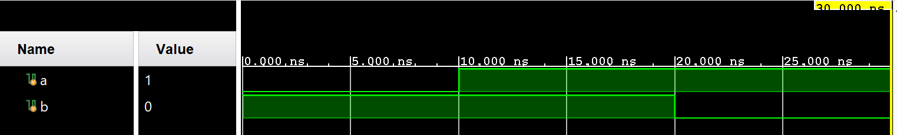

# Testbench

As we have seen [before](https://wenbo-notes.gitbook.io/ddca-notes/textbook/hardware-description-languages#synthesis), HDL will code be divided into synthesizable and testbench. A _testbench_ is an HDL module that is used to test another module, called the _device under test (DUT)_.


Some tools also call the module to be tested the _unit under test (UUT)_.


HDL example 4.38 shows how to write a self-checking testbench,




```verilog
module testbench2();
  logic a, b, c, y;
  
  // instantiate device under test
  sillyfunction dut(a, b, c, y);
  
  // apply inputs one at a time
  // checking results
  initial begin
    a = 0; b = 0; c = 0; #10;
    assert (y === 1) else $error("000 failed.");
    
    c = 1; #10;
    assert (y === 0) else $error("001 failed.");
    
    b = 1; c = 0; #10;
    assert (y === 0) else $error("010 failed.");
    
    c = 1; #10;
    assert (y === 0) else $error("011 failed.");
    
    a = 1; b = 0; c = 0; #10;
    assert (y === 1) else $error("100 failed.");
    
    c = 1; #10;
    assert (y === 1) else $error("101 failed.");
    
    b = 1; c = 0; #10;
    assert (y === 0) else $error("110 failed.");
    
    c = 1; #10;
    assert (y === 0) else $error("111 failed.");
  end
endmodule
```



#### Code Explanation

1. The `initial` statement executes the statements in its body at the start of simulation.
2. `initial` statement should be used only in testbenches for simulation, not in modules intended to be synthesized into actual hardware.
3. The blocking statements (`=`) and delays (`#`) are used to apply the inputs in the appropriate order.
4. Testbenches uses `===` and `!==` (instead of `==` and `!=`) for comparisons of equality and inequality, respectively, because these operators work correctly with operands that could be `x` or `z`.





```verilog
module testbench2();
  reg a, b, c;
  wire y;
  
  // instantiate device under test
  sillyfunction dut(a, b, c, y);
  
  // apply inputs one at a time
  // checking results
  initial begin
    a = 0; b = 0; c = 0; #10;
    if (y !== 1) $display("000 failed.");
    
    c = 1; #10;
    if (y !== 0) $display("001 failed.");
    
    b = 1; c = 0; #10;
    if (y !== 0) $display("010 failed.");
    
    c = 1; #10;
    if (y !== 0) $display("011 failed.");
    
    a = 1; b = 0; c = 0; #10;
    if (y !== 1) $display("100 failed.");
    
    c = 1; #10;
    if (y !== 1) $display("101 failed.");
    
    b = 1; c = 0; #10;
    if (y !== 0) $display("110 failed.");
    
    c = 1; #10;
    if (y !== 0) $display("111 failed.");
  end
endmodule
```




### More on Delay

What does delay actually mean? In essence, during the delay time, all signal values in the block where delay (`#`) is used remain **unchanged**, so in the waveform viewer it _looks flat_ (no change), unless there are other blocks which has some signal assignments.

For example,


```verilog
// Signal declarations
reg a;
reg b;
reg clk;

// Waveform generation
initial begin
    // Initialize signals
    a = 0;
    b = 1;
    clk = 0;
    #10; // Wait 10 time units
    a = 1;
    #10; // Wait another 10 time units
    b = 0;
    #10; // Additional time to observe final state
    $finish; // End simulation
end
```


So basically, at time `t=0`, `a=0` and `b=1`. Then from time `t=0` to `t=10`, because of delay, nothing happens and signals stay same as `t=0`. Similar to the remaining, and the waveform looks like below,

<figure><figcaption></figcaption></figure>

However, the delay (`#`) only applies to the block the delay statement is in, if we have another block, for example, an always block to generate the clock signal, that block won't be affected by the `delay` in the initial block.


```verilog
// Singal declaration same as above

// Waveform generation, the initial block same as above

always begin
    #5 clk = ~clk;
end
```


And thus, the waveform will look like as follows,

<figure><figcaption></figcaption></figure>
