# Memory Systems

> This part is almost the same as NUS CG3207 Lec 07 — Memory Systems Principles. So, I will combine the information together here.

## Introduction

Computer system performance depends on **both** the memory system **and** the processor microarchitecture. But processor speed has increased at a **faster rate** than memory speeds. DRAM memories are currently **10 to 100 times slower** than processors. This is the bottleneck!

The processor communicates with the memory system over a **memory interface**. The figure below shows the **simple memory interface** used in our **multicycle RISC-V processor**. The processor sends an **address** over the **Address bus** to the memory system. For a **read**, `MemWrite` is 0 and the memory returns the **data** on the `ReadData` bus. For a **write**, `MemWrite` is 1 and the processor sends **data** to memory on the **WriteData bus**.

<figure>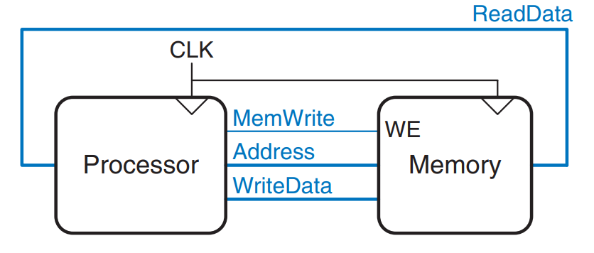<figcaption><p>The memory interface</p></figcaption></figure>


`WriteData`, `Address` and `MemWrite` are signals coming out of the processor. `ReadData` is the signal coming into the processor.


To solve this bottleneck, we use the [two principles of locality](memory-systems.md#two-principles-of-locality) to build a memory hierarchy shown as follows.

<figure>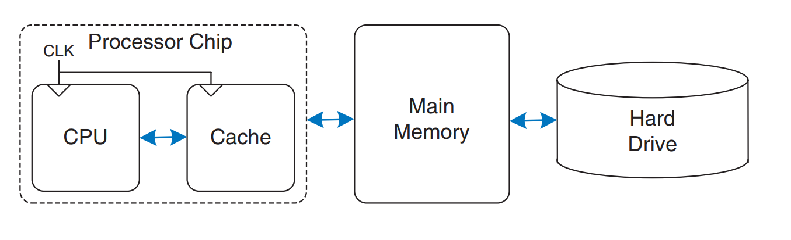<figcaption><p>A typical memory hierarchy</p></figcaption></figure>

The processor first seeks data in a **small but fast cache** that is usually located **on the same chip**. If the data is **not available in the cache**, the processor then looks in **main memory**. If the data is **not there either**, the processor fetches the data from **virtual memory** on the **large but slow hard disk**. Using this memory hierarchy, our memory systems can quickly access the most commonly used data while still having the capacity to store large amounts of data.

Within this memory hierarchy, there are three levels



#### Cache

Computers store the **most commonly used instructions and data** in a **faster but smaller memory**, called a **cache**. This is also the **first level** of our memory hierarchy. The cache is usually built out of **SRAM** on the **same chip** as the processor. The **cache speed** is **comparable to the processor speed** because **SRAM is inherently faster than DRAM** and because the **on-chip memory** eliminates **lengthy delays** caused by traveling to and from a separate chip.

1. **Cache hit**: If the processor requests data that is **available in the cache**, it is returned **quickly**. This is called a **cache hit**.
2. **Cache miss**: Otherwise, the processor retrieves the data from **main memory (DRAM)**. This is called a **cache miss**.



#### Main Memory

Computer memory, which is our **second level** of the memory hierarchy, is generally built from DRAM chips. Unfortunately, **DRAM speed** has improved by only about **7% per year**, whereas **processor performance** has improved at a rate of **25% to 50% per year**, as shown in the figure below.

<figure>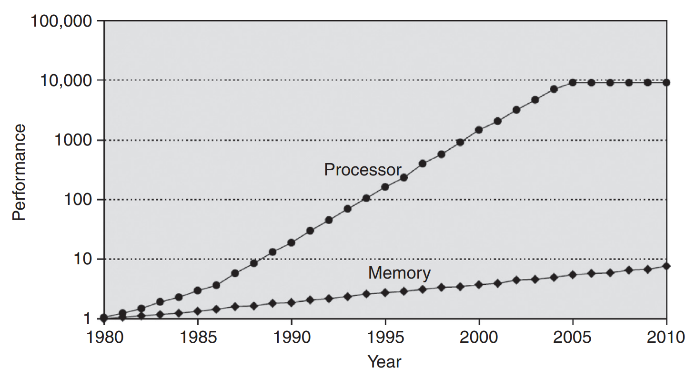<figcaption><p>Diverging processor and memory performance</p></figcaption></figure>

<details>

<summary>Memory Speed</summary>

Remember that speed is characterized by both **latency** and **throughput**.

* **Memory latency** is the time to access the **first byte** of information.
* **Throughput** is the number of bytes per second that can be delivered.

Main memories have good throughput but long latency.

</details>



#### Hard Drive

The **third level** of the memory hierarchy is the **hard drive**. The hard drive has evolved from HDD to NAND Flash devices, like SSD.

The hard drive provides an **illusion of more capacity** than actually exists in the main memory. It is thus called **virtual memory**. Main memory, also called **physical memory**, holds a **subset** of the **virtual memory**. Hence, the main memory can be viewed as a **cache** for the most commonly used data from the **hard drive**.



In summary, the figure below illustrates this capacity and speed trade-off in the memory hierarchy and lists typical costs, access times, and bandwidth in 2021 technology. As access time decreases, speed increases.

<figure>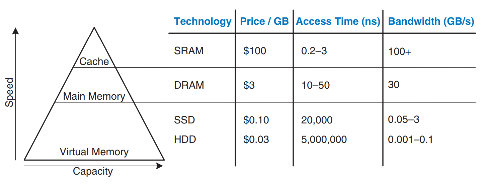<figcaption><p>Memory hierarchy components, with typical characteristics in 2021</p></figcaption></figure>

<details>

<summary>Two principles of locality</summary>

1. **Temporal locality**: If we have used a piece of data recently, we are likely to use it again soon.
2. **Spatial locality**: When we use one particular piece of data, we are likely to be interested in other pieces of data in the same area.

</details>

## Memory System Performance Analysis

There are three memory system performance metrics:



#### Miss Rate

$$
\text{Miss Rate} = \frac{\text{Number of misses}}{\text{Number of total memory accesses}} = 1 - \text{Hit Rate}
$$



#### Hit Rate

$$
\text{Hit Rate}  = \frac{\text{Number of hits}}{\text{Number of total memory accesses}}  = 1 - \text{Miss Rate}
$$



#### Average Memory Access Time (AMAT)

**Average memory access time (AMAT)** is the average time a processor must wait for memory per load or store instruction. It is calculated as follows:

$$
\text{AMAT} = t_{\text{cache}} + \text{MR}_{\text{cache}} \left( t_{\text{MM}} + \text{MR}_{\text{MM}} t_{\text{VM}} \right)
$$

where $$t_{\text{cache}}$$, $$t_{\text{MM}}$$, and $$t_{\text{VM}}$$ are the **access times** of the **cache**, **main memory**, and **virtual memory**, and $$\text{MR}_{\text{cache}}$$ and $$\text{MR}_{\text{MM}}$$ are the **cache** and **main memory miss rates**, respectively.

<details>

<summary>Self Diagnostic Question</summary>

Calculate the Average Memory Access Time (AMAT) for a computer system with a two-level memory hierarchy, given the following specifications:

* Cache Access Time: 1 cycle
* Cache Miss Rate: 10%
* Main Memory Access Time: 100 cycles

***

**Sol**: The formula for AMAT is:

<p align="center"><span class="math">\text{AMAT} = \text{Hit Time} + (\text{Miss Rate} \times \text{Miss Penalty})</span></p>

Substituting the values:

<p align="center"><span class="math">\begin{aligned} \text{AMAT} &#x26;= 1 + (0.10 \times 100) \\             &#x26;= 1 + 10                  \\             &#x26;= 11~\text{cycles} \end{aligned} </span></p>

</details>



As a word of caution, performance improvements might not always be as good as they sound. As we have seen in [NUS CG3207 Lec 01](https://wenbo-notes.gitbook.io/ddca-notes/lec/lec-01-history-technology-performance#amdahls-law), the **amdahl's law** says that the effort spent on increasing the performance of a subsystem is **worthwhile only if** the subsystem **affects a large percentage** of the **overall performance**.

## Cache

A **cache** holds **commonly used memory data**. The number of data words that it can hold is called the **capacity**, $$C$$. Because the **capacity of the cache** is **smaller than that of main memory**, the computer system designer must choose what **subset** of the **main memory** is kept in the cache.

As we explain in the following sections, **caches** are specified by their **capacity** ($$C$$), **number of sets** ($$S$$), **block size** ($$b$$), **number of blocks** ($$B$$), and **degree of associativity** ($$N$$).


Keep in mind that the spirit of cache is the [two principles of locality](memory-systems.md#two-principles-of-locality) we have introduced above, which is the inherent spatial and temporal locality of data accesses in most applications.


### Data

Because it is **impossible to predict the future with perfect accuracy**, the **cache** must **guess** what data will be needed based on the **past pattern** of **memory accesses**. This pattern is guided by the [two principles of locality](memory-systems.md#two-principles-of-locality):

1. By the **temporal locality**, when the processor **loads or stores data** that is **not in the cache**, the data is **copied from main memory into the cache**. **Subsequent requests** for that data then **hit in the cache**.
2. By the **spatial locality**, when the **cache** fetches one word from memory, it may also fetch several **adjacent words**. This group of words is called a **cache block** or **cache line**. The number of words in the cache block, $$b$$, is called the **block size**. A cache of **capacity** $$C$$ contains $$B = C/b$$  **blocks**.

### Mapping

A **cache** is organized into **S sets**, each of which holds one or more **blocks** of data. The relationship between the address of data in **main memory** and the location of that data in the cache is called the **mapping**. Each **memory address** maps to **exactly one set** in the cache. Some of the **address bits** are used to determine which **cache set** contains the data. If the set contains more than one block, the data may be kept in **any** of the blocks in the set.

**Caches** are categorized based on the **number of blocks** in a set.

1. In a **direct-mapped cache**, each set contains **exactly one block**, so the cache has **S = B sets**. Thus, a particular **main memory address** maps to a **unique block** in the cache.
2. In an **N-way set associative cache**, each set contains **N blocks**. The address still maps to a **unique set**, with **S = B/N sets**. But the data from that address can go in **any of the N blocks** in that set.
3. A **fully associative cache** has only **S = 1 set**. Data can go in **any** of the **B blocks** in the set. Hence, a **fully associative cache** is another name for a **B-way set associative cache**.

To illustrate these **cache organizations**, we will consider a **RISC-V memory system** with **32-bit addresses** and **32-bit words**. The memory is **byte-addressable**, and each word is **four bytes**, so the memory consists of $$2^{30}$$ **words** aligned on word boundaries. We analyze caches with an **eight-word capacity** ($$C$$) for the sake of simplicity. We begin with a **one-word block size** ($$b$$), then generalize later to **larger blocks**.

#### Direct Mapped Cache

A **direct-mapped cache** has **one block** in each set, so it is organized into **S = B sets**. This mapping is illustrated in the figure below for a direct mapped cache with a capacity of eight words and a block size of one word.

<figure>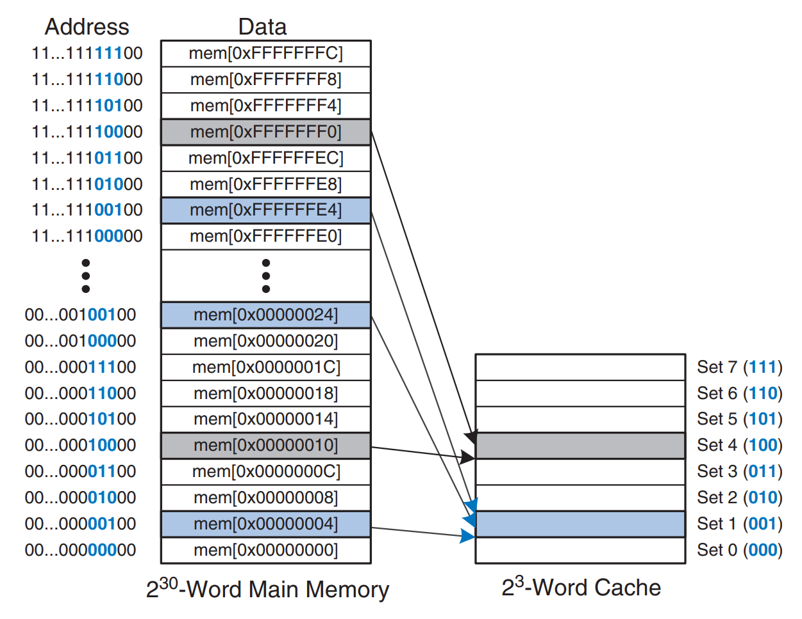<figcaption><p>Mapping of main memory to a direct mapped cache</p></figcaption></figure>

The **cache** has **eight sets**, each of which contains a **one-word block**. The bottom two bits of the address are always 00, because they are **word-aligned**. The next $$\log_2 8 = 3$$ bits indicate the **set** onto which the memory address maps. Thus, the data at addresses `0x00000004`, `0x00000024`, …, `0xFFFFFFE4` all map to **set 1**, as shown in blue. Likewise, data at addresses `0x00000010`, …, `0xFFFFFFF0` all map to **set 4**, and so forth. Each **main memory address** maps to **exactly one set** in the cache.



#### Tag Bit

Because many addresses map to a single set, the cache must also keep track of the address of the data actually contained in each set. This is achieved by the **tag bit** and it indicates which of the many possible addresses is held in that set.



#### Cache Field

In our previous examples, the **two least significant bits** of the **32-bit address** are called the **byte offset** because they indicate the **byte within the word**. The next **three bits** are called the **set bits** because they indicate the **set** to which the address maps. (In general, the number of set bits is $$\log_2 S$$.) The remaining **27 tag bits** indicate the **memory address** of the data stored in a given cache set. The following figure shows the **cache fields** for address `0xFFFFFFE4`. It maps to **set 1** and its **tag** is all 1’s.

<figure>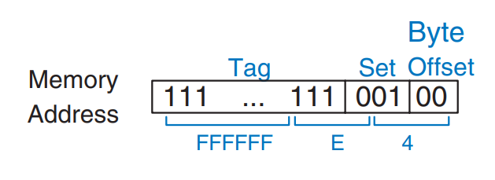<figcaption></figcaption></figure>

<details>

<summary>Self Diagnostic Quiz</summary>

Find the number of set and tag bits for a direct-mapped cache with 1024 (2¹⁰) sets and a one-word block size. The address size is 32 bits.

***

**Solution:** A cache with 2¹⁰ sets requires log₂(2¹⁰) = 10 set bits. The two least significant bits of the address are the byte offset, and the remaining 32 − 10 − 2 = 20 bits form the tag.

</details>



#### Valid Bit

Sometimes, such as when the computer first starts up, the **cache sets** contain **no data** at all. The cache uses a **valid bit** for each set to indicate whether the set holds **meaningful data**. If the **valid bit** is **0**, the contents are **are meaningless**.



#### Hardware Implementation

The following figure shows the hardware for the direct mapped cache of the above figure. The **cache** is constructed as an **eight-entry SRAM**. Each **entry** (or **set**) contains one line consisting of **32 bits of data**, **27 bits of tag**, and **1 valid bit**. The cache is accessed using the **32-bit address**.

<figure>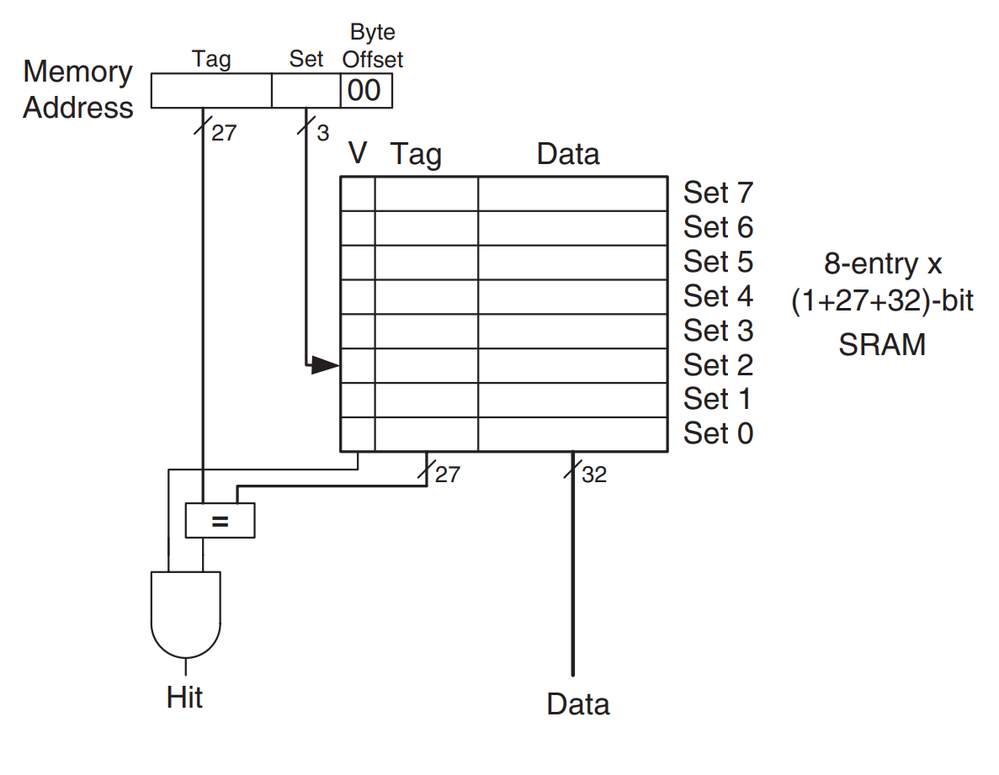<figcaption><p>Direct mapped cache with 8 sets</p></figcaption></figure>

A **load instruction** reads the specified **entry** from the **cache** and checks the **tag** and **valid bits**. If the **tag** matches the most significant **27 bits** of the requested address and the **valid bit** is **1**, the cache **hits** and the **data** is returned to the processor. Otherwise, the cache **misses** and the memory system must fetch the data from **main memory**.



#### Conflict

When two **recently accessed addresses** map to the **same cache block**, a **conflict** occurs, and the **most recently accessed address** **evicts** the previous one from the block.

**Direct-mapped caches** have **only one block** in each set, so two addresses that map to the **same set** always cause a **conflict**.



#### Multiway Set Associative Cache

An **N-way set associative cache** reduces **conflicts** by providing **N blocks** in each set where data mapping to that set might be found. Each **memory address** still maps to a **specific set**, but it can map to **any one of the N blocks** in the set. **N** is also called the **degree of associativity** of the cache.


A **direct mapped cache** is another name for a **one-way** set associative cache.


The following figure shows the hardware for a **C = 8-word**, **N = 2-way set associative cache**. The cache now has only **S = 4 sets** rather than 8. Thus, only **log₂4 = 2 set bits** rather than 3 are used to select the set. The **tag** increases from **27** to **28 bits**. Each set contains **two ways** (or degrees of associativity). Each **way** consists of a **data block** and the **valid** and **tag bits**.

<figure><figcaption></figcaption></figure>

The cache reads blocks from **both ways** in the selected set and checks the **tags** and **valid bits** for a **hit**. If a hit occurs in one of the ways, a multiplexer selects data from that way.

#### Fully Associative Cache

A **fully associative cache** contains a **single set** with **B ways**, where **B** is the **number of blocks**. A **memory address** can map to a block in **any** of these ways. A **fully associative cache** is another name for a **B-way set associative cache** with **one set**.

The following figure shows the **SRAM array** of a **fully associative cache** with **eight blocks**. Upon a data request, **eight tag comparisons** (not shown) must be made because the data could be in **any block**. Similarly, an **8:1 multiplexer** chooses the proper data if a **hit** occurs.

<figure>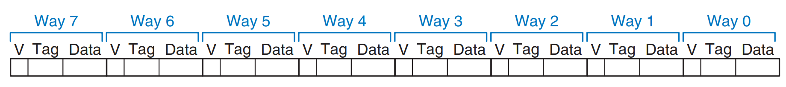<figcaption></figcaption></figure>

**Fully associative caches** tend to have the **fewest conflict misses** for a given cache capacity, but they require **more hardware** for additional **tag comparisons**. They are best suited to **relatively small caches** because of the **large number of comparators**.

#### Block Size

In our previous examples, we only take advantage of the **temporal locality** because the block size was one word. To exploit **spatial locality**, a cache uses larger blocks to hold several consecutive words so that when a miss occurs and the word is fetched into the cache, the adjacent words in the block are also fetched. Therefore, subsequent accesses are more likely to hit because of spatial locality.



#### Miss Penalty

The time required to load the **missing block** into the **cache** is called the **miss penalty**.



#### Block Offset Bits

The following figure shows the hardware for a **C = 8-word direct-mapped cache** with a **b = 4-word block size**. The cache now has only **B = C/b = 2 blocks**. A **direct-mapped cache** has **one block** in each set, so this cache is organized as **two sets**. Thus, only **log₂2 = 1 bit** is used to select the set. A **multiplexer** is now needed to select the **word within the block**. The multiplexer is controlled by the **log₂4 = 2 block offset bits** of the address. The **most significant 27 address bits** form the **tag**. Only **one tag** is needed for the entire block, because the words in the block are at **consecutive addresses**.

<figure>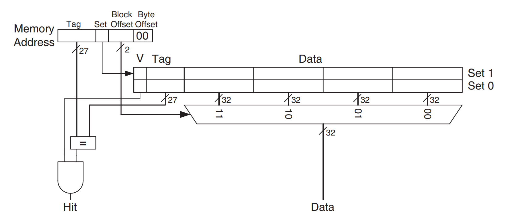<figcaption></figcaption></figure>

The following figure shows the **cache fields** for address `0x8000009C` when it maps to the **direct-mapped cache** of the above figure. The **byte offset bits** are always 0 for word accesses. The next log₂b = 2 **block offset bits** indicate the **word within the block** and the next **bit** indicates the **set**. The remaining **27 bits** are the **tag**. Therefore, word `0x8000009C` maps to **set 1**, **word 3** in the cache.

<figure>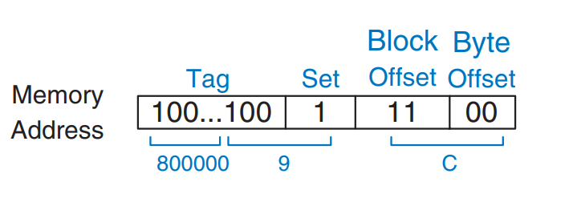<figcaption></figcaption></figure>

The principle of using larger block sizes to exploit spatial locality also applies to **associative caches**.



#### Summary

**Caches** are organized as **two-dimensional arrays**. The **rows** are called **sets**, and the **columns** are called **ways**. Each **entry** in the array consists of a **data block** and its associated **valid** and **tag bits**. **Caches** are characterized by

* **capacity** $$C$$
* **block size** $$b$$ (and **number of blocks**, $$B = C/b$$)
* **number of blocks in a set /** degree of associativity ($$N$$)

The following table summarizes the various **cache organizations**. Each **address** in memory maps to **only one set** but can be stored in **any of the ways**.

<figure>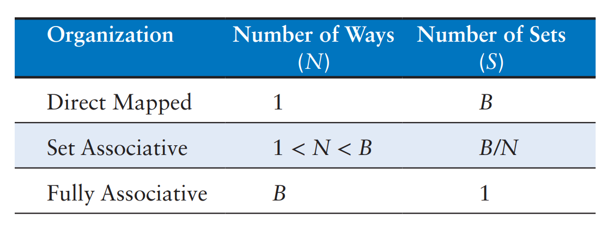<figcaption></figcaption></figure>

**Cache capacity**, **associativity**, **set size**, and **block size** are typically **powers of two**. This makes the **cache fields** (**tag**, **set**, and **block offset bits**) subsets of the **address bits**.

**Increasing the associativity** $$N$$ usually **reduces the miss rate** caused by **conflicts**. But higher associativity requires **more tag comparators**. **Increasing the block size** $$b$$ takes advantage of **spatial locality** to **reduce the miss rate**. However, it **decreases the number of sets** in a fixed-sized cache and, therefore, could lead to **more conflicts**. It also **increases the miss penalty**.

### Replacement

In the cache, when a set is full, the block must be kicked out to be replaced with a new block,

* In a direct-mapped cache, each address maps to a unique block and set, so if a set is full when new data must be loaded, the block in that set is replaced with the new data.
* In set-associative and fully associative caches, the cache must choose which block to evict when a cache set is full.

There are three replacement algorithms, the first two are based on the history, which are also practical, while the third is optimal but as it needs to predict the future, this is not practical.

#### FIFO

FIFO stands for First-In-First-Out. In this alogrithm, the **oldest block** will be replaced. For example, assuming that we are working with a fully associative cache which has 4 blocks.

<figure>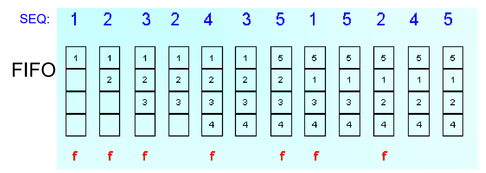<figcaption></figcaption></figure>

FIFO works well if the access follows a sequential pattern.

#### Leat Recently Use (LRU)

The principle of temporal locality suggests that the best choice is to evict the least recently used block because it is least likely to be used again soon. Hence, most associative caches have a **least recently used (LRU)** replacement policy.

In a **two-way set-associative cache**, a **use bit (U)** indicates which way within the set was **least recently used**; each access flips U to point to the other way. For **set-associative caches** with more than two ways, exact tracking of the **least recently used** way is complex, so the ways are typically divided into two groups and U identifies which **group** was least recently used. On replacement, the new block evicts a **random** block from the least recently used group. This approximation, known as **pseudo-LRU**, is sufficiently effective in practice.

<details>

<summary>Self Diagnostic Quiz</summary>

Show the contents of an eight-word two-way set-associative cache after executing the following code, assuming LRU replacement, a block size of one word, and an initially empty cache.


```riscv
addi t0, zero, 0
lw   s1, 0x4(t0)
lw   s2, 0x24(t0)
lw   s3, 0x54(t0)
```


**Solution**: The first two instructions load data from memory addresses 0x4 and 0x24 into set 1 of the cache, shown in the figure below, where U = 0 indicates that data in way 0 was the least recently used.

<figure>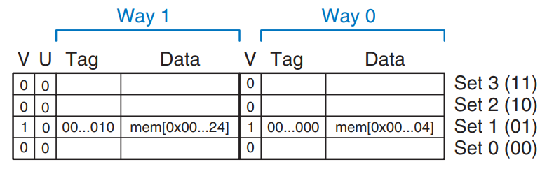<figcaption></figcaption></figure>

The next memory access, to address 0x54, also maps to set 1 and replaces the least recently used data in way 0, as shown in the figure below, after which the use bit U is set to 1 to indicate that data in way 1 was the least recently used.

<figure>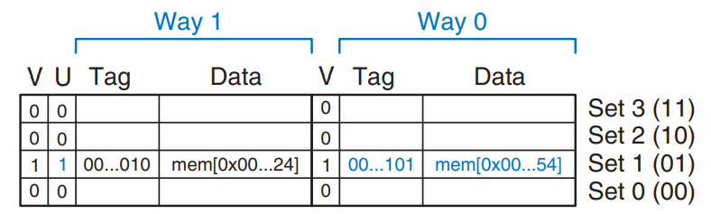<figcaption></figcaption></figure>

</details>

### Advanced Cache Design

In this section, we will introduce the multiple-level caches, which are used quite often in modern systems. Then we will discuss the performance of a two-level caching system and examines how block size, associativity, and cache capacity affect **miss rate**. Finally, we will introduce how caches handle stores, or writes, by using a write-through or write-back policy.

#### Multiple-Level Caches

**Large caches** are beneficial because they are more likely to contain the data of interest and thus exhibit **lower miss rates**; however, **large caches** are inherently **slower** than small ones. To balance these trade-offs, modern systems employ **multiple levels of caches**, as illustrated in the figure below.

<figure>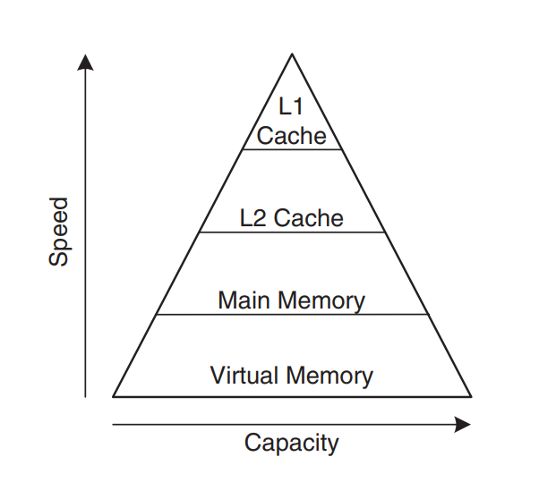<figcaption></figcaption></figure>

The **first-level (L1) cache** is designed to be small enough to achieve a **one- or two-cycle access time**, while the **second-level (L2) cache**, also constructed from **SRAM**, is significantly **larger** — and consequently **slower** — than the **L1 cache**.

#### Reducing Miss Rate

The misses can be classified as **compulsory**, **capacity**, and **conflict**.

* **Compulsory Miss**: This happens because the block must be retrieved from memory the first time it is accessed, regardless of the cache design
* **Capacity Miss**: This occurs when the cache is too small to hold all the data that the program is actively using at the same time.
* **Conflict Miss**: This arises in **set-associative** or **direct-mapped** caches when multiple addresses map to the same **set**, causing needed blocks to be prematurely evicted even though space may be available in other sets.

Changing cache parameters can affect one or more types of cache miss. For example, increasing **cache capacity** can reduce both **capacity misses** and **conflict misses**, but it has no effect on **compulsory misses**. In contrast, increasing **block size** can reduce **compulsory misses** by exploiting **spatial locality** (bringing in more adjacent data with each miss), yet it may increase **conflict misses** because a larger block size means fewer sets in the cache, causing more addresses to map to the same set and compete for space.



#### Cache Size vs. Miss Rate

<figure>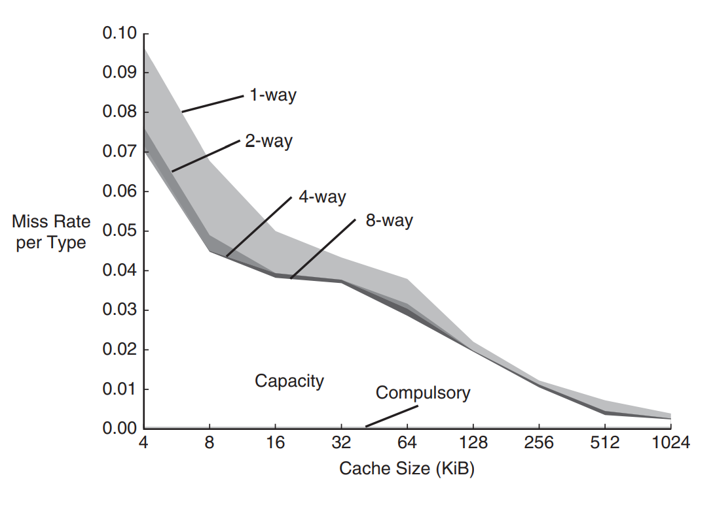<figcaption></figcaption></figure>

As expected, when cache size increases, capacity misses decrease. Increased associativity, especially for small caches, decreases the number of conflict misses shown along the top of the curve.



#### Block Size vs.Miss Rate

<figure>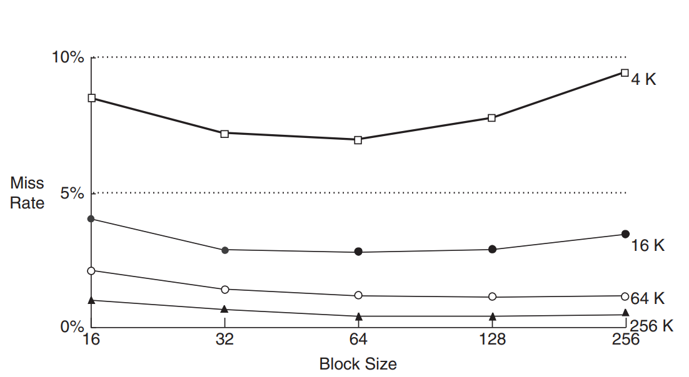<figcaption></figcaption></figure>

For small caches, such as a 4 KiB cache, increasing the **block size** beyond 64 bytes raises the **miss rate** due to fewer sets and higher **conflict misses**. In larger caches, increasing the block size beyond 64 bytes typically does not further reduce (and may not affect) the miss rate, as capacity and compulsory misses dominate. Nevertheless, **large block sizes** can still increase overall execution time because of the higher **miss penalty —** the longer time required to transfer the larger block from main memory on a miss.



#### Write Policy

Caches are classified as either **write-through** or **write-back**.

* In a **write-through** cache, every write to a cache block is immediately written to main memory as well.
* In a **write-back** cache, each cache block has a **dirty bit (D)** that is set to 1 when the block is modified and remains 0 otherwise; a dirty block is written back to main memory only when it is evicted from the cache.

Although a write-through cache needs no dirty bit, it generally performs far more main-memory writes than a write-back cache. Because main-memory access time is very large, modern caches are almost always **write-back**.
