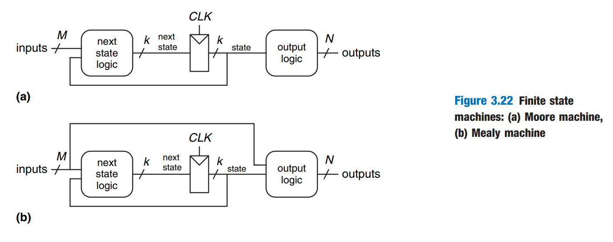
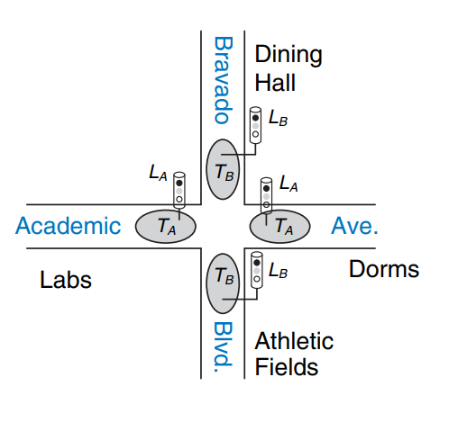
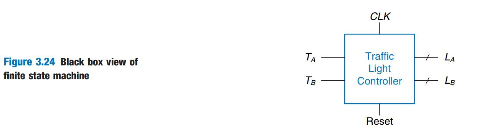
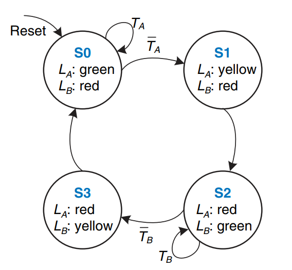
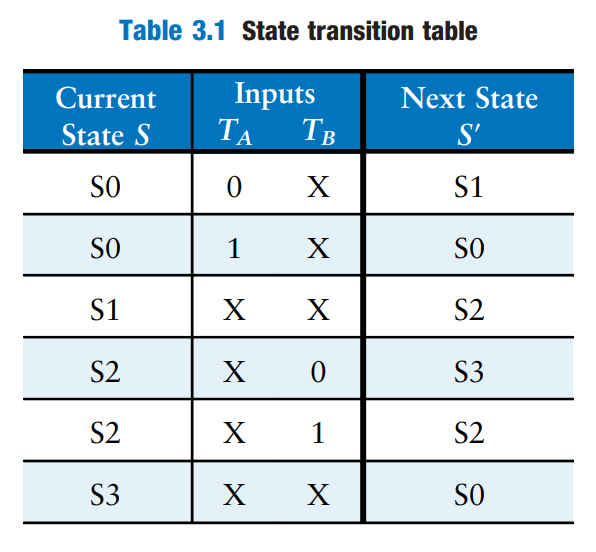
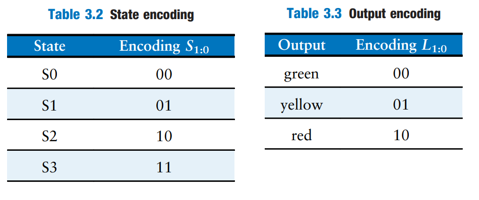
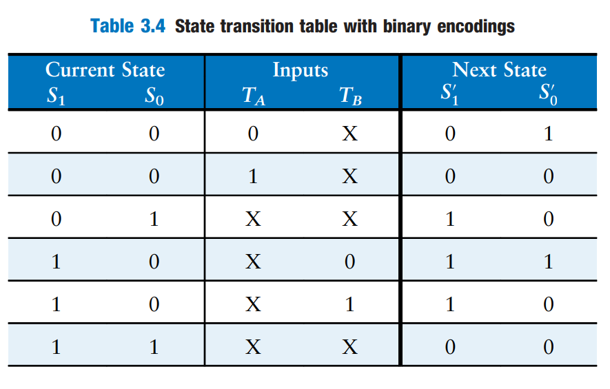
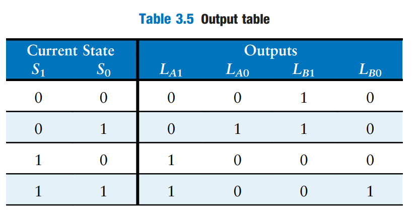
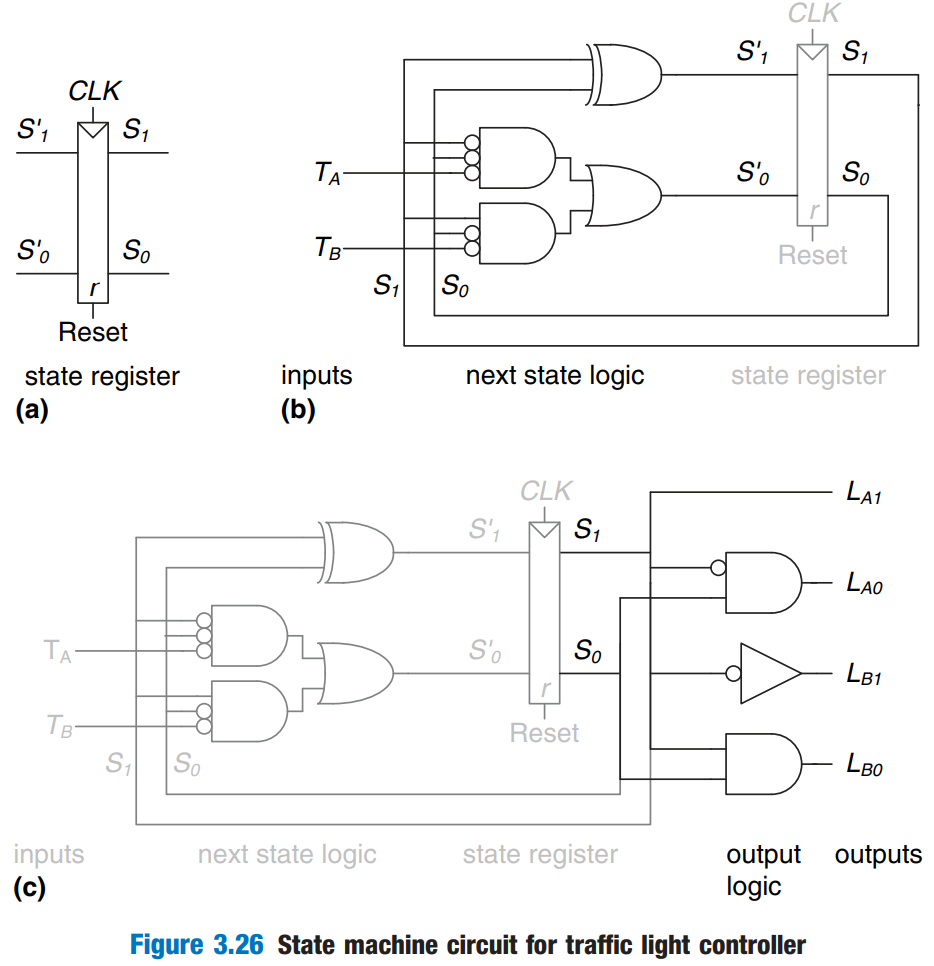

# Finite State Machines

Synchronous sequential circuits can be drawn in the forms shown in Figure 3.22. These forms are called _finite state machines_ (FSMs). They get their name because a circuit with k registers can be in one of a finite number ( $$2^k$$) of unique states (note the state symbol in the figure below).

<figure><figcaption></figcaption></figure>

An FSM has M inputs, N outputs, and k bits of state. It also receives a clock, and optionally, a reset signal. An FSM consists of two blocks of combinational logic, _next state logic_ and _output logic_, and a register that stores the state.

On each clock edge, the FSM advances to the next state, which was computed based on the current state and inputs. There are two general classes of finite state machines, characterized by their functional specifications.

* In _Moore machines_, the outputs depend only on the current state of the machine.
* In _Mealy machines_, the outputs depend of both current state and the current inputs.


Finite state machines provide a systematic way to design synchronous sequential circuits given a functional specification.


## FSM Design Example

Suppose now Ben Bitdiddle wants to design a traffic light controller for the following roads

<figure><figcaption></figcaption></figure>

He installs two traffic sensors, $$T_A$$ and $$T_B$$, on Academic Ave. and Bravado Blvd., respectively. Each sensor indicates TRUE if students are present and FALSE if the street is empty. He also installed two traffic lights, $$L_A$$ and $$L_B$$. Ben also provides a clock with a 5-second period. On each clock tick (rising edge), the lights may change based on the traffic sensors. He also provides a rest button so that the technicians can put the controller in a known initial state when they turn it on. Figure 3.24 shows a black box view of the state machine.

<figure><figcaption></figcaption></figure>

Now, Ben follows the following steps to systemetically this FSM



**Sktech the&#x20;**_**state transition diagram**_

After Ben's careful consideration, by analyzing the behavior of this system, he sketches the state transition diagram as follows

<figure><figcaption></figcaption></figure>


#### Notes

1. In a state transition diagram, circles represent states and arcs represent transitions between states.
2. The arc labeled Reset pointing from outer space into state S0 indicates that the system should enter that state upon reset, regardless of what previous state it was in.
3. If a state has multiple arcs leaving it, the arcs are labeled to show what input triggers each transition.
4. If a state has a single arc leaving it, that transition always occurs regardless of the inputs. For example, when in state S1, the system will always move to S2.
5. The value that the outputs have while in a particular state are indicated in the state.




**Write the&#x20;**_**state transition table**_

Ben then rewrites the state transition diagram as a _state transition table_, which indicates, for each state an input, what the next state, S', should be.

<figure><figcaption></figcaption></figure>


#### Notes

1. The table uses don't care symbols (X) whenever the next state does not depend on a particular input.
2. Reset is omitted from the table. Instead, we use [resettable flip-flops](latches-and-flip-flops.md#resettable-flip-flop) that always go to state S0 on reset, independent of the inputs.




**Encode states and outputs**

The state transition diagram is abstract in that it uses states labeled `{S0, S1, S2, S3}` and outputs `{red, yellow, green}`. To build a real circuit, the states and outputs must be assigned _binary encodings_. Ben chooses the simple encodings in Table 3.2 and 3.3. Each state and each output is encoded with two bits: $$S_{1:0}, L_{A~1:0}$$ and $$L_{B~1:0}$$.

<figure><figcaption></figcaption></figure>


Notice that states are designated as S0, S1, etc. The subscripted versions, $$S_0$$, $$S_1$$, etc., refer to the state bits.




**Calculate the next state logic**

Ben updates the state transition table to use these binary encodings, as shown in Table 3.4. The revised state transition table is a truth table specifying the next state logic. It defines next state, S', as a function of the current state, S, and the inputs.

<figure><figcaption></figcaption></figure>

From this table, we can either observe straight-forwardly or use the Karnaugh Map to get the simplest boolean equation for $$S'_{1}$$ and $$S'_{0}$$.

$$
\begin{align*}
S'_{1}&=S_1\oplus S_2 \\
S'_{0}&=\bar S_1\bar S_0\bar T_A+S_1\bar S_0\bar T_B
\end{align*}
$$

To use a K-map here,

1. The first key point is to know that we should have **two** functions/boolean equations for our "outputs" $$S'_{1}$$ and $$S'_{0}$$. Thus the content of our K-map should be the value of either these two "outputs".
2. Then, the columns and rows of the K-map should be the parameters of the function/boolean equation, which are current state and inputs.

Knowing these two points, and taking care of the don't cares carefully, we can build the K-map for $$S'_{0}$$ as follows,

| $$S_1S_0 \backslash T_AT_B$$ | 00 | 01 | 11 | 10 |
| ---------------------------- | -- | -- | -- | -- |
| **00**                       | 1  | 1  | 0  | 0  |
| **01**                       | 0  | 0  | 0  | 0  |
| **11**                       | 0  | 0  | 0  | 0  |
| **10**                       | 1  | 0  | 0  | 1  |

From the K-map table, we can easily get the boolean equation for $$S'_{0}$$. For $$S'_{1}$$, it will be similar.



**Calculate the output logic**

Similarly, Ben writes an _output table_ (Table 3.5) indicating, for each state, what the output should be in that state.

<figure><figcaption></figcaption></figure>

Again, it is straightforward to read off and simplify the Boolean equations for the outputs.

$$
\begin{align*}
L_{A1}&=S_1\\
L_{A0}&=\bar S_1 S_0\\
L_{B1}&=\bar S_1\\
L_{B0}&=S_1S_0
\end{align*}
$$



**Sketch the circuit for FSM**

Finally, Ben sketches his Moore FSM in Figure 3.26.

<figure><figcaption></figcaption></figure>



## State Encodings

In the previous example, the state and output encodings were selected arbitrarily. A different choice would have resulted in a different circuit.

One important decision in state encoding is the choice between binary encoding and one-hot encoding. With _binary encoding_, as was used in the traffic light controller example, each state is represented as a binary number. Because K binary numbers can be represented by $$\log_2K$$ bits, a system with K states only needs $$\log_2K$$ bits of state.

In _one-hot encoding_, a separate bit of state is used for each state. It is called one-hot because only one-bit is "hot" or TRUE at any time. For example, a one-hot encoded FSM with three states would have state encodings of 001, 010, and 100. Each bit of state is stored in a flip-flop, so one-hot encoding requires mroe flip-flops than binary encoding. However, with one-hot encoding, the next-state and output logic is often **simpler**, so fewer gates are required.


The best encoding choice depends on the specific FSM.


> The example of divide-by-3 counter on H\&H Page 130-131 is awesome!

## Moore and Mealy Machines

So far, we have shown examples of Moore machines, in which the output depends only on the state of the system. Hence, in state transition diagrams for Moore machines, the outputs are labeled in the circles. Recall that Mealy machines are much like Moore machines, but the outputs can depend on inputs as well as the current state. Hence, in state transition diagrams for Mealy machines, the outputs are labelled on the arcs instead of in the circles.


#### Notes

1. An easy way to remember the difference between the two types of finite state machines is that a Moore machine typically has _more states_ than a Mealy machine for a given problem.
2. When labelling the arcs for Mealy machines, we can use the trandition `A/Y`, where `A` is the value of the input that causes the transition, and `Y` is the corresponding output.&#x20;


> **TODO:** The example on H\&H Page 132-133 is awesome!

## Factoring State Machines

Designing complex FSMs is often easier if they can be broken down into multiple interacting simpler state machines such that the output of some machines is the input of others. This application of hierarchy and modularity is called _factoring_ of state machines.

> **TODO:** The exmaple on H\&H page 135-136 is awesome!

## Deriving an FSM from a Schematic

It follows nearly the reverse process of [FSM Design](finite-state-machines.md#fsm-design-example).

> **TODO:** The example on H\&H page 137-140 is worth reading if you want to know more about it.

## FSM Review

Finite State machines are a powerful way to systematically design sequential circuits from a written specification. Use the following procedure to design an FSM:

1. Identify the inputs and outputs.
2. Sketch a state transition diagram
3. For a Moore machine:
   1. Write a state transition table
   2. Write an output table
4. For a Mealy machine: Write a combined state transition and output table
5. Select state encodings — your selection affects the hardware design
6. Write Boolean equations for the next state and output logic
7. Sketch the circuit schematic
