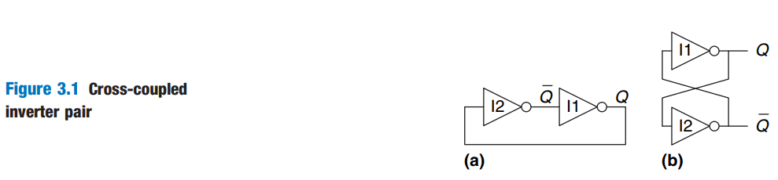
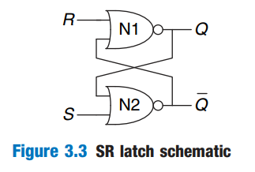
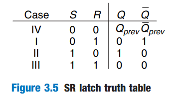
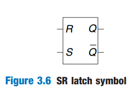
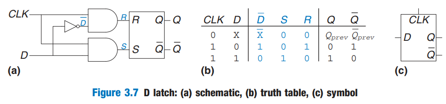
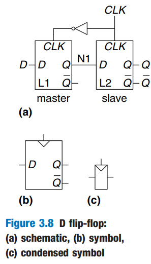

# Latches and Flip-Flops

## Bistable Element

The fundamental building block of memory is a _bistable_ element, an element with two stable states. Figure 3.1 (a) shows a simple bistable element consisting of a pair of inverters connected in a loop. Figure 3.1 (b) shows the same circuit redrawn to emphasize the symmetry.

<figure><figcaption></figcaption></figure>

The inverters are _cross-coupled_, meaning that the input of I1 is the output of I2 and vice versa. The circuit has no inputs, but it does have two outputs, $$Q$$ and $$\bar Q$$.

Analyzing this circuit is different from analyzing a combinational circuit because it is cyclic: $$Q$$ depends on $$\bar Q$$ and $$\bar Q$$ depends on $$Q$$. So, we just need to consider two cases: $$Q$$ is 0 or $$Q$$ is 1.

And we may find out that this circuit is **stable** under these two cases. Thus, we can say this cross-coupled inverter has two **stable** states, and because of this, it is **bistable**.


#### Notes

1. An element with N stable states conveys $$\log_2N$$ bits of information, so a **bistable** element stores one bit.
2. The state of the cross-coupled inverters is contained in one binary state variable, $$Q$$. The value of $$Q$$ tells us everything about the past that is necessary to explain the future behavior of the circuit. Specifically, if $$Q$$ = 0, it will remain 0 forever, and if $$Q$$ = 1, it will remain 1 forever.
3. The circuit does have another node, $$\bar Q$$, but $$\bar Q$$ does not contain any additional information because if $$Q$$ is known, $$\bar Q$$ is also known. On the other hand, $$\bar Q$$ is also an acceptable choice for the state variable.
4. When power is first applied to a sequential circuit, the initial state is unknown and usually unpredictable. It may differ each time the circuit is turned on.


Although the cross-coupled inverters can store a bit of information, they are not practical because the user has no inputs to control the state. However, other bistable elements, such as _latches_ and _flip-flops_, provide inputs to control the value of the state variable. The remainder of this section considers these circuits.

## SR Latch

One of the simplest sequential circuits is the SR _Latch_, which is composed of two cross-coupled NOR gates, as shown in Figure 3.3. The latch has two inputs, S and R, and two outputs $$Q$$ and $$\bar Q$$. The SR latch is similar to the cross-coupled inverters, but its state (the value of $$Q$$ ) can be controlled through the S and R inputs, which _set_ and _reset_ the output $$Q$$.

<figure><figcaption></figcaption></figure>

To analyze this circuit, we can build a truth table by considering the four cases of two inputs S and R. And we will build a truth table as shown in Figure 3.5 below

<figure><figcaption></figcaption></figure>


Note that in Case IV, when S and R are both 0, there are only two subcases which $$Q$$ can be either 0 or 1. Thus, we find that the future $$Q$$ will still remain the same.


The SR latch is represented by the symbol in Figure 3.6. Using the symbol is an application of abstraction and modularity.

<figure><figcaption></figcaption></figure>

Like the cross-coupled inverters, the SR latch is a bistable element with one bit of state stored in $$Q$$. Notice that the entire history of inputs can be accounted for by the single state variable $$Q$$.

## D Latch

The SR Latch is awkward because it behaves strangely when both S and R are simultaneously asserted. Moreover, the S and R inputs **conflate** the issues of _what_ and _when_. And designing circuits becomes easier when these questions of what and when are **separated**. The D latch in Figure 3.7 (a) solves these problems. It has two inputs. The data input, D, controls what the next state should be. The _clock_ input, CLK, controls when the state should change.

<figure><figcaption></figcaption></figure>

By analyzing this circuit, we see that the clock controls when data flows through the latch. When CLK = 1, the latch is _transparent_. The data at D flows through to Q as if the latch were just a **buffer** (from the point of comparing output $$Q$$ and input D). When CLK = 0, the latch is _opaque_. It blocks the new data from flowing through to Q, and Q retains the old value. Hence, the D latch is sometimes called a _transparent latch_ or _level-sensitive_ latch. The D latch symbol is given in Figure 3.7 (c).

In the D latch, from the truth table, we can clearly see that its state variable is still $$Q$$.


We may notice that the D latch updates its state **continuously** while CLK = 1. We shall see later in this chapter that it is useful to update the state only at a specific instant in time.


## D Flip-Flop

A D _flip-flop_ can be built from two back-to-back D latches controlled by complementary clocks, as shown in Figure 3.8 (a). The first latch, L1, is called the _master_. The second latch, L2, is called the _slave_. The node between them is named N1. A symbol for the D flip-flop is given in Figure 3.8 (b). When the $$\bar Q$$ output is not needed, the symbol is often condensed as in Figure 3.8 (c).

<figure><figcaption></figcaption></figure>

To analyze the behavior of a D flip-flop, we can see the following example (ignoring the progagation delay 😂),

<figure><figcaption></figcaption></figure>

To put it simply, a D flip-flop _**copies D to Q on the rising edge of the clock, and remembers its state at all other times until the next rising edge comes, it will update its state**_**.**


The sentence above is very very important! And beginner digital designer must remember it!


The rising edge of the clock is often just called the _clock edge_ for brevity. The D input specifies what the new state will be. The clock edge indicates when the state should be updated.

A D flip-flop is also known as a _master-slave flip-flop_, an _edge-triggered flip-flop_, or a _positive edge-triggered flip-flop_. The triangle in the symbols denotes an edge-triggered clock input. The $$\bar Q$$ is often omitted when it is not needed.


The term flip-flop or latch by itself usually refers to a **D flip-flop** or a **D latch**, respectively, because these are the types most commonly used in practice.

