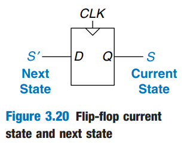

# Synchronous Logic Design

## Some Problematic Circuits

There are two examples here on the book and they are very classic. And a question remained here, how do we use the rule we have learned later in this page to optimize the race condition example?

I think the solution will be just adding register along the cyclic path, so that the register will store the state of the system. Because the problem is when CLK falls, Q may change to 0, thus making Q\_prev 0. But if we have a register, when CLK falls, the register retain the Q\_prev, which is 1. Problem solved! Awesome here!

But the sentence on P121 "If the clock is sufficiently slow, ....", how slow it should be in this race condition problem? Slower than or bigger than the propagation delay?

## Synchronous Sequential Circuits

The rules of _synchronous sequential circuit composition_ teach us that a circuit is a synchronous sequential circuit if it consists of interconnected circuit elements such that

* Every circuit element is either a register or a combinational circuit
* At least one circuit element is a register
* All registers receive the **same** clock signal
* Every cyclic path contains at least one register.

Sequential circuits that are not **synchronous** are called _asynchronous_.

A flip-flop is the simplest sychronous sequential circuit. It has one input, D, one clock, CLK, one output, Q, and two states, {0, 1}. The functional specification for a flip-flop is that the **next state** is D and the output, Q, is the **current state**, as shown in Figure 3.20.

<figure><figcaption></figcaption></figure>

We often call the current state variable S and the next state variable S'. And two other common types of synchronous sequential circuits are called **finite state machines** and **pipelines**.
