# Timing of Sequential Logic

Recall that a flip-flop copies the input D to the output Q on the rising edge of the clock. This process is called **sampling D** on the clock edge. If D is stable at either 0 or 1 when the clock rises, this behavior is clearly defined. But what happens if D is changing at the same time the clock rises?

This problem is similar to that faced by a camera when snapping a picture. Imagine photographing a frog jumping from a lily pad into the lake. If you take the picture before the jump, you will see a frog on a lily pad. If you take the picture after the jump, you will see ripples in the water. But if you take it just as the frog jumps, you may see a blurred image of the frog stretching from the lily pad into the water. A camera is characterized by its **aperture time**, during which the object must remain still for a sharp image to be captured. Similarly, a sequential element has an aperture time around the clock edge, during which the input must be stable for the flip-flop to produce a well-defined output.

The aperture of a sequential element is defined by a **setup time** and a **hold time**, before and after the clock edge, respectively.

* In **static discipline**, we deal with **what** a signal is (1 or 0). A digital system promises that it will never generate an output voltage in this "Forbidden Zone." It will always output a strong "1" (high voltage) or a strong "0" (low voltage).
* In **dynamic discipline**, we deal with **when** a signal is allowed to change. We are not allowed to change the input signal during this **Aperture time**. We can change the signal wildly _before_ the aperture opens or _after_ it closes, but during that specific split-second when the clock edge hits, the signal must be perfectly still.

By taking advantage the dynamic discipline, we can think of time in discrete units called **clocked cycles**, just as we think of signal levels as discrete 1's and 0's in the static discipline. Hence, under the dynamic discipline, we are concerned only about the signal's final value at the end of the clock cycle, after it has settled to a stable value. So, we can simply write A\[n], the vluae of signal A at the end of n-th clock cycle, where n is an integer, rather than A(t), the value of A at some instant t, where t is any real number.

The clock period has to be long enough for all signals to settle. This sets a limit on the speed of the system. In real systems, the clock does not reach all flip-flops at precisely the same time. This variation in time, called **clock skew**, further increases the necessary clock period.

## The Dynamic Discipline

So far, we have focused on the **functional specification** of sequential circuits. Recall that a **synchronous sequential circuit**, such as a flip-flop or FSM, also has a **timing specification**, as illustrated in the following figure.

<figure>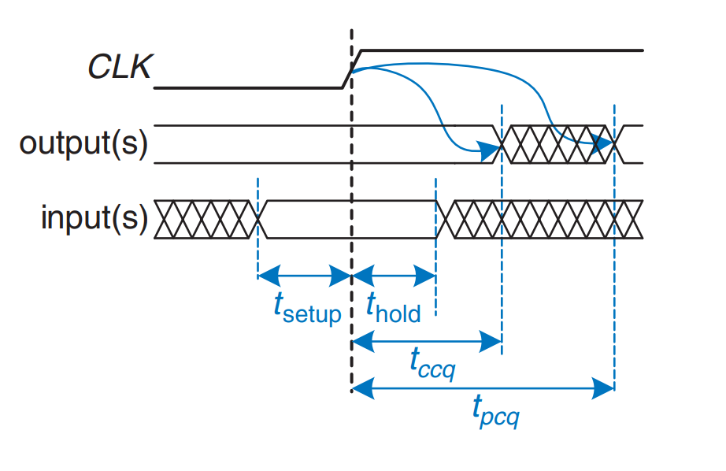<figcaption>
Timing specification for synchronous sequential circuit
</figcaption></figure>

1. When the clock rises, the output (or outputs) may start to change after the **clock-to-Q contamination delay**, **t****ccq**, and
2. must definitely settle to the final value within the **clock-to-Q propagation delay**, **t****pcq**.

These represent the fastest and slowest delays through the circuit, respectively.

1. For the circuit to sample its input correctly, the input (or inputs) must have stabilized at least some **setup time**, **t****setup**, before the rising edge of the clock and
2. must remain stable for at least some **hold time**, **t****hold**, after the rising edge of the clock.

The sum of the setup and hold times is called the **aperture time** of the circuit, because it is the total time for which the input must remain stable. The **dynamic discipline** states that

> The inputs of a **synchronous sequential circuit** must be stable during the **setup** and **hold aperture time** around the clock edge.

By imposing this requirement, we guarantee that the flip-flops sample signals while they are not changing. Because we are concerned only about the final values of the inputs at the time they are sampled, we can treat signals as discrete in time as well as in logic levels.

## System Timing

The **clock period** or **cycle time**, **T****c**, is the time between rising edges of a repetitive clock signal. Its reciprocal, **f****c****&#x20;= 1/T****c**, is the **clock frequency**.&#x20;

The following figure (a) illustrates a generic path in a **synchronous sequential circuit** whose **clock period** we wish to calculate. On the rising edge of the clock, register **R1** produces output (or outputs) **Q1**. These signals enter a block of **combinational logic**, producing **D2**, the input (or inputs) to register **R2**.

<figure>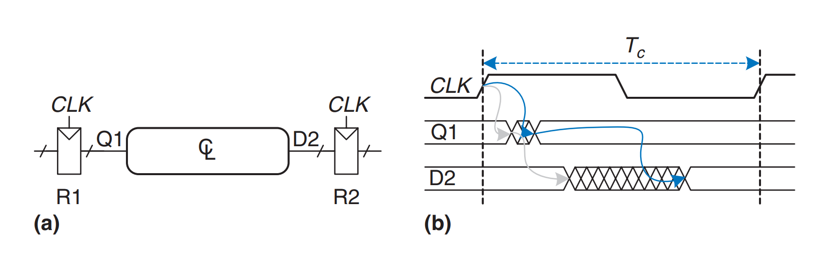<figcaption>
Path between registers and timing diagram
</figcaption></figure>

Figure (b) above shows that each output signal may start to change a **contamination delay** after its input changes and settles to the final value within a **propagation delay** after its input settles.

* The <mark style="color:$info;">gray arrows</mark> represent the **contamination delay** through **R1** and the **combinational logic**, and
* the <mark style="color:blue;">blue arrows</mark> represent the **propagation delay** through **R1** and the **combinational logic**.

We analyze the timing constraints with respect to the **setup** and **hold time** of the second register, **R2**.

### Setup Time Constraint

The following figure is timing diagram shows only the **maximum delay** through the path, indicated by the blue arrows. To satisfy the **setup time** of **R2**, **D2** must settle no later than the **setup time** before the next clock edge.

<figure>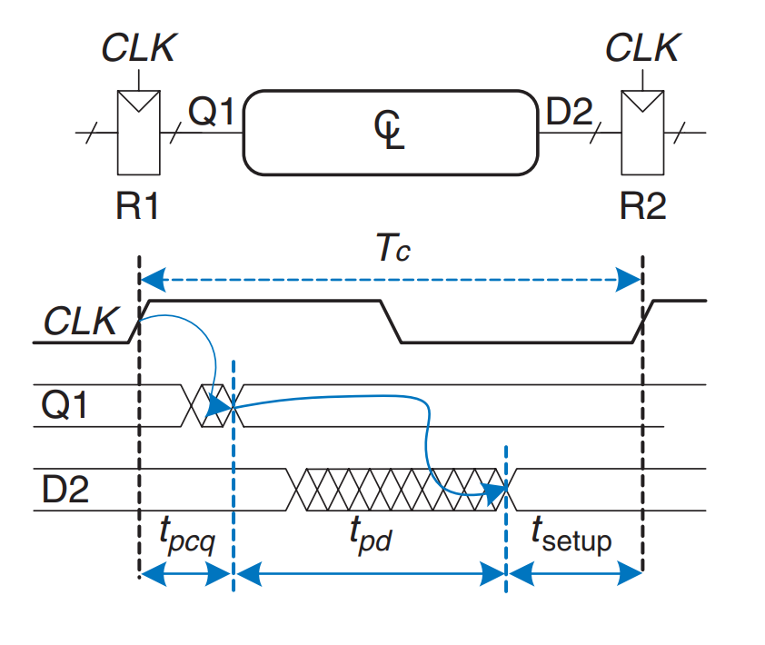<figcaption>
Maximum delay for setup time constraint
</figcaption></figure>

Hence, we find an equation for the **minimum clock period**:

$$
T_c\geq t_{\text{pcq}}+t_{\text{pd}}+t_{\text{setup}}
$$


To remember this equation, the clock period Tc is only relevant with the propagation delay and the tsetup.


In commercial designs, the **clock period** is often dictated by the **Director of Engineering** or by the **marketing department** (to ensure a competitive product). Moreover, the **flip-flop clock-to-Q propagation delay** and **setup time**, **tpcq** and **tsetup**, are specified by the manufacturer. Hence, we rearrange the equation above to solve for the **maximum propagation delay** through the **combinational logic**, which is usually the only variable under the control of the individual designer.

$$
t_{\text{pd}}\leq T_c - (t_{\text{pcq}}+t_{\text{setup}})
$$

The term in parenthese, tpcq +  tsetup, is called the **sequencing overhead**. Ideally, the entire **cycle time** **T****c** would be available for useful computation in the **combinational logic**, **t****pd**. However, the **sequencing overhead** of the **flip-flop** cuts into this time. The equation above is called the **setup time constraint** or **max-delay constraint** because it depends on the **setup time** and limits the **maximum delay** through **combinational logic**.

If the **propagation delay** through the **combinational logic** is too great, **D2** may not have settled to its final value by the time **R2** needs it to be stable and samples it. Hence, **R2** may sample an incorrect result or even an illegal logic level, a level in the **forbidden region**. In such a case, the circuit will malfunction. The problem can be solved by increasing the **clock period** or by redesigning the **combinational logic** to have a shorter **propagation delay**.

### Hold Time Constraint

The register **R2** also has a **hold time constraint**. Its input, **D2**, must not change until some time, **t****hold**, after the rising edge of the clock. According to the following figure, **D2** might change as soon as **t****ccq****&#x20;+ t****cd** after the rising edge of the clock.

<figure>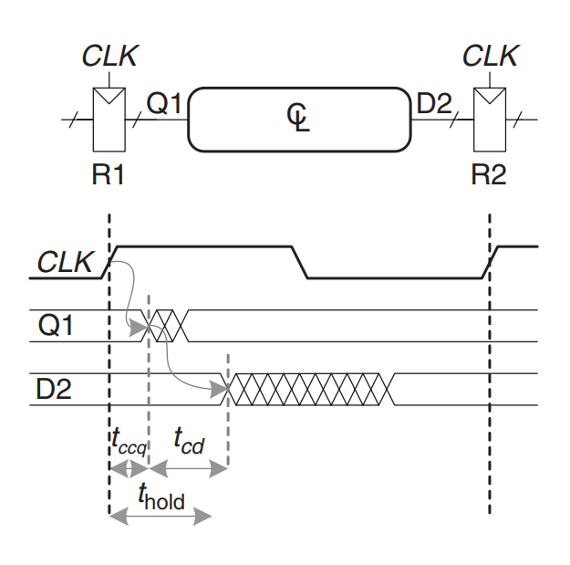<figcaption>
Minimum delay for hold time constraint
</figcaption></figure>

Hence, we find

$$
t_{\text{ccq}}+t_{\text{cd}}\geq t_{\text{hold}}
$$


To remember this equation, thold is only relevant to the **contanmination delay**.


Again, **t****ccq** and **t****hold** are characteristics of the **flip-flop** that are usually outside the designer’s control. Rearranging, we can solve for the **minimum contamination delay** through the **combinational logic**:

$$
t_{\text{cd}} \geq  t_{\text{hold}}- t_{\text{ccq}}
$$

The above equation the **hold time constraint** or **min-delay constraint** because it limits the minimum delay through combinational logic.


The hold time constraints are **critically important**. If they are violated, the only solution is to increase the contamination delay through the logic, which requires redesigning the circuit.


Why is thold related to the previous combinational logic?

Iin short, thold is to prevent the new data from affecting the old data. The **new** data from R1 starts racing through the combinational logic toward R2 immediately after the clock edge. If the logic is "too fast" (tcd is too small), this new data could reach R2's input (D2) before R2 has finished "holding" and locking in the **old** data.

We have assumed that any **logic elements** can be connected to each other without introducing **timing problems**. In particular, we would expect that two **flip-flops** may be directly cascaded as in the following figure without causing **hold time** problems.

<figure>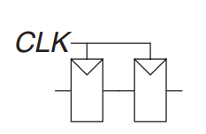<figcaption>
Back-to-back flip-flops
</figcaption></figure>

In such a case, **t****cd****&#x20;= 0** because there is no **combinational logic** between **flip-flops**. Substituting into the equation above yields the requirement that

$$
t_{\text{hold}}\leq t_{\text{ccq}}
$$

In other words, a reliable **flip-flop** must have a **hold time** shorter than its **contamination delay**. Often, **flip-flops** are designed with **t****hold****&#x20;= 0** so that the equation above is always satisfied.

#### Putting It All Together

**Sequential circuits** have **setup** and **hold time constraints** that dictate the **maximum** and **minimum delays** of the **combinational logic** between **flip-flops**. Modern **flip-flops** are usually designed so that the **minimum delay** through the **combinational logic** can be 0 — that is, **flip-flops** can be placed back-to-back. The **maximum delay constraint** limits the number of consecutive gates on the **critical path** of a high-speed circuit because a high **clock frequency** means a short **clock period**.

Timing Analysis Example

Ben Bitdiddle designed the circuit in the following figure. According to the data sheets for the components he is using, flip-flops have a clock-to-Q contamination delay of 30 ps and a propagation delay of 80 ps. They have a setup time of 50 ps and a hold time of 60 ps. Each logic gate has a propagation delay of 40 ps and a contamination delay of 25 ps. Help Ben determine the maximum clock frequency and whether any hold time violations could occur. This process is called **timing analysis**.

<figure>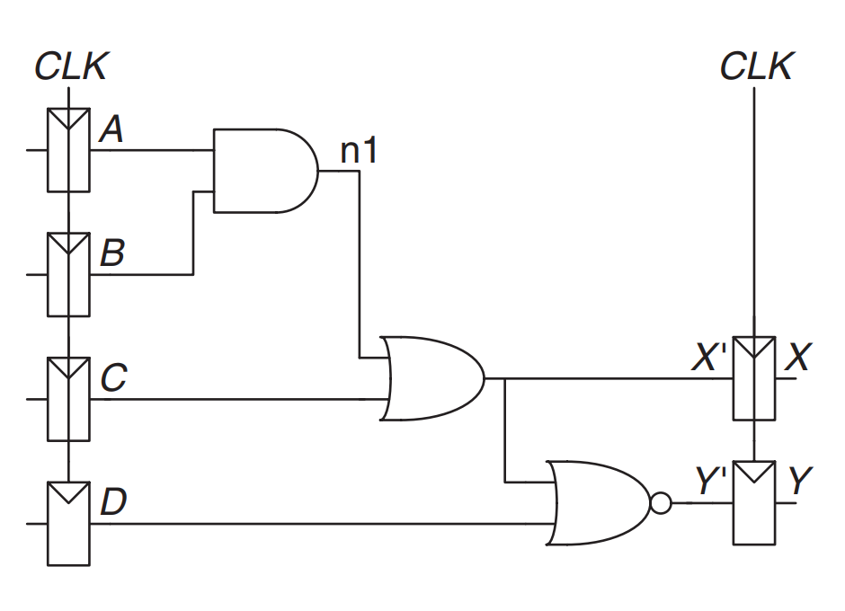<figcaption>
Sample circuit for timing analysis
</figcaption></figure>

**Solution**: The following figure (a) shows waveforms illustrating when the signals might change. The inputs, **A** to **D**, are registered, so they only change shortly after **CLK** rises.

The **critical path** occurs when **B = 1**, **C = 0**, **D = 0**, and **A** rises from 0 to 1, triggering **n1** to rise, **X′** to rise, and **Y′** to fall, as shown in the following figrue (b). This path involves three **gate delays**. For the **critical path**, we assume that each gate requires its full **propagation delay**. **Y′** must set up before the next rising edge of the **CLK**. Hence, the **minimum cycle time** is

T_c\geq t_{\text{pcq}}+3t_{\text{pd}}+t_{\text{setup}}=80+3\times40+50=250\text{ps}

The maximum clock frequency is $$f_c=1/T_c=4\text{GHz}$$.

A **short path** occurs when **A = 0** and **C** rises, causing **X′** to rise (Y' will fall, the same thing applies to Y' also), as shown in the following figure (c). For the **short path**, we assume that each gate switches after only a **contamination delay**. This path involves only one **gate delay**, so it may occur after **t****ccq****&#x20;+ t****cd****&#x20;= 30 + 25 = 55 ps**. But recall that the **flip-flop** has a **hold time** of 60 ps, meaning that **X′** must remain stable for 60 ps after the rising edge of **CLK** for the **flip-flop** to reliably sample its value. In this case, **X′ = 0** at the first rising edge of **CLK**, so we want the **flip-flop** to capture **X = 0**. Because **X′** did not hold stable long enough, the actual value of **X** is unpredictable. The circuit has a **hold time violation** and may behave erratically at any **clock frequency**.

<figure>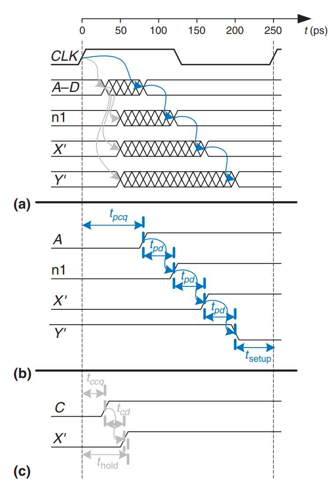<figcaption>
Timing diagram
</figcaption></figure>

To solve the hold time contraint violation, we can redesign our circuit as follows:

<figure>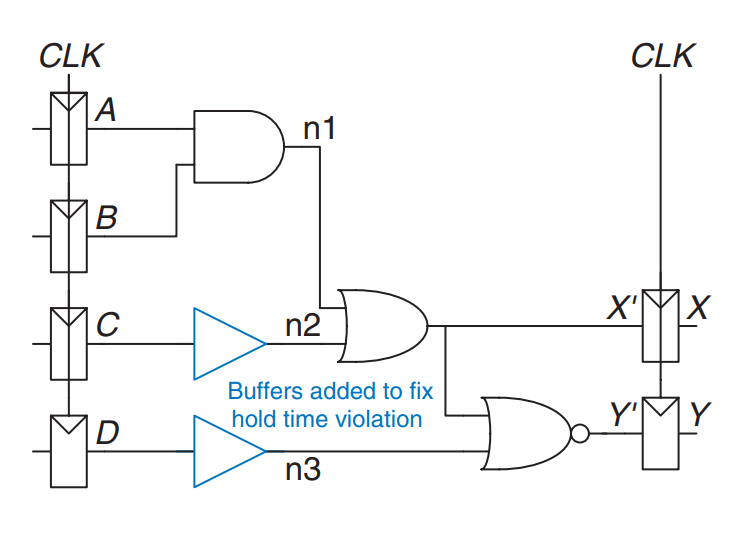<figcaption>
Corrected circuit to fix hold time problem
</figcaption></figure>

In this circuit, the short paths are slowed by the contamination delay of the buffer. Now, X' will not change until tccq + 2tcd=30 + 2 x 25 = 80 ps. This is after the 60ps hold time has elapsed, so the circuit now operates correctly.

<figure>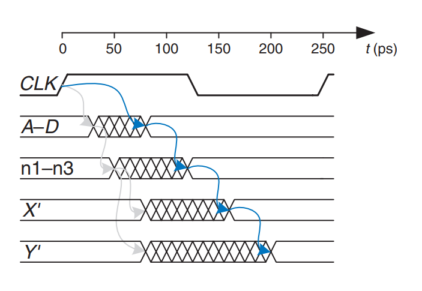<figcaption>
Timing diagram with buffers to fix hold time problem
</figcaption></figure>

From this figure, we can see that the critical path from A to Y is unaffected because it does not pass through any buffers. Therefore, the maximum clock frequency is still 4GHz.

## Clock Skew

In the previous analysis, we assumed that the **clock** reaches all **registers** at exactly the same time. In reality, there is some variation in this time. This variation in **clock** edges is called **clock skew**. For example, the wires from the **clock source** to different **registers** may be of different lengths, resulting in slightly different delays, as shown in the following figure.

<figure>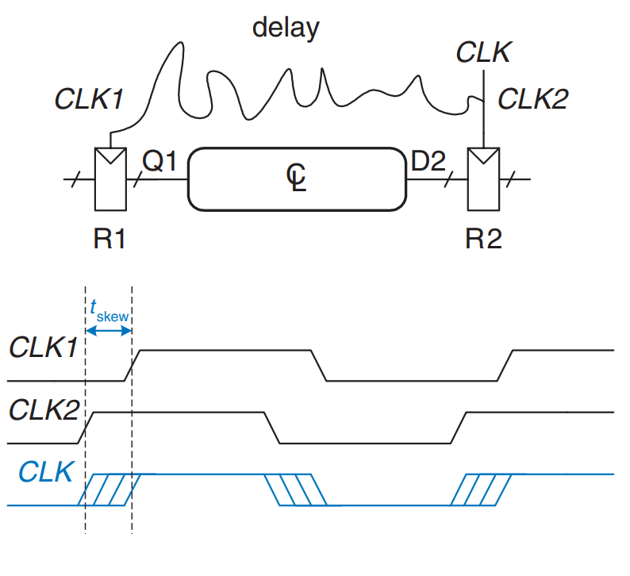<figcaption>
Clock skew caused by wire delay
</figcaption></figure>

In the figure above, **CLK2** is early with respect to **CLK1**, because the clock wire between the two registers follows a scenic route. If the clock had been routed differently, CLK1 might have been early instead. When doing **timing analysis**, we consider the **worst-case scenario** so that we can guarantee that the circuit will work under all circumstances.

The following figure adds **skew** to the timing diagram from the figure we have discussed above.

* The heavy **clock** line indicates the latest time at which the **clock signal** might reach any **register**;
* the hashed lines show that the **clock** might arrive up to **t****skew** earlier.

<figure><figcaption>
Timing diagram with clock skew
</figcaption></figure>

### Setup Time Constraint

First, consider the **setup time constraint** shown in the following figure. In the worst case, **R1** receives the latest skewed clock and **R2** receives the earliest skewed clock, leaving as little time as possible for data to propagate between the **registers**.

<figure>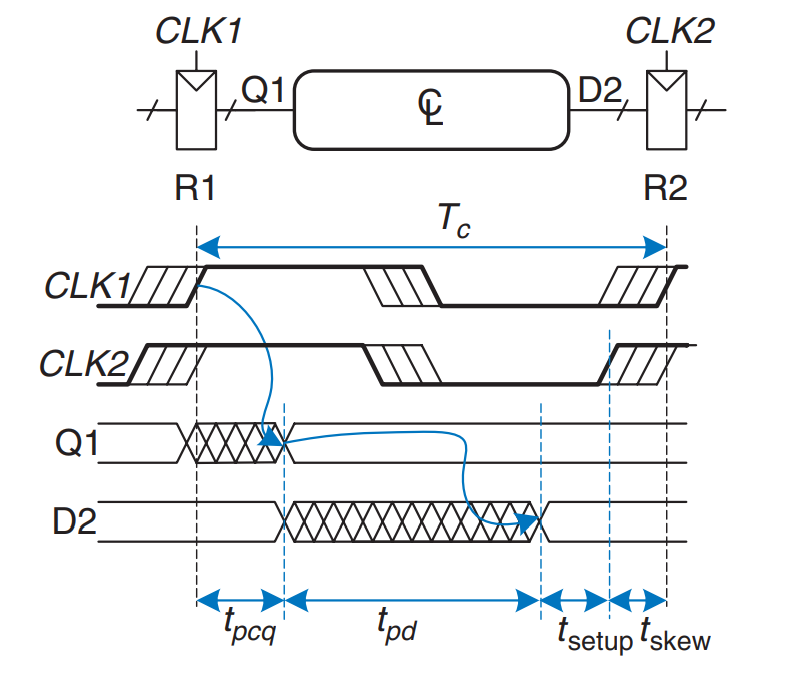<figcaption>
Setup time constraint with clock skew
</figcaption></figure>

The data propagates through the register and combinational logic and must set up before R2 samples it. Hence, we conclude that,

$$
T_c\geq t_{\text{pcq}}+t_{\text{pd}}+t_{\text{setup}}+t_{\text{skew}}
$$

Rearranging it, we will get,

$$
t_{\text{pd}}\leq T_c - (t_{\text{pcq}}+t_{\text{setup}}+t_{\text{skew}})
$$

### Hold Time Constraint

Next, consider the **hold time constraint** shown in the following figure. In the worst case, **R1** receives an early skewed clock, **CLK1**, and **R2** receives a late skewed clock, **CLK2**. The data zips through the **register** and **combinational logic**, but must not arrive until a **hold time** after the late clock.

<figure>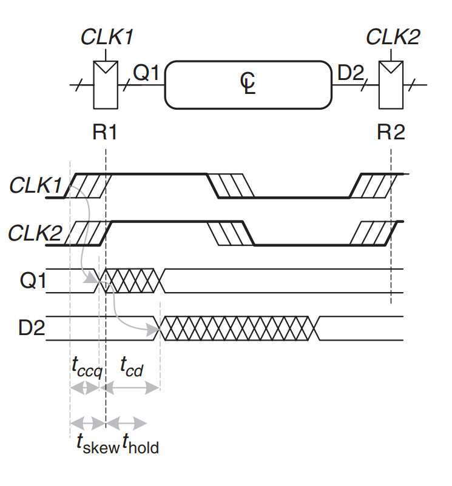<figcaption>
Hold time constraint with clock skew
</figcaption></figure>

Thus, we find that

$$
t_{\text{ccq}}+t_{\text{cd}}\geq t_{\text{hold}} + t_{\text{skew}}
$$

Rearranging it, we will have,

$$
t_{\text{cd}} \geq  t_{\text{hold}} + t_{\text{skew}}- t_{\text{ccq}}
$$

#### Putting It All Together

In summary, **clock skew** effectively increases both the **setup time** and the **hold time**. It adds to the **sequencing overhead**, reducing the time available for useful work in the **combinational logic**. It also increases the required **minimum delay** through the **combinational logic**.

Even if **t****hold****&#x20;= 0**, a pair of back-to-back **flip-flops** will violate the equation above if **t****skew****&#x20;> t****ccq**. To prevent serious **hold time** failures, designers must not permit too much **clock skew**. Sometimes, **flip-flops** are intentionally designed to be particularly slow (e.g., large **t****ccq**), to prevent **hold time** problems even when the **clock skew** is substantial.
